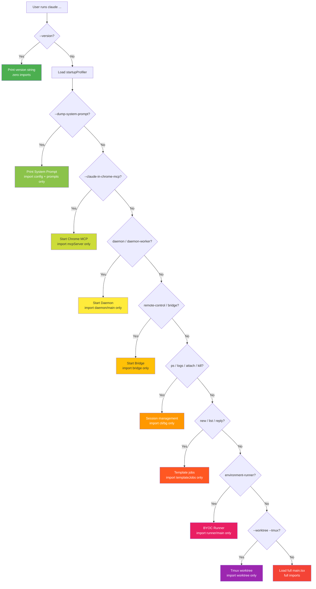

# Chapter 2: Startup Pipeline and Cold-Start Optimization — The Engineering Craft of a Millisecond CLI Launch

> This is Chapter 2 of *Deep Dive into Claude Code Source*. We will walk through the startup path of `cli.tsx` and `main.tsx`, and reveal how the Claude Code team drove CLI startup down to the millisecond scale.

## Why does startup speed matter so much?

The first impression a CLI tool makes is its **startup speed**. The moment a user types `claude` in the terminal and hits enter, their mental model demands an "instant" response. A 2-second startup feels laggy; a 5-second startup makes the user wonder whether they mistyped the command.

For a heavyweight application like Claude Code — close to 1900 TypeScript files, dependent on the React/Ink/Yoga rendering stack, required to talk to MCP servers and the Anthropic API — getting startup into the millisecond range is anything but trivial.

This chapter unpacks the **six startup optimization strategies** Claude Code employs:

1. **Fast Path**: zero-import returns for simple commands.
2. **Side-Effect Hoisting**: exploit the module-evaluation window to run I/O in parallel.
3. **API Preconnect**: complete the TCP+TLS handshake while the user is still typing.
4. **Early Input Capture**: never drop a keystroke during startup.
5. **Compile-time Dead Code Elimination**: the `feature()` function makes unused code physically disappear from the build artifact.
6. **`memoize` against re-initialization**: guarantee that expensive setup runs exactly once.

---

## 1. Fast Path: Make Simple Commands Cost Nothing

### 1.1 Core idea

The entry file `cli.tsx` follows one core principle: **load as few modules as possible, return as fast as possible**.

When a user runs `claude --version`, they need neither React, nor Ink, nor the API client, nor the tool system — they just want a version-number string. So `cli.tsx` short-circuits at the earliest opportunity:

```typescript
// entrypoints/cli.tsx:33-42
async function main(): Promise<void> {
  const args = process.argv.slice(2);

  // Fast-path for --version/-v: zero module loading needed
  if (args.length === 1 && (args[0] === '--version' || args[0] === '-v' || args[0] === '-V')) {
    // MACRO.VERSION is inlined at build time
    console.log(`${MACRO.VERSION} (Claude Code)`);
    return;
  }
  // ...
}
```

`MACRO.VERSION` is a constant inlined at build time, so even the cost of a function call is gone. The whole `--version` path **never dynamically loads any additional business module**.

> **Note**: `cli.tsx` is not entirely free of top-level side effects. Before `main()` runs, it performs a few environment fixups: patching corepack auto-pinning (`COREPACK_ENABLE_AUTO_PIN = '0'`), setting `NODE_OPTIONS` heap size for the CCR container environment, and a bulk write of the internal-edition Ablation Baseline environment variables. The common thread across these side effects is that they **import no business module** and only touch `process.env`, so the cost is negligible.

### 1.2 Layered fast paths

`--version` is only the first layer. `cli.tsx` defines a **waterfall of fast paths**, where each branch dynamically imports only the modules it actually needs:



One detail deserves attention: **many of the trim-eligible fast paths are gated by compile-time `feature()` checks**. For example:

```typescript
// entrypoints/cli.tsx:100-106
if (feature('DAEMON') && args[0] === '--daemon-worker') {
  const { runDaemonWorker } = await import('../daemon/workerRegistry.js');
  await runDaemonWorker(args[1]);
  return;
}
```

`feature('DAEMON')` is replaced with literal `true` or `false` at build time. In a build that does not ship the Daemon, the entire `if` branch (including `import('../daemon/workerRegistry.js')`) is removed completely by Bun's Dead Code Elimination. In other words, **the external-edition build artifact simply does not contain the code for those fast paths**.

Not every fast path is gated by `feature()`, though. For instance, `--claude-in-chrome-mcp` and `--chrome-native-host` are not wrapped in `feature()` (`cli.tsx:72-85`), meaning they are available in every build. `feature()` gating is reserved for capabilities that **belong only to a specific build edition**.

### 1.3 Tactical use of dynamic `import`

Notice how every fast path performs its imports:

```typescript
// Dynamic import — the module is loaded only when execution reaches this point
const { enableConfigs } = await import('../utils/config.js');
const { bridgeMain } = await import('../bridge/bridgeMain.js');
```

Instead of static top-of-file imports. This is deliberate — **`cli.tsx` has no static business-module import at the top** (the only static import is `bun:bundle`, a compile-time primitive that introduces no runtime module). The design philosophy of the whole file is: only after we know which path we are on do we load the modules that path needs.

The effect is that if `cli.tsx` had 20 static imports at the top, every startup would pay for all of them. With dynamic imports, `claude daemon` loads only daemon-related modules, `claude ps` loads only session-management modules, and they never interfere.

---

## 2. Side-Effect Hoisting: Exploit the "Idle Time" of Module Evaluation

### 2.1 The problem

When no fast path matches, `cli.tsx` has to load the full `main.tsx`. And `main.tsx` carries a very large static import chain — hundreds of static `import` statements. According to the source-code comment (`main.tsx:4`), evaluating these modules takes roughly **~135ms**.

During that window, the JavaScript engine is busy evaluating modules, executing top-level code, and building the dependency graph. The event loop is **blocked** for that duration — but the OS I/O subsystem is idle!

The team's insight was: **some startup-time I/O (subprocesses, Keychain reads) can be kicked off before module evaluation begins, so they run in parallel with module loading.**

### 2.2 The first 20 lines of `main.tsx`

This is one of the most precise startup optimizations in the entire codebase. Let's walk through the opening of `main.tsx` line by line:

```typescript
// main.tsx:1-20
// These side-effects must run before all other imports:
// 1. profileCheckpoint marks entry before heavy module evaluation begins
// 2. startMdmRawRead fires MDM subprocesses (plutil/reg query) so they run in
//    parallel with the remaining ~135ms of imports below
// 3. startKeychainPrefetch fires both macOS keychain reads (OAuth + legacy API
//    key) in parallel — isRemoteManagedSettingsEligible() otherwise reads them
//    sequentially via sync spawn inside applySafeConfigEnvironmentVariables()
//    (~65ms on every macOS startup)
import { profileCheckpoint, profileReport } from './utils/startupProfiler.js';
profileCheckpoint('main_tsx_entry');     // Stamp the entry immediately!

import { startMdmRawRead } from './utils/settings/mdm/rawRead.js';
startMdmRawRead();                      // Fire MDM subprocesses immediately!

import { ensureKeychainPrefetchCompleted, startKeychainPrefetch }
  from './utils/secureStorage/keychainPrefetch.js';
startKeychainPrefetch();                // Fire Keychain reads immediately!

import { feature } from 'bun:bundle';
import { Command as CommanderCommand, ... } from '@commander-js/extra-typings';
// ... hundreds more imports, ~135ms per source-code comment
```

Notice the pattern: **`import` statements and function calls are interleaved**. In JavaScript, module evaluation runs synchronously in source order. So the execution flow is:

1. Load `startupProfiler.js` (tiny, almost free).
2. Call `profileCheckpoint('main_tsx_entry')` — record the entry timestamp.
3. Load `rawRead.js` (depends only on `child_process` and `fs`, very fast).
4. Call `startMdmRawRead()` — **fire the MDM subprocesses but do not await the result**.
5. Load `keychainPrefetch.js` (also lightweight).
6. Call `startKeychainPrefetch()` — **fire the Keychain subprocesses but do not await the result**.
7. Begin loading the remaining hundreds of modules ... **the MDM and Keychain subprocesses are already running in parallel by this point.**

### 2.3 MDM subprocess prefetch: `startMdmRawRead()`

MDM (Mobile Device Management) is the enterprise device-management mechanism on macOS/Windows. Claude Code must read MDM configuration to apply enterprise policy.

```typescript
// utils/settings/mdm/rawRead.ts:120-123
export function startMdmRawRead(): void {
  if (rawReadPromise) return;    // Deduplicate
  rawReadPromise = fireRawRead();
}
```

`fireRawRead()` internally branches by platform:

- **macOS**: read multiple plist paths in parallel (an `existsSync()` check first skips the ~5ms `plutil` subprocess if the file is absent).
- **Windows**: query the `HKLM` and `HKCU` registry paths in parallel.
- **Linux**: return empty (no MDM).

```typescript
// utils/settings/mdm/rawRead.ts:57-88
if (process.platform === 'darwin') {
  const plistPaths = getMacOSPlistPaths();
  const allResults = await Promise.all(
    plistPaths.map(async ({ path, label }) => {
      // Fast-path: skip plutil if file doesn't exist (~5ms savings per missing file)
      if (!existsSync(path)) {
        return { stdout: '', label, ok: false };
      }
      const { stdout, code } = await execFilePromise(PLUTIL_PATH, [
        ...PLUTIL_ARGS_PREFIX, path
      ]);
      return { stdout, label, ok: code === 0 && !!stdout };
    }),
  );
  // First source wins (array is in priority order)
  const winner = allResults.find(r => r.ok);
  // ...
}
```

Two optimizations are worth highlighting:

1. **`existsSync()` short-circuit**: on machines not under MDM (the overwhelming majority of developers), the plist files simply do not exist. A synchronous `existsSync()` skips absent files and avoids spawning a `plutil` subprocess that was destined to fail (~5ms each).
2. **`Promise.all` for parallelism**: if multiple plist paths need checking, they run in parallel rather than serially.

### 2.4 Keychain prefetch: `startKeychainPrefetch()`

This optimization is even more elegant. On macOS, Claude Code reads two Keychain entries:

- **OAuth token** (`Claude Code-credentials`): ~32ms.
- **Legacy API key** (`Claude Code`): ~33ms.

Read serially, that is **~65ms of blocking time**. Worse, the original code used synchronous `execSync`, meaning the main thread was fully blocked.

The prefetch fires both reads at the start of `main.tsx` module evaluation, using async `execFile`:

```typescript
// utils/secureStorage/keychainPrefetch.ts:69-89
export function startKeychainPrefetch(): void {
  if (process.platform !== 'darwin' || prefetchPromise || isBareMode()) return;

  // Fire both subprocesses immediately (non-blocking)
  const oauthSpawn = spawnSecurity(
    getMacOsKeychainStorageServiceName(CREDENTIALS_SERVICE_SUFFIX),
  );
  const legacySpawn = spawnSecurity(getMacOsKeychainStorageServiceName());

  prefetchPromise = Promise.all([oauthSpawn, legacySpawn]).then(
    ([oauth, legacy]) => {
      if (!oauth.timedOut) primeKeychainCacheFromPrefetch(oauth.stdout);
      if (!legacy.timedOut) legacyApiKeyPrefetch = { stdout: legacy.stdout };
    },
  );
}
```

Key details:

- **`primeKeychainCacheFromPrefetch()`** writes the result into the cache, so later synchronous Keychain reads hit the cache and never spawn a subprocess.
- **Timeout handling**: if the prefetch times out (`timedOut`), nothing is written into the cache — letting the synchronous read retry rather than committing a possibly incomplete result.
- **`isBareMode()` skip**: `--bare` mode skips Keychain reads (that mode authenticates only via environment variables).

### 2.5 Awaiting the prefetch

In the Commander `preAction` hook inside `main.tsx`, all prefetched results are awaited together:

```typescript
// main.tsx:907-916
program.hook('preAction', async thisCommand => {
  profileCheckpoint('preAction_start');
  // Await async subprocess loads started at module evaluation (lines 12-20).
  // Nearly free — subprocesses complete during the ~135ms of imports above.
  await Promise.all([
    ensureMdmSettingsLoaded(),
    ensureKeychainPrefetchCompleted()
  ]);
  profileCheckpoint('preAction_after_mdm');
  await init();
  // ...
});
```

The comment says it best: "Nearly free — subprocesses complete during the ~135ms of imports above." Each subprocess takes ~30ms, while import evaluation takes ~135ms. By the time `preAction` runs, the subprocesses have long finished and the `await` is effectively zero-cost.

**Result**: the ~65ms of serial blocking on macOS is reduced to ~0ms of extra wait time.

---

## 3. API Preconnect: Finish the Handshake While the User Types

### 3.1 The hidden cost of the TCP+TLS handshake

Every HTTPS request starts with a TCP connection plus TLS handshake, typically **100–200ms**. For Claude Code, that 100–200ms on the first user message is pure wait — the API has not started processing anything; the time goes entirely to the network handshake.

Claude Code's answer is **API preconnect**: during `init()`, send a `HEAD` request to the Anthropic API to complete the TCP+TLS handshake in advance. The source comment notes that this works in two modes: in **interactive mode** it overlaps with the time the user is typing, and in **`-p` mode** it overlaps with the ~100ms of action-handler work (setup, commands, MCP configuration).

```typescript
// utils/apiPreconnect.ts:31-71
export function preconnectAnthropicApi(): void {
  if (fired) return;
  fired = true;

  // Skip if using a cloud provider — different endpoint + auth
  if (
    isEnvTruthy(process.env.CLAUDE_CODE_USE_BEDROCK) ||
    isEnvTruthy(process.env.CLAUDE_CODE_USE_VERTEX) ||
    isEnvTruthy(process.env.CLAUDE_CODE_USE_FOUNDRY)
  ) { return; }

  // Skip if proxy/mTLS/unix — SDK's custom dispatcher won't reuse this pool
  if (
    process.env.HTTPS_PROXY || process.env.http_proxy ||
    process.env.ANTHROPIC_UNIX_SOCKET ||
    process.env.CLAUDE_CODE_CLIENT_CERT
  ) { return; }

  const baseUrl =
    process.env.ANTHROPIC_BASE_URL || getOauthConfig().BASE_API_URL;

  // Fire and forget. HEAD = no response body, connection eligible for reuse.
  void fetch(baseUrl, {
    method: 'HEAD',
    signal: AbortSignal.timeout(10_000),
  }).catch(() => {});
}
```

### 3.2 Why does this work?

The optimization relies on Bun's connection-pool mechanism:

1. **`fetch()` uses a global keep-alive connection pool**: Bun's `fetch` implementation shares one process-wide pool.
2. **`HEAD` requests have no response body**: the connection is eligible for reuse as soon as headers come back.
3. **Subsequent API requests reuse the warm connection**: when the Anthropic SDK issues a real API request, the pool already has a connection with TLS completed.

### 3.3 Why the call order matters

`preconnectAnthropicApi()` is invoked inside `init()`, **after** `applyExtraCACertsFromConfig()` and `configureGlobalAgents()`. The order is critical:

```typescript
// entrypoints/init.ts:79 / 146 / 159
applyExtraCACertsFromConfig();      // Load custom CA certs first
// ...
configureGlobalAgents();            // Then configure the proxy
// ...
preconnectAnthropicApi();           // Only then preconnect
```

Reverse the order — preconnect before CA configuration — and two things break:

1. The preconnect uses the wrong TLS certificate set and the handshake fails.
2. Worse, Bun's BoringSSL **freezes the cert store on the first TLS handshake**, so any custom CA certs configured later silently fail to take effect.

### 3.4 Smart skips

Preconnect is skipped in the following cases:

- **Bedrock/Vertex/Foundry**: a different API endpoint, so preconnecting Anthropic API is meaningless.
- **Proxy/mTLS/Unix socket**: the SDK uses a custom dispatcher/agent and will not reuse the global pool.
- In those cases preconnecting would **waste a connection** for no benefit.

---

## 4. Early Input Capture: Don't Drop Keystrokes During Startup

### 4.1 The scenario

A common user habit: type `claude`, hit enter, **start typing the question immediately**, without waiting for the REPL to finish rendering. Before REPL init completes, the terminal is in a "no one owns stdin" state — and keystrokes vanish.

Claude Code claims stdin as early as possible inside `cli.tsx`:

```typescript
// entrypoints/cli.tsx:288-291
const { startCapturingEarlyInput } = await import('../utils/earlyInput.js');
startCapturingEarlyInput();
profileCheckpoint('cli_before_main_import');
const { main: cliMain } = await import('../main.js');
```

The ordering matters: `startCapturingEarlyInput()` runs **before** `import('../main.js')`. So during the entire main.tsx load window (~135ms per the source comment), the user's input is already being captured.

### 4.2 Implementation details

```typescript
// utils/earlyInput.ts:29-67
export function startCapturingEarlyInput(): void {
  // Capture only in interactive mode; skip in -p (print) mode
  if (!process.stdin.isTTY || isCapturing ||
      process.argv.includes('-p') || process.argv.includes('--print')) {
    return;
  }

  isCapturing = true;
  earlyInputBuffer = '';

  // Set raw mode, matching how Ink handles stdin
  process.stdin.setEncoding('utf8');
  process.stdin.setRawMode(true);
  process.stdin.ref();

  readableHandler = () => {
    let chunk = process.stdin.read();
    while (chunk !== null) {
      if (typeof chunk === 'string') {
        processChunk(chunk);
      }
      chunk = process.stdin.read();
    }
  };

  process.stdin.on('readable', readableHandler);
}
```

`processChunk()` handles a number of edge cases:

- **Ctrl+C (code 3)**: exit the process immediately with exit code 130.
- **Ctrl+D (code 4)**: EOF — stop capturing.
- **Backspace (code 127/8)**: delete the last grapheme cluster (note: not a naive last-character delete; this correctly handles Unicode combining characters).
- **ESC sequences**: skip arrow keys, function keys, and other escape sequences.
- **Enter (code 13)**: convert to a newline.

Once the REPL is ready, `consumeEarlyInput()` retrieves the buffered text and stops capturing automatically:

```typescript
// utils/earlyInput.ts:164-169
export function consumeEarlyInput(): string {
  stopCapturingEarlyInput();
  const input = earlyInputBuffer.trim();
  earlyInputBuffer = '';
  return input;
}
```

### 4.3 The full handoff loop with Ink

Early input capture is not an island — it has a precise handoff protocol with the Ink framework and the REPL component. The lifecycle involves three participants:

**1. When capture stops**

`stopCapturingEarlyInput()` is invoked from three sites, covering every case:

- **Non-interactive mode** (`main.tsx:807`): in `-p` / `--init-only` / `--sdk-url` and other non-interactive modes, capture stops immediately.
- **Ink takes over stdin** (`ink/components/App.tsx:224-228`): when Ink's `App` component first enables raw mode, it **must stop early capture first**, because both use the same `stdin.on('readable')` + `stdin.read()` pattern and cannot coexist — otherwise the early-capture handler would drain stdin first and Ink's handler would see nothing.
- **When the buffer is consumed** (`earlyInput.ts:165`): `consumeEarlyInput()` internally calls `stopCapturingEarlyInput()`.

```typescript
// ink/components/App.tsx:224-228
// Stop early input capture right before we add our own readable handler.
// Both use the same stdin 'readable' + read() pattern, so they can't
// coexist -- our handler would drain stdin before Ink's can see it.
// The buffered text is preserved for REPL.tsx via consumeEarlyInput().
stopCapturingEarlyInput();
```

**2. Consuming the buffer**

The REPL component consumes early input through a `useState` lazy initializer at mount time:

```typescript
// screens/REPL.tsx:1331
const [inputValue, setInputValueRaw] = useState(() => consumeEarlyInput());
```

The trick is subtle — `useState`'s lazy initializer runs exactly once on first mount, which lines up perfectly with the moment the REPL is ready.

**3. Don't reset stdin state**

`stopCapturingEarlyInput()` **does not** call `setRawMode(false)` to reset stdin:

> Don't reset stdin state - the REPL's Ink App will manage stdin state.
> If we call setRawMode(false) here, it can interfere with the REPL's own stdin setup which happens around the same time.

The full handoff chain is: `cli.tsx` starts capture → Ink `App` takes over stdin and stops capture → the `REPL` component consumes the buffer. Three stages, seamless handoff, no lost input and no conflict with Ink.

---

## 5. Compile-time Dead Code Elimination

### 5.1 The `feature()` mechanism

Bun's `bun:bundle` exposes a compile-time function `feature()`, replaced at build time by the literal `true` or `false`. Combined with the JavaScript engine's constant folding, entire code branches can be removed at compile time:

```typescript
// Source
if (feature('DAEMON') && args[0] === 'daemon') {
  const { daemonMain } = await import('../daemon/main.js');
  await daemonMain(args.slice(1));
  return;
}

// External-edition build (feature('DAEMON') → false)
if (false && args[0] === 'daemon') {  // Dead code, removed by DCE
  // ...
}
```

### 5.2 Compounding compile-time wins: `feature()` + `require()`

The `feature()` shown above is a direct **startup-path optimization** inside `cli.tsx` — unmatched fast-path code physically vanishes, shrinking `cli.tsx` itself.

But the `feature()` + `require()` combination has another important use: **build-artifact trimming**. This affects the dependency-graph size of the whole package rather than just the startup hot path. For example, in `tools.ts`:

```typescript
// tools.ts:25-53
const SleepTool =
  feature('PROACTIVE') || feature('KAIROS')
    ? require('./tools/SleepTool/SleepTool.js').SleepTool
    : null;

const cronTools = feature('AGENT_TRIGGERS')
  ? [
      require('./tools/ScheduleCronTool/CronCreateTool.js').CronCreateTool,
      require('./tools/ScheduleCronTool/CronDeleteTool.js').CronDeleteTool,
      require('./tools/ScheduleCronTool/CronListTool.js').CronListTool,
    ]
  : [];

const MonitorTool = feature('MONITOR_TOOL')
  ? require('./tools/MonitorTool/MonitorTool.js').MonitorTool
  : null;
```

**Why `require()` here instead of `import`?**

- A static `import` is pulled into the bundler's dependency graph regardless of condition.
- `require()` is a runtime call; when `feature()` is `false`, the branch containing `require()` is removed by DCE, and the module reference disappears along with it.
- Result: in the external-edition build, the code for `SleepTool`, the Cron tools, and `MonitorTool` **does not physically exist**.

### 5.3 Ablation Baseline inside `cli.tsx`

`cli.tsx` has an interesting use of `feature()` at the top:

```typescript
// entrypoints/cli.tsx:21-26
if (feature('ABLATION_BASELINE') && process.env.CLAUDE_CODE_ABLATION_BASELINE) {
  for (const k of [
    'CLAUDE_CODE_SIMPLE', 'CLAUDE_CODE_DISABLE_THINKING',
    'DISABLE_INTERLEAVED_THINKING', 'DISABLE_COMPACT',
    'DISABLE_AUTO_COMPACT', 'CLAUDE_CODE_DISABLE_AUTO_MEMORY',
    'CLAUDE_CODE_DISABLE_BACKGROUND_TASKS',
  ]) {
    process.env[k] ??= '1';
  }
}
```

The comment explains why this must live in `cli.tsx` rather than `init.ts`:

> BashTool/AgentTool/PowerShellTool capture DISABLE_BACKGROUND_TASKS into module-level consts at import time — init() runs too late.

Some tool modules read environment variables at import time and cache them as module-level constants. If those env vars are set inside `init()`, the modules have already been loaded and have already captured the old values. So the env vars **must be set before module evaluation begins**. This is a classic "execution-order" problem.

### 5.4 `bundledMode.ts`: telling "dev mode" from "standalone binary" apart

`feature()` answers "what code goes into the build artifact", but at runtime Claude Code also needs to answer: **am I running as `bun run` in dev mode, or as a `bun build --compile` standalone executable?** The answer lives in the 22-line file `utils/bundledMode.ts`:

```typescript
// utils/bundledMode.ts
export function isRunningWithBun(): boolean {
  // https://bun.com/guides/util/detect-bun
  return process.versions.bun !== undefined;
}

export function isInBundledMode(): boolean {
  return (
    typeof Bun !== 'undefined' &&
    Array.isArray(Bun.embeddedFiles) &&
    Bun.embeddedFiles.length > 0
  );
}
```

`isRunningWithBun()` just checks whether `process.versions.bun` exists — as long as the process runs on Bun (whether `bun run` or the compiled binary), it is `true`. `isInBundledMode()` goes a step further: the compile output stuffs assets into `Bun.embeddedFiles`, so a non-empty array is equivalent to "I am a standalone executable produced by `bun build --compile`".

A handful of startup-critical paths consume these checks: `autoUpdater.ts` uses `env.isRunningWithBun()` (`utils/autoUpdater.ts:272` / `:508`) to decide between `bun install -g <package>` and `npm install -g <package>` when installing a new release; `ripgrep.ts` and `imageProcessor.ts` use `isInBundledMode()` to decide whether to load binary assets from `Bun.embeddedFiles` or from disk; `bridge/bridgeMain.ts` uses it to choose between `process.execPath` and `process.argv[1]` when respawning itself. Unlike `feature()`, both functions are **runtime** checks — the same source can be distributed as both an npm package and a standalone binary, and the startup path forks based on the actual form.

---

## 6. `memoize` Against Re-initialization

### 6.1 The `memoize` wrapper around `init()`

The `init()` function contains a lot of expensive setup logic (config validation, CA certificates, proxy configuration, mTLS, telemetry, etc.). It is wrapped with lodash's `memoize`:

```typescript
// entrypoints/init.ts:57
export const init = memoize(async (): Promise<void> => {
  const initStartTime = Date.now();
  logForDiagnosticsNoPII('info', 'init_started');
  profileCheckpoint('init_function_start');

  enableConfigs();
  applySafeConfigEnvironmentVariables();
  applyExtraCACertsFromConfig();
  setupGracefulShutdown();
  // ... a lot of initialization logic

  preconnectAnthropicApi();
  // ...
  profileCheckpoint('init_function_end');
});
```

`memoize` guarantees that no matter how many times `init()` is called, the body runs once; subsequent calls just return the cached Promise. This is important in a complex startup flow — multiple code paths may all want to ensure initialization is complete, but none of them need to worry about double execution.

There is a subtler design point that is easy to miss: `init()` lives in `entrypoints/init.ts` rather than inside `main.tsx` because it must be **shared across multiple entrypoints**. The CLI main path at `main.tsx:32` imports it and awaits `init()` inside Commander's `preAction`; `interactiveHelpers.tsx:10` imports `initializeTelemetryAfterTrust` after the trust dialog. Worth emphasizing: the bridge / daemon fast paths in `entrypoints/cli.tsx` **do not** route through the memoized `init()` in `entrypoints/init.ts` — each of them calls `enableConfigs()` directly (the daemon additionally calls `initSinks()`) before invoking its own main, taking a trimmed-down init path. In other words, `init()` is the shared idempotent initializer of the CLI main path (and the SDK forms reached through it), not the "minimum common startup sequence for every runtime form". `memoize` pins single execution so that no matter which code path triggers `init()` on the CLI main path, the body runs exactly once.

### 6.2 Lazy loading inside `init()`

`init()` also uses lazy loading internally. OpenTelemetry initialization is a good example:

```typescript
// entrypoints/init.ts:306-310
async function setMeterState(): Promise<void> {
  // Lazy-load instrumentation to defer ~400KB of OpenTelemetry + protobuf
  const { initializeTelemetry } = await import(
    '../utils/telemetry/instrumentation.js'
  );
  const meter = await initializeTelemetry();
  // ...
}
```

The comment spells out the reason: OpenTelemetry + protobuf is roughly **~400KB** of modules, and the gRPC exporter adds another **~700KB**. Loading all of that at startup would noticeably hurt startup time. With dynamic `import`, those modules are loaded only when telemetry actually initializes.

### 6.3 "Safe" vs "full" env var application inside `init()`

`init()` distinguishes between two application times for environment variables:

```typescript
// init.ts:73-74
// Apply only safe environment variables before trust dialog
applySafeConfigEnvironmentVariables();
```

The full set (`applyConfigEnvironmentVariables()`) is applied only after the trust dialog. This is a **security consideration**: a project that has not been trusted yet should not be able to mutate critical env vars (such as `ANTHROPIC_API_KEY` or `HTTP_PROXY`) via `.claude/settings.json`.

---

## 7. Startup Performance Measurement: `profileCheckpoint()`

### 7.1 Dual-mode design

Startup performance cannot be left to "gut feel" — it needs data. Claude Code's startup profiler has two modes:

```typescript
// utils/startupProfiler.ts:26-36
const DETAILED_PROFILING = isEnvTruthy(process.env.CLAUDE_CODE_PROFILE_STARTUP);
const STATSIG_SAMPLE_RATE = 0.005;
const STATSIG_LOGGING_SAMPLED =
  process.env.USER_TYPE === 'ant' || Math.random() < STATSIG_SAMPLE_RATE;
const SHOULD_PROFILE = DETAILED_PROFILING || STATSIG_LOGGING_SAMPLED;
```

1. **Sampled logging**: 100% of internal users plus 0.5% of external users; key-phase latencies are reported automatically to Statsig.

> **Source archaeology**: the doc comment at the top of the file (`startupProfiler.ts:6`) says "0.1% of external users", but the actual constant `STATSIG_SAMPLE_RATE = 0.005` corresponds to 0.5%. The comment and the implementation disagree — **trust the constant**. This kind of stale comment is common in large projects and reminds us that when reading source, code wins and comments are advisory.

2. **Detailed profiling**: enabled via `CLAUDE_CODE_PROFILE_STARTUP=1`, producing a full timeline report and memory snapshot.

### 7.2 Zero-overhead guard

For the 99.5% of external users not sampled:

```typescript
// utils/startupProfiler.ts:65-68
export function profileCheckpoint(name: string): void {
  if (!SHOULD_PROFILE) return;  // Return immediately, zero overhead
  // ...
}
```

`SHOULD_PROFILE` is a constant decided at module-load time and never changes, so the JIT can optimize this function down to a no-op.

### 7.3 Key phase definitions

```typescript
// utils/startupProfiler.ts:49-54
const PHASE_DEFINITIONS = {
  import_time: ['cli_entry', 'main_tsx_imports_loaded'],
  init_time: ['init_function_start', 'init_function_end'],
  settings_time: ['eagerLoadSettings_start', 'eagerLoadSettings_end'],
  total_time: ['cli_entry', 'main_after_run'],
} as const;
```

These phases are the startup metrics the Claude Code team cares about most. With sampled logging, they can see global startup-latency distributions on Statsig and spot regressions early.

One thing worth noting: the `main_after_run` checkpoint is stamped twice in the source — once at the end of `main()` (`main.tsx:855`) and once at the end of the inner `run()` function (`main.tsx:4508`). The `total_time` entry in `PHASE_DEFINITIONS` references this name, but `perf_hooks`'s `getEntriesByType('mark')` returns every mark with the same name. That tells us the instrumentation system is not textbook-perfect in practice — but as a sampled log (not a precision timer), the noise is within acceptable bounds.

---

## 8. The Full Startup Timeline

Stitching all the optimizations together, a complete interactive startup looks like this:

```
T+0ms     cli.tsx entry (top-level side effects: env fixes, no module loading)
          ├── Check fast paths (--version, daemon, bridge, ...)
          └── No match → fall through to normal startup

T+1ms     startCapturingEarlyInput()   ← Start capturing user input
          import('../main.js')         ← Begin loading main.tsx

T+2ms     main.tsx module evaluation begins
          ├── profileCheckpoint('main_tsx_entry')
          ├── startMdmRawRead()        ← MDM subprocess fires (no await)
          ├── startKeychainPrefetch()  ← Keychain subprocess fires (no await)
          └── Begin evaluating hundreds of imports...
                                        ↕ MDM/Keychain subprocesses run in parallel
T+~30ms   MDM subprocess done           ← But JS is still loading modules; result is parked
T+~35ms   Keychain subprocess done      ← Same

T+~137ms  main.tsx imports fully evaluated
          Commander preAction hook fires
          ├── await ensureMdmSettingsLoaded()         ← Returns immediately (already done)
          ├── await ensureKeychainPrefetchCompleted() ← Returns immediately (already done)
          ├── await init()
          │   ├── enableConfigs()
          │   ├── applySafeConfigEnvironmentVariables()
          │   ├── applyExtraCACertsFromConfig()
          │   ├── configureGlobalAgents()
          │   ├── preconnectAnthropicApi()  ← TCP+TLS handshake fires (no await)
          │   └── ...
          └── Continue with the action handler...

T+~250ms  REPL render complete
          ├── Ink App takes over stdin; early capture stops
          ├── REPL component calls consumeEarlyInput()  ← Pulls input typed during startup
          └── User sees the interactive UI              ← TCP+TLS handshake already warm
```

> **Note**: the millisecond figures in the timeline come from source comments (such as the ~135ms in `main.tsx:4`) and represent typical values measured during development. Actual numbers vary with machine performance and the number of modules.

---

## 9. Transferable Design Patterns

### Pattern 1: Waterfall fast paths

Design the CLI entry as a chain of conditional short-circuits: each path loads only the modules it needs, and the simpler the command, the earlier it returns. Use dynamic `import()` instead of static `import` so that module loading is on demand.

**When it applies**: any CLI tool with multiple subcommands. Especially when subcommands have very different dependencies (one needs React, another needs only `fs`), fast paths avoid loading unrelated modules.

### Pattern 2: I/O hoisting for parallelism

Exploit the blocking window of JavaScript module evaluation: between imports, insert calls that kick off asynchronous I/O. Subprocesses and network requests run in parallel with module loading, and the eventual `await` is effectively free.

**When it applies**: any application that needs to run subprocesses, make network requests, or read files at startup. The key is to separate "start the I/O" from "await the I/O result", and fill the gap with module loading.

### Pattern 3: API preconnect

Before the first real API request, send a lightweight `HEAD` request to warm up the TCP+TLS connection. Thanks to keep-alive pooling, the real request reuses the established connection.

**When it applies**: any application that talks to a remote API, especially when first-request latency matters. Preconnect must run after TLS configuration (CA certs, proxy) is finalized — otherwise the preconnect uses a cert/channel that does not match the real request.

---

---

## Next chapter preview

[Chapter 3: Configuration System and Enterprise MDM — How Multi-Layer Configuration Merges](./03-configuration-system-and-enterprise-mdm.md)

We will see how Claude Code reads, validates, and merges configuration from 5 formal configuration sources (plus 1 Plugin base layer), and watches for changes at runtime — a multi-layer configuration-merging architecture aimed at enterprise-grade deployments.

---
*For everything, follow https://github.com/luyao618/Claude-Code-Source-Study (a free star is always appreciated)*
