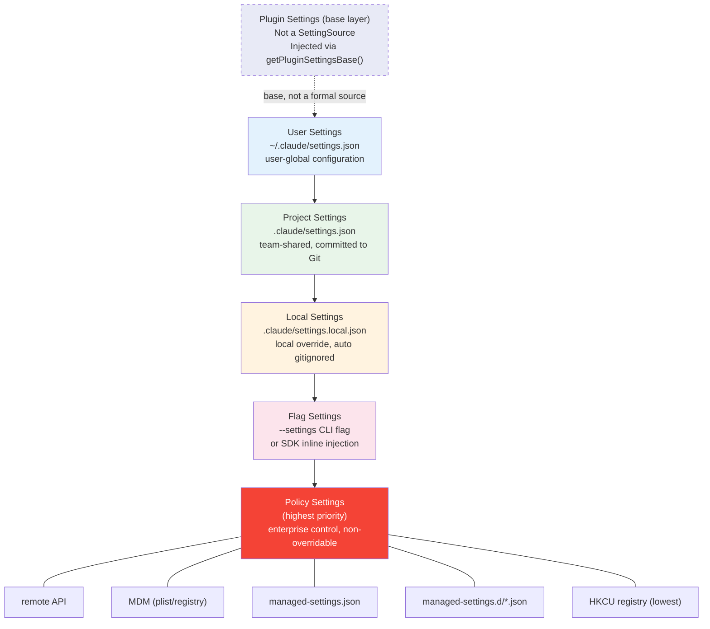

# Chapter 3: Configuration System and Enterprise MDM — The Art of Merging Multi-Layer Configuration

> This is Chapter 3 of *Deep Dive into Claude Code Source*. We dissect how the Settings system reads, validates, and merges configuration from 5 formal sources (plus 1 Plugin base layer), and how it watches for changes at runtime and hot-reloads — a multi-layer configuration merging architecture built for enterprise deployment. Beyond the file-level merge pipeline, Claude Code also runs two independent organization-level service pipelines — `services/policyLimits/` and `services/settingsSync/` — that take no part in settings merging, yet shape the runtime configuration the user ultimately sees along two axes: "enterprise control" and "cross-device consistency".

## Why do we need multi-layer configuration?

A CLI tool's configuration needs sound simple — let the user write a JSON file and be done. But the reality Claude Code faces is far more complex:

1. **Personal preferences** — users want a global setting for their preferred model and permission rules
2. **Team sharing** — project teams need to commit MCP servers and Hook scripts to a shared Git repository
3. **Local overrides** — local debugging requires overriding project settings without committing back to Git
4. **Enterprise control** — security teams need to force sandboxing on and forbid dangerous permissions, with no way for users to override
5. **Remote policy** — enterprise admins push configuration via API without touching every machine
6. **Platform differences** — macOS uses plist + MDM, Windows uses the registry, Linux uses files

These needs stack on top of each other; no single configuration file can satisfy all of them. Claude Code's Settings system solves the problem elegantly with **multi-source configuration + priority-based merging + change-driven hot-reload**.

---

## 1. The configuration sources at a glance: 5 + 1 priority layers

The Settings system is built around an explicit priority chain. Configuration is read from multiple sources, then merged layer by layer from lowest to highest priority — higher layers override lower layers:



The formal source types are defined in `utils/settings/constants.ts`, and there are only **5** `SettingSource` values:

```typescript
// utils/settings/constants.ts:7-22
export const SETTING_SOURCES = [
  'userSettings',      // user-global
  'projectSettings',   // project-shared
  'localSettings',     // local override (gitignored)
  'flagSettings',      // CLI --settings flag
  'policySettings',    // enterprise control (highest priority)
] as const
```

The array order is the merge order — **later entries override earlier ones**. `policySettings` comes last, which means enterprise-control policy gets the final say.

There is also an **informal layer 0** — Plugin Settings. It is not a member of the `SettingSource` type; it is injected as the lowest-priority base by `getPluginSettingsBase()` inside `loadSettingsFromDisk()` (`settingsCache.ts:61-80`). Plugin only contains whitelisted fields (such as `agent` configuration), and every formal file-based source overrides it.

### 1.1 File locations and uses for each source

| Layer | Source | File location | Typical use |
|------|--------|---------|---------|
| Base | Plugin (not a SettingSource) | In-memory injection | Default Agent configuration provided by plugins |
| 1 | User | `~/.claude/settings.json` | Personal global preferences (model, permissions) |
| 2 | Project | `$PROJECT/.claude/settings.json` | Team-shared configuration (Hook, MCP) |
| 3 | Local | `$PROJECT/.claude/settings.local.json` | Local overrides (auto-added to `.gitignore`) |
| 4 | Flag | `--settings` CLI flag | Transient configuration injected by SDK / IDE |
| 5 (highest) | Policy | Multiple sources (see below) | Enterprise security control |

Among these, Policy Settings is the most special — it is itself an internal multi-source system with its own priority chain, using a **first-source-wins** strategy.

### 1.2 The internal priority of Policy Settings

Policy Settings does not simply read from a single file like the other layers. It has its own **4-layer sub-priority chain**, using "first source wins" (the first source with content wins):

```typescript
// utils/settings/settings.ts:322-345
function getSettingsForSourceUncached(source: SettingSource): SettingsJson | null {
  if (source === 'policySettings') {
    // 1. Remote API (highest priority)
    const remoteSettings = getRemoteManagedSettingsSyncFromCache()
    if (remoteSettings && Object.keys(remoteSettings).length > 0) {
      return remoteSettings
    }

    // 2. Admin-only MDM (HKLM/plist)
    const mdmResult = getMdmSettings()
    if (Object.keys(mdmResult.settings).length > 0) {
      return mdmResult.settings
    }

    // 3. File-based managed settings
    const { settings: fileSettings } = loadManagedFileSettings()
    if (fileSettings) {
      return fileSettings
    }

    // 4. HKCU registry (lowest — user-writable)
    const hkcu = getHkcuSettings()
    if (Object.keys(hkcu.settings).length > 0) {
      return hkcu.settings
    }

    return null
  }
  // ...
}
```

Notice how this differs from the outer merge strategy: the outer system **merges every layer**, while Policy internally **lets the first source win** (first-source-wins). The design intent is clear — if the enterprise has pushed policy via the Remote API, the contents of the local `managed-settings.json` should no longer be considered, to avoid policy conflicts.

> **In-chapter roadmap**: §1–§5 cover the merge pipeline for the 5 `SettingSource` layers; §6 (PolicyLimits) and §7 (SettingsSync) cover two organization-level side services that run in parallel to settings — they **do not enter the `loadSettingsFromDisk()` merge pipeline** (see `utils/settings/constants.ts:7-22`, where `SETTING_SOURCES` only contains 5 entries), but they still shape the final runtime configuration. §8–§11 return to the merge system itself, covering change detection, security design, MDM polling, and portable patterns.

---

## 2. The core merge algorithm: loadSettingsFromDisk()

The most central function in the whole Settings system is `loadSettingsFromDisk()`. It is responsible for reading and merging every configuration source in priority order:

```typescript
// utils/settings/settings.ts:645-796
function loadSettingsFromDisk(): SettingsWithErrors {
  // Guard against recursive calls (some validation functions may indirectly trigger settings reads)
  if (isLoadingSettings) {
    return { settings: {}, errors: [] }
  }

  isLoadingSettings = true
  try {
    // Start from Plugin Settings (the lowest-priority base)
    const pluginSettings = getPluginSettingsBase()
    let mergedSettings: SettingsJson = {}
    if (pluginSettings) {
      mergedSettings = mergeWith(mergedSettings, pluginSettings, settingsMergeCustomizer)
    }

    const allErrors: ValidationError[] = []
    const seenFiles = new Set<string>()

    // Merge layer by layer in priority order
    for (const source of getEnabledSettingSources()) {
      if (source === 'policySettings') {
        // Policy uses first-source-wins (special logic)
        // ...
        continue
      }

      const filePath = getSettingsFilePathForSource(source)
      if (filePath) {
        const resolvedPath = resolve(filePath)
        // Dedup: the same file is never loaded twice
        if (!seenFiles.has(resolvedPath)) {
          seenFiles.add(resolvedPath)
          const { settings, errors } = parseSettingsFile(filePath)
          if (settings) {
            mergedSettings = mergeWith(mergedSettings, settings, settingsMergeCustomizer)
          }
        }
      }
    }

    return { settings: mergedSettings, errors: allErrors }
  } finally {
    isLoadingSettings = false
  }
}
```

A few subtle design choices deserve attention here:

**Recursion guard**: the `isLoadingSettings` flag prevents recursion. Some validation logic (such as permission checks) may indirectly trigger `getSettings()`; without the guard, you get infinite recursion.

**File dedup**: the `seenFiles` set guarantees that the same physical file is not loaded twice. In practice this mainly guards against an edge case where, after `--setting-sources` CLI control, several sources happen to resolve to the same path (for example, when a symlink causes two logical paths to point to the same physical file).

**Array merge strategy**: merging uses a custom `settingsMergeCustomizer`:

```typescript
// utils/settings/settings.ts:538-547
export function settingsMergeCustomizer(objValue: unknown, srcValue: unknown): unknown {
  if (Array.isArray(objValue) && Array.isArray(srcValue)) {
    return mergeArrays(objValue, srcValue)  // dedup-concat
  }
  return undefined  // let lodash handle everything else (deep-merge objects, overwrite scalars)
}
```

Arrays are **dedup-concatenated** (not replaced), and that decision is critical for the permission system — multi-layer `allow` and `deny` rules combine rather than the higher layer fully overriding the lower layer.

---

## 3. Configuration file parsing and validation

### 3.1 Zod Schema validation

After every configuration file is loaded, it goes through `SettingsSchema` for Zod runtime validation:

```typescript
// utils/settings/settings.ts:201-231
function parseSettingsFileUncached(path: string): {
  settings: SettingsJson | null
  errors: ValidationError[]
} {
  try {
    const content = readFileSync(resolvedPath)
    if (content.trim() === '') {
      return { settings: {}, errors: [] }
    }

    const data = safeParseJSON(content, false)

    // Filter out invalid permission rules before schema validation
    const ruleWarnings = filterInvalidPermissionRules(data, path)

    const result = SettingsSchema().safeParse(data)
    if (!result.success) {
      const errors = formatZodError(result.error, path)
      return { settings: null, errors: [...ruleWarnings, ...errors] }
    }

    return { settings: result.data, errors: ruleWarnings }
  } catch (error) {
    handleFileSystemError(error, path)
    return { settings: null, errors: [] }
  }
}
```

There is a key **fault-tolerance** design here: `filterInvalidPermissionRules()` runs before schema validation, peeling off invalid permission rules separately. That way a single bad rule does not cause the entire configuration file to be rejected — the other valid settings still take effect; only a warning is emitted.

### 3.2 Backward-compatible design of SettingsSchema

`SettingsSchema` is defined in `utils/settings/types.ts` and is built using `lazySchema()` (the same lazy-construction pattern used by the tool system; see chapter 10). Its design strictly follows backward-compatibility principles:

```typescript
// utils/settings/types.ts:210-241 (excerpted comments)
// ✅ Allowed changes:
// - Add new optional fields (always use .optional())
// - Add new enum values (preserve existing values)
// - Make validation more permissive

// ❌ Breaking changes to avoid:
// - Remove fields (mark deprecated instead)
// - Remove enum values
// - Turn an optional field into a required one
// - Make types stricter
```

The schema covers a wealth of configuration items — from basic `model` and `env` all the way to complex `permissions` (permission rules), `hooks` (lifecycle hooks), `sandbox` (sandbox configuration), `allowedMcpServers` (MCP server whitelist), and over 40 configuration fields in total. Every field carries a `.describe()` annotation, and those annotations are exported as JSON Schema to power editor autocompletion.

A particularly interesting fault-tolerance design is the `strictPluginOnlyCustomization` field:

```typescript
// utils/settings/types.ts:519-540
strictPluginOnlyCustomization: z
  .preprocess(
    // Forward compatibility: drop unknown surface names so that future enum additions
    // (e.g. 'commands') don't cause old clients' safeParse to fail,
    // which would in turn cause the whole managed-settings file to be discarded
    v => Array.isArray(v)
      ? v.filter(x => (CUSTOMIZATION_SURFACES as readonly string[]).includes(x))
      : v,
    z.union([z.boolean(), z.array(z.enum(CUSTOMIZATION_SURFACES))]),
  )
  .optional()
  // Non-array invalid values are still illegal after preprocess; .catch downgrades them to undefined
  // rather than letting the entire managed-settings file fail validation
  .catch(undefined)
```

This embodies an important principle: **configuration parsing should degrade gracefully, not fail catastrophically**. An unknown field value should not invalidate an entire enterprise policy file.

### 3.3 The three-level cache

Frequently reading configuration files would create performance problems. The Settings system uses three levels of cache to avoid redundant I/O:

```typescript
// utils/settings/settingsCache.ts

// Level 1: cache of the final merged result
let sessionSettingsCache: SettingsWithErrors | null = null

// Level 2: cache per configuration source
const perSourceCache = new Map<SettingSource, SettingsJson | null>()

// Level 3: file-parse cache (deduplicates re-parsing the same file when referenced by multiple paths)
const parseFileCache = new Map<string, ParsedSettings>()

export function resetSettingsCache(): void {
  sessionSettingsCache = null
  perSourceCache.clear()
  parseFileCache.clear()
}
```

The three caches cover different granularities:
- **parseFileCache** prevents the same file from being parsed twice (`parseSettingsFile()` and `getSettingsForSource()` may hit the same file from different paths)
- **perSourceCache** prevents redundant single-source computation (e.g. the 4-layer sub-source lookup of `policySettings`)
- **sessionSettingsCache** prevents redundant computation of the overall merge

All three caches are invalidated together via `resetSettingsCache()`, guaranteeing consistency.

---

## 4. MDM integration: cross-platform enterprise device management

Claude Code supports pushing configuration via the OS-native device management mechanism. This is a key feature for large enterprise deployments.

### 4.1 The three-module layered architecture

The MDM implementation is split into three modules, each with explicit responsibilities and import constraints:

```
mdm/
├── constants.ts  — zero-weight imports (only os), shared constants and path builders
├── rawRead.ts    — minimal imports (child_process + fs), child-process I/O
└── settings.ts   — parsing, caching, first-source-wins logic
```

**Why split it this way?** Because `rawRead.ts` is called during the module-evaluation phase of `main.tsx` (the side-effect-up-front pattern mentioned in chapter 2), and at that point no heavy module may be imported. MDM reading is divided into **two phases**:

**Phase one: pre-launch child process** (`main.tsx:3-4`, during module evaluation)

```typescript
// utils/settings/mdm/rawRead.ts:120-123
export function startMdmRawRead(): void {
  if (rawReadPromise) return
  rawReadPromise = fireRawRead()  // immediately fire the plutil / reg query child process
}
```

`startMdmRawRead()` is called at the top of `main.tsx`, taking advantage of the next ~135 ms of import-evaluation time to run the child-process I/O in parallel. At this point only a Promise is produced — no parsing yet.

**Phase two: await and consume the result** (`main.tsx:914`, inside the `preAction` hook)

```typescript
// utils/settings/mdm/settings.ts:67-98
export function startMdmSettingsLoad(): void {
  mdmLoadPromise = (async () => {
    // Use the promise from phase one if available, otherwise fire fresh
    const rawPromise = getMdmRawReadPromise() ?? fireRawRead()
    const { mdm, hkcu } = consumeRawReadResult(await rawPromise)  // parse + write cache
    mdmCache = mdm
    hkcuCache = hkcu
  })()
}
```

`ensureMdmSettingsLoaded()` is awaited before the first settings read — if the phase-one child process has already completed, the wait here is effectively zero.

### 4.2 Cross-platform reading strategy

```typescript
// utils/settings/mdm/rawRead.ts:55-113
export function fireRawRead(): Promise<RawReadResult> {
  return (async (): Promise<RawReadResult> => {
    if (process.platform === 'darwin') {
      // macOS: multi-path plist parallel reads (plutil converts to JSON)
      const plistPaths = getMacOSPlistPaths()
      const allResults = await Promise.all(
        plistPaths.map(async ({ path, label }) => {
          // Fast path: skip when the file does not exist (saves the ~5 ms plutil startup cost)
          if (!existsSync(path)) {
            return { stdout: '', label, ok: false }
          }
          const { stdout, code } = await execFilePromise(PLUTIL_PATH, [
            ...PLUTIL_ARGS_PREFIX, path,
          ])
          return { stdout, label, ok: code === 0 && !!stdout }
        }),
      )
      // First source wins (the array is sorted by priority)
      const winner = allResults.find(r => r.ok)
      return { plistStdouts: winner ? [{ stdout: winner.stdout, label: winner.label }] : [] }
    }

    if (process.platform === 'win32') {
      // Windows: HKLM and HKCU read in parallel
      const [hklm, hkcu] = await Promise.all([
        execFilePromise('reg', ['query', WINDOWS_REGISTRY_KEY_PATH_HKLM, '/v', 'Settings']),
        execFilePromise('reg', ['query', WINDOWS_REGISTRY_KEY_PATH_HKCU, '/v', 'Settings']),
      ])
      return { hklmStdout: hklm.code === 0 ? hklm.stdout : null, hkcuStdout: hkcu.code === 0 ? hkcu.stdout : null }
    }

    // Linux: no MDM (uses /etc/claude-code/managed-settings.json)
    return { plistStdouts: null, hklmStdout: null, hkcuStdout: null }
  })()
}
```

The macOS plist paths have an explicit priority order (defined in `constants.ts`):

```typescript
// utils/settings/mdm/constants.ts:45-81
export function getMacOSPlistPaths(): Array<{ path: string; label: string }> {
  const paths = []

  // 1. Highest priority: per-user Managed Preferences
  paths.push({
    path: `/Library/Managed Preferences/${username}/com.anthropic.claudecode.plist`,
    label: 'per-user managed preferences',
  })

  // 2. Device-level Managed Preferences
  paths.push({
    path: `/Library/Managed Preferences/com.anthropic.claudecode.plist`,
    label: 'device-level managed preferences',
  })

  // 3. Internal builds only: user-writable Preferences (used for local MDM testing)
  if (process.env.USER_TYPE === 'ant') {
    paths.push({
      path: join(homedir(), 'Library', 'Preferences', 'com.anthropic.claudecode.plist'),
      label: 'user preferences (ant-only)',
    })
  }

  return paths
}
```

The Windows registry path lives under `SOFTWARE\Policies` rather than `SOFTWARE` — and the source comment explains why: `SOFTWARE` is redirected under WOW64 (32-bit processes read values out of `WOW6432Node`), while `SOFTWARE\Policies` is a shared key that is not subject to redirection.

### 4.3 Drop-in directory pattern

Beyond the single `managed-settings.json`, the system also supports a `managed-settings.d/` directory, allowing multiple independent policy fragments:

```typescript
// utils/settings/settings.ts:63-121
export function loadManagedFileSettings(): { settings: SettingsJson | null; errors: ValidationError[] } {
  let merged: SettingsJson = {}

  // 1. Load managed-settings.json first as the base (lowest priority)
  const { settings } = parseSettingsFile(getManagedSettingsFilePath())
  if (settings && Object.keys(settings).length > 0) {
    merged = mergeWith(merged, settings, settingsMergeCustomizer)
  }

  // 2. Scan .json files under managed-settings.d/
  //    Sorted alphabetically; later files override earlier ones
  const dropInDir = getManagedSettingsDropInDir()
  const entries = fs.readdirSync(dropInDir)
    .filter(d => d.isFile() && d.name.endsWith('.json') && !d.name.startsWith('.'))
    .map(d => d.name)
    .sort()

  for (const name of entries) {
    const { settings } = parseSettingsFile(join(dropInDir, name))
    if (settings && Object.keys(settings).length > 0) {
      merged = mergeWith(merged, settings, settingsMergeCustomizer)
    }
  }

  return { settings: found ? merged : null, errors }
}
```

This is borrowed from the Linux `systemd` / `sudoers` drop-in pattern:
- A base file provides defaults
- Different teams can independently commit policy fragments (such as `10-otel.json` and `20-security.json`)
- No need to coordinate edits to the same file

---

## 5. Remote policy: Remote Managed Settings

The highest-priority source of Policy Settings is the Remote API — enterprise admins push configuration through the Anthropic API without physically accessing each device.

### 5.1 Eligibility check and fail-open design

`isRemoteManagedSettingsEligible()` decides whether the current user should query the API for remote policy. Its decision logic splits into **pre-exclusion** and **three pass-through paths**:

```typescript
// services/remoteManagedSettings/syncCache.ts:49-112
export function isRemoteManagedSettingsEligible(): boolean {
  // ── Pre-exclusion ──
  // 3P provider / custom base URL → do not query
  if (getAPIProvider() !== 'firstParty') return false
  if (!isFirstPartyAnthropicBaseUrl()) return false
  // Cowork VM → not applicable (server-managed settings are not appropriate for VM scenarios)
  if (process.env.CLAUDE_CODE_ENTRYPOINT === 'local-agent') return false

  // ── Path 1: externally injected OAuth token (subscriptionType === null) ──
  // Tokens injected via env vars by CCD/CCR carry no subscriptionType metadata;
  // let them through — let the API decide whether to return empty settings
  // (the cost of a false positive is a single network round-trip)
  const tokens = getClaudeAIOAuthTokens()
  if (tokens?.accessToken && tokens.subscriptionType === null) return true

  // ── Path 2: OAuth Enterprise or Team users ──
  // In addition to Enterprise, Team subscriptions are also eligible;
  // the scope must include CLAUDE_AI_INFERENCE_SCOPE
  if (
    tokens?.accessToken &&
    tokens.scopes?.includes(CLAUDE_AI_INFERENCE_SCOPE) &&
    (tokens.subscriptionType === 'enterprise' || tokens.subscriptionType === 'team')
  ) return true

  // ── Path 3: Console API Key users ──
  // Skip apiKeyHelper to avoid circular dependency
  const { key: apiKey } = getAnthropicApiKeyWithSource({
    skipRetrievingKeyFromApiKeyHelper: true,
  })
  if (apiKey) return true

  return false
}
```

A design choice worth noting: for the `subscriptionType === null` case (externally injected tokens missing metadata), the system **would rather send one extra API request than miss an eligible user**. The API returns a 204 / 404 empty response for orgs without policy, and the merge logic in `settings.ts` will fall through to MDM / file as expected — the cost of a false positive is extremely low (one round-trip), but the cost of a false negative is that enterprise policy fails to take effect at all.

The core design principle of remote settings is **fail-open**: when fetching fails, do not block startup; continue using local cache or simply do not apply remote policy.

### 5.2 Two-level cache + ETag optimization

Remote settings use a file-cache + memory-cache two-level mechanism:

1. **File cache**: `~/.claude/remote-settings.json`, persisted across sessions
2. **Memory cache**: a session-level `sessionCache` to avoid re-reading the file
3. **HTTP ETag**: incremental updates via the `If-None-Match` header and SHA-256 checksum; a 304 response means no change

```typescript
// services/remoteManagedSettings/index.ts:131-137
export function computeChecksumFromSettings(settings: SettingsJson): string {
  const sorted = sortKeysDeep(settings)
  // No whitespace separators — matches Python's json.dumps(separators=(",", ":"))
  const normalized = jsonStringify(sorted)
  const hash = createHash('sha256').update(normalized).digest('hex')
  return `sha256:${hash}`
}
```

Note that the checksum computation must match the server-side Python implementation exactly (`sort_keys=True, separators=(",", ":")`) — this is the kind of detail that easily breaks in cross-language collaboration.

### 5.3 Safety confirmation: validation before new policy lands

Before applying newly fetched remote settings to the session, the system runs a safety check:

```typescript
// services/remoteManagedSettings/index.ts:456-468
if (hasContent) {
  // Check whether the new settings contain dangerous changes (permission downgrade, sandbox disable, etc.)
  const securityResult = await checkManagedSettingsSecurity(cachedSettings, newSettings)
  if (!handleSecurityCheckResult(securityResult)) {
    // User declined → don't apply new settings, keep the cached older version
    logForDebugging('Remote settings: User rejected new settings, using cached settings')
    return cachedSettings
  }

  setSessionCache(newSettings)
  await saveSettings(newSettings)
  return newSettings
}
```

`checkManagedSettingsSecurity()` compares security-related fields (permission rules, sandbox configuration, etc.) between the old and new settings; if it detects a sensitive change, it prompts the user for confirmation via `handleSecurityCheckResult()`. This guarantees that even if an enterprise admin pushes a remote policy change, the user is not silently downgraded in security.

### 5.4 Background polling

After the initial load, a one-hour background poll captures mid-session policy changes:

```typescript
// services/remoteManagedSettings/index.ts:612-628
export function startBackgroundPolling(): void {
  pollingIntervalId = setInterval(() => {
    void pollRemoteSettings()
  }, POLLING_INTERVAL_MS)  // 60 * 60 * 1000 = 1 hour
  pollingIntervalId.unref()  // do not block process exit
}
```

---

## 6. PolicyLimits: an organization-level switch parallel to Settings

By now you have seen how the Settings system stuffs "enterprise control" into the same priority chain via the Policy layer. But there is another class of control that does not fit Settings — it is not "which model should we use" or "which permissions are allowed", but rather "can users in this organization use a given product feature at all". `services/policyLimits/` is a service built specifically for that class of organization-level switch.

It and Remote Managed Settings are like twin siblings: both fetch from the Anthropic API, both cache to `~/.claude/policy-limits.json`, both poll in the background on a one-hour interval, both are fail-open. But their scope of responsibility is different — Settings decides behavioral details, PolicyLimits decides feature visibility.

### 6.1 Eligibility: same source as Remote Settings, but stricter

```typescript
// services/policyLimits/index.ts:8-13 (file header comment)
// Eligibility:
// - Console users (API key): All eligible
// - OAuth users (Claude.ai): Only Team and Enterprise/C4E subscribers are eligible
// - API fails open (non-blocking) - if fetch fails, continues without restrictions
// - API returns empty restrictions for users without policy limits
```

The eligibility logic is closely aligned with Remote Managed Settings — both require a 1P Anthropic baseURL, both accept OAuth Enterprise/Team or Console API Key — but PolicyLimits does NOT accept the `subscriptionType === null` "externally injected token" path. The reason is practical: PolicyLimits is the decision to "hard-disable a UI entrypoint", and it would rather miss-detect (leave a token unrestricted) than mis-disable (force-tighten an ordinary token because of missing metadata).

### 6.2 Default values and the essential-traffic counter-example

`isPolicyAllowed(policy)` is the unified entry point for all feature gating. Its default values differ sharply in two cases:

```typescript
// simplified from services/policyLimits/index.ts
const ESSENTIAL_TRAFFIC_DENY_ON_MISS = new Set(['allow_product_feedback'])

export function isPolicyAllowed(policy: string): boolean {
  // Explicit policy already exists → use the explicit value
  const restrictions = getSessionCache()
  if (restrictions && policy in restrictions) {
    return restrictions[policy].allowed
  }

  // No policy → check whether the user is in essential-traffic-only mode
  if (isEssentialTrafficOnly() && ESSENTIAL_TRAFFIC_DENY_ON_MISS.has(policy)) {
    return false  // counter-example: missing means denied
  }
  return true  // default-allow (fail-open)
}
```

Why does `allow_product_feedback` work the opposite way? Because it concerns "sending user interaction data back to Anthropic" — for an enterprise user that has explicitly enabled "essential-traffic only", a missing policy in cache **does not** mean "the admin allows it"; it is more likely "we haven't fetched the policy yet". In that situation, the only safe choice is not to send. This is the explicitly carved-out counter-example to the general fail-open principle.

### 6.3 The cache file's 0o600 permission

When PolicyLimits writes `~/.claude/policy-limits.json`, it explicitly specifies mode `0o600` (read/write for the owner only). This differs from ordinary Settings files — the latter rely on default directory permissions, while PolicyLimits cache may contain organization-level feature switches, and exposing it to other users on the same machine would be an unnecessary information leak.

### 6.4 A 30-second loading-promise timeout

```typescript
// services/policyLimits/index.ts:94-114
export function initializePolicyLimitsLoadingPromise(): void {
  if (loadingCompletePromise) return
  if (isPolicyLimitsEligible()) {
    loadingCompletePromise = new Promise(resolve => {
      loadingCompleteResolve = resolve
      setTimeout(() => {
        if (loadingCompleteResolve) {
          loadingCompleteResolve()  // safety net against deadlock
          loadingCompleteResolve = null
        }
      }, LOADING_PROMISE_TIMEOUT_MS)  // 30 seconds
    })
  }
}
```

Any caller that wants to "wait until PolicyLimits is ready" can `await waitForPolicyLimitsLoaded()`, but even if `loadPolicyLimits()` is never called for some reason, the promise self-resolves after 30 seconds — guaranteeing that the fail-open chain does not deadlock the entire startup because some initialization path forgot to wire the call. This is a common but easily forgotten safety net for the "remote dependency + startup critical path" pattern.

---

## 7. SettingsSync: a bidirectional channel for cross-device consistency

If PolicyLimits is "push down from the top", `services/settingsSync/` is "carry between machines". It addresses the pain point of: when a user configures preferences on their laptop (model, Hook, Permission, `CLAUDE.md` memory), how do those preferences naturally appear on another machine (even a Claude Code Remote instance hosted in the cloud)?

The backend API number is `anthropic#218817`, listed right in the file header — an extremely useful breadcrumb when debugging, far easier than making readers dig through backend docs.

### 7.1 Two directions, two sets of gates

```typescript
// services/settingsSync/index.ts:60-74 (upload-path gates)
if (
  !feature('UPLOAD_USER_SETTINGS') ||
  !getFeatureValue_CACHED_MAY_BE_STALE('tengu_enable_settings_sync_push', false) ||
  !getIsInteractive() ||
  !isUsingOAuth()
) {
  // skip
  return
}
```

The upload direction (CLI → Server) has four gates: the bundle feature flag, the live GrowthBook flag, interactive mode (`getIsInteractive()`), and OAuth login. Why require interactive? Because in non-interactive scenarios such as SDK / CCR, the user has no "I am adjusting my preferences" semantic, and uploading a background Agent's transient configuration to the server would pollute the user's real preference set.

The download direction (Server → CCR) is the mirror image — `feature('DOWNLOAD_USER_SETTINGS')` + the `tengu_strap_foyer` flag — triggered only once, when CCR starts up and is about to install plugins.

### 7.2 Incremental upload: the beauty of lodash pickBy

```typescript
// services/settingsSync/index.ts:84-90
const projectId = await getRepoRemoteHash()
const localEntries = await buildEntriesFromLocalFiles(projectId)
const remoteEntries = result.isEmpty ? {} : result.data!.content.entries
const changedEntries = pickBy(
  localEntries,
  (value, key) => remoteEntries[key] !== value,
)
```

There is no diff algorithm here and no mtime comparison — it simply takes 4 local files (`~/.claude/settings.json`, `~/.claude/CLAUDE.md`, project-level `settings.local.json`, project-level `CLAUDE.local.md`) into a `{ path: content }` dictionary, compares it key-by-key against the remote-side dictionary for content equality, and only uploads the entries that have changed. `lodash pickBy` here serves as both filter and diff engine — beautifully simple.

`projectId = await getRepoRemoteHash()` decides what key project-level files use — worktrees sharing the same Git remote are treated as the same project, naturally supporting the "clone on machine A, continue on machine B" workflow.

### 7.3 500 KB per-file cap and MD5 integrity check

```typescript
const MAX_FILE_SIZE_BYTES = 500 * 1024 // 500 KB per file (matches backend limit)
```

The "matches backend limit" comment is the key — the threshold is not a CLI whim but a hard contract with the server. Reading a 600 KB `CLAUDE.md` causes that entry to be skipped without blocking the rest, consistent with the general fail-open principle. End-to-end integrity is enforced by the MD5 checksum field in `UserSyncDataSchema`.

### 7.4 The internal-write marker when landing files

After download completes, the remote content must be written back to local files. That moment triggers the chokidar file watcher described in §8.2 — without a marker, the system would mistake "I just wrote that myself" for "the user changed it externally" and trigger a full settings reload, causing meaningless thrash.

```typescript
// applyRemoteEntriesToLocal simplified pseudocode
markInternalWrite(targetPath)           // any write within a 5-second window is swallowed
await writeFile(targetPath, content)
resetSettingsCache()                    // proactively invalidate so the next read picks up the new value
clearMemoryFileCaches()                 // CLAUDE.md-style memory files have a separate cache
```

The `markInternalWrite` / `consumeInternalWrite` primitive pair is detailed in §8.2; we only point out here that SettingsSync is its second important consumer — the first is permission-rule saves triggered by the UI. Two completely different write entry points sharing the same "I wrote this myself, don't echo it back" mechanism is a piece of API reuse worth applauding.

### 7.5 A `/reload-plugins`-triggered fast re-download

```typescript
// services/settingsSync/index.ts:152-154
export function redownloadUserSettings(): Promise<boolean> {
  downloadPromise = doDownloadUserSettings(0)  // 0 = maxRetries
  return downloadPromise
}
```

`redownloadUserSettings()` itself takes no parameters, and internally forces a call to `doDownloadUserSettings(0)`, clamping `maxRetries` down to 0 — the startup path uses `DEFAULT_MAX_RETRIES` and automatically retries a turn or two; `/reload-plugins` is a command the user explicitly typed, so it makes just one attempt and fails open on failure (the source comment puts it plainly: `No retries: user-initiated command, one attempt + fail-open`); the user can simply type it again. This is a clean example of expressing "call semantics" through different parameters on the same underlying function — startup gets resilience, the user command gets responsiveness, and we avoid writing two copies of the download logic for the two scenarios.

---

## 8. Change detection and hot reload

The Settings system is not "read once at startup and done" — it supports runtime change detection and hot reload of configuration files.

### 8.1 File-watch architecture

`changeDetector.ts` uses the `chokidar` library to watch for configuration changes:

```typescript
// utils/settings/changeDetector.ts:84-146
export async function initialize(): Promise<void> {
  // Start MDM polling (independent of the filesystem watcher)
  startMdmPoll()

  const { dirs, settingsFiles, dropInDir } = await getWatchTargets()

  watcher = chokidar.watch(dirs, {
    persistent: true,
    ignoreInitial: true,
    depth: 0,  // watch only direct children
    awaitWriteFinish: {
      stabilityThreshold: 1000,   // wait for writes to stabilize
      pollInterval: 500,
    },
    ignored: (path, stats) => {
      // Only watch known configuration file paths
      if (settingsFiles.has(normalized)) return false
      // Also accept .json files inside the drop-in directory
      if (dropInDir && normalized.startsWith(dropInDir) && normalized.endsWith('.json')) {
        return false
      }
      return true  // ignore everything else
    },
  })

  watcher.on('change', handleChange)
  watcher.on('unlink', handleDelete)
  watcher.on('add', handleAdd)
}
```

### 8.2 Filtering internal writes

When Claude Code modifies a configuration file itself (for example, when the user adds a permission rule through the UI), no change notification should fire. The system uses a timestamp Map to filter these:

```typescript
// utils/settings/internalWrites.ts
const timestamps = new Map<string, number>()

export function markInternalWrite(path: string): void {
  timestamps.set(path, Date.now())
}

export function consumeInternalWrite(path: string, windowMs: number): boolean {
  const ts = timestamps.get(path)
  if (ts !== undefined && Date.now() - ts < windowMs) {
    timestamps.delete(path)  // delete after consumption — does not affect the next real external change
    return true
  }
  return false
}
```

Before writing a file in `updateSettingsForSource()`, the code calls `markInternalWrite(filePath)`. Then within `handleChange()`, any change within 5 seconds is recognized as an internal write and skipped.

### 8.3 Graceful handling of the delete-then-recreate pattern

Configuration files are often "deleted and immediately recreated" (by an auto-updater, or by another session starting up). Treating the delete event as a configuration wipe would cause flicker. The system introduces an elegant grace-period mechanism:

```typescript
// utils/settings/changeDetector.ts:62-64
const DELETION_GRACE_MS =
  FILE_STABILITY_THRESHOLD_MS + FILE_STABILITY_POLL_INTERVAL_MS + 200
  // = 1000 + 500 + 200 = 1700ms

function handleDelete(path: string): void {
  // Don't act on the delete immediately — set a grace timer
  const timer = setTimeout(() => {
    pendingDeletions.delete(path)
    fanOut(source)  // only process for real once the timeout fires
  }, DELETION_GRACE_MS, path, source)
  pendingDeletions.set(path, timer)
}

function handleAdd(path: string): void {
  // The file was recreated → cancel the pending deletion
  const pendingTimer = pendingDeletions.get(path)
  if (pendingTimer) {
    clearTimeout(pendingTimer)
    pendingDeletions.delete(path)
  }
  handleChange(path)  // treat as an ordinary change
}
```

If the file is recreated within 1700 ms (the `add` event fires), the delete event is cancelled — only `add` (as a change) is processed.

### 8.4 Centralized cache invalidation

Once a change is detected, the notification is dispatched centrally via `fanOut()`:

```typescript
// utils/settings/changeDetector.ts:437-439
function fanOut(source: SettingSource): void {
  resetSettingsCache()     // reset the cache first
  settingsChanged.emit(source)  // then notify all listeners
}
```

The source comment specifically calls out a performance lesson: cache resets used to be scattered among individual listeners, which led to N listeners = N disk re-reads. After centralizing into `fanOut()`, only the first listener triggers a single disk read, and subsequent listeners hit the cache.

### 8.5 Applying the hot reload

Change notifications ultimately propagate into AppState via `applySettingsChange()`:

```typescript
// utils/settings/applySettingsChange.ts:33-92
export function applySettingsChange(
  source: SettingSource,
  setAppState: (f: (prev: AppState) => AppState) => void,
): void {
  const newSettings = getInitialSettings()
  const updatedRules = loadAllPermissionRulesFromDisk()
  updateHooksConfigSnapshot()

  setAppState(prev => {
    let newContext = syncPermissionRulesFromDisk(prev.toolPermissionContext, updatedRules)

    // Re-check whether bypass mode has been disabled
    if (newContext.isBypassPermissionsModeAvailable && isBypassPermissionsModeDisabled()) {
      newContext = createDisabledBypassPermissionsContext(newContext)
    }

    return {
      ...prev,
      settings: newSettings,
      toolPermissionContext: newContext,
    }
  })
}
```

A single configuration change cascades through: settings refresh → permission rules reloaded → Hooks snapshot updated → AppState updated → React UI re-render.

---

## 9. Security design: defending against malicious project configuration

The Settings system has multiple lines of defense to prevent malicious projects from gaining excessive privileges via configuration files:

### 9.1 Trust limits on Project Settings

Certain sensitive settings **deliberately exclude projectSettings** and trust only the user's own settings:

```typescript
// utils/settings/settings.ts:882-889
export function hasSkipDangerousModePermissionPrompt(): boolean {
  return !!(
    getSettingsForSource('userSettings')?.skipDangerousModePermissionPrompt ||
    getSettingsForSource('localSettings')?.skipDangerousModePermissionPrompt ||
    getSettingsForSource('flagSettings')?.skipDangerousModePermissionPrompt ||
    getSettingsForSource('policySettings')?.skipDangerousModePermissionPrompt
    // Note: no projectSettings!
  )
}
```

The source comment spells out why: `projectSettings is intentionally excluded — a malicious project could otherwise auto-bypass the dialog (RCE risk).` A malicious project's `.claude/settings.json` can be committed into a Git repository; if it were allowed to skip the permission confirmation dialog, you have a remote code execution (RCE) risk.

### 9.2 Local Settings auto-gitignore

When writing `settings.local.json`, the file is automatically added to `.gitignore`:

```typescript
// utils/settings/settings.ts:508-514
if (source === 'localSettings') {
  void addFileGlobRuleToGitignore(
    getRelativeSettingsFilePathForSource('localSettings'),
    getOriginalCwd(),
  )
}
```

This prevents files containing local debug configuration (which may include sensitive things like API key paths) from being accidentally committed.

### 9.3 Type-level constraints on editable sources

The TypeScript type system restricts which configuration sources can be programmatically modified:

```typescript
// utils/settings/constants.ts:182-185
export type EditableSettingSource = Exclude<
  SettingSource,
  'policySettings' | 'flagSettings'
>
```

`policySettings` and `flagSettings` are excluded from the editable scope at the type level. The `updateSettingsForSource()` function also enforces this constraint at runtime.

---

## 10. MDM polling: change detection for registry and plist

Filesystem changes can be observed via chokidar, but changes to macOS plist files and the Windows registry cannot be captured via filesystem events. The system solves this with 30-minute interval polling:

```typescript
// utils/settings/changeDetector.ts:381-418
function startMdmPoll(): void {
  // Take a snapshot
  const initial = getMdmSettings()
  const initialHkcu = getHkcuSettings()
  lastMdmSnapshot = jsonStringify({ mdm: initial.settings, hkcu: initialHkcu.settings })

  mdmPollTimer = setInterval(() => {
    void (async () => {
      const { mdm: current, hkcu: currentHkcu } = await refreshMdmSettings()
      const currentSnapshot = jsonStringify({ mdm: current.settings, hkcu: currentHkcu.settings })

      if (currentSnapshot !== lastMdmSnapshot) {
        lastMdmSnapshot = currentSnapshot
        setMdmSettingsCache(current, currentHkcu)
        fanOut('policySettings')
      }
    })()
  }, MDM_POLL_INTERVAL_MS)  // 30 minutes
  mdmPollTimer.unref()  // do not block process exit
}
```

The principle is simple: serialize the entire MDM settings JSON to a string and compare snapshots. It is not fine-grained, but it is completely reliable and trivial to implement.

---

## 11. Portable design patterns

### Pattern 1: Multi-layer configuration merging + type safety

Use an ordered array to define source priority, paired with a `mergeWith` customizer from lodash. Protect the array with `as const` + a `SettingSource` type, and centralize the merging logic in one function.

**Key decision**: should arrays dedup-concatenate or replace? Should scalars overwrite or append? Different scenarios call for different strategies. Claude Code chose "dedup-concat arrays + overwrite scalars" — permission rules stack, model configuration overwrites.

**Where it applies**: any application that needs multi-layer configuration — CLI tools, SDKs, enterprise SaaS products.

### Pattern 2: Internal-write filtering for change detection

Use a timestamp Map to mark "my own writes" and consume the marker inside the change callback to filter the echo. Key design choices: the marker is deleted after consumption (one-shot) and has a time-window constraint (5 seconds), so a stale marker cannot wrongly mask a genuine external change.

**Where it applies**: any "watch file changes but ignore own writes" scenario — configuration hot-reload, file-sync tools, IDE plugins.

### Pattern 3: Fail-open degradation strategy

When fetching remote configuration fails, prefer the locally cached older version over blocking startup or wholly abandoning the policy. This is the application of the "cache-first + eventual consistency" pattern to configuration management.

**Where it applies**: any configuration loading that depends on a remote service — feature flag systems, A/B testing configuration, remote policy engines.

---

---

## Next chapter preview

[Chapter 4: Configuration migration as code — writing each breaking configuration change as a small function](./04-configuration-migration-as-code.md)

We will dissect the 11 migration files under `migrations/` along with the `runMigrations()` scheduler in `main.tsx`, and see how Claude Code turns "the product quietly swapping parts behind the user's back" into a set of idempotent, independently reviewable small functions whose serial execution is guarded by a version number.

---
*For the full content please visit https://github.com/luyao618/Claude-Code-Source-Study (a free star would be appreciated)*
