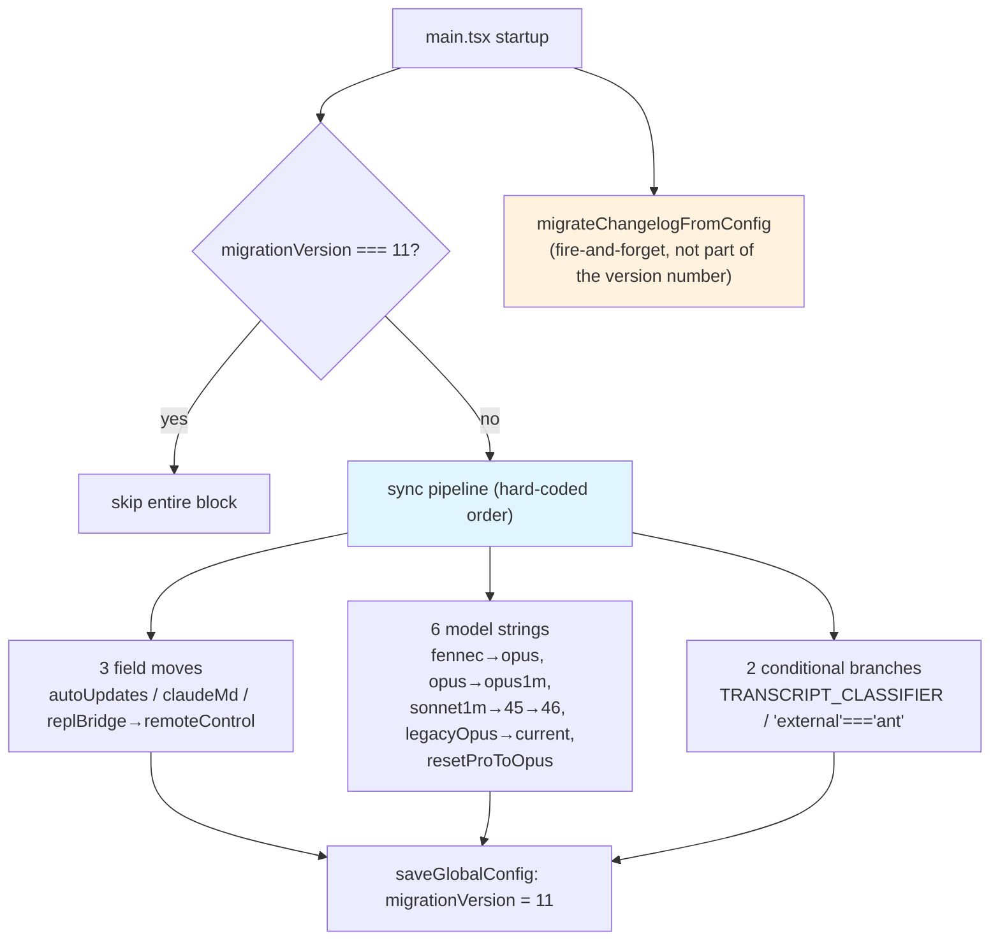

# Chapter 4: Configuration Migration as Code — Writing Every Breaking Config Change as a Tiny Function

> This chapter is Chapter 4 of *Deep Dive into Claude Code Source*. We dissect the 11 migration files under `migrations/` and the `runMigrations()` dispatch in `main.tsx`, watching how Claude Code turns "the product quietly swapping parts behind the user's back" into a set of idempotent, independently reviewable, version-number-guarded little functions that execute serially.

## Why does configuration migration deserve its own chapter?

An actively iterated CLI tool cannot avoid "changing the user's configuration behind their back." Over the past year-plus of Claude Code, this has happened many times:

1. **Model defaults change** — the default for Pro users flipped from Sonnet to Opus; an existing user must not be silently switched on startup to a model they never actively chose.
2. **Model aliases get re-mapped** — `sonnet` meant Sonnet 4.5 half a year ago and means Sonnet 4.6 today; the user's intent back then must be preserved.
3. **Fields move house** — fields like `autoUpdates` need to move from `~/.claude.json` to `~/.claude/settings.json`, without being lost and without existing in both places at once.
4. **Key names get renamed** — implementation-detail leaks like `replBridgeEnabled` need to be renamed to user-doc-worthy names like `remoteControlAtStartup`.
5. **Dialogs get re-shown** — when the old two-option AutoMode dialog gains a third option, users who accepted the old dialog need to see it again.

If these actions are done bluntly, ignoring history, an existing user's experience falls out of joint after some upgrade: the model has inexplicably changed, auto-update has inexplicably turned on, the `/model` screen displays an ID string that no longer maps to anything. Describe it with a "declarative migration DSL"? Too rigid — item 5 above, with its "fire only for the `'enabled'` state to avoid the back-edge of another state machine" kind of precise condition, can't be expressed in a DSL. Write a one-shot script before each release and run it through? Also no — this is something that keeps happening across the product lifecycle, not a one-time move for a single version.

Claude Code's answer: **write every breaking configuration change as an independent, idempotent, version-number-guarded little function, and string them serially into an internal hook at startup called `runMigrations`.** The 11 files in the `migrations/` directory are the complete historical ledger of every "change config behind the user's back" action over the past year-plus:

```text
migrateAutoUpdatesToSettings.ts
migrateBypassPermissionsAcceptedToSettings.ts
migrateEnableAllProjectMcpServersToSettings.ts
migrateFennecToOpus.ts
migrateLegacyOpusToCurrent.ts
migrateOpusToOpus1m.ts
migrateReplBridgeEnabledToRemoteControlAtStartup.ts
migrateSonnet1mToSonnet45.ts
migrateSonnet45ToSonnet46.ts
resetAutoModeOptInForDefaultOffer.ts
resetProToOpusDefault.ts
```

All 11 files sit at the top level — no subdirectories, no common base class, no "framework." Each file exports a single same-named no-arg function whose name is exactly the thing it does. There is a very clear intent behind this restrained organization: **every breaking configuration change is a small piece of code that can be independently reviewed, independently deleted, and independently tested**. You don't need to understand a "migration engine" — just open the file you care about and read it top to bottom; in 30 to 50 lines it has told its entire story.

**Quick reference for the 11 migration functions**

| Function | Group | Trigger condition | One-line purpose | Error handling |
|---|---|---|---|---|
| `migrateAutoUpdatesToSettings` | Field move (§2) | unconditional | Move `autoUpdates` from `~/.claude.json` to `~/.claude/settings.json` | try/catch + logError |
| `migrateBypassPermissionsAcceptedToSettings` | Field move (§2) | unconditional | Move `bypassPermissionsModeAccepted` into settings | try/catch + logError |
| `migrateEnableAllProjectMcpServersToSettings` | Field move (§2) | unconditional | Move `enableAllProjectMcpServers` into settings | try/catch + logError |
| `resetProToOpusDefault` | Model string (§3) | unconditional | Flip Pro default from Sonnet to Opus; banner timestamp as backstop | idempotent early return |
| `migrateSonnet1mToSonnet45` | Model string (§3) | unconditional | Expand the `sonnet[1m]` alias into the explicit string `sonnet-4-5-20250929[1m]` | idempotent early return |
| `migrateLegacyOpusToCurrent` | Model string (§3) | unconditional | Collapse ancient strings like `claude-opus-4-0` back to the `opus` alias | idempotent early return |
| `migrateSonnet45ToSonnet46` | Model string (§3) | unconditional | Roll `sonnet-4-5-*` back to the `sonnet` alias | idempotent early return |
| `migrateOpusToOpus1m` | Model string (§3) | unconditional | Upgrade `opus` to `opus[1m]` | idempotent early return |
| `migrateFennecToOpus` | Model string (§3) | internal builds only (`"external" === 'ant'`) | Migrate the internal codename model to `opus` | idempotent early return |
| `migrateReplBridgeEnabledToRemoteControlAtStartup` | Key-name cleanup (§4) | unconditional | `replBridgeEnabled` → `remoteControlAtStartup` | idempotent early return |
| `resetAutoModeOptInForDefaultOffer` | Key-name cleanup (§4) | `feature('TRANSCRIPT_CLASSIFIER')` | Make users who accepted the old two-option dialog re-see the new three-option dialog | try/catch + inner completion flag |

This chapter dismantles the 11 functions in the following order: first the pipeline in `main.tsx` that strings them together (§1), then three groups in turn — the 3 that move fields from one place to another (§2), the 6 that rename around model strings (§3), and the 2 that clean up around "old key names / old dialog options" (§4) — and finally we collect the disciplines that run through the chapter (§5).

---

## Overview: how the 11 migration functions relate to main.tsx



---

## 1. The pipeline: a serial entrypoint guarded by a version number

The 11 migrations do not each find their own moment to run. They are concentrated in one internal function inside `main.tsx`, guarded by a tiny number called `migrationVersion`. The snippet below is the full pipeline (`main.tsx:323-352`):

```typescript
const CURRENT_MIGRATION_VERSION = 11;
function runMigrations(): void {
  if (getGlobalConfig().migrationVersion !== CURRENT_MIGRATION_VERSION) {
    migrateAutoUpdatesToSettings();
    migrateBypassPermissionsAcceptedToSettings();
    migrateEnableAllProjectMcpServersToSettings();
    resetProToOpusDefault();
    migrateSonnet1mToSonnet45();
    migrateLegacyOpusToCurrent();
    migrateSonnet45ToSonnet46();
    migrateOpusToOpus1m();
    migrateReplBridgeEnabledToRemoteControlAtStartup();
    if (feature('TRANSCRIPT_CLASSIFIER')) resetAutoModeOptInForDefaultOffer();
    if ("external" === 'ant') migrateFennecToOpus();
    saveGlobalConfig(prev => prev.migrationVersion === CURRENT_MIGRATION_VERSION
      ? prev
      : { ...prev, migrationVersion: CURRENT_MIGRATION_VERSION });
  }
  migrateChangelogFromConfig().catch(() => {});
}
```

In 30 short lines, every discipline of this subsystem is laid bare. Let's go through them one by one.

**First, a gatekeeper.** The line `if (getGlobalConfig().migrationVersion !== CURRENT_MIGRATION_VERSION)` is the switch for the entire pipeline: on each startup it reads the small number called `migrationVersion` from global config and compares it against the hard-coded `CURRENT_MIGRATION_VERSION = 11` in source. If they match, skip the whole block; if not, run every migration below once more. Note this is **not** "only run the ones that haven't run yet" — it is **run the entire set again**, then stamp the version number with the new value at the end. The comment at the top of the file states this intent plainly: "Bump this when adding a new sync migration so existing users re-run the set." Add a new migration, bump the version from 11 to 12, and on the next startup an existing user runs all 12 migrations end-to-end. Every migration must therefore be **safe to re-run** — an implicit contract carried by the "idempotent" pattern we'll see below.

**Next, a fixed order.** 9 unconditional migrations plus 2 conditional ones, **the order hard-coded in source**, with no dependency graph and no topological sort. This order is not random; it encodes a few factual relationships: `resetProToOpusDefault` must run before any Sonnet/Opus model-string renames, because it decides whether to show a banner based on "did the user have a custom model at that moment"; `migrateSonnet1mToSonnet45` must run before `migrateSonnet45ToSonnet46`, because what it produces — the explicit string `sonnet-4-5-20250929[1m]` — is exactly what the latter consumes and rolls back into the `sonnet[1m]` alias; `migrateLegacyOpusToCurrent` and `migrateOpusToOpus1m` come one after the other, the former collapsing ancient strings like `claude-opus-4-0` back to the `opus` alias, the latter then upgrading `opus` to `opus[1m]`. The order is the factual order; no need to dress it up as a DAG.

**Then two conditional branches.** `feature('TRANSCRIPT_CLASSIFIER')` is a compile-time / runtime dual-mode switch; only when it fires does `resetAutoModeOptInForDefaultOffer` run. The most interesting one is `if ("external" === 'ant')` — a string-folding hook left by the bundler. In bundles shipped to external users this branch is always dead code and `migrateFennecToOpus` is stripped out; in bundles for internal `ant` users this branch always enters and the migration runs. This is Claude Code's classic technique for maintaining "internal-only logic" and "the external artifact" together in the same source (see Chapter 22 on feature flags and compile-time optimization).

**Finally, stamping the version.** The line `saveGlobalConfig(prev => prev.migrationVersion === CURRENT_MIGRATION_VERSION ? prev : { ...prev, migrationVersion: CURRENT_MIGRATION_VERSION })` is also deliberate: the inner comparison decides whether to return a new object at all, avoiding an empty write. If `saveGlobalConfig`'s updater returns the same object reference, downstream can skip a disk IO and an in-memory "it's already consistent, don't write" check. This kind of "defensive equality" is everywhere inside the 11 migrations.

After stamping the version comes one more line: `migrateChangelogFromConfig().catch(() => {})` — a fire-and-forget async migration kept apart from the sync pipeline, swallowing its own errors. It does not participate in the version-number machinery; it tries on every startup and silently absorbs any error. This is the other path Claude Code leaves open for migrations that are "non-blocking, retryable, and must not affect startup."

Once you've read this section, you already command the entire "framework" of this chapter. What remains is to open the 11 files under `migrations/` one at a time and see how each piece of historical debt is settled.

---

## 2. Moving fields: 3 migrations that land in settings.json

The 3 migrations in the first group do the same thing — **take a field that used to live in `~/.claude.json` (GlobalConfig) or in project config, and move it into `~/.claude/settings.json` (userSettings) or into project local settings**. Why move? As you'll recall from Chapter 17, `settings.json` is Claude Code's "proper" user-facing config file: it has multi-layer merging, enterprise policy overrides, and runtime change listeners. The `~/.claude.json` GlobalConfig, on the other hand, took on too many "incumbent" duties in its early days and accumulated a pile of fields that are actually user preferences. Moving them to the proper home keeps the entire configuration system consistent.

These three pieces of code look nearly identical; the pattern is: "**read the old place → write the new place → delete the old place**." Let's go through them.

### 2.1 `migrateAutoUpdatesToSettings`: moving "I don't want auto-updates" into an environment variable

The first file, `migrations/migrateAutoUpdatesToSettings.ts`, handles the `autoUpdates` field. In older versions, when a user disabled auto-update on the `/config` screen it wrote `autoUpdates: false` into global config; newer versions express the same intent uniformly through the environment variable `DISABLE_AUTOUPDATER=1`. The reason: the native install-package update pipeline also needs to consume this signal, and an environment variable is a better fit for a "global disable" switch than a global JSON field. The core check in the function looks like this (`migrations/migrateAutoUpdatesToSettings.ts:18-23`):

```typescript
// Only migrate if autoUpdates was explicitly set to false by user preference
// (not automatically for native protection)
if (
  globalConfig.autoUpdates !== false ||
  globalConfig.autoUpdatesProtectedForNative === true
) {
  return
}
```

Read the two conditions stacked together: **only when the user explicitly set `autoUpdates` to `false` and it was not auto-set by the "native protection" mechanism** does the migration proceed. Any "I never touched it" or "the protection mechanism set it incidentally" case returns early. This is the most restrained of the three migrations in this group — it recognizes that "is this `false` value 'written by the user' or 'written by the machine'" are two different things.

Once the check passes, the function does three things: write `DISABLE_AUTOUPDATER: '1'` into the `env` subobject of userSettings; immediately set `process.env.DISABLE_AUTOUPDATER` so the current startup takes effect without waiting for the next; and finally delete `autoUpdates` and `autoUpdatesProtectedForNative` from GlobalConfig. The delete uses the ES destructuring pattern `{ autoUpdates: _, autoUpdatesProtectedForNative: __, ...rest }` — this is a recurring idiom in this group of migrations, better suited to an immutable updater than `delete obj.foo`. The whole thing is wrapped in `try/catch`; on failure it calls `logError` once and emits a `tengu_migrate_autoupdates_error` event, but does not throw — **a migration failure must never block the user's startup**.

### 2.2 `migrateBypassPermissionsAcceptedToSettings`: moving "I accepted dangerous mode" into settings

The second file is even shorter — only 40 lines. It handles a flag, `bypassPermissionsModeAccepted`, that the user left behind after clicking "I accept the dangerous-mode prompt" in the permission dialog. This flag used to live in GlobalConfig, and its name carried implementation detail ("bypass permissions mode accepted" is not a term to expose to users); the new version renames it to `skipDangerousModePermissionPrompt` in settings.json, which is more direct. The code skeleton is identical to the first migration (`migrations/migrateBypassPermissionsAcceptedToSettings.ts:21-34`):

```typescript
try {
  if (!hasSkipDangerousModePermissionPrompt()) {
    updateSettingsForSource('userSettings', {
      skipDangerousModePermissionPrompt: true,
    })
  }

  logEvent('tengu_migrate_bypass_permissions_accepted', {})

  saveGlobalConfig(current => {
    if (!('bypassPermissionsModeAccepted' in current)) return current
    const { bypassPermissionsModeAccepted: _, ...updatedConfig } = current
    return updatedConfig
  })
} catch (error) {
  logError(
    new Error(`Failed to migrate bypass permissions accepted: ${error}`),
  )
}
```

But two details deserve calling out. **First**, before writing the new key, the code calls `hasSkipDangerousModePermissionPrompt()` — it only writes when the new key does **not** exist yet. The intent: don't overwrite a value the user set later through another path (manually editing settings.json, or synced over from another machine via settings sync). One small check blocks the failure path "new and old sources have both been set, and the migration silently overwrites the new with the old." **Second**, when deleting the old key the updater again uses an equality short-circuit `if (!('bypassPermissionsModeAccepted' in current)) return current` — return the same reference, avoid an empty write to GlobalConfig. This is the shared "re-run without trouble" discipline of this group of migrations.

### 2.3 `migrateEnableAllProjectMcpServersToSettings`: moving three MCP fields together

The third file, `migrations/migrateEnableAllProjectMcpServersToSettings.ts`, is 118 lines — longer than the first two combined. The reason: it moves three fields at once: `enableAllProjectMcpServers` (boolean), `enabledMcpjsonServers` (string array), and `disabledMcpjsonServers` (string array). All three relate to "the approval state of project-level MCP servers," used to live in project config, and now move uniformly into local settings.

The complexity lies not in the checks but in merging the two array fields: the user may have already maintained an `enabledMcpjsonServers` array in local settings through another path, and the migration must not blow that away wholesale. The code reads, then merges, then writes (`migrations/migrateEnableAllProjectMcpServersToSettings.ts:60-71`):

```typescript
// Migrate enabledMcpjsonServers if it exists
if (hasEnabledServers && projectConfig.enabledMcpjsonServers) {
  const existingEnabledServers =
    existingSettings.enabledMcpjsonServers || []
  // Merge the servers (avoiding duplicates)
  updates.enabledMcpjsonServers = [
    ...new Set([
      ...existingEnabledServers,
      ...projectConfig.enabledMcpjsonServers,
    ]),
  ]
  fieldsToRemove.push('enabledMcpjsonServers')
}
```

`new Set([...existing, ...incoming])` dedupes, then spread back into an array. `disabledMcpjsonServers` is handled in exactly the same way. The boolean field `enableAllProjectMcpServers` takes a different path — only when settings does **not yet** have this key does it copy the value from project config ("if already migrated, don't write back, just clean up the residue in project config"). Once all three fields are processed, they are destructure-out-deleted from project config in one shot, and finally a `tengu_migrate_mcp_approval_fields_success` event fires with the count of migrated fields.

The three migrations together demonstrate the complete pattern Claude Code uses for "field moves": **check whether the old place has it / check whether writing the new place risks overwrite / dedupe-merge for array-shaped fields / existence short-circuit for single-value fields / write the new place / delete the old place / fire an event / don't throw on failure**. The next time some field needs to move, write a new file from this template, add it to the pipeline, bump the version by one, and you're done.

---

## 3. Renaming the model: 5 model-string migrations

The 5 migrations in the second group revolve around the same thing: **Claude Code has reshuffled its model aliases several times over the past year-plus, and existing users' settings strings need to roll along**. This is subtler than "field moves" — a user who half a year ago pinned `sonnet` into settings.json wanted Sonnet 4.5 at the time; today the `sonnet` alias points to Sonnet 4.6, and if nothing is done, that user is silently switched to a model they never actively chose. What model migrations have to do is preserve the user's **intent at the time** through the alias re-mapping.

The 5 files in chronological order are: `resetProToOpusDefault`, `migrateSonnet1mToSonnet45`, `migrateLegacyOpusToCurrent`, `migrateSonnet45ToSonnet46`, `migrateOpusToOpus1m`, plus the internal-only `migrateFennecToOpus` — 6 in total, encoding the full evolution of model strings in source.

### 3.1 Shared discipline: string-rewriting migrations only touch userSettings, never the merged value

The line that recurs most often across the 5 **model-string-rewriting** migrations is `getSettingsForSource('userSettings')?.model` — not `getCurrentModel()`, not the merged final value. This choice has a very concrete reason; the comment in `migrations/migrateFennecToOpus.ts:14-17` puts it most clearly:

```typescript
// Only touches userSettings. Reading and writing the same source keeps this
// idempotent without a completion flag. Fennec aliases in project/local/policy
// settings are left alone — we can't rewrite those, and reading merged
// settings here would cause infinite re-runs + silent global promotion.
```

Two reasons stacked together. **First**, reading and writing the same source (userSettings) is what makes the migration naturally idempotent — after you've written, the next run of the same code reads the new value from the source and never enters the branch again. **Second**, if you read the merged value (merged settings) to decide whether to write into userSettings, a silent "promotion" appears — a user who only pinned `fennec-latest` at the project-level settings would see that string in the merged view too, and the migration would write the corresponding new value `opus` into userSettings, "promoting" a model preference that was meant to be effective in only one project into a global default. The consequence: the user gets switched to the new model in other projects too. The 5 **rewriting** model-string migrations `migrateSonnet1mToSonnet45` / `migrateLegacyOpusToCurrent` / `migrateSonnet45ToSonnet46` / `migrateOpusToOpus1m` / `migrateFennecToOpus` all honestly touch only `userSettings.model`, leaving old strings at the project / local / policy layers for runtime `parseUserSpecifiedModel` to re-map on the fly.

The exception is `resetProToOpusDefault` — it **does not rewrite strings**, only decides whether to stamp a one-time banner timestamp for the current user, so it takes a different path: it uses `getSettings_DEPRECATED()` (`migrations/resetProToOpusDefault.ts:26-30`) to read merged settings and judge "has the user ever set a custom model." Reading merged here is safe — it does not write the model field into userSettings, so it cannot trigger the "silent global promotion" path above. This exception also says: "only read and write userSettings" is the discipline for **string-rewriting** migrations, not a global discipline for the entire migrations directory.

### 3.2 `resetProToOpusDefault`: flipping the Pro user default from Sonnet to Opus

`migrations/resetProToOpusDefault.ts` is a 51-line piece. What it does is not rewrite a string but **record a "we changed your default value" timestamp for Pro subscription users**, used to show a one-time banner at the top of the REPL. The logic: if and only if the user is 1P (firstParty) + Pro subscription + `settings.model` was never set (always followed the default), write the current time to `opusProMigrationTimestamp`; in every other case just stamp `opusProMigrationComplete` and be done.

This code's "story" is carried entirely by two nested ifs. The first if absorbs all users to whom this default-value change doesn't apply (not 1P, not Pro); they too must be marked complete, or they will run through this code again on the next startup. After entering the second if, it checks `settings?.model === undefined` — those who never set it get a banner, those who did pass silently. Note that it reads settings via `getSettings_DEPRECATED()` (`migrations/resetProToOpusDefault.ts:26-30`) — that is, the **merged** settings, not the userSettings single source. This is an exception to the "only read and write userSettings" discipline above: it does not write the model field into settings, only uses the merged view to decide "is the user's currently effective default never set" and thus whether to stamp a banner, so there is no risk of silent global promotion. There is no try/catch and no fallback — if any of `getGlobalConfig()` / `saveGlobalConfig` / `getSettings_DEPRECATED()` throws, the error bubbles up to the caller of `runMigrations` and is caught by the outer "bump first, loop on next run" design as "this entire round is void; redo on next startup" (see §1). Each branch corresponds to a `tengu_reset_pro_to_opus_default` event carrying a `skipped` / `had_custom_model` marker — from telemetry you can count precisely how many people this migration touches and how many had already pinned their own model long ago and were unaffected.

### 3.3 `migrateSonnet1mToSonnet45`: from alias-lock to explicit string

This is the "textbook example" called out in the comment in main.tsx. The problem to solve: the user originally wrote `sonnet[1m]` in settings, meaning "Sonnet 4.5 + 1M context"; later the `sonnet` alias was bumped to 4.6, but 4.6 1M is for a different user group and is not the same thing as 4.5 1M — to keep the people who were using 4.5 1M on 4.5 1M, `sonnet[1m]` needs to be replaced with the explicit string `sonnet-4-5-20250929[1m]`. The code looks like this (`migrations/migrateSonnet1mToSonnet45.ts:31-42`):

```typescript
const model = getSettingsForSource('userSettings')?.model
if (model === 'sonnet[1m]') {
  updateSettingsForSource('userSettings', {
    model: 'sonnet-4-5-20250929[1m]',
  })
}

// Also migrate the in-memory override if already set
const override = getMainLoopModelOverride()
if (override === 'sonnet[1m]') {
  setMainLoopModelOverride('sonnet-4-5-20250929[1m]')
}
```

What deserves a circle in this snippet is an anomaly at the top of the file — it is **not** purely "read and write the same source" for idempotence; it additionally uses a `sonnet1m45MigrationComplete` flag (`migrations/migrateSonnet1mToSonnet45.ts:27-29`):

```typescript
const config = getGlobalConfig()
if (config.sonnet1m45MigrationComplete) {
  return
}
```

Why a completion flag here? Look at the lower half: besides changing settings, it also changes the in-memory override (`getMainLoopModelOverride()`) along with it. This override is runtime state coming from the `--model` command-line argument, not a persisted preference in settings — without the flag, the legitimacy check for `--model sonnet[1m]` on the next startup would collide with this migration. The flag is set so that the override migration only happens once and doesn't repeatedly rewrite, on every startup, what should be a transient value from the command line. This is the only migration in the group that uses an explicit completion flag, and the reason is specifically about its handling of in-memory state.

### 3.4 `migrateLegacyOpusToCurrent`: collapsing ancient strings back to the `opus` alias

`migrations/migrateLegacyOpusToCurrent.ts` handles another set of "antique strings." The check is 4-way:

```typescript
if (
  model !== 'claude-opus-4-20250514' &&
  model !== 'claude-opus-4-1-20250805' &&
  model !== 'claude-opus-4-0' &&
  model !== 'claude-opus-4-1'
) {
  return
}
```

Match any one and rewrite to `opus`, plus write this migration's timestamp `legacyOpusMigrationTimestamp` into GlobalConfig for the banner, and fire a `tengu_legacy_opus_migration` event with a `from_model` field. The function has two more gates up top — early return if `getAPIProvider() !== 'firstParty'`, and the feature flag `isLegacyModelRemapEnabled()` — this snippet serves only 1P users within the window when the legacy remap feature is on. The comment at the top, "`parseUserSpecifiedModel` now silently remaps these at runtime anyway — this migration cleans up the settings file so /model shows the right thing," is the soul of this code: runtime is already remapping these antique strings to the right model for you; the migration's job is to **wash the settings file itself** so the `/model` screen sees a currently legal alias instead of a stale ID that no longer maps to anything.

### 3.5 `migrateSonnet45ToSonnet46`: rolling explicit strings back to the `sonnet` alias

§3.3 left behind explicit strings like `sonnet-4-5-20250929[1m]`. Now that 4.6 has shipped to everyone and the `sonnet` alias points to 4.6, the Pro/Max/Team Premium 1P users who were pinned to the 4.5 explicit string need to be **rolled back to the alias** so they follow `sonnet` again (and thus follow subsequent alias upgrades). The check is again 4-way (`migrations/migrateSonnet45ToSonnet46.ts:39-43`):

```typescript
if (
  model !== 'claude-sonnet-4-5-20250929' &&
  model !== 'claude-sonnet-4-5-20250929[1m]' &&
  model !== 'sonnet-4-5-20250929' &&
  model !== 'sonnet-4-5-20250929[1m]'
) {
  return
}
```

After a match, check whether the tail has `[1m]` and replace with `sonnet[1m]` or `sonnet` accordingly, then write back. There is also a small consideration here: the banner timestamp is only written for **existing users** (`config.numStartups > 1`); brand-new users with only 1 startup are skipped — "someone who just installed Claude Code has never experienced the old default and shouldn't see a migration banner." This "don't disturb fresh installs" judgement is sprinkled across several migrations.

### 3.6 `migrateOpusToOpus1m`: upgrading `opus` to `opus[1m]`

The last model migration serves the merged Opus 1M experience — for users like Max / Team Premium on 1P, Opus and Opus 1M have merged into one experience, and users pinned on the `opus` alias should be upgraded to `opus[1m]`. Pro subscriptions are explicitly skipped (they can still see Opus and Opus 1M as separate options on the `/model` screen). The most interesting part is the write-back (`migrations/migrateOpusToOpus1m.ts:34-40`):

```typescript
const migrated = 'opus[1m]'
const modelToSet =
  parseUserSpecifiedModel(migrated) ===
  parseUserSpecifiedModel(getDefaultMainLoopModelSetting())
    ? undefined
    : migrated
updateSettingsForSource('userSettings', { model: modelToSet })
```

This snippet first feeds the target string `opus[1m]` and the "current default" through `parseUserSpecifiedModel` for structured parsing. **If the two parse results are equal, write `undefined` (i.e. clear the field from settings); otherwise write the explicit string.** Put differently: if the "target" happens to be this user's default, let them follow the default; if their default is something else and they intend to pin this in settings, only then write a string. This is another shape of the "don't do silent global promotion" principle we've been emphasizing — when the default works, use the default; don't leave an extra entry in settings.

### 3.7 `migrateFennecToOpus`: internal `ant` users only

The 6th piece is effective only for internal `ant` users (gated by the dead-code guard `if ("external" === 'ant')` in main.tsx, compiled into the ant bundle and entirely stripped from external artifacts). It handles rolling the internal fennec family of aliases onto the opus aliases: `fennec-latest[1m] → opus[1m]`, `fennec-latest → opus`, `fennec-fast-latest` and `opus-4-5-fast → opus[1m] + fastMode:true`, matched via `startsWith` one by one. It also showcases the "read and write the same source + no flag" trick — the comment at the top of the file (quoted in §3.1) is written precisely for this piece.

Read the 6 model migrations together and you see the complete thinking behind how Claude Code handles "the evolution of model strings": **when bumping an alias, first map existing users from the old alias to the corresponding explicit string at that moment (preserving intent) → when the next alias change comes, roll qualifying users back onto the new alias (following the upgrade) → throughout, only read and write userSettings, leave other layers alone, and don't read merged**. The same pattern extends to orthogonal dimensions like fast mode.

---

## 4. Rename, clean up, reset: the 2 remaining migrations

The 2 migrations in the last group don't fall into the above two categories, but each demonstrates some unique small tricks under the "configuration migration as code" style.

### 4.1 `migrateReplBridgeEnabledToRemoteControlAtStartup`: renaming a key

The simplest piece, 22 lines. The task is to rename the GlobalConfig key `replBridgeEnabled` to `remoteControlAtStartup` — the former is implementation detail leaking into user config, the latter is more direct. The whole thing is one `saveGlobalConfig` (`migrations/migrateReplBridgeEnabledToRemoteControlAtStartup.ts:11-21`):

```typescript
saveGlobalConfig(prev => {
  // The old key is no longer in the GlobalConfig type, so access it via
  // an untyped cast. Only migrate if the old key exists and the new key
  // hasn't been set yet.
  const oldValue = (prev as Record<string, unknown>)['replBridgeEnabled']
  if (oldValue === undefined) return prev
  if (prev.remoteControlAtStartup !== undefined) return prev
  const next = { ...prev, remoteControlAtStartup: Boolean(oldValue) }
  delete (next as Record<string, unknown>)['replBridgeEnabled']
  return next
})
```

Note three things: the old key has already been removed from GlobalConfig's TypeScript type, so reading it uses the punch-through `(prev as Record<string, unknown>)['replBridgeEnabled']` (the type has "forgotten" it, but the runtime data may still carry it); equality short-circuits in two places — return `prev` if the old key is absent, return `prev` if the new key is already set, avoiding overwriting a value the user later changed actively; finally, the `delete` is performed on the new object `next` rather than the original `prev`, preserving immutable-updater semantics.

The "teaching value" here: **when deleting a field already wiped from the source-code type, the type system can't help you, but you can't pretend it doesn't exist**. Claude Code chooses the bluntest `Record<string, unknown>` punch-through writing style to face this fact, rather than maintain a separate "legacy type."

### 4.2 `resetAutoModeOptInForDefaultOffer`: showing the old dialog once more

`migrations/resetAutoModeOptInForDefaultOffer.ts` serves a narrow scenario. The task: previously the user clicked "accept" in the two-option AutoModeOptInDialog, so `skipAutoPermissionPrompt` was set; later the dialog gained a third option, "make this my default mode" — to let people who accepted the old dialog also see the new option, **clear that flag** so the dialog pops once more.

This piece is unique in having far more gatekeeper conditions than the others (`migrations/resetAutoModeOptInForDefaultOffer.ts:26-36`):

```typescript
if (feature('TRANSCRIPT_CLASSIFIER')) {
  const config = getGlobalConfig()
  if (config.hasResetAutoModeOptInForDefaultOffer) return
  if (getAutoModeEnabledState() !== 'enabled') return

  try {
    const user = getSettingsForSource('userSettings')
    if (
      user?.skipAutoPermissionPrompt &&
      user?.permissions?.defaultMode !== 'auto'
    ) {
      updateSettingsForSource('userSettings', {
        skipAutoPermissionPrompt: undefined,
      })
```

An outer feature flag, a completion flag (to prevent repeated resets), and a precise state gate `getAutoModeEnabledState() === 'enabled'`. The key, as explained in a long source comment: if we clear the flag for users in the `'opt-in'` state too, then because of another piece of logic at `permissionSetup.ts:988`, auto mode would actually be removed from the permission carousel and the dialog would become **forever unreachable** — the migration would shoot itself in the foot. It fires only for users in the `'enabled'` state precisely to avoid the back-edge of that state machine. **Having to chase backward into another state machine for what looks like a simple cleanup** is the most error-prone and least-skippable part of migration code.

#### Persisting the completion flag

This piece has another detail worth pointing out. When persisting the completion flag, it uses a **nested equality short-circuit**:

```typescript
saveGlobalConfig(c => {
  if (c.hasResetAutoModeOptInForDefaultOffer) return c
  return { ...c, hasResetAutoModeOptInForDefaultOffer: true }
})
```

The outer pipeline already has a version-number guard, so why set another `hasResetAutoModeOptInForDefaultOffer` flag here? Because this piece is fenced by the `feature('TRANSCRIPT_CLASSIFIER')` flag — if the feature is toggled off in the future, the outer version number already "thinks this piece has run" and can't reach it again when toggled back on; only the migration's own completion flag can precisely record "whether this piece has truly been honored for this user." Put differently, **the outer pipeline's version number governs "this round"; the migration's inner completion flag governs "this piece for this user"** — two layers of idempotence, independent of each other, neither in conflict nor substitutable.

---

## Summary: the disciplines running through the 11 files

After reading the 11 migrations one by one, you'll find that the `migrations/` directory distills a few disciplines that run through every file.

**First**, "**configuration migration as code**" is an explicit refusal of the "declarative migration DSL" path. Claude Code did not write migrations as JSON / YAML config; there are no "from / to / when" fields and no migration engine to interpret them. Each migration is a TypeScript function — it can read any helper in source, call any feature flag, check any subscription type, grab any in-memory override. Writing migrations as ordinary code buys you "arbitrarily complex conditions / arbitrarily precise exits / arbitrarily fine telemetry markers" — the kind of condition in §4.2, "precisely gate on `'enabled'` to dodge the back-edge of another state machine," cannot be written in a DSL.

**Second**, all migrations share the same set of idempotence techniques: **read and write the same source, existence short-circuit, destructure-rest to delete fields, equality-returns-original-reference to avoid empty writes**. This set requires no inheritance hierarchy or abstract base class — each file uses them once in 30 to 120 lines, and the next person writing a migration follows the recipe.

**Third**, the outer version number plus the inner completion flag are two independent dimensions of idempotence. **The outer governs "will this round be invoked again," the inner governs "has this piece truly landed for this user."** Most migrations get by with just the outer plus read-and-write-same-source; only cases with cross-process state (in-memory override) or with a feature flag gate (TRANSCRIPT_CLASSIFIER) warrant an additional inner flag.

**Fourth**, migrations **must not let errors bubble to the caller** — but the means to achieve this come in two flavors, unevenly distributed. Only 4 of the 11 migrations (`migrateAutoUpdatesToSettings:25-60`, `migrateBypassPermissionsAcceptedToSettings:21-39`, `migrateEnableAllProjectMcpServersToSettings:33-117`, `resetAutoModeOptInForDefaultOffer:31-49`) explicitly use `try/catch` to swallow settings/config writes and route through `logError`; the remaining 7 (`migrateSonnet1mToSonnet45:31-47`, `migrateLegacyOpusToCurrent:48-56`, `migrateSonnet45ToSonnet46:48-66`, `migrateOpusToOpus1m:34-42`, `migrateFennecToOpus:23-44`, `migrateReplBridgeEnabledToRemoteControlAtStartup:11-21`, `resetProToOpusDefault:18-50`) have no `try/catch` at all — they rely on **idempotence + early return**: a write either hits "read and write same source → next pass takes the early return" or hits "completion flag already set → next pass takes the early return," so even if an exception fires mid-stream, the next startup re-running the same code is no worse than running it once. The version-number comparison at the top of `runMigrations` only checks "equal or not," not "greater or less" — the failed round's version number was not written successfully, so the next startup re-triggers the outer block; the successful round's version is stamped and the whole migration set falls silent. The two mechanisms combined produce the effect "the entire migration set is designed to be safe to re-run ten thousand times," but the path is not a uniform try/catch; it is **explicit try/catch (4 pieces) + idempotent early return backed by the version number (7 pieces)**.

**Fifth**, the model-migration class treats "the user's intent at the time" as an inviolable invariant to defend. The 5 string-rewriting pieces all only read and write userSettings, never read merged, never touch project/local/policy, don't disturb fresh installs, and clear the field rather than write an explicit string when the default works; the sole exception is `resetProToOpusDefault` — it does not rewrite strings, only decides on a banner timestamp, and can therefore use `getSettings_DEPRECATED()` to read merged for "is the user's default never set," with no silent-global-promotion risk. The whole set of small considerations together lets Claude Code reshuffle model aliases several times a year without stirring up trouble.

The single most direct line this chapter wants to leave you with: **when a piece of product logic must change the user's configuration behind their back, it must either be careful enough or simply not change it**. The 11 files in `migrations/` demonstrate the former — each file records, in one place, what it changed, why it changed, how it ensures correctness, and how it ensures it won't mis-change next time. After reading the 11 files, you've also read the complete answer Claude Code gives to "the product quietly swapping parts behind the user's back."

---

## Next chapter preview

[Chapter 5: QueryEngine and the conversation main loop — the heartbeat of one complete AI interaction](./05-queryengine-and-conversation-main-loop.md)

We will dive into QueryEngine and the 1729-line core file `query.ts`, revealing how one complete AI conversation is driven — from message assembly, API calls, and tool execution to error recovery.
