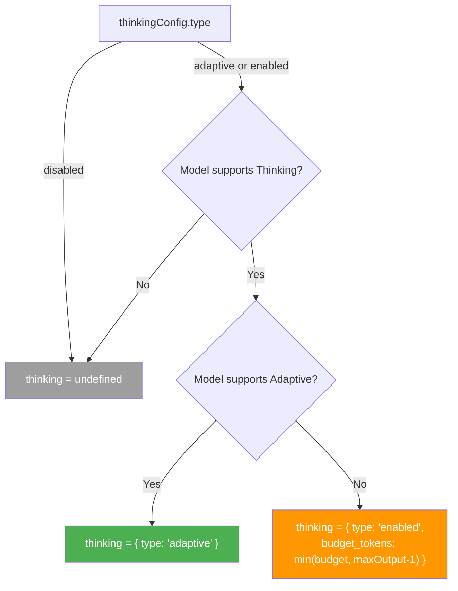
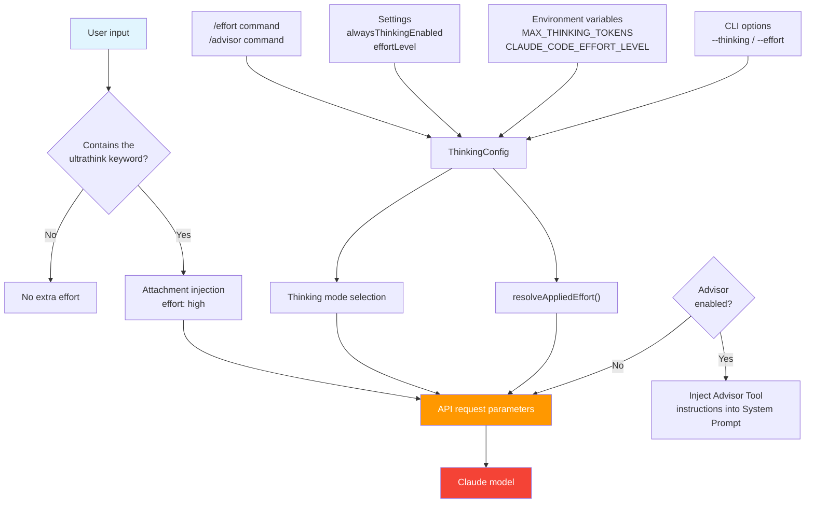

# Chapter 9: Thinking, Effort, and Advisor: Controlling How Much the Model Thinks

> This is chapter 9 of *Deep Dive into Claude Code Source*. We will analyze how Claude Code finely controls model reasoning depth: the three Extended Thinking modes, the Effort level system, `ultrathink` keyword triggering, and Advisor, the "stronger model review" mechanism.
>
> Together, these mechanisms answer a core question: **how can the product give users maximum control across speed, quality, and cost?**

## Why Reasoning Control Is Needed

Large language model reasoning is not free. When a model "thinks more deeply," it consumes more tokens, takes more time, and costs more. But not every task needs deep reasoning: renaming a variable and re-architecting an entire module require vastly different amounts of thinking.

The engineering challenge for Claude Code is this: **how can users and the system switch flexibly between "fast response" and "deep thinking," while keeping behavior consistent across model versions?**

The source code builds four related subsystems around this problem:

1. **ThinkingConfig**: controls whether Extended Thinking is enabled and which mode it uses.
2. **Effort**: controls how much reasoning effort the model invests: `low` / `medium` / `high` / `max`.
3. **Ultrathink**: lets users temporarily raise reasoning depth by typing a keyword in their input.
4. **Advisor**: brings in a stronger "reviewer" model alongside the main model.

---

> **In-chapter guide**: §1/§2 Extended Thinking (three modes + API injection) -> §3 Effort levels -> §4 Ultrathink trigger -> §5 Advisor review -> §6/§7 Thinking streaming and side queries -> §8 overview of how the four subsystems cooperate -> extra section on PromptSuggestion -> §9 transferable patterns. This chapter develops "four related but independent reasoning-control knobs" side by side. Looking back through the overview diagram in §8 helps connect §1-§5.

## 1. ThinkingConfig: The Three Extended Thinking Modes

### 1.1 Type Definition

**File**: `utils/thinking.ts:10-13`

```typescript
export type ThinkingConfig =
  | { type: 'adaptive' }
  | { type: 'enabled'; budgetTokens: number }
  | { type: 'disabled' }
```

The three modes have clear meanings:

| Mode | Meaning | Suitable scenario |
|------|---------|-------------------|
| `adaptive` | The model decides whether to think and how much to think. | New models (4.6+); recommended default. |
| `enabled` + `budgetTokens` | Force thinking on and specify an upper token-budget limit. | Older models, or cases that need precise thinking-budget control. |
| `disabled` | Turn thinking off completely. | Side queries, classifiers, and other helper calls. |

### 1.2 Determining the Default: Who Decides Whether to Think?

**File**: `utils/thinking.ts:146-162`

```typescript
export function shouldEnableThinkingByDefault(): boolean {
  if (process.env.MAX_THINKING_TOKENS) {
    return parseInt(process.env.MAX_THINKING_TOKENS, 10) > 0
  }

  const { settings } = getSettingsWithErrors()
  if (settings.alwaysThinkingEnabled === false) {
    return false
  }

  // Enable thinking by default unless explicitly disabled.
  return true
}
```

The priority chain is straightforward:

1. **Environment variable `MAX_THINKING_TOKENS`**: if it is set, a value greater than `0` enables thinking.
2. **`alwaysThinkingEnabled` in Settings**: explicitly setting it to `false` disables thinking.
3. **Enabled by default**: the source comment specifically marks this as `IMPORTANT`: do not change the default without notifying the model launch DRI and research team.

This "enabled by default + layered overrides" design reflects a product belief: **Extended Thinking is an important part of model quality and should be enabled whenever possible, but users and operations must still have ways to turn it off.**

### 1.3 Initializing ThinkingConfig at Startup

**File**: `main.tsx:2456-2488`

```typescript
let thinkingEnabled = shouldEnableThinkingByDefault();
let thinkingConfig: ThinkingConfig = thinkingEnabled !== false ? {
  type: 'adaptive'
} : {
  type: 'disabled'
};

if (options.thinking === 'adaptive' || options.thinking === 'enabled') {
  thinkingEnabled = true;
  thinkingConfig = { type: 'adaptive' };
} else if (options.thinking === 'disabled') {
  thinkingEnabled = false;
  thinkingConfig = { type: 'disabled' };
} else {
  const maxThinkingTokens = process.env.MAX_THINKING_TOKENS
    ? parseInt(process.env.MAX_THINKING_TOKENS, 10)
    : options.maxThinkingTokens;
  if (maxThinkingTokens !== undefined) {
    if (maxThinkingTokens > 0) {
      thinkingEnabled = true;
      thinkingConfig = { type: 'enabled', budgetTokens: maxThinkingTokens };
    } else if (maxThinkingTokens === 0) {
      thinkingEnabled = false;
      thinkingConfig = { type: 'disabled' };
    }
  }
}
```

The initialization priority is: CLI option `--thinking` -> environment variable `MAX_THINKING_TOKENS` -> CLI option `--max-thinking-tokens` -> default value. Notice one detail: when the user specifies `--thinking enabled`, the actual config created is `{ type: 'adaptive' }`, because `adaptive` is a superset of `enabled` and is better for new models.

### 1.4 Model Capability Detection: Who Supports Thinking?

Not every model supports Extended Thinking. The source has two layers of capability detection:

**File**: `utils/thinking.ts:90-144`

```typescript
// Basic thinking capability
export function modelSupportsThinking(model: string): boolean {
  const supported3P = get3PModelCapabilityOverride(model, 'thinking')
  if (supported3P !== undefined) return supported3P

  const canonical = getCanonicalName(model)
  const provider = getAPIProvider()
  // 1P and Foundry: all Claude 4+ models (including Haiku 4.5)
  if (provider === 'foundry' || provider === 'firstParty') {
    return !canonical.includes('claude-3-')
  }
  // 3P (Bedrock/Vertex): only Opus 4+ and Sonnet 4+
  return canonical.includes('sonnet-4') || canonical.includes('opus-4')
}

// Adaptive Thinking (more advanced)
export function modelSupportsAdaptiveThinking(model: string): boolean {
  const supported3P = get3PModelCapabilityOverride(model, 'adaptive_thinking')
  if (supported3P !== undefined) return supported3P

  const canonical = getCanonicalName(model)
  // Supported by a subset of Claude 4 models
  if (canonical.includes('opus-4-6') || canonical.includes('sonnet-4-6')) {
    return true
  }
  // ...legacy models return false

  // Default to true for unknown model strings on 1P and Foundry
  const provider = getAPIProvider()
  return provider === 'firstParty' || provider === 'foundry'
}
```

There is a **key design decision** here: for unknown model strings on 1P (direct Anthropic) and Foundry, adaptive thinking returns `true` by default. The comment explains why:

> Newer models (4.6+) are all trained on adaptive thinking and MUST have it enabled for model testing. DO NOT default to false for first party, otherwise we may silently degrade model quality.

This reflects a "safe default" mindset: it is better to send one extra parameter that the model may ignore than to silently degrade model quality.

### 1.5 Third-Party Model Overrides: ModelCapabilityOverride

**File**: `utils/model/modelSupportOverrides.ts`

```typescript
export type ModelCapabilityOverride =
  | 'effort'
  | 'max_effort'
  | 'thinking'
  | 'adaptive_thinking'
  | 'interleaved_thinking'

export const get3PModelCapabilityOverride = memoize(
  (model: string, capability: ModelCapabilityOverride): boolean | undefined => {
    if (getAPIProvider() === 'firstParty') return undefined
    const m = model.toLowerCase()
    for (const tier of TIERS) {
      const pinned = process.env[tier.modelEnvVar]
      const capabilities = process.env[tier.capabilitiesEnvVar]
      if (!pinned || capabilities === undefined) continue
      if (m !== pinned.toLowerCase()) continue
      return capabilities.toLowerCase().split(',').map(s => s.trim())
        .includes(capability)
    }
    return undefined
  },
  (model, capability) => `${model.toLowerCase()}:${capability}`,
)
```

Model capabilities on third-party platforms such as Bedrock and Vertex may differ from 1P. This override mechanism lets deployers declare supported capabilities with comma-separated environment variables such as `ANTHROPIC_DEFAULT_OPUS_MODEL_SUPPORTED_CAPABILITIES`. `memoize` ensures that each model + capability check runs only once.

---

## 2. How Thinking Is Injected into API Requests

### 2.1 Core Decision Logic in claude.ts

**File**: `services/api/claude.ts:1596-1630`

`ThinkingConfig` is translated into API parameters inside `queryModel()`:

```typescript
const hasThinking =
  thinkingConfig.type !== 'disabled' &&
  !isEnvTruthy(process.env.CLAUDE_CODE_DISABLE_THINKING)
let thinking: BetaMessageStreamParams['thinking'] | undefined = undefined

if (hasThinking && modelSupportsThinking(options.model)) {
  if (
    !isEnvTruthy(process.env.CLAUDE_CODE_DISABLE_ADAPTIVE_THINKING) &&
    modelSupportsAdaptiveThinking(options.model)
  ) {
    // Models that support adaptive: always use adaptive and do not set a budget.
    thinking = { type: 'adaptive' }
  } else {
    // Models that do not support adaptive: use enabled mode with a budget.
    let thinkingBudget = getMaxThinkingTokensForModel(options.model)
    if (
      thinkingConfig.type === 'enabled' &&
      thinkingConfig.budgetTokens !== undefined
    ) {
      thinkingBudget = thinkingConfig.budgetTokens
    }
    thinkingBudget = Math.min(maxOutputTokens - 1, thinkingBudget)
    thinking = {
      budget_tokens: thinkingBudget,
      type: 'enabled',
    }
  }
}
```

The `IMPORTANT` marker appears again in the comments:

> Do not change the adaptive-vs-budget thinking selection below without notifying the model launch DRI and research.

The core decision tree is:



One key constraint is that `budget_tokens` must be strictly less than `max_tokens`, because the API requires it. The code therefore uses `Math.min(maxOutputTokens - 1, thinkingBudget)` to guarantee that. For deprecated legacy paths, `getMaxThinkingTokensForModel()` returns `upperLimit - 1` directly.

### 2.2 Temperature and Thinking Are Mutually Exclusive

**File**: `services/api/claude.ts:1691-1694`

```typescript
// Only send temperature when thinking is disabled — the API requires
// temperature: 1 when thinking is enabled, which is already the default.
const temperature = !hasThinking
  ? (options.temperatureOverride ?? 1)
  : undefined
```

The API requires `temperature` to be `1` when Extended Thinking is enabled. The source simply omits the `temperature` parameter when thinking is enabled and relies on the server default, avoiding conflicts.

### 2.3 Operations Escape Hatches: Kill-Switch Environment Variables

Several environment variables can urgently disable reasoning features at runtime. They are critical during production incidents:

| Environment variable | Effect | Check location |
|----------------------|--------|----------------|
| `CLAUDE_CODE_DISABLE_THINKING` | Completely disables Extended Thinking. | `claude.ts:1597` |
| `CLAUDE_CODE_DISABLE_ADAPTIVE_THINKING` | Disables only adaptive mode and falls back to budget mode. | `claude.ts:1606` |
| `CLAUDE_CODE_EFFORT_LEVEL` | Force-overrides effort; set to `unset` to send no effort value. | `effort.ts:137-142` |
| `CLAUDE_CODE_ALWAYS_ENABLE_EFFORT` | Forces the effort parameter on regardless of model detection. | `effort.ts:25-27` |
| `CLAUDE_CODE_DISABLE_ADVISOR_TOOL` | Disables Advisor. | `advisor.ts:61` |
| `DISABLE_INTERLEAVED_THINKING` | Disables the Interleaved Thinking beta. | `betas.ts:258` |

In addition, internal users (`process.env.USER_TYPE === 'ant'`) receive special treatment in several places: `modelSupportsThinking()` expands model support via `resolveAntModel()` (`thinking.ts:95-99`); `modelSupportsMaxEffort()` opens `max` effort to all internal models for ant users (`effort.ts:61-63`); and `getDefaultEffortForModel()` has an independent default-value path for ant users that can be overridden by the GrowthBook-configured `defaultModel` (`effort.ts:282-301`).

### 2.4 Interleaved Thinking (ISP) and Context Management

Extended Thinking also affects two related API features.

**Interleaved Thinking** allows thinking blocks to appear between tool calls instead of only at the beginning of a response.

**File**: `utils/betas.ts:92-110, 254-261`

```typescript
export function modelSupportsISP(model: string): boolean {
  // ...
  const provider = getAPIProvider()
  if (provider === 'foundry') return true      // Foundry supports all models.
  if (provider === 'firstParty') {
    return !canonical.includes('claude-3-')    // 1P: Claude 4+ supports it.
  }
  return canonical.includes('sonnet-4') || canonical.includes('opus-4')
}

// Inject the beta header in getMergedBetas().
if (!isEnvTruthy(process.env.DISABLE_INTERLEAVED_THINKING) && modelSupportsISP(model)) {
  betaHeaders.push(INTERLEAVED_THINKING_BETA_HEADER)
}
```

### 2.5 Thinking Cleanup at the Context Management Layer

After a conversation has been idle for more than one hour, Prompt Cache has already expired. Keeping old thinking blocks provides no cache benefit and wastes tokens instead.

**File**: `services/api/claude.ts:1443-1456`

```typescript
let thinkingClearLatched = getThinkingClearLatched() === true
if (!thinkingClearLatched && isAgenticQuery) {
  const lastCompletion = getLastApiCompletionTimestamp()
  if (
    lastCompletion !== null &&
    Date.now() - lastCompletion > CACHE_TTL_1HOUR_MS
  ) {
    thinkingClearLatched = true
    setThinkingClearLatched(true)
  }
}
```

This `thinkingClearLatched` mechanism is a **session-level one-way latch**: once cache timeout is detected in a conversation, it latches into "cleanup" mode and does not flip back on its own. The reason is that flipping back to "keep all thinking" would break the newly warmed cache created by the cleanup. But it is **not permanently latched**: `clearBetaHeaderLatches()` (`bootstrap/state.ts:1744-1749`) resets it to `null` on `/clear` and `/compact`, allowing the next conversation to get a fresh header evaluation.

The signal is eventually passed to API Context Management:

**File**: `services/compact/apiMicrocompact.ts:64-87`

```typescript
export function getAPIContextManagement(options?: {
  hasThinking?: boolean
  isRedactThinkingActive?: boolean
  clearAllThinking?: boolean
}): ContextManagementConfig | undefined {
  // ...
  if (hasThinking && !isRedactThinkingActive) {
    strategies.push({
      type: 'clear_thinking_20251015',
      keep: clearAllThinking
        ? { type: 'thinking_turns', value: 1 }
        : 'all',
    })
  }
  // ...
}
```

When `clearAllThinking` is `true`, only the last 1 thinking turn (the API requires `value >= 1`) is kept and all others are cleared. Otherwise, all thinking is kept. The path is skipped when `isRedactThinkingActive` (redacted thinking) is active, because redacted blocks have no model-visible content and do not need management.

### 2.6 Adjusting Thinking Budget for Non-Streaming Fallback

**File**: `services/api/claude.ts:3356-3385`

When a streaming request fails and the client needs to fall back to non-streaming, `max_tokens` is capped at 64K. The thinking budget must be adjusted at the same time:

```typescript
export function adjustParamsForNonStreaming<
  T extends {
    max_tokens: number
    thinking?: BetaMessageStreamParams['thinking']
  },
>(params: T, maxTokensCap: number): T {
  const cappedMaxTokens = Math.min(params.max_tokens, maxTokensCap)

  const adjustedParams = { ...params }
  if (
    adjustedParams.thinking?.type === 'enabled' &&
    adjustedParams.thinking.budget_tokens
  ) {
    adjustedParams.thinking = {
      ...adjustedParams.thinking,
      budget_tokens: Math.min(
        adjustedParams.thinking.budget_tokens,
        cappedMaxTokens - 1,  // Must be at least 1 less than max_tokens
      ),
    }
  }
  // ...
}
```

---

## 3. Effort Levels: A Related but Independent Reasoning-Control Knob

Effort and Thinking are two **related but independent API control surfaces**. `ThinkingConfig` decides "whether to enable Extended Thinking and which mode to use," while Effort controls "how much reasoning effort the model invests while processing the request." At the implementation level, the code paths for `resolveAppliedEffort()` and `configureEffortParams()` are independent of the `hasThinking` branch (`services/api/claude.ts:1458, 1559-1569, 440-466`); each writes directly to API request parameters without depending on the other.

### 3.1 Four Levels

**File**: `utils/effort.ts:13-18`

```typescript
export const EFFORT_LEVELS = [
  'low',
  'medium',
  'high',
  'max',
] as const satisfies readonly EffortLevel[]

export type EffortValue = EffortLevel | number
```

Each level has a clear semantic description:

| Level | Description | Typical scenario |
|-------|-------------|------------------|
| `low` | Fast, direct implementation. | Simple code changes. |
| `medium` | Balanced approach. | Regular development tasks. |
| `high` | Comprehensive implementation with broad testing. | Complex feature development. |
| `max` | Deepest reasoning; Opus 4.6 only. | Architecture-level decisions. |

Notice that `EffortValue` is a union type: in addition to string levels, internal (`ant`) builds also support **numeric effort**, which provides finer-grained control.

### 3.2 Effort Priority Chain

**File**: `utils/effort.ts:152-167`

```typescript
export function resolveAppliedEffort(
  model: string,
  appStateEffortValue: EffortValue | undefined,
): EffortValue | undefined {
  const envOverride = getEffortEnvOverride()
  if (envOverride === null) return undefined    // env set to 'unset' -> send nothing

  const resolved =
    envOverride ?? appStateEffortValue ?? getDefaultEffortForModel(model)

  // API rejects 'max' on non-Opus-4.6 models — downgrade to 'high'.
  if (resolved === 'max' && !modelSupportsMaxEffort(model)) {
    return 'high'
  }
  return resolved
}
```

The priority chain is: environment variable `CLAUDE_CODE_EFFORT_LEVEL` -> user setting in AppState -> model default.

The downgrade logic is subtle: `max` effort is supported only by Opus 4.6, so other models are automatically downgraded to `high` rather than failing. This reflects the design principle that "graceful degradation is better than hard failure."

### 3.3 Strategy for Model Default Effort

**File**: `utils/effort.ts:279-329`

```typescript
export function getDefaultEffortForModel(
  model: string,
): EffortValue | undefined {
  // ...

  // Default effort on Opus 4.6 to medium for Pro.
  if (model.toLowerCase().includes('opus-4-6')) {
    if (isProSubscriber()) return 'medium'
    if (getOpusDefaultEffortConfig().enabled &&
        (isMaxSubscriber() || isTeamSubscriber())) {
      return 'medium'
    }
  }

  // When ultrathink feature is on, default effort to medium
  // (ultrathink bumps to high)
  if (isUltrathinkEnabled() && modelSupportsEffort(model)) {
    return 'medium'
  }

  // Fallback to undefined, which means we don't set an effort level.
  // This should resolve to high effort level in the API.
  return undefined
}
```

This code reveals an interesting product strategy: **Opus 4.6 defaults to `medium` effort rather than `high`**. The comment explains why: to "balance speed and intelligence and maximize rate limits." Combined with the `ultrathink` mechanism, users can temporarily raise the level to `high` when needed.

The default-effort configuration is also A/B tested through GrowthBook (`getOpusDefaultEffortConfig()`), showing that Anthropic is continuously experimenting with the optimal default.

### 3.4 How Effort Is Injected into the API

**File**: `services/api/claude.ts:436-466`

```typescript
function configureEffortParams(
  effortValue: EffortValue | undefined,
  outputConfig: BetaOutputConfig,
  extraBodyParams: Record<string, unknown>,
  betas: string[],
  model: string,
): void {
  if (!modelSupportsEffort(model) || 'effort' in outputConfig) return

  if (effortValue === undefined) {
    betas.push(EFFORT_BETA_HEADER)        // Send only the beta header, no value.
  } else if (typeof effortValue === 'string') {
    outputConfig.effort = effortValue      // Set the string level directly.
    betas.push(EFFORT_BETA_HEADER)
  } else if (process.env.USER_TYPE === 'ant') {
    // Numeric effort is ant-only and is passed through anthropic_internal.
    const existingInternal =
      (extraBodyParams.anthropic_internal as Record<string, unknown>) || {}
    extraBodyParams.anthropic_internal = {
      ...existingInternal,
      effort_override: effortValue,
    }
  }
}
```

There are three injection paths:

1. **Effort is unset**: send only the beta header and let the API use the default.
2. **String level**: set `output_config.effort`.
3. **Numeric value (ant-only)**: pass it through `anthropic_internal.effort_override`, bypassing the standard API surface.

### 3.5 The `/effort` Command: Runtime Adjustment

**File**: `commands/effort/effort.tsx`

Users can dynamically adjust effort within a session through the `/effort` slash command:

```typescript
export function executeEffort(args: string): EffortCommandResult {
  const normalized = args.toLowerCase()
  if (normalized === 'auto' || normalized === 'unset') {
    return unsetEffortLevel()
  }
  if (!isEffortLevel(normalized)) {
    return {
      message: `Invalid argument: ${args}. Valid options are: low, medium, high, max, auto`
    }
  }
  return setEffortValue(normalized)
}
```

`setEffortValue()` does two things: updates AppState, which affects the current session, and persists the value to `userSettings`, which affects future sessions. But there is one limitation: `toPersistableEffort()` filters out `max` for non-ant users and filters out numeric effort, because both are designed to be session-level only:

```typescript
export function toPersistableEffort(
  value: EffortValue | undefined,
): EffortLevel | undefined {
  if (value === 'low' || value === 'medium' || value === 'high') return value
  if (value === 'max' && process.env.USER_TYPE === 'ant') return value
  return undefined  // Do not persist.
}
```

---

## 4. Ultrathink: Keyword-Triggered Reasoning Acceleration

### 4.1 Mechanism Overview

Ultrathink is a clever UX design: the user only needs to include the `ultrathink` keyword in their input, and Claude Code automatically raises the current turn's effort to `high`.

**File**: `utils/thinking.ts:19-31`

```typescript
export function isUltrathinkEnabled(): boolean {
  if (!feature('ULTRATHINK')) return false  // Compile-time gate
  return getFeatureValue_CACHED_MAY_BE_STALE('tengu_turtle_carbon', true)
}

export function hasUltrathinkKeyword(text: string): boolean {
  return /\bultrathink\b/i.test(text)
}
```

There are two gates: compile-time `feature('ULTRATHINK')` controls whether the code is included in the build, while GrowthBook `tengu_turtle_carbon` controls runtime enablement. This is a typical application of the Feature Flag pattern covered in chapter 22.

### 4.2 Injection Through the Attachment System

After keyword detection, `ultrathink` is injected into the conversation through the Attachment system, the message-attachment mechanism mentioned in chapter 5:

**File**: `utils/attachments.ts:1446-1452`

```typescript
function getUltrathinkEffortAttachment(input: string | null): Attachment[] {
  if (!isUltrathinkEnabled() || !input || !hasUltrathinkKeyword(input)) {
    return []
  }
  logEvent('tengu_ultrathink', {})
  return [{ type: 'ultrathink_effort', level: 'high' }]
}
```

This Attachment is converted into a model-injected instruction in `utils/messages.ts:4170-4176`:

```typescript
case 'ultrathink_effort': {
  return wrapMessagesInSystemReminder([
    createUserMessage({
      content: `The user has requested reasoning effort level: ${attachment.level}. Apply this to the current turn.`,
      isMeta: true,
    }),
  ])
}
```

One important point: the `ultrathink` keyword **only injects a meta instruction through Attachment** ("use high effort for this turn") and **does not rewrite the `output_config.effort` parameter in the current turn's API request**. The path that actually writes API effort is `resolveAppliedEffort()` -> `configureEffortParams()`, and that path is independent of whether the current prompt contains `ultrathink`.

However, enabling `ultrathink` **indirectly affects the default effort**: when `isUltrathinkEnabled()` returns `true`, `getDefaultEffortForModel()` sets the default effort to `medium` (`utils/effort.ts:321-324`). This means that in an environment where the `ultrathink` feature is enabled, the model runs with `medium` effort by default, while the `ultrathink` keyword guides the model through a prompt-layer instruction to invest more reasoning in that turn. That adjustment is model behavior, not a client-side rewrite of API parameters.

### 4.3 Rainbow Highlighting: Visual Feedback

Ultrathink also has a distinctive UI behavior: the keyword is highlighted in the input box with **rainbow colors**.

**File**: `utils/thinking.ts:60-86`

```typescript
const RAINBOW_COLORS: Array<keyof Theme> = [
  'rainbow_red', 'rainbow_orange', 'rainbow_yellow',
  'rainbow_green', 'rainbow_blue', 'rainbow_indigo', 'rainbow_violet',
]

export function getRainbowColor(
  charIndex: number, shimmer: boolean = false,
): keyof Theme {
  const colors = shimmer ? RAINBOW_SHIMMER_COLORS : RAINBOW_COLORS
  return colors[charIndex % colors.length]!
}
```

**File**: `components/PromptInput/PromptInput.tsx:686-698`

```typescript
// Rainbow highlighting for ultrathink keyword (per-character cycling colors)
if (isUltrathinkEnabled()) {
  for (const trigger of thinkTriggers) {
    for (let i = trigger.start; i < trigger.end; i++) {
      highlights.push({
        start: i,
        end: i + 1,
        color: getRainbowColor(i),
        // ...
      })
    }
  }
}
```

Each character uses a different rainbow color, with a shimmer animation, giving the user clear visual feedback: "super-thinking mode is active." At the same time, a temporary notification appears for 5 seconds:

```typescript
// components/PromptInput/PromptInput.tsx:748-758
useEffect(() => {
  if (thinkTriggers.length && isUltrathinkEnabled()) {
    addNotification({
      key: 'ultrathink-active',
      text: 'Effort set to high for this turn',
      priority: 'immediate',
      timeoutMs: 5000
    });
  } else {
    removeNotification('ultrathink-active');
  }
}, [addNotification, removeNotification, thinkTriggers.length]);
```

---

## 5. Advisor: Introducing a Stronger Reviewer

Advisor is another dimension of reasoning control: instead of making the main model "think more deeply," it brings in a **different, potentially stronger model** to review the main model's work.

### 5.1 Core Concept

**File**: `utils/advisor.ts:9-34`

```typescript
export type AdvisorServerToolUseBlock = {
  type: 'server_tool_use'
  id: string
  name: 'advisor'
  input: { [key: string]: unknown }
}

export type AdvisorToolResultBlock = {
  type: 'advisor_tool_result'
  tool_use_id: string
  content:
    | { type: 'advisor_result'; text: string }
    | { type: 'advisor_redacted_result'; encrypted_content: string }
    | { type: 'advisor_tool_result_error'; error_code: string }
}
```

Advisor exists as a **server-side tool**: it is a tool named `advisor`, but it is not executed by the client. Instead, when the API server receives the tool call request, it automatically forwards the conversation history to the reviewer model. This means the main model can "call advisor" just like any other tool, without the client doing any special handling.

### 5.2 Enablement Conditions and Configuration

**File**: `utils/advisor.ts:53-96`

```typescript
function getAdvisorConfig(): AdvisorConfig {
  return getFeatureValue_CACHED_MAY_BE_STALE<AdvisorConfig>(
    'tengu_sage_compass', {},
  )
}

export function isAdvisorEnabled(): boolean {
  if (isEnvTruthy(process.env.CLAUDE_CODE_DISABLE_ADVISOR_TOOL)) return false
  if (!shouldIncludeFirstPartyOnlyBetas()) return false  // 3P is not supported.
  return getAdvisorConfig().enabled ?? false
}

export function modelSupportsAdvisor(model: string): boolean {
  const m = model.toLowerCase()
  return m.includes('opus-4-6') || m.includes('sonnet-4-6') ||
    process.env.USER_TYPE === 'ant'
}
```

Advisor currently supports only Opus 4.6 and Sonnet 4.6 as the main model, because the main model needs to know how to call the `advisor` tool. Its enablement depends on `shouldIncludeFirstPartyOnlyBetas()`, which returns `true` for the **firstParty and Foundry** providers (`utils/betas.ts:215-219`) and explicitly excludes third-party platforms such as Bedrock and Vertex. Configuration is gradually rolled out through GrowthBook (`tengu_sage_compass`).

### 5.3 Advisor System Prompt Instructions

**File**: `utils/advisor.ts:130-145`

This prompt is the key to understanding the Advisor design philosophy:

```typescript
export const ADVISOR_TOOL_INSTRUCTIONS = `# Advisor Tool

You have access to an \`advisor\` tool backed by a stronger reviewer model.
It takes NO parameters -- when you call it, your entire conversation history
is automatically forwarded.

Call advisor BEFORE substantive work -- before writing code, before committing
to an interpretation, before building on an assumption.

Also call advisor:
- When you believe the task is complete.
- When stuck -- errors recurring, approach not converging.
- When considering a change of approach.

BEFORE this call, make your deliverable durable: write the file, stage the
change, save the result. The advisor call takes time; if the session ends
during it, a durable result persists and an unwritten one doesn't.`
```

Several design points stand out:

1. **Guidance on when to call it**: call it "before substantive work" to avoid doing the work first and then discovering through review that it needs rework.
2. **Persistence first**: "save the result before calling" because the advisor call takes time and the session may be interrupted.
3. **Conflict-resolution protocol**: "if you have evidence pointing to A while advisor points to B, initiate a mediation call" rather than blindly obeying the advisor.

### 5.4 The `/advisor` Command

**File**: `commands/advisor.ts`

Users can configure the reviewer model through the `/advisor` command:

```typescript
const advisor = {
  type: 'local',
  name: 'advisor',
  description: 'Configure the advisor model',
  argumentHint: '[<model>|off]',
  isEnabled: () => canUserConfigureAdvisor(),
  get isHidden() {
    return !canUserConfigureAdvisor()
  },
  // ...
} satisfies Command
```

Notice that `isHidden` uses `canUserConfigureAdvisor()`: if a user is not allowed to configure Advisor, as controlled by GrowthBook `canUserConfigure`, the command is hidden from the command list instead of being displayed and then failing.

---

## 6. Streaming Thinking Blocks and Message Normalization

Extended Thinking introduces two new content block types in streaming responses, `thinking` and `redacted_thinking`, which require special handling at multiple layers.

### 6.1 Streaming Receive Path

**File**: `services/api/claude.ts:2030-2160`

```typescript
case 'thinking':
  contentBlocks[part.index] = {
    ...part.content_block,
    thinking: '',
    signature: '',  // Initialize even if signature_delta never arrives.
  }
  break

// ...

case 'thinking_delta':
  if (contentBlock.type !== 'thinking') {
    throw new Error('Content block is not a thinking block')
  }
  contentBlock.thinking += delta.thinking
  break
```

Each thinking block carries a `signature`, an encrypted signature the API uses to verify the authenticity of the thinking content. If the user switches API keys, for example through `/login`, old signatures become invalid and the API returns a 400 error.

### 6.2 Cleanup Required by Signature Binding

**File**: `utils/messages.ts:5060-5090`

```typescript
/**
 * Strip signature-bearing blocks (thinking, redacted_thinking, connector_text)
 * from all assistant messages. Their signatures are bound to the API key that
 * generated them; after a credential change (e.g. /login) they're invalid and
 * the API rejects them with a 400.
 */
export function stripSignatureBlocks(messages: Message[]): Message[] {
  // ...strips thinking/redacted_thinking/connector_text blocks...
}
```

### 6.3 Filtering Orphan Thinking Messages

**File**: `utils/messages.ts:4980-5057`

During streaming, each content block is pushed as a separate message. If the user cancels the request, this can leave behind an "orphan" message that contains only a thinking block. Such messages can cause API errors:

```typescript
export function filterOrphanedThinkingOnlyMessages(
  messages: Message[],
): Message[] {
  // First pass: collect message IDs that have non-thinking content.
  const messageIdsWithNonThinkingContent = new Set<string>()
  for (const msg of messages) {
    if (msg.type !== 'assistant') continue
    const hasNonThinking = content.some(
      block => block.type !== 'thinking' && block.type !== 'redacted_thinking',
    )
    if (hasNonThinking && msg.message.id) {
      messageIdsWithNonThinkingContent.add(msg.message.id)
    }
  }

  // Second pass: filter true orphans with no same-id non-thinking partner to merge with.
  return messages.filter(msg => {
    // ...keep if it has non-thinking content or has a merge partner...
  })
}
```

This is a typical **edge case introduced by the streaming message model**. It never appears in non-streaming scenarios, but after streaming splits each content block into an independent message, interruption, retry, compact, and similar operations can all create message sequences that fail API requirements.

---

## 7. Thinking Control in Side Queries

Outside the conversation main loop (对话主循环), Claude Code also performs many side queries: classifier judgments, compact summaries, session memory extraction, and so on. These scenarios have different needs for thinking.

**File**: `utils/sideQuery.ts:58-59, 169-177`

```typescript
/** Thinking budget (enables thinking), or `false` to send `{ type: 'disabled' }`. */
thinking?: number | false

// ...

let thinkingConfig: BetaThinkingConfigParam | undefined
if (thinking === false) {
  thinkingConfig = { type: 'disabled' }
} else if (thinking !== undefined) {
  thinkingConfig = {
    type: 'enabled',
    budget_tokens: Math.min(thinking, max_tokens - 1),
  }
}
```

Side queries use a simplified thinking interface: `false` disables thinking, and a `number` specifies the budget. Most helper queries, such as `classifyBashCommand` and `compactConversation`, pass `{ type: 'disabled' }`: cost-sensitive helper calls do not need deep reasoning from the model.

---

## 8. Overview: How the Four Subsystems Cooperate



The four subsystems have distinct responsibilities while cooperating with one another:

- **ThinkingConfig** controls "whether Extended Thinking is allowed" and "which thinking mode is used."
- **Effort** is independent of Thinking and controls "how much reasoning effort the model invests."
- **Ultrathink** guides the model to invest more reasoning in the current turn through a prompt-layer instruction, without rewriting API effort parameters.
- **Advisor** provides an orthogonal dimension of quality review.

---

## Extra: PromptSuggestion: Predicting the User's Next Line Without Breaking Prompt Cache

The first six sections discuss ways to "make the model think more": Thinking, Effort, and Advisor all adjust reasoning depth on the critical path of the main conversation. There is also a neighboring subsystem that moves in the opposite direction: while the main conversation is **waiting for user input**, Claude Code quietly forks a small side-branch agent (a side request with the same parameters) to predict "what the user is most likely to type next" and displays it below the input box as a gray hint. It is not part of the main melody of reasoning control, but it is deeply coupled to the Effort and Cache subsystems, so it fits here as an extra section.

**File**: `services/PromptSuggestion/promptSuggestion.ts:1-523`

### Extra.1 Enablement Gates and Suppression Reasons

PromptSuggestion has an even more conservative enablement chain than Thinking:

```typescript
// services/PromptSuggestion/promptSuggestion.ts:37-94
export function shouldEnablePromptSuggestion(): boolean {
  // 1) Hard environment-variable override for testing and disabling.
  // 2) GrowthBook: tengu_chomp_inflection.
  // 3) Non-interactive pipe/print mode returns false immediately.
  // 4) Disabled for Swarm sub-agents, or teammates.
  // 5) settings.promptSuggestionEnabled user toggle.
}
```

Every turn also runs through `getSuggestionSuppressReason()`, which enumerates five reasons why suggestions should not be shown at that moment: `disabled` / `pending_permission` (there is user approval pending for a ToolUse, etc.) / `elicitation_active` (an MCP elicitation dialog is open) / `plan_mode` (UX noise in Plan mode) / `rate_limit`. Any match suppresses the feature silently. This is an easy trap in UX engineering: auxiliary UI must yield to the critical path by default, not the other way around.

### Extra.2 Why PromptSuggestion Must Use a "Forked Agent with the Same Parameters"

The most important part of the file is the implementation strategy in `generateSuggestion()` (`promptSuggestion.ts:294-352`). Instead of starting a brand-new lightweight request, it copies the main conversation's current `cacheSafeParams` as-is, appends `SUGGESTION_PROMPT` (lines 258-287) as a **user message** (`promptSuggestion.ts:319-321`: `promptMessages: [createUserMessage({ content: prompt })]`), and lets the model continue from the user's perspective. It deliberately does not touch the `system` field, precisely to avoid breaking the main conversation's cache prefix.

Why so indirect? Because Anthropic Prompt Cache requires **strict prefix matching**: if any parameter, including `system`, `tools`, `temperature`, or even `thinking` / `effort`, differs from the main request, the request triggers a full cache write rather than a cache hit. The source comment (`services/PromptSuggestion/promptSuggestion.ts:313`) states the lesson directly; here is an English rendering of that comment:

```typescript
// Adapted from the source comment at services/PromptSuggestion/promptSuggestion.ts:313:
// An earlier version forced suggestion requests down to 'low' effort to save cost.
// The result was a 45x spike in cache writes, and the main conversation's cache
// hit rate dropped from 92.7% to 61%.
// The small amount saved on effort was far outweighed by the cache-miss cost.
```

This is reverse evidence for the "prefix stability" principle repeatedly emphasized in chapter 8 on Prompt Cache: **a subsystem would rather spend a few more tokens running a model at the same effort than change the main conversation's cache prefix**. This constraint belongs to the same family of designs as `thinkingClearLatched` in §2: every switch that changes critical API request fields must first answer, "will this damage the main conversation's cache?"

### Extra.3 Early-Return Guards and Parent Cache Warmth

Before `tryGenerateSuggestion()` actually forks a model request, it passes through two gates (`promptSuggestion.ts:125-182`):

- **`assistantTurnCount < 2` -> `early_conversation`**: at the start of a conversation, the model does not have enough context to make a useful prediction, so it gives up immediately.
- **Parent cache cold-start guard**: using the `MAX_PARENT_UNCACHED_TOKENS = 10_000` threshold (line 239), it checks whether the previous main request was itself a cache miss with more than 10,000 uncached tokens. If so, forking another request in this turn would only make the bill worse, so it does not run.

In other words, PromptSuggestion is always a gift that appears only when the **main conversation is already cruising in cache**, not an extra cost during cold start.

### Extra.4 Twelve Filtering Gates: Do Not Pass Model Text Off as User Text

The predicted string still has to pass through the `filters` array in `shouldFilterSuggestion()` (`promptSuggestion.ts:354-456`; the 12 filters are `done` / `meta_text` / `meta_wrapped` / `error_message` / `prefixed_label` / `too_few_words` / `too_many_words` / `too_long` / `multiple_sentences` / `has_formatting` / `evaluative` / `claude_voice`). Common categories include:

- `done` / `meta_text` / `meta_wrapped`: the model says "nothing found," "stay silent," or wraps meta-reasoning in parentheses or brackets.
- `error_message`: the model repeats an error from the previous turn, such as "API Error:" or "prompt is too long."
- `prefixed_label`: the output starts with a label-like `word:` prefix.
- `too_few_words` / `too_many_words` / `too_long` / `multiple_sentences`: the output is as short as "yes," longer than 12 words or 100 characters, or spans multiple sentences, none of which look like a real next user input.
- `has_formatting`: the output contains newlines or Markdown emphasis.
- `evaluative`: evaluative sentences such as "this is good," which are usually Claude praising itself on the user's behalf.
- `claude_voice`: first-person perspective leakage.
- The `ALLOWED_SINGLE_WORDS` allowlist inside `too_few_words` specifically permits high-frequency one-word replies such as "continue," "yes," and "no."

The existence of this whole filter set tells us something simple: getting an LLM to imitate the **user perspective** is much harder than getting it to imitate the **assistant perspective**. Prompting alone is not enough; the engineering layer must block every output that leaks an AI identity. This is the same "role consistency" problem mentioned in §5 on Advisor, appearing in another form.

### Extra.5 How It Fits with the Other Subsystems in This Chapter

Putting the extra section back into the chapter's overview:

| Subsystem | Trigger timing | Impact on main conversation cache | Model reasoning depth |
| --- | --- | --- | --- |
| ThinkingConfig | Every main-conversation turn. | Can change; `thinkingClearLatched` controls when to clear. | Decided by the model (`adaptive`/`enabled`). |
| Effort | Every main-conversation turn. | Can change; must be sticky to avoid oscillation. | Explicitly locked by parameter. |
| Ultrathink | The turn whose user text contains the keyword. | Unchanged; only appends to the prompt. | Raised for that turn. |
| Advisor | Actively called by the model at certain points. | Separate `server_tool_use`, not in the main cache. | Uses a stronger model. |
| **PromptSuggestion (extra)** | **When the main conversation is silently waiting for user input.** | **Must not change; the fork must use identical parameters.** | **Same as the main conversation.** |

The last row is the real value of this extra section: it constrains the three independent chains of "Thinking / Effort / Cache" in one concrete feature. The Effort system's "sticky first" behavior and the Prompt Cache chapter's "prefix stability" principle come together here.

---

## 9. Transferable Design Patterns

### Pattern 1: Capability Detection + Graceful Degradation

Do not assume that all models support the same feature set. Build a capability-detection function for each feature, such as `modelSupportsThinking()` or `modelSupportsEffort()`, and degrade gracefully when support is absent, such as `max` -> `high`. Combine this with environment-variable overrides (`get3PModelCapabilityOverride()`) so deployers can declare custom model capabilities.

**Suitable scenarios**: any AI application that needs to support multiple versions or providers: different LLM providers, different model versions, or different API compatibility layers.

### Pattern 2: Layered Priority Chain + Single Resolution Function

Centralize the decision of "where a configuration value comes from" in a `resolve*()` function, such as `resolveAppliedEffort()`, and explicitly list the priority order: environment variable -> user setting -> model default. This is easier to understand and maintain than scattering `if/else` blocks across multiple call sites.

**Suitable scenarios**: any system with multiple configuration sources: CLI options, environment variables, configuration files, or remote configuration.

### Pattern 3: Keyword-Triggered Behavior Modification

Trigger behavior changes through specific keywords in user input, such as using `ultrathink` to raise effort, instead of requiring the user to run a separate command or edit configuration. This "inline modifier" pattern reduces cognitive load: the user does not need to remember `/effort high`; they only need to include one word in their natural-language request.

**Suitable scenarios**: CLI tools, chat applications, text editors: any scenario where the user is already typing text is a good fit for keyword-triggered behavior changes.

---

---

## Next Chapter Preview

[Chapter 10: Tool Protocol, Registration, and ToolSearch: the Elegance of the buildTool() Abstraction](./10-tool-protocol-registration-and-toolsearch.md)

Next, we will enter the tool family and examine how the Tool interface, the `buildTool()` builder pattern, and the ToolSearch lazy-loading mechanism manage an entire family of built-in tools.

---
*For all content, follow https://github.com/luyao618/Claude-Code-Source-Study (a free star would be appreciated).*
