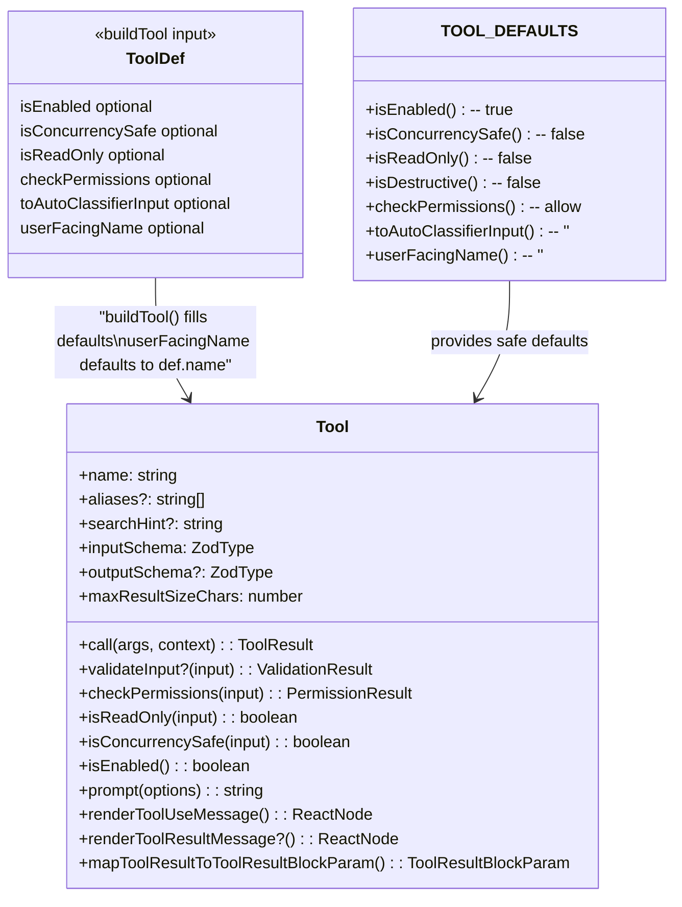

# Chapter 10: Tool Protocol, Registration, and ToolSearch — The Abstraction Beauty of `buildTool()`

> This is Chapter 10 of *Deep Dive into Claude Code Source*. We dig into the heart of the tool system: from the core methods of the `Tool` interface, to the builder pattern in `buildTool()`, to the registry architecture in `tools.ts`, and finally to the lazy-loading mechanism behind ToolSearch. Together they show how a production-grade AI agent manages an entire family of built-in tools (the full inventory and taxonomy live in [Appendix A](./appendix/A.md)) plus an unbounded number of MCP tools.

## Why is the tool system the soul of an agent?

What distinguishes an AI agent from an ordinary chatbot is one thing: **an agent can take actions**. The moment the model decides to read a file, run a shell command, or search code, it leans on the tool system.

The real set of built-in tools in Claude Code is not a fixed number. It is composed of three columns (the complete inventory is in [Appendix A · Tool Cheat Sheet](./appendix/A.md)):

1. **Family** — top-level directories under `tools/` that act as families.
2. **Runtime leaf** — runtime tools registered by default in `tools.ts`.
3. **Feature-gated** — tools loaded conditionally via `feature(...)` or environment variables.

Layer on top of these the externally-supplied, dynamically-sized tools that come in through MCP, and managing a tool set of this scale poses several core challenges:

1. **Interface consistency** — every tool needs the same protocol for invocation, validation, permission checks, and UI rendering.
2. **Safe defaults** — tools touch the filesystem and the shell, so default behavior MUST be fail-closed.
3. **Conditional registration** — different build flavors and run modes expose different tools.
4. **Scalability** — when the number of tools exceeds what the model's context window can carry, a dynamic discovery mechanism is required.

This chapter answers those questions and extracts design patterns you can port to your own project.

---

## 1. The `Tool` core interface: what does a tool have to implement?

### 1.1 Interface definition

`Tool.ts` is the type foundation of the whole tool system; it defines the complete `Tool` interface. The interface carries **30+ methods/properties**. Below we show a core subset grouped by responsibility. The full interface includes roughly a dozen more methods (`interruptBehavior`, `isSearchOrReadCommand`, `shouldDefer`, `alwaysLoad`, `mcpInfo`, `strict`, `backfillObservableInput`, `preparePermissionMatcher`, `extractSearchText`, `renderToolUseTag`, `renderToolUseQueuedMessage`, `isResultTruncated`, and so on) covering tool interrupt behavior, command classification, lazy loading, MCP metadata, permission-match preprocessing, and extended rendering — see `Tool.ts:362-695`:

```typescript
// Tool.ts:362-695 (simplified)
export type Tool<
  Input extends AnyObject = AnyObject,
  Output = unknown,
  P extends ToolProgressData = ToolProgressData,
> = {
  // ── Identity ──
  readonly name: string
  aliases?: string[]
  searchHint?: string           // used by ToolSearch keyword matching

  // ── Schema ──
  readonly inputSchema: Input   // Zod schema
  readonly inputJSONSchema?: ToolInputJSONSchema  // MCP tools use JSON Schema directly
  outputSchema?: z.ZodType<unknown>

  // ── Core methods ──
  call(args, context, canUseTool, parentMessage, onProgress?): Promise<ToolResult<Output>>
  description(input, options): Promise<string>
  prompt(options): Promise<string>

  // ── Safety and permissions ──
  validateInput?(input, context): Promise<ValidationResult>
  checkPermissions(input, context): Promise<PermissionResult>
  isReadOnly(input): boolean
  isDestructive?(input): boolean
  isConcurrencySafe(input): boolean
  isEnabled(): boolean

  // ── UI rendering protocol (six render methods) ──
  renderToolUseMessage(input, options): React.ReactNode
  renderToolResultMessage?(content, progressMessages, options): React.ReactNode
  renderToolUseProgressMessage?(progressMessages, options): React.ReactNode
  renderToolUseRejectedMessage?(input, options): React.ReactNode
  renderToolUseErrorMessage?(result, options): React.ReactNode
  renderGroupedToolUse?(toolUses, options): React.ReactNode | null

  // ── Result serialization ──
  mapToolResultToToolResultBlockParam(content, toolUseID): ToolResultBlockParam

  // ── Helpers ──
  maxResultSizeChars: number
  userFacingName(input): string
  getPath?(input): string
  toAutoClassifierInput(input): unknown
  // ...more
}
```

This interface embodies an important design philosophy: **a tool is not just "execution logic"; it is a complete "microservice"**, shipping with input validation, permission control, UI rendering, and result serialization.



### 1.2 Method groups in detail

**Safety-related methods** (fail-closed by design):

| Method | Purpose | Default |
|---|---|---|
| `isEnabled()` | Is this tool available in the current environment? | `true` |
| `isReadOnly()` | Is this a read-only operation? | `false` (assume it writes) |
| `isConcurrencySafe()` | Can this tool run concurrently with others? | `false` (assume unsafe) |
| `isDestructive()` | Is this operation irreversible? | `false` |
| `validateInput()` | Pre-flight input check (before the permission check) | none (skipped) |
| `checkPermissions()` | Permission check | `allow` (defer to the general permission system) |

Note the intent behind the defaults: `isReadOnly` and `isConcurrencySafe` both default to `false`. This is the **fail-closed** principle — if the tool author forgets to declare these, the system falls back to the most conservative assumption (assume it writes, assume it is not concurrency-safe).

**UI rendering protocol** (one required render method plus five optional ones, together with helper display methods such as `renderToolUseTag`, `renderToolUseQueuedMessage`, `isResultTruncated`, and `extractSearchText`):

Every tool can customize the full UI lifecycle from "tool call in progress" to "result shown". Of these, `renderToolUseMessage` is **required** (it shows what the tool is being asked to do); the rest are optional:

```
model emits tool_use → renderToolUseMessage (shows the intent of the call)
                    → renderToolUseProgressMessage (shows live progress)
                    → renderToolResultMessage (shows the result)
                    → renderToolUseRejectedMessage (when the user denies it)
                    → renderToolUseErrorMessage (when execution fails)
                    → renderGroupedToolUse (batched rendering for repeated calls)
```

This protocol lets BashTool render command output and a progress bar, FileEditTool render a diff view, and GlobTool render a file list — all through one unified interface, all rendered by Ink React components.

---

## 2. `buildTool()`: a builder pattern with safe defaults

### 2.1 Why do we need `buildTool()`?

The `Tool` interface carries 30+ methods. Forcing every tool to implement all of them would ruin the developer experience. More importantly, **forgetting a safety-related method can introduce a security hole** (for example, forgetting to declare `isConcurrencySafe` as `true` for a read-only tool merely serializes calls that could have run in parallel — slow but safe; the reverse default would be dangerous).

`buildTool()` solves both problems:

```typescript
// Tool.ts:757-792
const TOOL_DEFAULTS = {
  isEnabled: () => true,
  isConcurrencySafe: (_input?: unknown) => false,  // assume unsafe
  isReadOnly: (_input?: unknown) => false,          // assume it writes
  isDestructive: (_input?: unknown) => false,
  checkPermissions: (input, _ctx?) =>
    Promise.resolve({ behavior: 'allow', updatedInput: input }),
  toAutoClassifierInput: (_input?: unknown) => '',
  userFacingName: (_input?: unknown) => '',
}

export function buildTool<D extends AnyToolDef>(def: D): BuiltTool<D> {
  return {
    ...TOOL_DEFAULTS,
    userFacingName: () => def.name,
    ...def,
  } as BuiltTool<D>
}
```

The runtime logic is a single line: `{ ...TOOL_DEFAULTS, userFacingName: () => def.name, ...def }`. It is a classic **object spread merge** — first lay down the defaults, then overwrite the empty-string `userFacingName` from `TOOL_DEFAULTS` with `() => def.name`, and finally let the tool definition `def` overwrite anything else (if the tool explicitly defines `userFacingName`, that one wins over the `def.name` default).

### 2.2 The clever type-level design

The truly intricate part of `buildTool()` is not the runtime — it is the **type system**:

```typescript
// Tool.ts:707-726
// Methods that may be defaulted
type DefaultableToolKeys =
  | 'isEnabled'
  | 'isConcurrencySafe'
  | 'isReadOnly'
  | 'isDestructive'
  | 'checkPermissions'
  | 'toAutoClassifierInput'
  | 'userFacingName'

// ToolDef: these methods become optional
export type ToolDef<...> =
  Omit<Tool<...>, DefaultableToolKeys> &
  Partial<Pick<Tool<...>, DefaultableToolKeys>>

// BuiltTool<D>: type-level model of { ...TOOL_DEFAULTS, ...def }
type BuiltTool<D> = Omit<D, DefaultableToolKeys> & {
  [K in DefaultableToolKeys]-?: K extends keyof D
    ? undefined extends D[K]
      ? ToolDefaults[K]   // D omitted it → use the default's type
      : D[K]              // D provided it → use D's type
    : ToolDefaults[K]
}
```

The key is `BuiltTool<D>`: it precisely models the runtime spread semantics in the type system. If the tool defines `isReadOnly`, the result type uses the tool's own implementation type; if it does not, the result type uses the default's type.

### 2.3 In practice: the GlobTool example

Here is a moderately complex tool — GlobTool:

```typescript
// tools/GlobTool/GlobTool.ts:57-198
export const GlobTool = buildTool({
  name: GLOB_TOOL_NAME,
  searchHint: 'find files by name pattern or wildcard',
  maxResultSizeChars: 100_000,

  async description() { return DESCRIPTION },

  // ── Schema (lazy) ──
  get inputSchema(): InputSchema { return inputSchema() },
  get outputSchema(): OutputSchema { return outputSchema() },

  // ── Override defaults ──
  isConcurrencySafe() { return true },   // read-only search, safe to parallelize
  isReadOnly() { return true },          // does not modify files

  // ── Tool-specific logic ──
  async validateInput({ path }): Promise<ValidationResult> {
    if (path) {
      const absolutePath = expandPath(path)
      // UNC path safety check; prevents NTLM credential leakage
      if (absolutePath.startsWith('\\\\') || absolutePath.startsWith('//')) {
        return { result: true }
      }
      // verify the directory exists
      // ...
    }
    return { result: true }
  },

  async checkPermissions(input, context) {
    return checkReadPermissionForTool(GlobTool, input, ...)
  },

  async call(input, { abortController, getAppState, globLimits }) {
    const { files, truncated } = await glob(
      input.pattern,
      GlobTool.getPath(input),
      { limit: globLimits?.maxResults ?? 100 },
      abortController.signal,
    )
    return { data: { filenames: files.map(toRelativePath), ... } }
  },

  // ── UI delegated to a separate file ──
  renderToolUseMessage,       // from ./UI.tsx
  renderToolResultMessage,    // reuses GrepTool's implementation
  renderToolUseErrorMessage,  // from ./UI.tsx
  // ...
} satisfies ToolDef<InputSchema, Output>)
```

A few patterns worth highlighting:

1. **`satisfies ToolDef<...>`** — the TypeScript 4.9 `satisfies` keyword ensures the object shape conforms to `ToolDef` while preserving literal types (safer than `as`).
2. **UI separation** — render logic lives in a dedicated `UI.tsx`, keeping the tool definition focused on business logic.
3. **Lazy schema** — `get inputSchema() { return inputSchema() }`. Why not assign directly?

### 2.4 `lazySchema`: deferring Zod schema construction

```typescript
// utils/lazySchema.ts
export function lazySchema<T>(factory: () => T): () => T {
  let cached: T | undefined
  return () => (cached ??= factory())
}
```

This eight-line helper solves a practical problem: Zod schemas are constructed at module-load time, but a CLI tool needs to start up as fast as possible. `lazySchema` defers schema construction until first access, which combined with the `get inputSchema()` getter gives **on-demand construction**.

---

## 3. The tool registry: the single-source-of-truth design in `tools.ts`

### 3.1 `getAllBaseTools()`: the one canonical tool list

`tools.ts` is the **single source of truth** for every built-in tool. The `getAllBaseTools()` function returns the complete list:

```typescript
// tools.ts:193-251
export function getAllBaseTools(): Tools {
  return [
    AgentTool,
    TaskOutputTool,
    BashTool,
    // when embedded search tools are present, drop Glob/Grep
    ...(hasEmbeddedSearchTools() ? [] : [GlobTool, GrepTool]),
    ExitPlanModeV2Tool,
    FileReadTool,
    FileEditTool,
    FileWriteTool,
    NotebookEditTool,
    WebFetchTool,
    TodoWriteTool,
    WebSearchTool,
    // ... more tools
    // conditional registration
    ...(process.env.USER_TYPE === 'ant' ? [ConfigTool] : []),
    ...(SleepTool ? [SleepTool] : []),
    ...cronTools,
    ...(isToolSearchEnabledOptimistic() ? [ToolSearchTool] : []),
    // test-only
    ...(process.env.NODE_ENV === 'test' ? [TestingPermissionTool] : []),
  ]
}
```

### 3.2 Three conditional-registration mechanisms

The registry uses three different conditional mechanisms to control tool availability:

**Mechanism 1: compile-time `feature()` + conditional `require()` (DCE)**

```typescript
// tools.ts:25-28
const SleepTool =
  feature('PROACTIVE') || feature('KAIROS')
    ? require('./tools/SleepTool/SleepTool.js').SleepTool
    : null
```

When `feature('PROACTIVE')` compiles to `false`, the entire `require()` branch is removed by the Bun bundler and contributes nothing to the final bundle size. This is **compile-time DCE**.

**Mechanism 2: `process.env` runtime check**

```typescript
// tools.ts:16-19
const REPLTool =
  process.env.USER_TYPE === 'ant'
    ? require('./tools/REPLTool/REPLTool.js').REPLTool
    : null
```

These checks run at runtime; they distinguish the internal build (`ant`) from the external one.

**Mechanism 3: runtime `isEnabled()` check**

```typescript
// tools.ts:325-326 (inside getTools)
const isEnabled = allowedTools.map(_ => _.isEnabled())
return allowedTools.filter((_, i) => isEnabled[i])
```

Each tool's `isEnabled()` method can check more complex runtime conditions (GrowthBook feature flags, env-var combinations, and so on).

The three mechanisms form a **layered filtering funnel**:

```
compile-time DCE → module-load env vars → runtime isEnabled() → permission deny rules
```

### 3.3 `getTools()` and `assembleToolPool()`: from registered to available

From the registry to what the model actually sees, tools pass through several filters:

```typescript
// tools.ts:271-327
export const getTools = (permissionContext: ToolPermissionContext): Tools => {
  // 1. simple mode: only Bash, Read, Edit
  if (isEnvTruthy(process.env.CLAUDE_CODE_SIMPLE)) {
    return filterToolsByDenyRules([BashTool, FileReadTool, FileEditTool], ...)
  }

  // 2. fetch all base tools (excluding special tools)
  const tools = getAllBaseTools().filter(tool => !specialTools.has(tool.name))

  // 3. apply deny-rule filtering
  let allowedTools = filterToolsByDenyRules(tools, permissionContext)

  // 4. REPL-mode filtering: hide raw tools that are wrapped by REPL
  if (isReplModeEnabled()) { /* ... */ }

  // 5. isEnabled() filtering
  return allowedTools.filter((_, i) => isEnabled[i])
}

// tools.ts:345-367 — merge built-in tools with MCP tools
export function assembleToolPool(
  permissionContext: ToolPermissionContext,
  mcpTools: Tools,
): Tools {
  const builtInTools = getTools(permissionContext)
  const allowedMcpTools = filterToolsByDenyRules(mcpTools, permissionContext)

  // sort by name (Prompt Cache stability), built-ins first
  const byName = (a: Tool, b: Tool) => a.name.localeCompare(b.name)
  return uniqBy(
    [...builtInTools].sort(byName).concat(allowedMcpTools.sort(byName)),
    'name',
  )
}
```

The sorting design in `assembleToolPool()` deserves attention: built-in and MCP tools are sorted **separately** and then concatenated, rather than interleaved. The comment explains why — **Prompt Cache stability**. The API server places a cache breakpoint right after the last built-in tool; if MCP tools were mixed into the built-in range, every downstream cache key would be invalidated.

### 3.4 Lazy `require()` to break circular dependencies

```typescript
// tools.ts:62-72
// Lazy require to break circular dependency:
// tools.ts -> TeamCreateTool/TeamDeleteTool -> ... -> tools.ts
const getTeamCreateTool = () =>
  require('./tools/TeamCreateTool/TeamCreateTool.js')
    .TeamCreateTool as typeof import('./tools/TeamCreateTool/TeamCreateTool.js').TeamCreateTool
```

A function wrapper plus `as typeof import(...)` is the standard pattern for handling circular dependencies:
1. **Function wrapping** `require()` — defers execution, avoiding the cycle at module-load time.
2. **`as typeof import(...)`** — preserves full type information without sacrificing type safety.

### 3.5 The thin cross-tool base: `tools/utils.ts` and `tools/shared/`

Outside the registry, the `tools/` directory has two more pieces of foundation that do not belong to any single tool but are shared by several:

- **`tools/utils.ts`** (40 lines · `tools/utils.ts:12-24`) exposes just two functions, `tagMessagesWithToolUseID` and `getToolUseIDFromParentMessage`. The first walks a message array and tags only entries with `m.type === 'user'` with `sourceToolUseID`, so transient user messages like "X is running" disappear automatically once the tool finishes (attachment and system messages pass through untagged). The second is used to look up a specific tool's `tool_use.id` from an assistant message. Neither belongs to any specific tool, so both are factored out here.
- **`tools/shared/`** currently contains just two files: `gitOperationTracking.ts` (277 lines) and `spawnMultiAgent.ts`. `gitOperationTracking.ts` is the Git-behavior recognition base shared by BashTool and PowerShellTool, made of two functions:

  - **`detectGitOperation`** (`tools/shared/gitOperationTracking.ts:135-186`) is a pure parser — it scans the command string and stdout/stderr to identify actions like `git commit` / `git push` / `git merge` / `git rebase` / `gh pr create|edit|merge|comment|close|ready`, and assembles the matches into a `{ commit, push, branch, pr }` object. It does not emit events or touch counters.
  - **`trackGitOperations`** (`gitOperationTracking.ts:189-277`) is the actual event-emitting entrypoint — when the command succeeds (`exitCode === 0`), it dispatches `logEvent('tengu_git_operation', ...)` per regex hit and bumps `getCommitCounter()` / `getPrCounter()` via `add(1)`. In addition, a successful `gh pr create` dynamically imports `linkSessionToPR` to bind the current session to the new PR; `glab mr create` and `curl POST <pulls|pull-requests|merge[-_]requests>` endpoints that create a PR are also recognized as `pr_create` and counted.

  Because the recognition works on raw command strings, the same regex set serves both Bash and PowerShell (`gitOperationTracking.ts:1-9` calls this design intent out explicitly), so the file lives under `shared/` rather than inside either shell's own directory.

---

## 4. Tool execution orchestration: concurrency-safe partitioning

When the model returns several `tool_use` calls in a single turn, the tool system has to decide which ones may run in parallel and which must run serially.

### 4.1 `partitionToolCalls()`: the safety partitioning algorithm

```typescript
// services/tools/toolOrchestration.ts:91-116
function partitionToolCalls(
  toolUseMessages: ToolUseBlock[],
  toolUseContext: ToolUseContext,
): Batch[] {
  return toolUseMessages.reduce((acc: Batch[], toolUse) => {
    const tool = findToolByName(toolUseContext.options.tools, toolUse.name)
    const parsedInput = tool?.inputSchema.safeParse(toolUse.input)
    const isConcurrencySafe = parsedInput?.success
      ? (() => {
          try {
            return Boolean(tool?.isConcurrencySafe(parsedInput.data))
          } catch {
            return false  // parsing failed → be conservative
          }
        })()
      : false

    // consecutive concurrency-safe tools merge into one batch
    if (isConcurrencySafe && acc[acc.length - 1]?.isConcurrencySafe) {
      acc[acc.length - 1]!.blocks.push(toolUse)
    } else {
      acc.push({ isConcurrencySafe, blocks: [toolUse] })
    }
    return acc
  }, [])
}
```

The algorithm is straightforward:
1. Validate the input with Zod's `safeParse`.
2. Call `isConcurrencySafe()` to decide whether the call can run in parallel.
3. Merge consecutive safe tools into one concurrent batch.
4. Each unsafe tool becomes its own serial batch.

At execution time, tools inside a concurrent batch run in parallel via the `all()` helper (default maximum concurrency of 10), and serial batches run one at a time:

```typescript
// services/tools/toolOrchestration.ts:19-82
export async function* runTools(...): AsyncGenerator<MessageUpdate, void> {
  for (const { isConcurrencySafe, blocks } of partitionToolCalls(...)) {
    if (isConcurrencySafe) {
      // run in parallel, applying contextModifier in order afterwards
      for await (const update of runToolsConcurrently(blocks, ...)) {
        yield { message: update.message, newContext: currentContext }
      }
    } else {
      // run serially
      for await (const update of runToolsSerially(blocks, ...)) {
        yield { message: update.message, newContext: currentContext }
      }
    }
  }
}
```

### 4.2 `ToolUseContext`: the runtime context for a tool call

Every tool call receives a `ToolUseContext` object — the full runtime environment for that execution:

```typescript
// Tool.ts:158-300 (core fields)
export type ToolUseContext = {
  options: {
    tools: Tools              // all tools currently available
    commands: Command[]       // available slash commands
    mcpClients: MCPServerConnection[]
    mainLoopModel: string     // current model
    thinkingConfig: ThinkingConfig
    isNonInteractiveSession: boolean
    // ...
  }
  abortController: AbortController   // cancellation signal
  readFileState: FileStateCache      // file state cache (LRU)
  getAppState(): AppState            // read global state
  setAppState(f): void               // mutate global state
  messages: Message[]                // current conversation history
  setInProgressToolUseIDs: (f) => void
  // ...
}
```

`ToolUseContext` is the "runtime context container" we met in Chapter 33. Its most critical design lies in the `getAppState/setAppState` pair — a subagent's `setAppState` can be a no-op (see `createSubagentContext()`), which is how agent isolation is achieved.

---

## 5. ToolSearch: a lazy-loading dynamic discovery mechanism

When there are many MCP tools (dozens or even hundreds), stuffing every tool definition into the System Prompt burns through tokens. ToolSearch solves that problem.

### 5.1 The Deferred Tool mechanism

Whether a tool should be lazy-loaded is decided by `isDeferredTool()`:

```typescript
// tools/ToolSearchTool/prompt.ts:62-108
export function isDeferredTool(tool: Tool): boolean {
  // explicit opt-out: tools with alwaysLoad = true are never deferred
  if (tool.alwaysLoad === true) return false

  // MCP tools: always deferred (discovered on demand)
  if (tool.isMcp === true) return true

  // ToolSearch itself: never deferred (the model needs it to load others)
  if (tool.name === TOOL_SEARCH_TOOL_NAME) return false

  // Agent tool in fork mode: not deferred (needed on the first turn)
  if (feature('FORK_SUBAGENT') && tool.name === AGENT_TOOL_NAME) {
    if (m.isForkSubagentEnabled()) return false
  }

  // otherwise: governed by the shouldDefer flag
  return tool.shouldDefer === true
}
```

Deferred tools are surfaced to the model as a name-only list, but how they are presented depends on the run mode. The source code follows two paths (`tools/ToolSearchTool/prompt.ts:31-42`):

| Dimension | Delta mode | Legacy mode |
|---|---|---|
| Enablement | `isDeferredToolsDeltaEnabled()` is true (internal users or the `tengu_glacier_2xr` flag) | default |
| Where it surfaces | `<system-reminder>` message blocks (incremental attachment) | `<available-deferred-tools>` message block |
| Notification policy | only notifies about additions/removals | lists the full set every turn |
| Token cost | incremental push, saves steady-state tokens | full list repeated every turn |

In either mode, the model never sees the parameter schemas or detailed descriptions of deferred tools — only their names:

```
<available-deferred-tools>
mcp__slack__slack_send_message
mcp__slack__slack_list_conversations
mcp__github__create_pull_request
...
</available-deferred-tools>
```

### 5.2 `ToolSearchTool`: a search engine for tools

When the model wants to use a deferred tool, it first calls `ToolSearchTool`:

```typescript
// tools/ToolSearchTool/ToolSearchTool.ts:304-471 (core)
export const ToolSearchTool = buildTool({
  name: TOOL_SEARCH_TOOL_NAME,
  isEnabled() { return isToolSearchEnabledOptimistic() },
  isConcurrencySafe() { return true },
  isReadOnly() { return true },

  async call(input, { options: { tools }, getAppState }) {
    const { query, max_results = 5 } = input
    const deferredTools = tools.filter(isDeferredTool)

    // mode 1: select:Name1,Name2 — exact selection
    const selectMatch = query.match(/^select:(.+)$/i)
    if (selectMatch) {
      // look up by name
      // ...
    }

    // mode 2: keyword search
    const matches = await searchToolsWithKeywords(query, deferredTools, tools, max_results)
    return buildSearchResult(matches, query, deferredTools.length)
  },

  // return tool_reference blocks; the API expands them into full tool definitions
  mapToolResultToToolResultBlockParam(content, toolUseID) {
    return {
      type: 'tool_result',
      tool_use_id: toolUseID,
      content: content.matches.map(name => ({
        type: 'tool_reference',
        tool_name: name,
      })),
    }
  },
})
```

The search algorithm supports two modes:

1. **`select:Name`** — exact selection by tool name (comma-separated for multiple).
2. **Keyword search** — combined scoring over tokenized tool name, `searchHint`, and description.

The scoring logic for keyword search (`searchToolsWithKeywords`):

```typescript
// tools/ToolSearchTool/ToolSearchTool.ts:259-301
// scoring weights
// - name part exact match:    MCP 12 / standard 10
// - name part contains match: MCP 6  / standard 5
// - searchHint match:         4
// - description match:        2
```

`searchHint` is each tool's short capability sentence (3–10 words), written specifically to help the model find the tool by keyword:

```typescript
// GlobTool.ts
searchHint: 'find files by name pattern or wildcard'

// FileReadTool.ts
searchHint: 'read files, images, PDFs, notebooks'
```

### 5.3 Enablement strategy: from the optimistic check to the final decision

ToolSearch enablement is split across two layers: the **optimistic check** (`isToolSearchEnabledOptimistic()`) and the **final decision** (`isToolSearchEnabled()`).

The optimistic check decides whether `ToolSearchTool` is registered into the tool list at all. It first consults `getToolSearchMode()`:

```typescript
// utils/toolSearch.ts:172-198
// ENABLE_TOOL_SEARCH    Mode
// auto / auto:1-99      tst-auto (defer only above a threshold)
// true / auto:0         tst (always defer)
// false / auto:100      standard (never defer)
// (unset)               tst (default: always defer MCP and shouldDefer tools)
```

Even when the mode is not `standard`, the optimistic check has one important **proxy-gateway guard** (`utils/toolSearch.ts:299-311`): when `ENABLE_TOOL_SEARCH` is not explicitly set and `ANTHROPIC_BASE_URL` points at a non-first-party Anthropic address (i.e. the user reaches the API through a third-party proxy), ToolSearch is disabled. The reason is that `tool_reference` is a beta content type and third-party proxies usually do not support it. Users who know their proxy supports `tool_reference` can override this by explicitly setting `ENABLE_TOOL_SEARCH=true`.

The final decision `isToolSearchEnabled()` runs immediately before the actual API call, additionally checking model compatibility (Haiku does not support `tool_reference`) and the `tst-auto` mode threshold.

`tst-auto` mode is especially interesting: it computes what fraction of the context window all deferred tool definitions would occupy, and only enables lazy loading when that ratio exceeds a threshold (default 10%):

```typescript
// utils/toolSearch.ts:104-109
function getAutoToolSearchTokenThreshold(model: string): number {
  const contextWindow = getContextWindowForModel(model, betas)
  const percentage = getAutoToolSearchPercentage() / 100
  return Math.floor(contextWindow * percentage)
}
```

---

## 6. Directory layout per tool

Every tool follows the same directory structure:

```
tools/
├── GlobTool/
│   ├── GlobTool.ts      # tool definition (buildTool + call logic)
│   ├── prompt.ts        # tool name constant + description text
│   └── UI.tsx           # implementations of the render* methods
├── BashTool/
│   ├── BashTool.tsx     # main file
│   ├── prompt.ts        # description + timeout configuration
│   ├── UI.tsx           # rendering logic
│   ├── bashPermissions.ts    # permission-match logic
│   ├── bashSecurity.ts       # AST-based safety analysis
│   ├── commandSemantics.ts   # command semantic classification
│   ├── shouldUseSandbox.ts   # sandbox decision
│   └── ... (18 files)
├── FileReadTool/
│   ├── FileReadTool.ts
│   ├── prompt.ts
│   ├── UI.tsx
│   ├── limits.ts        # read-limit configuration
│   └── imageProcessor.ts
├── shared/              # cross-tool submodules (gitOperationTracking, spawnMultiAgent)
├── utils.ts             # cross-tool helpers: tagMessagesWithToolUseID / getToolUseIDFromParentMessage
└── ... (other tool directories — see Appendix A)
```

The core principles behind this layout:
- **Tool name and description live as constants** in `prompt.ts`, so other modules (such as `constants/tools.ts`) can reference the tool name without loading the entire tool.
- **UI rendering logic stays separate** in `UI.tsx`, keeping the tool definition pure.
- **Complex tools are free to split further** into submodules (BashTool has 18 files); there is no fixed template to follow.

---

## 7. Portable design patterns

### Pattern 1: Builder + safe defaults

Wrap interface implementations in a builder function that supplies fail-closed defaults. The tool author only worries about their own special logic and cannot forget to handle safety.

```typescript
// pattern in the abstract
const DEFAULTS = {
  isReadOnly: () => false,      // default to "unsafe"
  canRunConcurrently: () => false,
}

function buildPlugin(def) {
  return { ...DEFAULTS, ...def }
}
```

**Where it fits**: any plugin or middleware system, especially when security-sensitive operations are involved.

### Pattern 2: Layered conditional registration

Split conditional registration into three layers — compile-time (DCE), module-load time (env vars), and runtime (`isEnabled()`) — forming a filtering funnel. Compile-time conditions can erase code paths entirely; runtime conditions react to dynamic configuration.

```
compile-time feature() → module-load env check → runtime isEnabled() → permission deny rules
```

**Where it fits**: projects that build multiple flavors from the same source where different flavors expose different feature sets.

### Pattern 3: Concurrency-safe partitioning

Use an `isConcurrencySafe` flag to partition a batch of operations into a concurrent group and a strictly-serial group. Defaulting to `false` keeps things safe; opting in to `true` enables parallelism.

**Where it fits**: any system that runs heterogeneous tasks in batches (build systems, data pipelines, API gateways).

---

---

## Next chapter

[Chapter 11: BashTool / PowerShellTool — the most complex single tool family](./11-bashtool-powershelltool-dual-shell.md)

We dive into BashTool's 18 files and PowerShellTool's symmetric implementation, watching how a shell-command tool handles command-semantic analysis, AST-based safety checks, sandbox execution, output truncation, and permission matching — a tour through one tool family's worth of complexity.

---
*For the full series, see https://github.com/luyao618/Claude-Code-Source-Study (a free star would be lovely)*
