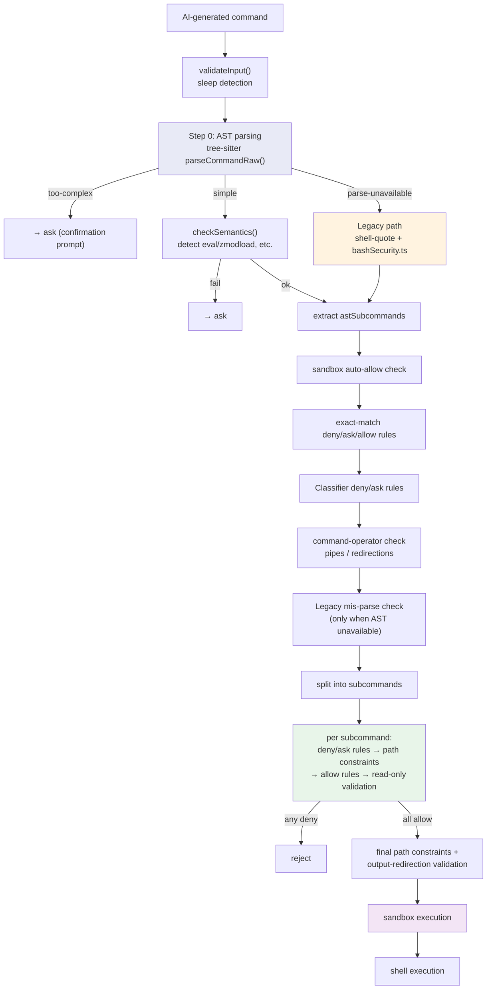

# Chapter 11: BashTool / PowerShellTool dual shell — the most complex single tool family

> This is Chapter 11 of *Deep Dive into Claude Code Source*. BashTool is the largest and most security-sensitive single tool in Claude Code, totaling 12,411 lines of code. We will dissect — across five dimensions: command-semantic classification, layered safety nets, sandbox execution, output handling, and permission matching — how it lets the AI run shell commands safely; the chapter closes with PowerShellTool as the mirror implementation on the Windows path.

## Why is BashTool the most complex tool?

In Chapter 10 we walked through the `buildTool()` abstraction and the Tool interface design. Every tool follows the same `name / inputSchema / call() / checkPermissions()` protocol. What makes BashTool special is this: **it is the only tool that lets the AI execute arbitrary code on the user's machine**.

That means it has to satisfy two requirements that pull in opposite directions:
1. **Powerful enough** — the AI needs shell commands to run git operations, execute tests, install dependencies, inspect logs, and just about everything else.
2. **Safe enough** — the AI (or an attacker steering it via prompt injection) must never be able to perform destructive actions.

This tension produced a massive subsystem of 18 source files and 12,411 lines of code:

| File | Lines | Responsibility |
|------|------|------|
| `BashTool.tsx` | 1,143 | Main file: `buildTool` definition, `call()` execution, `runShellCommand` generator |
| `bashPermissions.ts` | 2,621 | Permission decision pipeline, rule matching, prefix extraction |
| `bashSecurity.ts` | 2,592 | Safety validation: 20+ attack-pattern detectors |
| `readOnlyValidation.ts` | 1,990 | Read-only command allowlist validation (100+ command configs) |
| `pathValidation.ts` | 1,303 | Path safety: dangerous-path detection, project-boundary enforcement |
| `sedValidation.ts` | 684 | Special validation logic for the `sed` command |
| `prompt.ts` | 369 | System Prompt generation for BashTool |
| `shouldUseSandbox.ts` | 153 | Sandbox decision logic |
| `commandSemantics.ts` | 140 | Exit-code semantic interpretation |
| The other 8 files | 1,416 | UI rendering, sed edit parsing, destructive-command warnings, etc. |

In what follows, we trace the full lifecycle of a command — from generation by the AI to completion of execution — to analyze this system.

---

> **Chapter roadmap**: §1 command-semantic classification (so the AI knows what it is running) → §2 the permission backbone `bashToolHasPermission` → §3 rule matching and suggestions → §4 sandbox execution → §5 execution and output handling → §6 prompt engineering → §7 the sed special case → §8 destructive-command warnings → §9 transferable patterns → §10 PowerShellTool as the mirror. The first five sections form the backbone (classify → authorize → match rules → sandbox → execute); §6–§8 are "engineering restraint around the backbone"; §10 calls out the Windows path as a separate mirror implementation.

## 1. Command-semantic classification: what kind of command is the AI running?

The first design highlight of BashTool is **command-semantic classification**. It does not treat every command alike; it classifies commands along multiple dimensions, and each classification dictates a different UI presentation and safety policy.

### 1.1 Search / read / list classification

`BashTool.tsx:59-172` defines four command-semantic sets:

```typescript
// BashTool.tsx:60-72
const BASH_SEARCH_COMMANDS = new Set([
  'find', 'grep', 'rg', 'ag', 'ack', 'locate', 'which', 'whereis'
]);

const BASH_READ_COMMANDS = new Set([
  'cat', 'head', 'tail', 'less', 'more',
  'wc', 'stat', 'file', 'strings',
  'jq', 'awk', 'cut', 'sort', 'uniq', 'tr'
]);

const BASH_LIST_COMMANDS = new Set(['ls', 'tree', 'du']);

const BASH_SEMANTIC_NEUTRAL_COMMANDS = new Set([
  'echo', 'printf', 'true', 'false', ':'  // bash no-op
]);
```

`isSearchOrReadBashCommand()` analyzes the entire command pipeline, and **only when every non-neutral subcommand belongs to the search / read / list categories** does the whole command get tagged as collapsible. That means `ls dir && echo "---" && ls dir2` is treated as a list command (`echo` is neutral), while `ls dir && rm file` is not.

This classification drives the UI: search commands collapse into "Searched N files", read commands into "Read N files", list commands into "Listed N directories".

### 1.2 Silent-command classification

```typescript
// BashTool.tsx:81
const BASH_SILENT_COMMANDS = new Set([
  'mv', 'cp', 'rm', 'mkdir', 'rmdir', 'chmod', 'chown',
  'chgrp', 'touch', 'ln', 'cd', 'export', 'unset', 'wait'
]);
```

Silent commands usually emit no stdout on success. Once BashTool spots one, the UI shows "Done" instead of "(No output)" — a small detail, but it shows how much attention the tool pays to user experience.

### 1.3 Exit-code semantics

`commandSemantics.ts` implements an elegant exit-code semantic system. Many commands use non-zero exit codes to convey information (not errors):

```typescript
// commandSemantics.ts:31-48
const COMMAND_SEMANTICS: Map<string, CommandSemantic> = new Map([
  // grep: 0=match found, 1=no match, 2+=real error
  ['grep', (exitCode) => ({
    isError: exitCode >= 2,
    message: exitCode === 1 ? 'No matches found' : undefined,
  })],
  // diff: 0=no differences, 1=differences, 2+=error
  ['diff', (exitCode) => ({
    isError: exitCode >= 2,
    message: exitCode === 1 ? 'Files differ' : undefined,
  })],
  // test / [: 0=condition true, 1=condition false, 2+=error
  ['test', (exitCode) => ({
    isError: exitCode >= 2,
    message: exitCode === 1 ? 'Condition is false' : undefined,
  })],
]);
```

Without this system, the AI would interpret `grep` returning 1 (no match) as a failure and chase a bug that never existed. Semantic interpretation lets the AI understand what the command's exit really means.

---

## 2. The permission backbone: the real execution order of `bashToolHasPermission`

BashTool's safety design is the most complex and the most exquisite part of the whole tool. It uses **defense in depth** — instead of relying on a single check, it sets up multiple layers along the command's execution path so that any one layer can stop a dangerous operation.

To understand the safety architecture, you first need to pin down the real execution order of `bashToolHasPermission()` (`bashPermissions.ts:1663-2400+`). This function is the main entry point for permission decisions and is invoked directly by `checkPermissions()`:



The key architectural fact here is: **tree-sitter AST parsing is the main entry point (Step 0), not an "extra precise-analysis layer"**. The system falls back to the regex-based path in `bashSecurity.ts` only when the tree-sitter WASM is unavailable or has been turned off by a killswitch. And **read-only validation (`checkReadOnlyConstraints`) is not on the backbone** — it is called by `bashToolCheckPermission()` at Step 8 (after deny/ask/allow rules and path constraints) for each subcommand via `BashTool.isReadOnly()`, not as a standalone "fourth layer".

### 2.1 Layer one: input validation (`validateInput`)

The simplest layer, checking basic command legality:

```typescript
// BashTool.tsx:524-538
async validateInput(input: BashToolInput): Promise<ValidationResult> {
  if (feature('MONITOR_TOOL') && !isBackgroundTasksDisabled
      && !input.run_in_background) {
    const sleepPattern = detectBlockedSleepPattern(input.command);
    if (sleepPattern !== null) {
      return {
        result: false,
        message: `Blocked: ${sleepPattern}. Run blocking commands in the background...`,
        errorCode: 10
      };
    }
  }
  return { result: true };
}
```

`detectBlockedSleepPattern()` (`BashTool.tsx:322-337`) detects commands that begin with `sleep N` where N ≥ 2. Sleeps shorter than 2 seconds (used for rate limiting) are allowed through, while polling patterns like `sleep 5 && check` are redirected to the Monitor tool or `run_in_background`.

### 2.2 AST parsing: the fail-closed design at the entry point (`ast.ts`)

The first step of `bashToolHasPermission()` (Step 0, `bashPermissions.ts:1670-1806`) is tree-sitter AST parsing. This is not an "extra precise-analysis layer" — it **is** the main safety entry point:

```typescript
// bashPermissions.ts:1688-1695
let astRoot = injectionCheckDisabled
  ? null
  : feature('TREE_SITTER_BASH_SHADOW') && !shadowEnabled
    ? null
    : await parseCommandRaw(input.command);
let astResult: ParseForSecurityResult = astRoot
  ? parseForSecurityFromAst(input.command, astRoot)
  : { kind: 'parse-unavailable' };
```

`parseForSecurityFromAst()` performs AST-based analysis on top of tree-sitter (`utils/bash/ast.ts`), and its core design property is **FAIL-CLOSED**:

```typescript
// utils/bash/ast.ts:1-18
/**
 * AST-based bash command analysis using tree-sitter.
 *
 * The key design property is FAIL-CLOSED: we never interpret a
 * structure we do not understand. If tree-sitter produces a node
 * type we have not explicitly allowed, we refuse to extract argv
 * and the caller must ask the user.
 */

export type ParseForSecurityResult =
  | { kind: 'simple'; commands: SimpleCommand[] }
  | { kind: 'too-complex'; reason: string; nodeType?: string }
  | { kind: 'parse-unavailable' }
```

The tree-sitter parser produces three outcomes:
- `simple`: the command structure is simple and `argv[]` (command name and arguments, with quotes stripped) was extracted successfully for each subcommand.
- `too-complex`: the parser hit an AST node type not on the allowlist; analysis is refused → fall back to a confirmation prompt.
- `parse-unavailable`: tree-sitter is not available (external build) → fall back to regex analysis.

The allowlist approach is the heart of this design: rather than enumerate every dangerous shell construct (an open-ended task), it only lets known-safe syntax through and forces user confirmation for everything else.

### 2.3 Legacy fallback path (`bashSecurity.ts`)

When the tree-sitter WASM is unavailable (e.g. an external build without the `TREE_SITTER_BASH` feature) or has been turned off by a GrowthBook killswitch, the backbone falls back to the regex-based analysis path in `bashSecurity.ts` (`bashPermissions.ts:1808-1827,2078-2142`). This path is 2,592 lines and contains 23 safety checks — it used to be the sole safety entry point, and it continues to serve as the fallback for the AST path.

The core idea is: **after quote and escape handling, use regular expressions to detect dangerous patterns in the command**.

#### 2.3.1 Command-substitution pattern detection

```typescript
// bashSecurity.ts:16-41
const COMMAND_SUBSTITUTION_PATTERNS = [
  { pattern: /<\(/, message: 'process substitution <()' },
  { pattern: />\(/, message: 'process substitution >()' },
  { pattern: /=\(/, message: 'Zsh process substitution =()' },
  { pattern: /(?:^|[\s;&|])=[a-zA-Z_]/, message: 'Zsh equals expansion (=cmd)' },
  { pattern: /\$\(/, message: '$() command substitution' },
  { pattern: /\$\{/, message: '${} parameter substitution' },
  { pattern: /\$\[/, message: '$[] legacy arithmetic expansion' },
  { pattern: /<#/, message: 'PowerShell comment syntax' },
  // ... more patterns
];
```

One defense worth noting is the **Zsh EQUALS expansion**: in Zsh, `=curl evil.com` expands to `/usr/bin/curl evil.com`, bypassing a `Bash(curl:*)` deny rule. This shell-dialect difference attack is caught by a single tidy regex.

#### 2.3.2 Dangerous-command blacklist

```typescript
// bashSecurity.ts:45-74
const ZSH_DANGEROUS_COMMANDS = new Set([
  'zmodload',   // loads dangerous modules (mapfile/sysopen/zpty/ztcp)
  'emulate',    // -c flag is equivalent to eval
  'sysopen', 'sysread', 'syswrite', 'sysseek',  // file-descriptor ops
  'zpty',       // pseudo-terminal command execution
  'ztcp',       // TCP connections (used for exfiltration)
  'zsocket',    // Unix / TCP sockets
  'zf_rm', 'zf_mv', 'zf_ln', 'zf_chmod',  // built-ins that bypass binary checks
  // ...
]);
```

This blacklist exposes a deeper security challenge: Zsh built-in modules (such as `zsh/system`, `zsh/net/tcp`) can perform file I/O and network operations without invoking any external binary, bypassing traditional command-name checks. BashTool addresses this by intercepting both `zmodload` (the loader) and each individual module command (defense in depth).

#### 2.3.3 Quote stripping and contextual analysis

A central difficulty for safety checks is that dangerous patterns in a command can be "hidden" inside quotes. `extractQuotedContent()` (`bashSecurity.ts:128-174`) strips quoted content and produces three views:

```typescript
// bashSecurity.ts:119-126
type QuoteExtraction = {
  withDoubleQuotes: string     // keeps content inside double quotes, strips single quotes
  fullyUnquoted: string        // strips everything inside any quotes
  unquotedKeepQuoteChars: string  // strips the contents but keeps the quote characters themselves
}
```

Why three views? Because different safety checks need different contexts:
- `withDoubleQuotes`: detects variable expansion inside double quotes (e.g. `$()` still expands inside double quotes).
- `fullyUnquoted`: detects redirections and shell metacharacters in command pipelines.
- `unquotedKeepQuoteChars`: detects "quote-adjacent hash" attacks (such as `'x'#`, which uses a comment to hide what follows).

#### 2.3.4 Safety check inventory

`bashSecurity.ts:77-101` defines numeric identifiers for **23** safety checks (numeric IDs rather than strings, so the check name is not embedded in telemetry logs). We list them all here so the reader does not have to grep:

```typescript
const BASH_SECURITY_CHECK_IDS = {
  INCOMPLETE_COMMANDS: 1,                            // incomplete commands (unclosed quotes / pipes, etc.)
  JQ_SYSTEM_FUNCTION: 2,                             // `system(...)` inside a jq expression
  JQ_FILE_ARGUMENTS: 3,                              // jq -f / --from-file and other args that load external scripts
  OBFUSCATED_FLAGS: 4,                               // obfuscated CLI flags (backslash / Unicode splicing)
  SHELL_METACHARACTERS: 5,                           // shell metacharacters (;, &, $, etc.) in sensitive positions
  DANGEROUS_VARIABLES: 6,                            // dangerous env-var assignments (e.g. LD_PRELOAD)
  NEWLINES: 7,                                       // bare newline characters in the command
  DANGEROUS_PATTERNS_COMMAND_SUBSTITUTION: 8,        // $(…) / `…` command substitution
  DANGEROUS_PATTERNS_INPUT_REDIRECTION: 9,           // < / <<< / <(…) input redirection
  DANGEROUS_PATTERNS_OUTPUT_REDIRECTION: 10,         // > / >> output redirection (with fallback allowlist)
  IFS_INJECTION: 11,                                 // IFS injection attack
  GIT_COMMIT_SUBSTITUTION: 12,                       // command substitution in `git commit -m`
  PROC_ENVIRON_ACCESS: 13,                           // reading /proc/<pid>/environ
  MALFORMED_TOKEN_INJECTION: 14,                     // malformed-token injection (bypasses shell-quote parsing)
  BACKSLASH_ESCAPED_WHITESPACE: 15,                  // `\<space>` used to disguise consecutive tokens
  BRACE_EXPANSION: 16,                               // brace expansion {a,b}
  CONTROL_CHARACTERS: 17,                            // ASCII control characters (\x00-\x1F, etc.)
  UNICODE_WHITESPACE: 18,                            // Unicode whitespace (U+00A0, etc.) impersonating a space
  MID_WORD_HASH: 19,                                 // a # inside a word truncates the rest into a comment
  ZSH_DANGEROUS_COMMANDS: 20,                        // zsh modules / built-ins (zmodload, zf_*, etc.)
  BACKSLASH_ESCAPED_OPERATORS: 21,                   // backslashes used to hide ;, &, etc.
  COMMENT_QUOTE_DESYNC: 22,                          // comment / quote desync ('x'# hides what follows)
  QUOTED_NEWLINE: 23,                                // newline inside quotes to bypass single-line matching
} as const
```

Each check has a corresponding validator function. When a problem is detected, the command is not rejected outright but marked as "unsafe", which triggers a permission confirmation dialog. This reflects a core principle: **safety systems should fail closed (default to asking the user when uncertain), not fail open**.

### 2.4 Read-only validation inside per-subcommand permission decisions (`readOnlyValidation.ts`)

Read-only validation is **not** a standalone layer on the backbone; it is called at Step 8 inside `bashToolCheckPermission()` (`bashPermissions.ts:1050-1178`), the per-subcommand permission decision function. The 8-step skeleton is below (**each step's line range has been cross-checked against the source**); there is also a passthrough fallback after the eighth step that is not counted among the 8:

| Step | Name | Line range | Behavior on hit |
| --- | --- | --- | --- |
| 1 | Exact-match deny/ask rules | 1058-1070 | deny / ask returns immediately |
| 2 | Prefix / wildcard deny/ask rules | 1072-1104 | deny / ask returns immediately |
| 3 | Path-constraint check (`checkPathConstraints`) | 1106-1122 | non-passthrough returns immediately |
| 4 | Exact-match allow rules | 1124-1127 | allow returns immediately |
| 5 | Prefix / wildcard allow rules | 1129-1139 | allow returns immediately |
| 6 | sed-constraint check (`checkSedConstraints`) | 1141-1145 | non-passthrough returns immediately |
| 7 | Permission-mode branch (`checkPermissionMode`) | 1147-1151 | non-passthrough returns immediately (specific to acceptEdits / plan modes, etc.) |
| 8 | **Read-only validation**: `BashTool.isReadOnly(input)` → `checkReadOnlyConstraints()` | 1153-1163 | on hit, allow (`reason: 'Read-only command is allowed'`) |

> **Fallback branch (outside the 8 steps)**: passthrough (1165-1177) — when none of the first 8 steps hit, trigger the permission confirmation dialog with an exact-match suggestion attached.

Deny rules outrank read-only allowance: if the user has set a deny rule for `Bash(git status)`, the command is rejected even though `git status` is a read-only command. Note also that Steps 6 and 7 sit before Step 8 — dangerous sed writes and plan mode both intercept the command before any read-only allowance can fire.

`readOnlyValidation.ts` runs to 1,990 lines, most of which is command configuration. It defines "safe-flag allowlists" for 100+ common commands. But before deciding whether a command is read-only, `checkReadOnlyConstraints()` runs **a string of critical safety preconditions** (`readOnlyValidation.ts:1882-1966`):

```typescript
// readOnlyValidation.ts:34-49 (simplified)
type CommandConfig = {
  safeFlags: Record<string, FlagArgType>  // safe flags and their argument types
  regex?: RegExp                          // extra regex validation
  additionalCommandIsDangerousCallback?: (
    rawCommand: string, args: string[]
  ) => boolean                            // custom danger detection
  respectsDoubleDash?: boolean            // whether `--` separator is supported
}
```

Take the safe-flag configuration for `fd` (a file-search tool) as an example:

```typescript
// readOnlyValidation.ts:55-100 (excerpt)
const FD_SAFE_FLAGS: Record<string, FlagArgType> = {
  '-h': 'none', '--help': 'none',
  '-H': 'none', '--hidden': 'none',
  '-i': 'none', '--ignore-case': 'none',
  '-d': 'number', '--max-depth': 'number',
  '-t': 'string', '--type': 'string',
  '-e': 'string', '--extension': 'string',
  // SECURITY: -x/--exec and -X/--exec-batch are deliberately excluded.
  // They execute arbitrary commands against every search result.
  // SECURITY: -l/--list-details is also excluded.
  // It internally spawns an `ls` subprocess, exposing a PATH-hijack risk.
}
```

Note the safety reasoning in the comments: `fd -x` is "just a flag on a search tool", but it lets the tool execute arbitrary commands over the search results, so it is excluded from the allowlist. This level of per-command security analysis runs through the entire tool.

The overall logic of `checkReadOnlyConstraints()` is:

**Safety preconditions** (`readOnlyValidation.ts:1882-1966`; failing any single one returns `passthrough` and skips read-only allowance):
1. The command must be parseable by `shell-quote`.
2. `bashCommandIsSafe_DEPRECATED()` must pass (no dangerous patterns).
3. Must not contain a Windows UNC path (guards against WebDAV attacks).
4. Must not contain a `cd` + `git` combination (guards against bare-repo hook attacks).
5. Must not run git inside a directory whose structure matches a bare repository (guards against malicious hooks).
6. Must not run git after writing into git-internal paths (guards against `mkdir hooks && echo evil > hooks/pre-commit && git status`).
7. With the sandbox enabled, must not run git outside the original CWD (guards a race condition: a background command could create bare-repo files inside a subdirectory).

**Flag-allowlist validation** (only after preconditions pass):
1. Split compound commands (`&&`, `||`, `|`).
2. For each subcommand: extract the base command name → look up its `CommandConfig` → verify every flag is on the allowlist.
3. **Every subcommand passes read-only validation** → the whole command is tagged read-only and skips the permission prompt.

---

## 3. Permission decisions: rule matching and smart suggestions

When a command clears the safety analysis but is not read-only, it enters the permission decision flow. `bashPermissions.ts` (2,621 lines) implements a precise permission-rule matching system.

### 3.1 The three shapes of a permission rule

```typescript
// bashPermissions.ts (via shellRuleMatching.ts)
type ShellPermissionRule =
  | { type: 'exact'; command: string }    // exact match: "npm run build"
  | { type: 'prefix'; prefix: string }    // prefix match: "npm run:*" → "npm run"
  | { type: 'wildcard'; pattern: string } // wildcard: "git *"
```

Permission rules come from three sources: `alwaysAllowRules` (auto-approve), `alwaysDenyRules` (auto-reject), and `alwaysAskRules` (always prompt). Rules are layered by source (see Chapter 19 on the permission system).

### 3.2 Env-var stripping and wrapper stripping

A neat detail is "safe-wrapper stripping". When the AI runs `NODE_ENV=test npm run build`, the permission system needs to identify it as `npm run build` for rule matching:

```typescript
// bashPermissions.ts:378-399 (excerpt)
const SAFE_ENV_VARS = new Set([
  'GOEXPERIMENT', 'GOOS', 'GOARCH', 'CGO_ENABLED', 'GO111MODULE',
  'RUST_BACKTRACE', 'RUST_LOG',
  'NODE_ENV',
  'PYTHONUNBUFFERED', 'PYTHONDONTWRITEBYTECODE',
  // ...
]);
// SECURITY: the following variables must NEVER be added to the allowlist:
// PATH, LD_PRELOAD, LD_LIBRARY_PATH, DYLD_* (execution / library loading)
// PYTHONPATH, NODE_PATH (module loading)
// GOFLAGS, RUSTFLAGS, NODE_OPTIONS (can contain code-execution flags)
```

The safety allowlist strictly separates env vars that "only change behavioral configuration" from those that "can execute code". `PATH=evil npm run build` is not stripped — because `PATH` can be used to hijack a binary.

Likewise, safe wrapper commands (`nice`, `timeout`, `time`, etc.) are stripped before matching. But `sudo`, `env`, `bash -c`, and friends **are never suggested as permission-rule prefixes**, because `Bash(sudo:*)` is equivalent to `Bash(*)`:

```typescript
// bashPermissions.ts:196-226
const BARE_SHELL_PREFIXES = new Set([
  'sh', 'bash', 'zsh', 'fish', 'csh', 'ksh', 'dash',
  'env', 'xargs',
  'nice', 'stdbuf', 'nohup', 'timeout', 'time',
  'sudo', 'doas', 'pkexec',
]);
```

### 3.3 Smart rule suggestions

When the user approves a command, the system automatically suggests reusable permission rules. `getSimpleCommandPrefix()` extracts the command prefix (such as `git commit`), and `suggestionForExactCommand()` decides what form the suggested rule should take:

```typescript
// bashPermissions.ts:161-188
export function getSimpleCommandPrefix(command: string): string | null {
  const tokens = command.trim().split(/\s+/).filter(Boolean);
  // skip safe env-var assignments
  let i = 0;
  while (i < tokens.length && ENV_VAR_ASSIGN_RE.test(tokens[i]!)) {
    const varName = tokens[i]!.split('=')[0]!;
    if (!SAFE_ENV_VARS.has(varName)) return null; // unsafe env var → no prefix suggestion
    i++;
  }
  const remaining = tokens.slice(i);
  if (remaining.length < 2) return null;
  const subcmd = remaining[1]!;
  // the second token must "look like a subcommand" (lowercase alphanumerics)
  if (!/^[a-z][a-z0-9]*(-[a-z0-9]+)*$/.test(subcmd)) return null;
  return remaining.slice(0, 2).join(' ');
}
```

`git commit -m "fix typo"` → suggests the rule `Bash(git commit:*)`
`NODE_ENV=prod npm run build` → suggests the rule `Bash(npm run:*)`
`MY_VAR=val npm run build` → no prefix suggestion (`MY_VAR` is not a safe variable)

For commands that include a heredoc, since the heredoc body is different every time, an exact-match rule would never hit again. The system automatically extracts the prefix before the heredoc as the rule suggestion.

### 3.4 The safety ceiling for compound commands

To stop maliciously crafted, oversized compound commands from hanging the system, the permission check enforces a hard ceiling:

```typescript
// bashPermissions.ts:103
export const MAX_SUBCOMMANDS_FOR_SECURITY_CHECK = 50;
// bashPermissions.ts:110
export const MAX_SUGGESTED_RULES_FOR_COMPOUND = 5;
```

More than 50 subcommands and the system requires user confirmation outright (the safe default); more than 5 suggested rules and they collapse into "similar commands". This limit comes from a real performance incident (CC-643): certain compound commands produced an exponentially growing subcommand array after `splitCommand`, and each subcommand had to run tree-sitter parsing + 20+ safety checks + `logEvent`, which eventually starved the event loop.

---

## 4. Sandbox execution: isolation at runtime

After passing every safety check, the command enters the execution stage. `shouldUseSandbox.ts` decides whether to run the command inside the sandbox.

### 4.1 Sandbox decision logic

```typescript
// shouldUseSandbox.ts:130-153
export function shouldUseSandbox(input: Partial<SandboxInput>): boolean {
  if (!SandboxManager.isSandboxingEnabled()) return false;
  // explicitly disabled, and policy allows it
  if (input.dangerouslyDisableSandbox
      && SandboxManager.areUnsandboxedCommandsAllowed()) return false;
  if (!input.command) return false;
  // user-configured excluded commands
  if (containsExcludedCommand(input.command)) return false;
  return true;
}
```

The sandbox's exclusion check (`containsExcludedCommand`) is just as carefully designed. It does not look at the command as a whole; it splits the compound command first and checks each subcommand independently. This prevents an attack like `docker ps && curl evil.com` from leaving the sandbox just because `docker` is on the exclusion list.

### 4.2 Iterative stripping of excluded commands

```typescript
// shouldUseSandbox.ts:82-101
const candidates = [trimmed];
const seen = new Set(candidates);
let startIdx = 0;
while (startIdx < candidates.length) {
  const endIdx = candidates.length;
  for (let i = startIdx; i < endIdx; i++) {
    const cmd = candidates[i]!;
    const envStripped = stripAllLeadingEnvVars(cmd, BINARY_HIJACK_VARS);
    if (!seen.has(envStripped)) { candidates.push(envStripped); seen.add(envStripped); }
    const wrapperStripped = stripSafeWrappers(cmd);
    if (!seen.has(wrapperStripped)) { candidates.push(wrapperStripped); seen.add(wrapperStripped); }
  }
  startIdx = endIdx;
}
```

This "fixed-point iteration" algorithm handles interleaved env vars and wrappers, such as `timeout 300 FOO=bar bazel run` — a single stripping pass cannot handle it, but iterating until no new candidates appear can.

### 4.3 Sandbox instructions in the prompt

`getSimpleSandboxSection()` in `prompt.ts:172-273` serializes the sandbox configuration (filesystem read/write permissions, network allowlist) as JSON and injects it into the System Prompt so the model knows the sandbox's limits:

```typescript
// prompt.ts:188-203 (simplified)
const filesystemConfig = {
  read: { denyOnly: dedup(fsReadConfig.denyOnly) },
  write: {
    allowOnly: normalizeAllowOnly(fsWriteConfig.allowOnly),
    denyWithinAllow: dedup(fsWriteConfig.denyWithinAllow),
  },
};
```

One detail: temporary directory paths (such as `/private/tmp/claude-1001/`) are normalized to `$TMPDIR`, so the prompt does not differ between users with different UIDs — which would otherwise break the global Prompt Cache across users.

---

## 5. Command execution and output handling

### 5.1 Execution driven by an AsyncGenerator

`runShellCommand()` (`BashTool.tsx:826-1143`) is an AsyncGenerator: it `yield`s progress updates and `return`s the final result:

```typescript
// BashTool.tsx:826-853 (type signature)
async function* runShellCommand(params): AsyncGenerator<
  { type: 'progress'; output: string; fullOutput: string;
    elapsedTimeSeconds: number; totalLines: number;
    totalBytes?: number; taskId?: string; timeoutMs?: number },
  ExecResult,  // return type
  void
> {
  // ...
}
```

The caller consumes the generator with a `do...while` loop:

```typescript
// BashTool.tsx:660-682
let generatorResult;
do {
  generatorResult = await commandGenerator.next();
  if (!generatorResult.done && onProgress) {
    const progress = generatorResult.value;
    onProgress({
      toolUseID: `bash-progress-${progressCounter++}`,
      data: { type: 'bash_progress', ...progress }
    });
  }
} while (!generatorResult.done);
result = generatorResult.value;  // the final ExecResult
```

### 5.2 The 2-second threshold for progress display

```typescript
// BashTool.tsx:55
const PROGRESS_THRESHOLD_MS = 2000;
```

Progress is not displayed for the first 2 seconds after the command starts. If the command finishes within 2 seconds (the common case), the user sees instant output with no flickering progress bar. Only commands that exceed 2 seconds stream live output:

```typescript
// BashTool.tsx:1006-1014
const initialResult = await Promise.race([
  resultPromise,
  new Promise<null>(resolve => {
    const t = setTimeout(r => r(null), PROGRESS_THRESHOLD_MS, resolve);
    t.unref();  // does not block process exit
  })
]);
if (initialResult !== null) {
  shellCommand.cleanup();
  return initialResult;  // finished within 2 seconds, return directly
}
```

### 5.3 Foreground / background task transitions

BashTool supports **four** ways to background a task:

1. **AI-initiated backgrounding**: `run_in_background: true` (`BashTool.tsx:989-1001`).
2. **Timeout-triggered backgrounding**: automatically moved to the background after the default timeout (`BashTool.tsx:967-971`).
3. **User-initiated backgrounding**: Ctrl+B moves a running foreground command into the background (`UI.tsx:31-84`).
4. **Assistant-mode automatic backgrounding**: the main agent automatically backgrounds blocking commands that exceed 15 seconds (`BashTool.tsx:976-983`).

```typescript
// BashTool.tsx:57
const ASSISTANT_BLOCKING_BUDGET_MS = 15_000;

// BashTool.tsx:976-983
if (feature('KAIROS') && getKairosActive() && isMainThread
    && !isBackgroundTasksDisabled && run_in_background !== true) {
  setTimeout(() => {
    if (shellCommand.status === 'running' && backgroundShellId === undefined) {
      assistantAutoBackgrounded = true;
      startBackgrounding('tengu_bash_command_assistant_auto_backgrounded');
    }
  }, ASSISTANT_BLOCKING_BUDGET_MS).unref();
}
```

### 5.4 Persistence for large outputs

BashTool's output persistence runs two independent mechanisms:

**Mechanism one: shell-level file-mode output.** When the shell command's stdout exceeds a certain size, `TaskOutput` writes the output to a file on disk rather than holding it all in memory. After the command finishes, BashTool detects `result.outputFilePath` and hard-links (falling back to a copy) the output file into the `tool-results/` directory, then generates a `<persisted-output>` preview for the model to read:

```typescript
// BashTool.tsx:732
const MAX_PERSISTED_SIZE = 64 * 1024 * 1024;  // 64MB ceiling; truncate beyond
```

**Mechanism two: the generic `tool_result` persistence threshold.** `maxResultSizeChars: 30_000` is a generic mechanism on the Tool interface (defined in `Tool.ts`): when a tool's returned text exceeds the threshold, the framework persists the result to disk. BashTool sets this threshold to 30K (other tools default to 100K) because shell output tends to be longer.

The two mechanisms are complementary: the shell-level file mode handles the **stream of output during execution**, while `maxResultSizeChars` controls **size at result-return time**.

### 5.5 Image-output detection

```typescript
// BashTool.tsx:785-802
let isImage = isImageOutput(strippedStdout);
if (isImage) {
  const resized = await resizeShellImageOutput(
    strippedStdout, result.outputFilePath, persistedOutputSize
  );
  if (resized) {
    compressedStdout = resized;
  } else {
    isImage = false;  // parse failed or file too large, fall back to text
  }
}
```

When a command's output is a base64-encoded image (e.g. from a screenshot tool), BashTool detects it and sends it to the model as an `image` content block, letting Claude "see" the image. Oversized images are compressed or fall back to text.

---

## 6. Prompt engineering: steering the AI toward correct use of BashTool

The BashTool description that `prompt.ts` produces does not just tell the model what the tool can do; it also packs in plenty of behavioral guidance.

### 6.1 Tool-preference guidance

```typescript
// prompt.ts:280-291
const toolPreferenceItems = [
  `File search: Use ${GLOB_TOOL_NAME} (NOT find or ls)`,
  `Content search: Use ${GREP_TOOL_NAME} (NOT grep or rg)`,
  `Read files: Use ${FILE_READ_TOOL_NAME} (NOT cat/head/tail)`,
  `Edit files: Use ${FILE_EDIT_TOOL_NAME} (NOT sed/awk)`,
  `Write files: Use ${FILE_WRITE_TOOL_NAME} (NOT echo >/cat <<EOF)`,
  'Communication: Output text directly (NOT echo/printf)',
];
```

These directives steer the model toward dedicated tools (Glob, Grep, FileRead, etc.) instead of shelling out to the equivalent command-line tools through BashTool. The reason: dedicated tools have better UI presentation and tighter permission control.

### 6.2 Git Safety Protocol

`prompt.ts:81-161` contains the full Git Safety Protocol, embedded directly into BashTool's System Prompt:

- Never update git config.
- Never skip hooks (`--no-verify`).
- Never force-push to main / master.
- Always create a NEW commit instead of amending (after a pre-commit hook failure, amending would modify the previous commit).
- Use the HEREDOC format to pass commit messages (ensures correct formatting).

### 6.3 The safety design of the input schema

```typescript
// BashTool.tsx:227-259
const fullInputSchema = lazySchema(() => z.strictObject({
  command: z.string(),
  timeout: semanticNumber(z.number().optional()),
  description: z.string().optional(),
  run_in_background: semanticBoolean(z.boolean().optional()),
  dangerouslyDisableSandbox: semanticBoolean(z.boolean().optional()),
  _simulatedSedEdit: z.object({
    filePath: z.string(),
    newContent: z.string()
  }).optional()
}));

// remove _simulatedSedEdit from the model-visible schema
const inputSchema = lazySchema(() =>
  fullInputSchema().omit({ _simulatedSedEdit: true })
);
```

`_simulatedSedEdit` is an internal field used for the precise-write step after a sed-edit preview. It is removed from the model-visible schema because **exposing it would let the model bypass permission checks and the sandbox** — the model could submit a harmless `command` paired with an arbitrary `_simulatedSedEdit` to write any file.

---

## 7. Special handling: turning sed edits into file edits

BashTool has a complete special-case pipeline for `sed -i`. `sedEditParser.ts` (322 lines) parses the sed command into structured edit operations:

```typescript
// sedEditParser.ts:23-33
export type SedEditInfo = {
  filePath: string        // path of the file being edited
  pattern: string         // search pattern (regex)
  replacement: string     // replacement string
  flags: string           // replacement flags (g, i, etc.)
  extendedRegex: boolean  // whether extended regex (-E/-r) is used
}
```

When `sed -i 's/old/new/g' file.txt` is detected:
1. **UI rendering**: the sed command is hidden; the file path is shown the same way FileEditTool would show it (`UI.tsx:99-103`).
2. **Permission preview**: a file diff preview is shown in the permission confirmation dialog.
3. **Precise write**: once the user confirms, sed is not actually executed. Instead, `applySedEdit()` writes the previewed content directly (`BashTool.tsx:360-419`), guaranteeing that what the user saw is what gets written.

This "simulated execution" mode (`_simulatedSedEdit`) resolves a subtle consistency issue: if the file changes between user preview and actual execution, the result of the sed command could differ from the preview. By computing the final content at preview time and using it directly on write, the TOCTOU (Time-of-Check-to-Time-of-Use) race is eliminated.

---

## 8. Destructive-command warnings

`destructiveCommandWarning.ts` adds extra visual warnings for common destructive commands. Note that this warning mechanism is gated by the GrowthBook feature flag `tengu_destructive_command_warning` — only when the flag is on does the `BashPermissionRequest` component call `getDestructiveCommandWarning()` (`BashPermissionRequest.tsx:274`):

```typescript
// destructiveCommandWarning.ts:12-89 (excerpt)
const DESTRUCTIVE_PATTERNS: DestructivePattern[] = [
  { pattern: /\bgit\s+reset\s+--hard\b/,
    warning: 'Note: may discard uncommitted changes' },
  { pattern: /\bgit\s+push\b[^;&|\n]*--force\b/,
    warning: 'Note: may overwrite remote history' },
  { pattern: /\bgit\s+clean\b(?![^;&|\n]*--dry-run)[^;&|\n]*-[a-zA-Z]*f/,
    warning: 'Note: may permanently delete untracked files' },
  { pattern: /\bkubectl\s+delete\b/,
    warning: 'Note: may delete Kubernetes resources' },
  { pattern: /\bterraform\s+destroy\b/,
    warning: 'Note: may destroy Terraform infrastructure' },
];
```

Note that the regex for `git clean` excludes the `--dry-run` flag — if the command is a dry run, no warning is needed. This precise understanding of CLI tool semantics runs throughout BashTool's design.

---

## 9. Transferable design patterns

### Pattern 1: defense-in-depth architecture

Split safety checks into multiple independent dimensions (AST structural validation → semantic checks → permission-rule matching → path constraints → read-only allowlist → sandbox) and orchestrate them by priority on the permission backbone. Any single dimension can independently block a dangerous operation, and the AST path can fall back to the regex path when AST parsing is unavailable.

**When it applies**: any system that lets users / AI perform dynamic operations. Do not rely on a single safety checkpoint.

### Pattern 2: the fail-closed allowlist pattern

Use explicit allowlists (not blacklists) to define safe behavior. In tree-sitter AST analysis, only allowlisted node types are let through; every unknown structure is rejected by default. In read-only command validation, only allowlisted flags are considered safe.

**When it applies**: security-sensitive parsing and validation. Blacklists are never complete (there is an unbounded number of attack vectors); allowlists have a finite set of known-safe items.

### Pattern 3: semantics-driven differentiated handling

Classify inputs semantically (search / read / list / silent / destructive) and apply different UI presentations and safety policies based on the classification. Compared with "one size fits all", this delivers both a better user experience and more precise safety controls at once.

**When it applies**: tool systems that handle many input types. Orders in an e-commerce system (prepaid / cash-on-delivery / refund), events in a log system (info / warn / error), and similar domains all benefit from semantic classification.

---

## 10. The Windows mirror: PowerShellTool

The book's vantage point has so far sat on the macOS / Linux side, treating BashTool as the only channel through which "the AI executes arbitrary code on the user's machine". But open the `tools/PowerShellTool/` directory and you will find that Windows users actually travel an almost parallel road — 14 source files totaling 8,959 lines of code. Although that is not on the same order as BashTool's 18 files and 12,411 lines, **the overall shape is nearly a mirror image**.

The mirroring shows up in three places.

**The entry point and lifecycle line up exactly.** `tools/PowerShellTool/PowerShellTool.tsx` (1,000 lines) and `BashTool.tsx` (1,143 lines) are almost the same skeleton: the same `PROGRESS_THRESHOLD_MS = 2000`, `ASSISTANT_BLOCKING_BUDGET_MS = 15_000` (`PowerShellTool.tsx:159–162`), the same `runPowerShellCommand` AsyncGenerator (`PowerShellTool.tsx:663`), the same `detectBlockedSleepPattern` (`PowerShellTool.tsx:189`) — just with the detection target switched from `sleep` to `Start-Sleep`. `isSearchOrReadPowerShellCommand()` (`PowerShellTool.tsx:101`) does the same job as BashTool's `BASH_SEARCH/READ/LIST` sets, except the command names become PowerShell cmdlets like `select-string`, `get-content`, `write-output` (`PowerShellTool.tsx:54–93`).

**The number and order of safety layers also line up.** `powershellPermissions.ts` (1,648 lines) maps to `bashPermissions.ts` (2,621 lines); `powershellSecurity.ts` (1,090 lines) maps to `bashSecurity.ts` (2,592 lines); `readOnlyValidation.ts` exists on both sides (1,823 lines vs 1,990 lines). `pathValidation.ts` is even thicker on the PowerShell side — 2,049 lines, compared to Bash's 1,303 — because the edge cases Windows paths must handle (drive-relative `C:foo`, PS provider prefixes like `FileSystem::`, NTFS trailing-space / dot stripping, `/` and `\` interchangeability, the assorted dash characters `–`/`—`/`―` used as parameter prefixes) far outnumber those on POSIX paths.

**But two pieces are unique to PowerShell with no counterpart in BashTool.**

The first is `gitSafety.ts` (176 lines). The attack scenarios it defends against are exactly the same as BashTool's `cd + git` defenses — bare-repo hook attacks, git execution after writing into git-internal directories — but the peculiarities of Windows paths force a whole separate normalization pipeline: `normalizeGitPathArg()` (`gitSafety.ts:48`+) has to reduce PS colon-bound parameters (`/Path:hooks/pre-commit`), provider prefixes (`Microsoft.PowerShell.Core\FileSystem::path`), drive-relative paths (`C:foo` is cwd-relative, `C:\foo` is absolute, and the two must be distinguished), and NTFS trailing-space / dot stripping all into one canonical path before it can compare against the git-internal directory prefixes `hooks/`, `HEAD`, `objects/`. BashTool has no such layer because POSIX filesystems do not treat `hooks ` and `hooks` as the same file, while NTFS does.

The second is `clmTypes.ts` (211 lines), which corresponds to an attack surface that simply does not exist on the BashTool side: **.NET type instantiation**. A line of innocent-looking PowerShell such as `[adsi]'LDAP://evil.com/...'` is "just a type conversion", but at runtime it really does open a network connection to a remote LDAP server — there is no equivalent in bash. Microsoft's Constrained Language Mode maintains an allowlist of ".NET types that remain usable while the system is locked down" (`CLM_ALLOWED_TYPES` in `clmTypes.ts`), and PowerShellTool uses that allowlist as its decision baseline: any `TypeName.Name` encountered during AST parsing that is not on the allowlist is rejected, and the user is prompted to confirm. One regression worth noting: `adsi` and `adsisearcher` have been explicitly **removed** from Microsoft's original allowlist — Microsoft allows them because their assumed scenario is a Windows-domain administrator, but in Claude Code's scenario the caller is not necessarily trusted.

A few "look-alike-but-not-quite" differences are also worth a line each:

- **Sandbox**: BashTool's `shouldUseSandbox.ts` (153 lines) uses sandbox-exec or namespace isolation on macOS / Linux; PowerShellTool.tsx:210 puts it bluntly — "Enterprise policy requires sandboxing, but sandboxing is not available on native Windows". Native Windows has no equivalent sandbox primitive, so when policy requires the sandbox the only option is to **refuse execution** rather than silently skip it.
- **Version split**: PowerShell 5.1 and PowerShell 7+ have incompatible syntax (5.1 does not support `&&`/`||` and parser-errors outright), so `prompt.ts` has to tell the model the currently detected `PowerShellEdition` in the System Prompt to avoid commands that "look legal in the training data but exit 1 at runtime". BashTool has no such problem because bash's syntax is far more stable across mainstream versions.
- **Pipeline semantics**: PowerShell's pipeline carries .NET objects rather than a byte stream; `commandSemantics.ts` (142 lines, against BashTool's 140 lines) has an exit-code semantics table of the same size, but the PowerShell side has to handle the two distinct exit-status variables `$?` and `$LASTEXITCODE`.

Looking back at BashTool's 12,411 lines and PowerShellTool's 8,959 lines, there is really only one point worth stressing: **letting the AI run code on the user's machine cannot be turned into a single "generic shell tool"**. The differences between shells (POSIX vs PowerShell), filesystems (case sensitivity, path normalization, legal characters in filenames), isolation primitives (sandbox-exec vs "nothing"), and attack surfaces (command injection vs .NET type instantiation) force Claude Code to keep two nearly parallel implementations under `tools/`. The apparent redundancy is in fact the minimum price for "failing closed under both OS semantics".

---

---

## Next chapter preview

[Chapter 12: file, code, and LSP collaboration family — engineering consistency from Read to LSP](./12-file-code-and-lsp-collaboration-family.md)

We will examine the eight tools FileRead / FileWrite / FileEdit / NotebookEdit / Glob / Grep / LSPTool / REPLTool, plus the stack of services under `services/lsp/` that LSPTool builds on, to jointly answer the question "an Agent wants to read and modify a code repository".

---
*Full content at https://github.com/luyao618/Claude-Code-Source-Study (a free star would be appreciated)*
