# Chapter 15: Built-in Agent Design Patterns — Prompt Design for Explore, Plan, and Verification

> This chapter is chapter 15 of *Deep Dive into Claude Code Source*. We will examine the System Prompt design of Claude Code's six built-in agents (内置 Agent), show how prompt engineering shapes the same tool system into sharply different agent personas and behavioral patterns, and unpack the full markdown frontmatter configuration surface for custom agents.

## Why Does Claude Code Need Built-in Agents?

In chapter 14, we studied the overall architecture of the Agent system: the `AgentDefinition` data structure, the `runAgent()` lifecycle, and the isolation mechanism in `createSubagentContext()`. But architecture is only the skeleton. What truly gives an Agent its "soul" is its **System Prompt design**.

Here is the core question: Claude Code has 40+ tools, so why not let one general-purpose Agent do everything? The answer lies in engineering practice:

1. **Cost control**: the Explore Agent is fine on the Haiku model; it does not need Opus for file search.
2. **Safety isolation**: the Verification Agent is forbidden from modifying the project directory. If the "verifier" edits code itself, verification loses its meaning.
3. **Prompt precision**: the more focused the role definition, the more predictable the model's behavior becomes.
4. **Token savings**: read-only agents do not need the commit/PR/lint rules from CLAUDE.md, saving 5-15 Gtok per week.

Through six built-in agents (General-purpose, Statusline-setup, Explore, Plan, Guide, and Verification), Claude Code demonstrates a set of **role-based prompt design patterns**: the same tool collection produces completely different behavior under different System Prompt constraints. This chapter analyzes all six agents one by one. Explore/Plan/Verification/General-purpose/Guide are mainly prompt-engineering cases, while Statusline-setup is domain-specialized: a small agent dedicated to editing the `statusLine.command` field in `settings.json`. It appears in §2.6.

---

## 1. Built-in Agent Overview: Registration and Gating

The registration entrypoint for all built-in agents is the `getBuiltInAgents()` function in `builtInAgents.ts`:

```typescript
// tools/AgentTool/builtInAgents.ts:22-72
export function getBuiltInAgents(): AgentDefinition[] {
  // SDK users can disable all built-in agents through an environment variable.
  if (
    isEnvTruthy(process.env.CLAUDE_AGENT_SDK_DISABLE_BUILTIN_AGENTS) &&
    getIsNonInteractiveSession()
  ) {
    return []
  }

  // In Coordinator mode, replace them with worker agents.
  if (feature('COORDINATOR_MODE')) {
    if (isEnvTruthy(process.env.CLAUDE_CODE_COORDINATOR_MODE)) {
      const { getCoordinatorAgents } =
        require('../../coordinator/workerAgent.js')
      return getCoordinatorAgents()
    }
  }

  const agents: AgentDefinition[] = [
    GENERAL_PURPOSE_AGENT,
    STATUSLINE_SETUP_AGENT,
  ]

  if (areExplorePlanAgentsEnabled()) {
    agents.push(EXPLORE_AGENT, PLAN_AGENT)
  }

  // Load the Guide Agent only for non-SDK entrypoints.
  if (isNonSdkEntrypoint) {
    agents.push(CLAUDE_CODE_GUIDE_AGENT)
  }

  // The Verification Agent is gated by both a feature flag and GrowthBook.
  if (
    feature('VERIFICATION_AGENT') &&
    getFeatureValue_CACHED_MAY_BE_STALE('tengu_hive_evidence', false)
  ) {
    agents.push(VERIFICATION_AGENT)
  }

  return agents
}
```

Several design points in this code are worth noting:

| Design point | Explanation |
|---------|------|
| SDK disable switch | `CLAUDE_AGENT_SDK_DISABLE_BUILTIN_AGENTS` gives SDK users a "blank slate". |
| Coordinator replacement | In Coordinator mode, built-in agents are fully replaced by worker agents. |
| Explore/Plan are A/B tested | `areExplorePlanAgentsEnabled()` is controlled through GrowthBook `tengu_amber_stoat`. |
| Verification has dual gating | Compile-time `feature()` plus runtime `getFeatureValue_CACHED_MAY_BE_STALE()`. |
| General-purpose is always available | It is registered unconditionally as the fallback. |

---

## 2. The Six Built-in Agents, One by One

### 2.1 Explore Agent: Read-only Search Specialist

**File**: `tools/AgentTool/built-in/exploreAgent.ts`

The Explore Agent's core role is **fast, read-only code search**. Its System Prompt establishes a strict identity constraint from the very beginning:

```typescript
// tools/AgentTool/built-in/exploreAgent.ts:24-56
return `You are a file search specialist for Claude Code...

=== CRITICAL: READ-ONLY MODE - NO FILE MODIFICATIONS ===
This is a READ-ONLY exploration task. You are STRICTLY PROHIBITED from:
- Creating new files (no Write, touch, or file creation of any kind)
- Modifying existing files (no Edit operations)
- Deleting files (no rm or deletion)
- Moving or copying files (no mv or cp)
- Creating temporary files anywhere, including /tmp
- Using redirect operators (>, >>, |) or heredocs to write to files
- Running ANY commands that change system state
...

NOTE: You are meant to be a fast agent that returns output as quickly as possible.
In order to achieve this you must:
- Make efficient use of the tools that you have at your disposal
- Wherever possible you should try to spawn multiple parallel tool calls...`
```

**Prompt design highlights**:

1. **Uppercase "CRITICAL" warning**: in prompt engineering practice, all caps plus "STRICTLY PROHIBITED" is often an effective way to constrain model behavior. Claude Code uses this pattern consistently across multiple read-only agent prompts.
2. **Exhaustive prohibited actions**: it does not merely say "do not modify files". It lists seven concrete ways to modify state, including `touch`, `mv`, and redirection, closing off the paths the model might otherwise take around the rule.
3. **Efficiency orientation**: it explicitly asks for output "as quickly as possible" and to "spawn multiple parallel tool calls", steering the model toward parallel tool execution.

The configuration in the Agent definition is just as deliberate:

```typescript
// tools/AgentTool/built-in/exploreAgent.ts:64-83
export const EXPLORE_AGENT: BuiltInAgentDefinition = {
  agentType: 'Explore',
  disallowedTools: [
    AGENT_TOOL_NAME,          // Cannot nest Agent calls.
    EXIT_PLAN_MODE_TOOL_NAME, // Does not need plan mode.
    FILE_EDIT_TOOL_NAME,      // Cannot edit.
    FILE_WRITE_TOOL_NAME,     // Cannot write.
    NOTEBOOK_EDIT_TOOL_NAME,  // Cannot edit notebooks.
  ],
  // Internal users inherit the main Agent model; external users use Haiku for speed.
  model: process.env.USER_TYPE === 'ant' ? 'inherit' : 'haiku',
  // Does not need the commit/PR/lint rules from CLAUDE.md.
  omitClaudeMd: true,
  getSystemPrompt: () => getExploreSystemPrompt(),
}
```

**Dual safety guarantee**: the System Prompt tells the model in natural language that it must not modify files, while `disallowedTools` removes write tools directly at the tool-registration layer. This is the double-lock pattern of "prompt constraint plus tool constraint".

**Cost optimization**: `omitClaudeMd: true` is a key optimization. In `runAgent.ts:390-398`, this flag makes the Agent skip CLAUDE.md injection during startup:

```typescript
// tools/AgentTool/runAgent.ts:390-398
const shouldOmitClaudeMd =
  agentDefinition.omitClaudeMd &&
  !override?.userContext &&
  getFeatureValue_CACHED_MAY_BE_STALE('tengu_slim_subagent_claudemd', true)
const { claudeMd: _omittedClaudeMd, ...userContextNoClaudeMd } =
  baseUserContext
const resolvedUserContext = shouldOmitClaudeMd
  ? userContextNoClaudeMd
  : baseUserContext
```

The source comments reveal a striking number: **34+ million Explore Agent calls per week**. Omitting CLAUDE.md saves 5-15 Gtok per week. Explore and Plan also omit the `gitStatus` context, which can be up to 40 KB, because they can run `git status` themselves if they need fresh data (`runAgent.ts:400-410`).

In addition, the `whenToUse` field introduces a "thoroughness" parameter. The caller can specify `"quick"`, `"medium"`, or `"very thorough"` to control search depth. This is a clever use of natural language as parameter passing.

### 2.2 Plan Agent: Read-only Architect

**File**: `tools/AgentTool/built-in/planAgent.ts`

The Plan Agent shares the READ-ONLY constraint with the Explore Agent, but its role is completely different: it is a **software architect**:

```typescript
// tools/AgentTool/built-in/planAgent.ts:21-71
return `You are a software architect and planning specialist for Claude Code.
Your role is to explore the codebase and design implementation plans.

=== CRITICAL: READ-ONLY MODE - NO FILE MODIFICATIONS ===
...

## Your Process
1. **Understand Requirements**: Focus on the requirements provided...
2. **Explore Thoroughly**: Read files, find patterns, understand architecture...
3. **Design Solution**: Create implementation approach...
4. **Detail the Plan**: Step-by-step implementation strategy...

## Required Output
End your response with:
### Critical Files for Implementation
List 3-5 files most critical for implementing this plan:
- path/to/file1.ts
- path/to/file2.ts`
```

**Prompt design highlights**:

1. **Structured process**: numbered steps from 1 to 4 guide the model to reason in order instead of jumping around.
2. **Contracted output format**: the prompt requires the response to end with "Critical Files for Implementation". This is a prompt-level output contract that lets the main Agent expect a structured file list. Note that the source does not contain a hard-coded parser to extract these files; the constraint is enforced through the prompt rather than code.
3. **Role separation**: "your assigned perspective" hints that the caller can assign different perspectives to different Plan Agents, such as security, performance, or maintainability, enabling multi-perspective review.

```typescript
// tools/AgentTool/built-in/planAgent.ts:73-92
export const PLAN_AGENT: BuiltInAgentDefinition = {
  agentType: 'Plan',
  disallowedTools: [ /* Same as Explore. */ ],
  tools: EXPLORE_AGENT.tools,     // Reuses Explore's tool configuration.
  model: 'inherit',               // Inherits the main Agent model for stronger reasoning.
  omitClaudeMd: true,
  getSystemPrompt: () => getPlanV2SystemPrompt(),
}
```

Notice that the Plan Agent directly references `EXPLORE_AGENT.tools`, avoiding duplicated configuration. Unlike Explore, which uses Haiku, Plan is configured as `'inherit'`, inheriting the main Agent model. From the configuration intent, architecture design likely needs stronger reasoning than file search.

### 2.3 Verification Agent: Adversarial Verifier

**File**: `tools/AgentTool/built-in/verificationAgent.ts`

This built-in agent has the **longest and most carefully engineered** System Prompt among all built-in agents: 120 lines of pure prompt text, see `verificationAgent.ts:10-129`. Its core idea is: **the value of a verifier is finding problems, not confirming correctness**.

Unlike the "fully READ-ONLY" Explore/Plan agents, the Verification Agent has a finer-grained constraint: **the project directory is read-only, but writing test scripts in temporary directories is allowed**:

```
=== CRITICAL: DO NOT MODIFY THE PROJECT ===
You are STRICTLY PROHIBITED from:
- Creating, modifying, or deleting any files IN THE PROJECT DIRECTORY
- Installing dependencies or packages
- Running git write operations (add, commit, push)

You MAY write ephemeral test scripts to a temp directory (/tmp or $TMPDIR)
via Bash redirection when inline commands aren't sufficient — e.g.,
a multi-step race harness or a Playwright test. Clean up after yourself.
```

This is an important design distinction: Explore/Plan use an absolute "NO FILE MODIFICATIONS" ban, including `/tmp`, while the Verification Agent allows temporary writes because some verification scenarios, such as concurrency race harnesses or multi-step Playwright scripts, genuinely need temp files.

The prompt opens by going straight to the point: it tells the model about two of its own natural weaknesses.

```typescript
// tools/AgentTool/built-in/verificationAgent.ts:10-12
const VERIFICATION_SYSTEM_PROMPT = `You are a verification specialist.
Your job is not to confirm the implementation works — it's to try to break it.

You have two documented failure patterns. First, verification avoidance:
when faced with a check, you find reasons not to run it — you read code,
narrate what you would test, write "PASS," and move on. Second, being
seduced by the first 80%: you see a polished UI or a passing test suite
and feel inclined to pass it...`
```

**This can be understood as a kind of "metacognitive prompt" design**. It is not teaching the model what to do; it is telling the model what mistakes it will make. This design likely comes from a practical observation: LLMs tend to "read code and announce correctness" instead of actually running and testing.

Next, the prompt spends substantial space listing **concrete verification strategies**, grouped by change type:

```
**Frontend changes**: Start dev server → check browser automation tools → curl subresources...
**Backend/API changes**: Start server → curl endpoints → verify response shapes...
**CLI/script changes**: Run with representative inputs → verify stdout/stderr/exit codes...
**Bug fixes**: Reproduce the original bug → verify fix → run regression tests...
**Refactoring**: Existing test suite MUST pass unchanged → diff public API surface...
```

Then comes the most valuable part: **anti-avoidance instructions** that anticipate and block the model's "rationalized avoidance" directly:

```typescript
// tools/AgentTool/built-in/verificationAgent.ts:54-61
=== RECOGNIZE YOUR OWN RATIONALIZATIONS ===
You will feel the urge to skip checks. These are the exact excuses you reach for:
- "The code looks correct based on my reading" — reading is not verification. Run it.
- "The implementer's tests already pass" — the implementer is an LLM. Verify independently.
- "This is probably fine" — probably is not verified. Run it.
- "Let me start the server and check the code" — no. Start the server and hit the endpoint.
- "I don't have a browser" — did you actually check for mcp__claude-in-chrome__*?
```

**The output format is enforced** through side-by-side negative and positive examples:

```
Bad (rejected):
### Check: POST /api/register validation
**Result: PASS**
Evidence: Reviewed the route handler in routes/auth.py...
(No command run. Reading code is not verification.)

Good:
### Check: POST /api/register rejects short password
**Command run:** curl -s -X POST localhost:8000/api/register ...
**Output observed:** {"error": "password must be at least 8 characters"}
**Result: PASS**
```

Finally, there is a three-level verdict protocol:

```
VERDICT: PASS   — all checks passed
VERDICT: FAIL   — issues found; must include reproduction steps
VERDICT: PARTIAL — only for environmental limits, such as no test framework or unavailable tools
```

The Verification Agent's configuration is distinctive as well:

```typescript
// tools/AgentTool/built-in/verificationAgent.ts:134-152
export const VERIFICATION_AGENT: BuiltInAgentDefinition = {
  agentType: 'verification',
  color: 'red',                    // Red UI marker, signaling warning.
  background: true,                // Always runs in the background.
  disallowedTools: [ /* Cannot edit files. */ ],
  model: 'inherit',
  getSystemPrompt: () => VERIFICATION_SYSTEM_PROMPT,
  // Key reminder injected on every turn; note the precise wording:
  // project directory writes are forbidden, tmp writes are allowed.
  criticalSystemReminder_EXPERIMENTAL:
    'CRITICAL: This is a VERIFICATION-ONLY task. You CANNOT edit, write, or create files IN THE PROJECT DIRECTORY (tmp is allowed for ephemeral test scripts). You MUST end with VERDICT: PASS, VERDICT: FAIL, or VERDICT: PARTIAL.',
}
```

`criticalSystemReminder_EXPERIMENTAL` is a special field. It is reinjected on **every user turn** of the Agent, preventing the model from "forgetting" its constraints during a long conversation. Notice how the reminder precisely distinguishes between "no project directory writes" and "tmp is allowed", matching the constraint in the System Prompt. At `runAgent.ts:700`, `createSubagentContext()` passes this field through into the child Agent's `ToolUseContext`; field assembly appears at `runAgent.ts:711-712`.

### 2.4 General-purpose Agent: Universal Worker

**File**: `tools/AgentTool/built-in/generalPurposeAgent.ts`

In sharp contrast to the long prompts of the previous three agents, the General-purpose Agent's System Prompt is extremely concise:

```typescript
// tools/AgentTool/built-in/generalPurposeAgent.ts:3-16
const SHARED_PREFIX = `You are an agent for Claude Code...
Given the user's message, you should use the tools available to complete the task.
Complete the task fully—don't gold-plate, but don't leave it half-done.`

const SHARED_GUIDELINES = `Your strengths:
- Searching for code, configurations, and patterns across large codebases
- Analyzing multiple files to understand system architecture
...
Guidelines:
...
- NEVER create files unless they're absolutely necessary for achieving your goal.
- NEVER proactively create documentation files (*.md) or README files.`
```

**Key configuration difference**:

```typescript
// tools/AgentTool/built-in/generalPurposeAgent.ts:25-34
export const GENERAL_PURPOSE_AGENT: BuiltInAgentDefinition = {
  agentType: 'general-purpose',
  tools: ['*'],                  // Wildcard: has all tools.
  source: 'built-in',
  baseDir: 'built-in',
  // model is intentionally omitted; uses getDefaultSubagentModel().
  getSystemPrompt: getGeneralPurposeSystemPrompt,
}
```

`tools: ['*']` is wildcard mode, handled in `agentToolUtils.ts:163-173`:

```typescript
// tools/AgentTool/agentToolUtils.ts:163-173
const hasWildcard =
  agentTools === undefined ||
  (agentTools.length === 1 && agentTools[0] === '*')
if (hasWildcard) {
  return {
    hasWildcard: true,
    resolvedTools: allowedAvailableTools,  // All available tools.
  }
}
```

When `subagent_type` is **not specified** and fork subagents are not enabled, the General-purpose Agent is the default fallback choice. The source routing logic is as follows (`AgentTool.tsx:322`):

```typescript
// subagent_type set -> use it
// subagent_type omitted + fork enabled -> fork path, inheriting parent context
// subagent_type omitted + fork disabled -> default general-purpose
const effectiveType = subagent_type
  ?? (isForkSubagentEnabled() ? undefined : GENERAL_PURPOSE_AGENT.agentType);
```

When the fork subagent feature is enabled, through compile-time `feature('FORK_SUBAGENT')`, non-Coordinator mode, and an interactive session, omitting `subagent_type` takes the fork path rather than General-purpose. The fork path lets the child Agent inherit the parent Agent's full conversation context, which is a completely different execution mode; see chapter 14 for details.

The General-purpose design philosophy is "do not restrict, but guide": it does not restrict tools, but uses the prompt to guide behavior with rules such as "don't gold-plate" and "do not proactively create documentation".

### 2.5 Claude Code Guide Agent: Documentation Navigation Specialist

**File**: `tools/AgentTool/built-in/claudeCodeGuideAgent.ts`

The Guide Agent is the most "dynamic" built-in agent: its System Prompt is generated from the user's current configuration:

```typescript
// tools/AgentTool/built-in/claudeCodeGuideAgent.ts:121-204
getSystemPrompt({ toolUseContext }) {
  const commands = toolUseContext.options.commands

  const contextSections: string[] = []

  // 1. Inject the user's custom skill list.
  const customCommands = commands.filter(cmd => cmd.type === 'prompt')
  if (customCommands.length > 0) {
    contextSections.push(`**Available custom skills:**\n${commandList}`)
  }

  // 2. Inject the custom Agent list.
  const customAgents = toolUseContext.options.agentDefinitions
    .activeAgents.filter(a => a.source !== 'built-in')
  // 3. Inject the MCP server list.
  // 4. Inject the plugin command list.
  // 5. Inject the user's settings.json.
  ...
}
```

The Guide Agent's unique configuration:

```typescript
// tools/AgentTool/built-in/claudeCodeGuideAgent.ts:98-119
export const CLAUDE_CODE_GUIDE_AGENT: BuiltInAgentDefinition = {
  agentType: 'claude-code-guide',
  tools: [GLOB_TOOL_NAME, GREP_TOOL_NAME, FILE_READ_TOOL_NAME,
          WEB_FETCH_TOOL_NAME, WEB_SEARCH_TOOL_NAME],  // Precise tool list.
  model: 'haiku',                 // Uses the cheapest model.
  permissionMode: 'dontAsk',      // No permission dialog; read-only operations only.
}
```

Three design points:

1. **Precise tool list rather than wildcard**: it only needs search and network-access tools. Note that when `hasEmbeddedSearchTools()` is true, which in Ant internal builds aliases find/grep to embedded bfs/ugrep, Glob/Grep are replaced by Bash + Read + WebFetch + WebSearch. In other words, the tool list is not fixed; it adapts to the build environment.
2. **`dontAsk` permission mode**: the Guide Agent only performs search and fetch, so it does not need user confirmation.
3. **Dynamic System Prompt**: `getSystemPrompt` receives `toolUseContext`, making this the only built-in agent that uses runtime context to build its prompt.

### 2.6 Statusline-setup Agent: Small Domain-specialized Worker

**File**: `tools/AgentTool/built-in/statuslineSetup.ts`

Statusline-setup is the **most single-purpose** of the six built-in agents: it does exactly one thing, configuring the `statusLine.command` field in `~/.claude/settings.json` based on the user's shell PS1. It has no READ-ONLY constraint and no adversarial prompt. Its entire System Prompt is a "domain operation manual":

```typescript
// tools/AgentTool/built-in/statuslineSetup.ts:134-144
export const STATUSLINE_SETUP_AGENT: BuiltInAgentDefinition = {
  agentType: 'statusline-setup',
  whenToUse:
    "Use this agent to configure the user's Claude Code status line setting.",
  tools: ['Read', 'Edit'],     // Only 2 tools: read rc files and edit settings.json.
  source: 'built-in',
  baseDir: 'built-in',
  model: 'sonnet',             // A text transformation task; Sonnet is enough.
  color: 'orange',             // Orange UI marker.
  getSystemPrompt: () => STATUSLINE_SYSTEM_PROMPT,
}
```

**Minimal tool allowlist**: only `Read` and `Edit`. It needs to read rc files such as `~/.zshrc` and `~/.bashrc` to get PS1, then use Edit to modify `~/.claude/settings.json`. It has no Bash, no Write, and no Glob. This means it **cannot modify anything outside settings.json and cannot implicitly execute commands through Bash**. This allowlist design is more reliable than any prompt constraint.

The System Prompt itself (`statuslineSetup.ts:3-132`, about 130 lines) is a highly domain-specific guide:

1. **rc file read order**: `~/.zshrc` → `~/.bashrc` → `~/.bash_profile` → `~/.profile`.
2. **PS1 extraction regex**: `/(?:^|\n)\s*(?:export\s+)?PS1\s*=\s*["']([^"']+)["']/m`.
3. **Mapping table from PS1 escapes to shell commands**: `\u → $(whoami)`, `\h → $(hostname -s)`, `\w → $(pwd)`, `\t → $(date +%H:%M:%S)`, and 12 entries in total.
4. **Complete description of the statusLine stdin JSON schema**: fields include `session_id`, `model`, `workspace`, `context_window`, `rate_limits`, `vim`, `agent`, and `worktree`, with `jq` examples.
5. **Common recipes**: remaining context percentage, 5h/7d rate-limit display, and so on.

The final `IMPORTANT` also tells the Agent to notify the main Agent when it finishes: "call this Agent again for future statusLine changes". This is self-promotion at the prompt layer, embedding the "specialist owns this task" contract into conversation history.

Statusline-setup demonstrates a **fourth tool-constraint pattern**: when the task is narrow enough and the side effects are clear enough, the most effective constraint is to shrink the tool set to the minimum. It does not need a long READ-ONLY warning or an adversarial prompt; the single line `tools: ['Read', 'Edit']` locks down all out-of-bounds paths.

---

## 3. Common Design Patterns Across Built-in Agents

```mermaid
graph TD
    subgraph "Built-in Agent hierarchy"
        BUILTIN["builtInAgents.ts<br/>registration center"]
        BUILTIN --> GP["General-purpose<br/>tools: ['*'], model: default"]
        BUILTIN --> EX["Explore<br/>disallowedTools, model: haiku"]
        BUILTIN --> PL["Plan<br/>disallowedTools, model: inherit"]
        BUILTIN --> VE["Verification<br/>disallowedTools, background: true"]
        BUILTIN --> GU["Guide<br/>tools: [precise list], model: haiku"]
        BUILTIN --> SL["Statusline-setup<br/>tools: [Read, Edit], model: sonnet"]
    end

    subgraph "Tool constraint strategy"
        W["Wildcard ['*']<br/>all tools"] -.-> GP
        D["disallowedTools<br/>denylist exclusion"] -.-> EX
        D -.-> PL
        D -.-> VE
        A["tools: [precise list]<br/>allowlist restriction"] -.-> GU
        A -.-> SL
    end

    subgraph "Prompt constraint layers"
        P1["READ-ONLY hard constraint<br/>exhaustive prohibited actions"] -.-> EX
        P1 -.-> PL
        P2["Project read-only + adversarial verification<br/>anti-avoidance instructions + tmp writable"] -.-> VE
        P3["Concise guidance<br/>direction without restriction"] -.-> GP
        P4["Dynamic context injection<br/>aware of user configuration"] -.-> GU
    end

    style BUILTIN fill:#ff9800,color:#fff
    style GP fill:#4caf50,color:#fff
    style EX fill:#2196f3,color:#fff
    style PL fill:#2196f3,color:#fff
    style VE fill:#f44336,color:#fff
    style GU fill:#9c27b0,color:#fff
    style SL fill:#795548,color:#fff
```



From the built-in agents, we can extract three **tool constraint strategies**:

| Strategy | Representative Agent | Implementation | Best fit |
|------|-----------|---------|---------|
| Allowlist | Guide, Statusline-setup | `tools: ['Read', 'Edit']` | Dedicated agents with clear functionality and few tools. |
| Denylist | Explore, Plan, Verification | `disallowedTools: [...]` | Agents that need most tools but must exclude dangerous operations. |
| Wildcard | General-purpose | `tools: ['*']` or omitted | General-purpose agents with unrestricted tools. |

And three **prompt constraint layers**:

| Layer | Representative | Method |
|------|------|------|
| Absolute read-only | Explore/Plan | "STRICTLY PROHIBITED" plus exhaustive prohibited actions, including `/tmp`. |
| Project read-only + adversarial constraints | Verification | Project directory writes are forbidden, temp directory writes are allowed, and the prompt anticipates and refutes model avoidance excuses. |
| Soft guidance | General-purpose | "don't gold-plate" gives direction without strict restriction. |

---

## 4. Custom Agents: Complete Guide to Markdown Frontmatter Configuration

Beyond built-in agents, users can define custom agents with markdown files under `.claude/agents/`. The parsing logic is implemented in `parseAgentFromMarkdown()` in `loadAgentsDir.ts:541-755`.

### 4.1 Complete Frontmatter Field Table

A complete custom Agent markdown file has the following format:

```markdown
---
name: my-reviewer
description: "Code review specialist for reviewing PR changes"
model: inherit
tools: Read, Glob, Grep, Bash
disallowedTools: Agent
permissionMode: plan
maxTurns: 20
color: blue
effort: high
memory: project
isolation: worktree
skills: my-linting-skill, code-standards
mcpServers:
  - github                          # Reference an existing MCP server by name.
  - custom-server:                   # Inline definition in { serverName: config } format.
      type: stdio
      command: node
      args: ["server.js"]
hooks:
  SubagentStart:
    - command: echo "Agent started"
      timeout: 5000
---
You are a code review specialist. Your responsibility is...

(This is the System Prompt body, namely the markdown body.)
```

The `mcpServers` field accepts two formats, represented by the `AgentMcpServerSpec` type in `loadAgentsDir.ts:58-67`:

1. **String reference**: for example, `"github"`, referencing a server already defined in MCP configuration.
2. **Single-key object**: for example, `{ custom-server: { type: "stdio", command: "node", args: [...] } }`, defining a server inline in the form `{ serverName: McpServerConfig }`.

Note that the inline format is **not** a `{ name, command, args }` structure. It is a map where the server name is the key and the configuration object is the value.

The parsing logic and effect of each field are as follows:

| Field | Type | Default | Effect | Source location |
|------|------|--------|------|---------|
| `name` | `string` (required) | — | Agent type identifier, used for the `subagent_type` parameter. | `loadAgentsDir.ts:549` |
| `description` | `string` (required) | — | Describes when to use it; shown to the main Agent. | `loadAgentsDir.ts:550` |
| `model` | `string` | `getDefaultSubagentModel()` | Model selection; `'inherit'` inherits from the main Agent. | `loadAgentsDir.ts:568-573` |
| `tools` | `string` (comma-separated) | `undefined` (all tools) | Tool allowlist; `'*'` means all tools. | `loadAgentsDir.ts:660` |
| `disallowedTools` | `string` (comma-separated) | `undefined` | Tool denylist. | `loadAgentsDir.ts:677-681` |
| `permissionMode` | `string` | Inherited from parent | Permission mode. The parser accepts every value in `PERMISSION_MODES` (`default`/`plan`/`acceptEdits`/`bypassPermissions`/`dontAsk`; internal builds additionally support `auto`), while actual behavior is constrained by the runtime environment. | `loadAgentsDir.ts:635-645` |
| `maxTurns` | `number` | Unlimited | Maximum number of conversation turns. | `loadAgentsDir.ts:648-654` |
| `color` | `string` | Automatically assigned | UI marker color. | `loadAgentsDir.ts:567` |
| `background` | `boolean` | Unset, behaviorally equivalent to non-background execution | Always runs in the background. | `loadAgentsDir.ts:576-591` |
| `effort` | `'low'\|'medium'\|'high'\|number` | Inherited from parent | Reasoning effort level. | `loadAgentsDir.ts:624-632` |
| `memory` | `'user'\|'project'\|'local'` | No memory | Persistent memory scope. | `loadAgentsDir.ts:594-605` |
| `isolation` | `'worktree'\|'remote'` | No isolation | Runtime environment isolation. | `loadAgentsDir.ts:608-621` |
| `skills` | `string` (comma-separated) | None | List of Skills to preload. | `loadAgentsDir.ts:684` |
| `mcpServers` | `array` | None | Agent-specific MCP servers. | `loadAgentsDir.ts:693-708` |
| `hooks` | `object` | None | Agent lifecycle hooks. | `loadAgentsDir.ts:711` |
| `initialPrompt` | `string` | None | Content prepended before the first user turn. | `loadAgentsDir.ts:686-689` |

### 4.2 Agent Type System

Agent definitions are divided into three types, modeled as a TypeScript union:

```typescript
// tools/AgentTool/loadAgentsDir.ts:136-165
// Built-in agent: dynamic prompt that needs toolUseContext parameters.
export type BuiltInAgentDefinition = BaseAgentDefinition & {
  source: 'built-in'
  getSystemPrompt: (params: {
    toolUseContext: Pick<ToolUseContext, 'options'>
  }) => string
}

// Custom agent: static prompt, read from the markdown body.
export type CustomAgentDefinition = BaseAgentDefinition & {
  getSystemPrompt: () => string  // No parameters.
  source: SettingSource           // userSettings | projectSettings | policySettings
}

// Plugin agent: similar to custom, but with plugin metadata.
export type PluginAgentDefinition = BaseAgentDefinition & {
  getSystemPrompt: () => string
  source: 'plugin'
  plugin: string
}

export type AgentDefinition =
  | BuiltInAgentDefinition
  | CustomAgentDefinition
  | PluginAgentDefinition
```

Notice that the built-in agent's `getSystemPrompt` receives `toolUseContext` parameters; the Guide Agent uses this to inject the user's configuration. Custom and plugin agent prompts are parameterless closures.

### 4.3 Agent Priority and Overrides

When multiple sources define an Agent with the same name, `getActiveAgentsFromList()` implements priority overriding through traversal order:

```typescript
// tools/AgentTool/loadAgentsDir.ts:193-221
export function getActiveAgentsFromList(
  allAgents: AgentDefinition[],
): AgentDefinition[] {
  const agentGroups = [
    builtInAgents,     // Lowest priority.
    pluginAgents,
    userAgents,
    projectAgents,
    flagAgents,
    managedAgents,     // Highest priority.
  ]

  const agentMap = new Map<string, AgentDefinition>()
  for (const agents of agentGroups) {
    for (const agent of agents) {
      agentMap.set(agent.agentType, agent)  // Later writes override earlier writes.
    }
  }
  return Array.from(agentMap.values())
}
```

Priority from low to high is: `built-in` → `plugin` → `userSettings` → `projectSettings` → `flagSettings` → `policySettings`. This means enterprise policy, also called managed/policy configuration, can override any Agent definition, even built-in agents.

### 4.4 Memory and Skill Injection

When an Agent enables `memory`, the parsing stage automatically injects file read/write tools and appends the memory prompt:

```typescript
// tools/AgentTool/loadAgentsDir.ts:663-674
if (isAutoMemoryEnabled() && memory && tools !== undefined) {
  const toolSet = new Set(tools)
  for (const tool of [FILE_WRITE_TOOL_NAME, FILE_EDIT_TOOL_NAME, FILE_READ_TOOL_NAME]) {
    if (!toolSet.has(tool)) {
      tools = [...tools, tool]
    }
  }
}
```

Skill preloading happens in `runAgent.ts:578-645`: when the Agent starts, the Skill content specified in frontmatter is loaded and injected as a user message at the beginning of the conversation.

---

## 5. Dynamic Generation of the AgentTool Prompt

The `getPrompt()` function in `prompt.ts` is responsible for generating the AgentTool's tool description: the instructions the model sees about how to use the Agent tool. It is not the System Prompt of any individual Agent. Instead, it is **the guide the main Agent uses to decide when to call which child Agent**.

One clever optimization is **externalizing the Agent list**. A source comment reveals the motivation:

```typescript
// tools/AgentTool/prompt.ts:59-64
// The dynamic Agent list accounts for about 10.2% of fleet cache_creation tokens:
// MCP async connections, /reload-plugins, and permission mode changes all change the list ->
// description changes -> tool schema cache is fully invalidated.
export function shouldInjectAgentListInMessages(): boolean {
  if (isEnvTruthy(process.env.CLAUDE_CODE_AGENT_LIST_IN_MESSAGES)) return true
  if (isEnvDefinedFalsy(process.env.CLAUDE_CODE_AGENT_LIST_IN_MESSAGES))
    return false
  return getFeatureValue_CACHED_MAY_BE_STALE('tengu_agent_list_attach', false)
}
```

When this switch is enabled, by default through the GrowthBook flag `tengu_agent_list_attach` or explicitly through the `CLAUDE_CODE_AGENT_LIST_IN_MESSAGES` environment variable, the Agent list is moved out of the tool description and injected through a `system-reminder` message. The tool description becomes a static string, avoiding prompt cache invalidation caused by Agent list changes. This is a tradeoff between **cache stability and information completeness**.

`getPrompt()` also generates different usage guidance and examples depending on whether fork subagents are enabled. When fork is enabled, the prompt adds a "When to fork" section and fork-specific examples. When fork is not enabled, it uses traditional agent-call examples.

---

## 6. Transferable Design Patterns

### Pattern 1: Role-based Prompt + Tool Constraint Double Lock

It is not enough to tell the model "do not do X" through the System Prompt alone; models sometimes ignore instructions. Claude Code's approach is to constrain behavior at two levels at once: natural-language constraints in the prompt, and `disallowedTools` removing dangerous tools directly at the tool layer. The two layers work independently. Even if one layer fails, it will not create a safety problem.

**Best fit**: any system that needs to constrain the behavioral boundaries of an AI Agent.

### Pattern 2: Adversarial Prompt: Anticipating Avoidance Behavior

The Verification Agent's "RECOGNIZE YOUR OWN RATIONALIZATIONS" section demonstrates an advanced prompt technique: instead of telling the model "what you should do", it tells the model "how you will avoid doing it, and why that is wrong". This kind of "metacognitive prompt" is especially effective for tasks that require the model to uphold high standards against its own "lazy tendency".

**Best fit**: AI tasks that require strict standards, such as code review, security audit, and quality inspection.

### Pattern 3: Configuration Hierarchy Overrides: From Built-in to Enterprise Policy

Agent definitions support six source levels: built-in → plugin → user → project → flag → managed. Later sources can override earlier ones. This means:

- Developers can override built-in agent behavior through `.claude/agents/`.
- Enterprise administrators can enforce specific Agent configuration through managed settings.
- Plugins can contribute new Agent types.

**Best fit**: platform products that need to support multi-level configuration, such as IDE plugins, CLI tools, and SaaS platforms.

---

---

## Next Chapter Preview

[Chapter 16: Task Model and TaskType Lineage — The Concurrent Execution Engine for Agents](./16-task-model-and-tasktype-lineage.md)

We will examine `Task.ts` / `tasks.ts` and the six `tasks/*.ts` implementations to see how seven wire `TaskType`s uniformly weave together foreground/background, local/remote, and single-Agent/multi-Agent execution.

---
*For the full content, follow https://github.com/luyao618/Claude-Code-Source-Study (a free star would be appreciated).*
