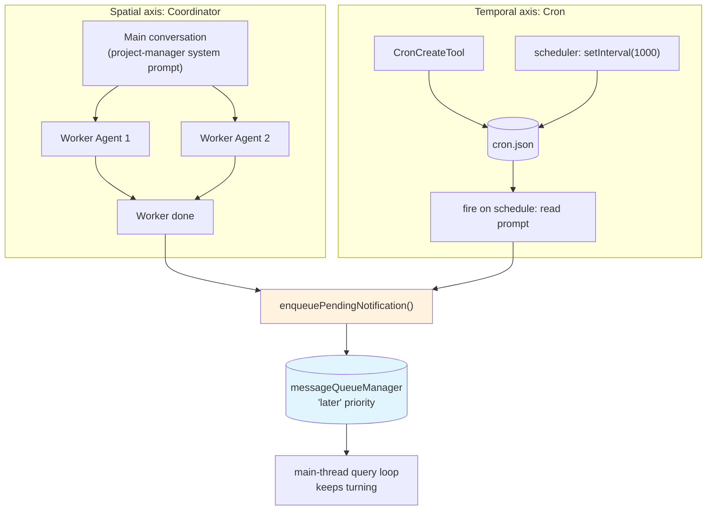

# Chapter 17: Coordinator, Cron, and scheduled execution (定时调度) — keeping the session moving when nobody is pressing Enter

> This is Chapter 17 of *Deep Dive into Claude Code Source*. The last few chapters all asked the same question from one side: how does the model get a task done inside a single conversation? This one flips the angle: **if nobody is watching the REPL, can the work still move forward?**

The answer hides in two pieces of code that look unrelated but in fact prop each other up:

- `coordinator/` — turns the main conversation into a "project manager with workers";
- `tools/ScheduleCronTool/` + `utils/cronScheduler.ts` + `hooks/useScheduledTasks.ts` — let a prompt wake the session up five minutes from now, half an hour from now, or at 9:17 tomorrow morning.

We first explain why these two pieces live in the same chapter, then unpack them in turn, and finally come back to the question in the introduction.

---

## Big picture: Coordinator and Cron converge on the same entrypoint



---

## 1. Why are these in the same chapter?

> This section explains the motivation for the merge; specific source locations are in §2 (`coordinator/coordinatorMode.ts`) and §3, §4 (`tools/ScheduleCronTool/`, `utils/cronScheduler.ts`, `hooks/useScheduledTasks.ts`).

Coordinator looks like "multi-agent orchestration (编排)". Cron looks like "scheduled task scheduling". On the surface they are two different topics.

But once you read both pieces of code side by side, it becomes clear they solve the same problem: **how to make Claude Code produce its own next turn (回合) when nobody is pressing Enter**.

- Coordinator solves the **next turn in space**: the main thread is no longer doing the work itself, but workers it dispatched are off running in parallel.
- Cron solves the **next turn in time**: the session is idle right now, but ten minutes from now the scheduler will read a prompt off disk, stuff it back into the main loop, and let the model continue as if a user had just hit Enter.

The two surfaces expose their tools through different registries (`AgentTool` / `TaskStopTool` vs `CronCreate` / `CronDelete` / `CronList`), but they **break into the conversation loop at exactly the same point**: both go through `enqueuePendingNotification()`, both use the `'later'` priority on `messageQueueManager`, and both behave like "a user message coming in from the background" cutting into the query loop.

Once you see this, the `pendingMessages` / `pendingNotification` APIs that kept showing up in Chapter 14 (Agent) and Chapter 16 (task model) stop being mere internal details of the Agent system and reveal themselves as the unified entrypoint this CLI has reserved for the "unattended" dimension.

This chapter follows that thread: first we look at how Coordinator rewrites a regular conversation into a project manager; then how the Cron tool family lands "a prompt + a cron expression" onto disk; finally how the scheduler stuffs each due task back into the main loop on every tick.

---

## 2. Coordinator mode: the main conversation stops doing the work itself

Open `coordinator/coordinatorMode.ts`. The first thing worth looking at is not the system prompt — it is the entry check:

```typescript
// coordinator/coordinatorMode.ts:36-41
export function isCoordinatorMode(): boolean {
  if (feature('COORDINATOR_MODE')) {
    return isEnvTruthy(process.env.CLAUDE_CODE_COORDINATOR_MODE)
  }
  return false
}
```

Two gates closed in sequence. The first is `feature('COORDINATOR_MODE')`, the compile-time switch — per the DCE (Dead Code Elimination) mechanism covered in Chapter 22, this whole block is stripped out of external builds without leaving a byte behind. Only after that does the runtime env truthy check kick in.

Why two gates? Coordinator mode is not the default behavior for every user. It strips away the Read / Write / Edit / Bash tools the model normally holds and swaps in a completely different toolset. If an external user stumbled into it by accident, the experience would feel like "Claude suddenly forgot how to edit files". External builds would rather not have this code exist at all than have it exist and be merely off by default.

### 2.1 Issuing yourself a new ID card

Once Coordinator mode is on, the first thing the main conversation does is swap the system prompt. The original "you are an AI helping the user write code" is replaced with a long passage that reads like a project-manager job description. The source is `getCoordinatorSystemPrompt()` at `coordinator/coordinatorMode.ts:111-369`. The bullets it hammers on repeatedly:

- your role is to dispatch work to workers, not to make code changes yourself;
- the tools you have are only `AgentTool` (dispatch a worker), `SendMessage` (send a follow-up instruction to an in-flight worker), and `TaskStopTool` (kill a worker that has gone off the rails);
- never write "based on your findings" — you must read the worker's research output, distill it into a concrete next-step instruction, instead of letting the downstream model guess what you wanted;
- a task walks Research → Synthesis → Implementation → Verification in four steps, and at each step you decide Continue (carry on with the same worker) or Spawn Fresh (cut a clean worker with a fresh slice of context).

Why so verbose? Because Coordinator has no ready-made "project manager intuition" to draw on. The model in a normal conversation is trained with a very strong preference to "just do it": it sees a bug and instinctively wants to Read the source, Edit a line, and try. In Coordinator mode that path is closed off — it has to convert the instinct into "dispatch a worker to go Read this", and write a prompt specific enough that the worker can actually get to work. The point of this system prompt is precisely to use words to override the model's default action again and again.

### 2.2 Which toolset does the worker get?

Now turn to the worker side. `coordinator/coordinatorMode.ts` defines a set named `INTERNAL_WORKER_TOOLS`:

```typescript
// coordinator/coordinatorMode.ts:29-34
const INTERNAL_WORKER_TOOLS = new Set([
  'TeamCreate',
  'TeamDelete',
  'SendMessage',
  'SyntheticOutput',
])
```

These are tools the Coordinator orchestration layer uses for itself; workers never receive them. The worker's toolset = full tool table − this internal set, with an additional env-variable filter on top: when `CLAUDE_CODE_SIMPLE` is set to truthy, the worker's toolset is squeezed down further to just `Bash / Read / Edit`, with even Glob / Grep removed.

The motivation for this extra trim makes sense the moment you remember the discussion of REPL mode in the previous chapter (eight high-frequency tools hidden inside a REPL VM): the worker does not need ToolSearch, does not need deferred tools like LSPTool — it only needs enough to "read a chunk, edit a chunk, run a chunk". The narrower the toolset the worker sees, the fewer tokens the prompt surface burns, and the cheaper each spawn becomes. Coordinator mode happens to spawn workers very often (a single engineering task may dispatch 4–5), and these token savings add up to a noticeable difference over a session.

### 2.3 What Coordinator really is

Putting it all together, Coordinator is not "a new conversation type" — it is a **double reskin of toolset and system prompt**:

- toolset: from "tools that do work" to "tools that dispatch work";
- system prompt: from "you are an AI" to "you are a project manager";
- the conversation loop itself: **unchanged** — still the same `query()` main loop from C05, the same TaskState registry from C16, the same hooks from C20.

This "kernel unchanged, outer layer reskinned" design is everywhere in the source. In the Cron section you will see a structurally identical decision: the Cron system also does not invent a new query loop; it just stuffs messages into the existing one. The same kernel reused by two different outer layers is a remarkably stable strand of engineering aesthetics in the Claude Code source.

---

## 3. ScheduleCronTool: turning "run this prompt half an hour from now" into a tool

Coordinator solved the "don't make the user press Enter at every step" problem, but it still requires **someone or some upstream process to be talking to the model**. If you want Claude Code to wake itself up at 3 a.m. and run a quality check, or auto-check CI results in 5 minutes, Coordinator alone is not enough — you need a real timer.

The directory `tools/ScheduleCronTool/` does not contain an entry file named `ScheduleCronTool.ts`. It is a family of leaf tools: `CronCreateTool` / `CronDeleteTool` / `CronListTool`. Chapter 10 covered the relationship between family tools and leaf tools — the family surfaces only its name in `<available-deferred-tools>`, and the three leaves are exposed to the model by the family tool itself with their schemas. Cron follows exactly this pattern.

### 3.1 The three leaf tools and where they draw the line

Each leaf has its own job, but it is not a plain CRUD split. The `validateInput()` of `CronCreateTool` is the heaviest of the three: it parses the cron expression, computes whether "the next firing time falls within a year", checks whether 50 cron tasks have already been registered, and blocks one special out-of-bounds case:

```typescript
// tools/ScheduleCronTool/CronCreateTool.ts:25
const MAX_JOBS = 50

// tools/ScheduleCronTool/CronCreateTool.ts:105-113
if (input.durable && context?.agentId) {
  return {
    result: false,
    errorCode: 4,
    message:
      'Teammates cannot create durable cron tasks. ' +
      'Set durable: false to keep this task session-only.',
  }
}
```

The last rule deserves another sentence. `CronCreateTool`'s schema defaults `durable` to false: a cron created by default is session-only, lives only in memory, and disappears when the current REPL exits. To survive across sessions you have to pass `durable: true` explicitly, and only then does the task get written into `.claude/scheduled_tasks.json`. But a teammate (the in-process teammate, the kind of agent covered in C16) is hard-banned from creating durable cron tasks, with error code 4.

The reason is on the execution side: a teammate is a session-scoped object whose identity is only valid inside its parent session. The moment its cron survives across sessions, the original teammate is gone by the time the cron fires, and the cron becomes a homeless orphan. The source chose "do not allow it to come into existence" instead of "allow it to come into existence and then clean up the orphans" — the former is cheap, the latter would require maintaining extra dependency tracking down at the scheduler layer.

`CronDeleteTool` looks the simplest, but it carries a permission check: a teammate can only delete cron tasks it created itself, with error code 2. This is textbook least-privilege in multi-agent collaboration — we do not want Agent A to delete reminders that Agent B had carefully queued.

`CronListTool` gives asymmetric visibility: a teammate calling List can only see its own cron tasks; the main conversation (with no `agentId`) calling List can see every cron in the project. It also sets two flags to true:

```typescript
// tools/ScheduleCronTool/CronListTool.ts:51-55
isReadOnly(): boolean {
  return true
},
isConcurrencySafe(): boolean {
  return true
},
```

These two switches mean: the model can safely run CronList concurrently in the same turn with other read-only tools (Read / Grep / other lists) without serializing — in mixed troubleshooting scenarios like "look at the cron jobs and the current file state at the same time" you save a round trip. Neither `CronCreateTool` nor `CronDeleteTool` carries these flags; write operations must run serially.

### 3.2 jitter: never fire exactly on the hour

The easiest section to overlook when reading the cron system is the jitter configuration — and this configuration can be pushed remotely through GrowthBook: `getCronJitterConfig()` defined at `utils/cronJitterConfig.ts:24` validates the `tengu_kairos_cron_config` feature payload with Zod, falling back to the hard-coded defaults in `utils/cronTasks.ts` on validation failure (in the same file, `JITTER_CONFIG_REFRESH_MS = 60 * 1000` controls the 1-minute refresh, and `utils/cronJitterConfig.ts:67` does defense-in-depth boundary clamping):

```typescript
// utils/cronTasks.ts (DEFAULT_CRON_JITTER_CONFIG excerpt)
recurringFrac: 0.1,             // random offset fraction for recurring tasks
recurringCapMs: 15 * 60 * 1000, // offset upper bound: 15 minutes
oneShotMaxMs: 90 * 1000,        // one-shot tasks may borrow at most 90s forward
oneShotMinuteMod: 30,           // avoid hitting the top / bottom of the hour
recurringMaxAgeMs: 7 * 24 * 60 * 60 * 1000, // expire after 7 days
```

The plain but easily-missed engineering concern behind these numbers: if a thousand users all wrote `0 9 * * *` (run every day at 9 a.m.), then at 9:00:00 sharp Anthropic's API will be hit by a thousand requests simultaneously — a textbook thundering herd. The Cron tool already reminds the model in its prompt to "avoid :00 and :30 where possible", but the cron expression the model produces for the user is ultimately out of its control. So the system provides a backstop at the execution layer: each next firing of a recurring task is pushed back by a random amount equal to 10% of "how long until the next firing would otherwise be", capped at 15 minutes.

One-shot jitter follows a different logic — **borrowing time forward**, by up to 90 seconds, but with a 30-minute minimum step. The logic is a bit twisty but lines up with the prompt line "try to avoid the hour mark": the source does not trust users and models to space themselves out voluntarily.

One more detail worth remembering: `jitterFrac`, which produces a random number in `[0, 1)`, does not use `Math.random()`. Instead it takes the first 8 hex chars of the cron task's ID and divides by `0x100000000`. This means every time the same task computes jitter it gets the same random distribution — after reloading `scheduled_tasks.json` the next firing time of a task is stable, which makes debugging easier; users restoring across sessions do not get the jarring feeling of "today's reminder fires at a different time than yesterday's".

### 3.3 Cron expression parser: a restrained implementation

The hand-written 5-field cron parser at `utils/cron.ts` runs to 308 lines. Compared to a mature library like `cron-parser` it **deliberately gives up several features**:

- no L (last day of month) / W (weekday closest to) / ? (don't specify one of dayOfMonth/dayOfWeek);
- no `MON-FRI` / `JAN-DEC` name aliases;
- no 6-field (with seconds) or 7-field (with year) format;
- accepts only combinations of `*`, N, N-M, N-M/S, `*/N`.

Why a parser this restrained? Because the Cron tool is meant for the model, not for an operator who has written vixie-cron. 95% of the cron expressions the model has ever seen fall into these few syntaxes; the leftover L / W / name aliases belong to "few people use them well, many people use them wrong". Giving up a handful of syntaxes in exchange for an implementation that fits whole in 308 lines and can be read by a reviewer in one sitting is a reasonable trade.

Worth a note: `computeNextCronRun()` does not compute the next match analytically — it **walks forward minute by minute** from the current time, up to 366 days, checking at each step whether month / day / hour / minute all match. This "walk it through" approach trades a touch of CPU for correctness — particularly for DST edge cases. Computing analytically gets these wrong easily (spring forward skips 2–3 a.m., fall back repeats 1–2 a.m.), while a per-minute walk naturally handles these boundaries. The source comments spell out the semantics: a fixed-hour cron on the spring-forward day is naturally skipped (that hour does not exist in local time), and on the fall-back day it fires only once — exactly vixie-cron's standard semantics.

### 3.4 OR or AND: day-of-month versus day-of-week

Cron expressions have one detail 99% of users get wrong: when `dayOfMonth` and `dayOfWeek` are both specified (neither is `*`), matching either one counts as a match. This is the semantics vixie-cron has carried for decades, but it is completely counterintuitive — most people expect "AND". The source spells it out plainly:

```typescript
// utils/cron.ts:151-158
const dayMatches =
  domWild && dowWild ? true
  : domWild ? dowSet.has(dow)
  : dowWild ? domSet.has(dom)
  : domSet.has(dom) || dowSet.has(dow)
```

The OR semantics are written out explicitly — `domSet.has(dom) || dowSet.has(dow)`. Edge-case semantics like this, if not documented in the source with a comment and a unit test, will tempt the next maintainer to "fix this bug". Claude Code's approach is to accept the semantics, and nail down the name "vixie-cron" in the source comment — anyone who wants to change this line will first have to read up on vixie-cron's history.

---

## 4. scheduler: the little heart that ticks once a second

`utils/cronScheduler.ts` is the real engine of the cron system. In 565 lines it crams in: the tick loop, file watching, lock cooperation, jitter computation, missed-task detection, aged-out handling, teammate routing. Start with a few core constants:

```typescript
// utils/cronScheduler.ts:40-44
const CHECK_INTERVAL_MS = 1000      // check every second
const FILE_STABILITY_MS = 300       // a file is "settled" 300ms after the last change
const LOCK_PROBE_INTERVAL_MS = 5000 // probe the lock every 5 seconds
```

Ticking once a second sounds crude, but on an idle REPL `setInterval(1000)` brings no measurable overhead. `FILE_STABILITY_MS = 300` is the "how long after a change counts as settled" window chokidar uses when watching `scheduled_tasks.json` — it avoids one save triggering two reloads (write + truncate + write). `LOCK_PROBE_INTERVAL_MS = 5000` is for the scenario where "another session is waiting": when this session cannot acquire the scheduler lock, it retries every 5 seconds. Five seconds is a compromise that feels like "ownership transfer is fast" to the user without turning PID liveness checks into high-frequency polling.

### 4.1 The lock: only one scheduler per project

Open `utils/cronTasksLock.ts` and you find an implementation structurally identical to `computerUseLock.ts` — this is a "single-tenant lock" pattern reused several times in Claude Code:

```typescript
// utils/cronTasksLock.ts:23-32
const schedulerLockSchema = lazySchema(() =>
  z.object({
    sessionId: z.string(),
    pid: z.number(),
    acquiredAt: z.number(),
  }),
)
```

The lock file lives at `.claude/scheduled_tasks.lock` and contains `{sessionId, pid, acquiredAt}`. Acquisition uses O_EXCL atomic create (`writeFile(..., { flag: 'wx' })`) — a failure can only mean the file already exists. Then it handles three cases:

1. If the file's sessionId is our own, this is the same session re-acquiring the lock (e.g. `--resume`); return true and refresh the pid to the current process's new pid.
2. If the file's pid is still alive (`isProcessRunning(pid)`), another live session holds it; return false.
3. If the file's pid is dead, that is a stale lock; unlink and retry the atomic create.

These three steps — "fail + probe + rescue" — are both correct (only one wins when multiple sessions race to rescue a stale lock) and simple (no distributed coordination required).

Why does the cron system need a lock like this? Because the same project directory may have two, three, or more REPLs open at the same time. If every REPL ran its own scheduler, the same cron task would fire several times. The lock makes "scheduling" happen exactly once per project — other sessions can still create / delete / list cron tasks (writing files needs no lock), but only the lock-holding session is responsible for delivering tasks back into each respective main loop.

`registerCleanup()` plugs in the last piece — "what happens to the lock if the process dies": after every successful acquisition we register a cleanup callback that unlinks the lock file on normal exit. Even on abnormal exit (kill -9) the next session's startup will rescue the stale lock through the PID liveness check — a belt-and-suspenders arrangement.

### 4.2 What happens in one tick

Once the scheduler has the lock, what it does each second falls into three steps.

**Step one** is "what tasks are in memory". File-backed tasks are loaded by chokidar calling `load()` whenever `scheduled_tasks.json` changes, refreshing disk contents into the in-memory `tasks` array; the scheduler's per-second tick only reads this memory and does not stat the file every second. Session-only tasks are re-fetched from `bootstrap/state` via `getSessionCronTasks()` on every tick — they have no file events, so the tick has to re-read them. This is a hybrid of "event-driven file + periodic in-memory read": even if chokidar misses an event in an environment where inotify is unreliable (NFS, Docker volumes), the only consequence is that newly added cron tasks become visible at the next file event; tasks already in memory keep walking second by second.

**Step two** is computing each task's `nextFireAt` and comparing to `Date.now()`. The anchor for `nextFireAt` is `lastFiredAt ?? createdAt` — a new task starts counting from its "creation moment", an already-fired task from its "last firing moment". This choice avoids a subtle drift: if `Date.now()` were the anchor, every tick would push the next firing back by one second, and long-running operation would accumulate visible drift.

**Step three** is "fire when due". There is no standalone `fireCronTask()` function — calling this out separately because a reader coming in with the "scheduling system" intuition naturally expects an entrypoint called `fireCronTask()`, only to fail to find it in the source. Claude Code writes the firing logic right next to where it lives, inside the `process()` closure of `check()` inside `createCronScheduler()`, so `process()` can directly close over `onFireTask` / `onFire` / `markCronTasksFired` callbacks without threading them through extra parameters:

```typescript
// utils/cronScheduler.ts:293-297 (excerpt)
if (onFireTask) {
  await onFireTask(t)        // useScheduledTasks takes this path
} else {
  await onFire(t.prompt)     // fallback: hand over just the prompt
}
```

When `now >= next`, `onFireTask(task)` is preferred, handing the full CronTask up to the upper layer; when that callback is absent we fall back to `onFire(t.prompt)`. Immediately afterwards, for a recurring task, the next `nextFireAt` is computed — starting from `now` rather than the "would-be next" (`cronScheduler.ts:315-321`). This choice means a session that has been offline for a long time wakes up and **catches up only once**, rather than replaying every missed firing accumulated over the past hours; meanwhile `lastFiredAt = now` is batched back to disk via `markCronTasksFired()` (`cronScheduler.ts:358-369`), so the next first-sight startup of the process can rebuild the same `nextFireAt` from the same anchor.

### 4.3 missed task: how to make up at startup

The scheduler also has to answer another question: if a cron task is set to "run at 3 p.m." but you shut your laptop at 2 p.m. and only reopen the session at 5 p.m., does the task still run?

The source handles it like this: **only on the scheduler's first launch (initial load), make up overdue one-shot tasks as "missed"**. `load(initial)` only computes `findMissedTasks()` when `initial === true`, and explicitly `filter(t => !t.recurring && ...)` to exclude recurring tasks (`utils/cronScheduler.ts:184-197`).

Recurring tasks do not go through the missed channel on initial load. Instead the subsequent tick's `check()` computes their `nextFireAt` from `lastFiredAt ?? createdAt`: if that anchor is already a full cycle (or several) behind `now`, the first tick fires once, then computes the next `nextFireAt` from `now` — meaning no matter how long you have been offline, only one make-up fire occurs, not many. This strategy aligns with how vixie-cron treats `anacron` — neither lose one-shot tasks, nor fire a recurring task several times because you missed a few hours.

Recurring tasks also have another life-cycle gate:

```typescript
// utils/cronScheduler.ts:53-60
function isRecurringTaskAged(t: CronTask, nowMs: number, maxAgeMs: number): boolean {
  if (!t.recurring) return false
  if (t.permanent) return false
  if (maxAgeMs === 0) return false
  return nowMs - t.createdAt >= maxAgeMs
}
```

`recurringMaxAgeMs = 7 * 24 * 60 * 60 * 1000`, that is 7 days. The decision looks at `nowMs - t.createdAt`, which is unrelated to "whether the task actually fired during those 7 days" — a recurring task that has been firing steadily dozens of times over 7 days is still judged aged. An aged task **fires one last time** the next time it is due and is then removed from disk; built-in tasks marked `permanent: true` and the case `recurringMaxAgeMs === 0` are exempted entirely. This decision answers the long tail of "I set up a daily CI reminder, but six months later I do not need it anymore" — we do not want `.claude/scheduled_tasks.json` to pile up dozens of long-forgotten recurring tasks that keep running forever.

### 4.4 buildMissedTaskNotification: the small craft of wrapping a prompt

When making up missed tasks there is another detail worth borrowing. The original prompt was written by the user and may contain Markdown fences or special characters. Stuffing it directly back into the query loop may not only confuse the parsing of the `<task-notification>` XML tag, but also open the door to attacks where "I embed a fake system message inside my cron prompt".

`buildMissedTaskNotification()` handles this by **wrapping the whole prompt in a backtick fence long enough to contain it** — the fence length is determined by "the longest run of backticks in the prompt + 1", so no matter how many backticks the prompt uses, the fence closes correctly. This is the standard practice for safe Markdown nesting, but it is easily overlooked in the cron-notification context, and the source's handling here is worth remembering.

---

## 5. useScheduledTasks: the last mile between scheduler and REPL

By now the scheduler has pushed the task all the way to "should fire", but **how exactly does the firing message get back to the model?** This last mile runs through `hooks/useScheduledTasks.ts` — a React hook that embeds the scheduler into the REPL's lifecycle.

What this hook does looks simple: at component mount it calls `createCronScheduler()`, wires schedule fire events into the REPL's enqueue path, and calls cleanup at unmount. But several details inside are worth pulling apart.

**The ref closure trap**. `isLoadingRef` is a ref rather than a plain closure variable: with a plain variable, the `isLoading` captured at the first render would be closed over inside the scheduler callback — after `isLoading` changes later, the scheduler still sees the original value. This is an old React pitfall; the solution is a ref.

**Routing by agentId**. The fire-event callback has to determine whether this cron was created by the main conversation or by a teammate:

```typescript
// hooks/useScheduledTasks.ts:91-108 (excerpt)
if (task.agentId) {
  const teammate = getTeammate(task.agentId)
  if (!teammate) {
    // orphan: the teammate is no longer around
    await removeCronTasks([task.id])
    return
  }
  enqueueForTeammate(teammate, task.prompt)
} else {
  enqueuePendingNotification({ /* ... WORKLOAD_CRON ... */ })
}
```

A cron created by the main conversation goes straight to `enqueuePendingNotification()` and onto the main queue; a cron created by a teammate goes to that teammate's own mailbox. If the teammate is gone (killed by the user, or the parent session closed), the cron task is an orphan, and the hook just calls `removeCronTasks([task.id])` to clean up.

Note that teammate cron is already barred from `durable` at the creation end (`CronCreateTool.ts:105-113`), and `agentId` is explicitly marked runtime-only, never written to disk (`utils/cronTasks.ts:64-69`). So this cleanup acts on the session store, not on the on-disk `.claude/scheduled_tasks.json`. This pairs with the "teammate-no-durable" rule mentioned in §3.1: the creation end forbids persisting to disk, the execution end cleans up the session store — both ends close the door on the state "orphan cron survives across sessions".

**The WORKLOAD_CRON tag**. The `workload: WORKLOAD_CRON` field shows up in the notification metadata that cuts into the query loop and is eventually shipped to the Anthropic backend via an HTTP header. You can trace the chain in the source from end to end: `utils/workloadContext.ts:26` defines the constant `WORKLOAD_CRON: Workload = 'cron'` and wraps `runWithWorkload()` around `AsyncLocalStorage`; `utils/handlePromptSubmit.ts:457-472` uses `runWithWorkload(turnWorkload, …)` to put the entire turn inside the ALS boundary; finally `constants/system.ts:83-91` reads `getCurrentWorkload()` while assembling the `x-anthropic-billing-header` and appends `cc_workload=${workload}`. So "cron-triggered requests are tagged as background tasks" is not folk wisdom — it has this three-step chain in the source as evidence. What QoS handling Anthropic's backend actually applies after receiving `cc_workload=cron` (deprioritize, throttle, separate billing bucket) is a server-side private policy; the source side can only confirm "this tag was sent".

**isMeta: true**. This flag makes the notification render as a "system message" in the UI, rather than masquerading as a user message. Without this flag, the user returning to the REPL would see a few "messages they never said" in the chat history — a very confusing experience.

---

## 6. Cron enablement: three gates and a layer of cache

Back to when the Cron tool family actually appears in the model's tool list:

```typescript
// tools/ScheduleCronTool/prompt.ts:36-45
export function isKairosCronEnabled(): boolean {
  if (!feature('AGENT_TRIGGERS')) return false
  if (isEnvTruthy(process.env.CLAUDE_CODE_DISABLE_CRON)) return false
  return getCachedGate('tengu_kairos_cron')
}
```

Three gates stacked together:

1. `feature('AGENT_TRIGGERS')` — the compile-time DCE gate; the whole block does not exist in external builds.
2. No `CLAUDE_CODE_DISABLE_CRON` env emergency brake — the user/admin's local kill switch.
3. The GrowthBook feature gate `tengu_kairos_cron` — the Anthropic backend's rollout knob.

`isDurableCronEnabled()` is an independent sub-switch (`tengu_kairos_cron_durable`), separately controlling "whether durable tasks are usable" — this layering lets Anthropic do fine-grained control in production: ship session-only cron to everyone for a while, confirm stability, then flip the durable switch.

GrowthBook's result is cached for 5 minutes (`KAIROS_CRON_REFRESH_MS = 5 * 60 * 1000`) and is not queried on every tool enumeration. So whether a tool is visible to the model is not a constant but the product of "compile-time feature flag × local env kill switch × the GrowthBook 5-minute-cached remote gate" — any of the three flipping causes the CronCreate / CronDelete / CronList family to vanish from `<available-deferred-tools>`.

`DEFAULT_MAX_AGE_DAYS = 7` is also called out in the prompt — telling the model that "recurring tasks auto-expire after 7 days untouched" so the model knows the boundary when helping users set long-term reminders. This little detail of "writing the life cycle into the prompt" keeps showing up across the tool family: the tool description the model sees has to say not only how to use a tool, but also when it will stop working.

---

## 7. Looking back: two lines converge on the same entrypoint

With both Coordinator and Cron unpacked, return to the question in the introduction — "why are they in the same chapter". The convergence point is one sentence: **both let the query loop keep turning when nobody is pressing Enter**.

Coordinator's way: the main thread becomes a project manager and the dispatched workers run their own independent query loops; when a worker finishes, the result comes back to the main thread's query loop through `enqueuePendingNotification()`, and the main-thread model continues reasoning about "who should be dispatched for what next".

Cron's way: at a moment when no model is running, the little heart `setInterval(1000)` produces the trigger for "the next turn", and the prompt is stuffed back into the main thread's query loop through the same `enqueuePendingNotification()`.

Both lines end at the `'later'` priority queue — the "coming from the background" entrypoint reserved by `messageQueueManager`. Chapter 16's discussion of the task-notification mechanism already covered this queue's three-tier priority (now / next / later); what you are seeing now is the full list of users of this mechanism: notifications from background tasks, triggers from cron, idle signals from teammates, completion reports from workers dispatched by Coordinator — they all walk through the same entrypoint.

This also answers why the Cron system's jitter config is so detailed. If cron triggers raced with user input on the same `'now'` priority, the thunderstorm at the hour mark would slam straight into the user experience. The point of the `'later'` priority is precisely: user input is always processed first; the background can wait. Cron's jitter + the `'later'` priority + the QoS classification of WORKLOAD_CRON together form a quite restrained engineering pledge: "background tasks must not disturb the foreground".

---

## 8. Transferable design patterns

After reading both Coordinator and Cron, several design trade-offs are worth pulling out and reusing elsewhere.

### Pattern 1: lock file + PID liveness for rescuing stale locks

`utils/cronTasksLock.ts` and its "O_EXCL atomic create + sessionId reuse + PID liveness rescue" make a tiny textbook on single-machine multi-process coordination:

- atomic create guarantees "only one winner at any moment";
- the sessionId field allows the same session to re-enter (mandatory for `--resume`);
- the PID liveness check rescues stale locks left behind by abnormal exits;
- `registerCleanup()` handles normal exits.

These four pieces together are both correct and simple — no Redis, no etcd, no distributed coordination component needed.

**When to use**: any "only one instance per machine" background daemon — file indexer, local cache reaper, scheduled uploader. As long as your coordination scope does not span machines, this pattern is lighter than any distributed lock. Note: in systems where PIDs are reused quickly (especially inside containers), PID liveness has a small theoretical window; you can stack a `starttime` check on top as a backstop.

### Pattern 2: event-driven + periodic-fallback hybrid scheduler

`utils/cronScheduler.ts` neither went pure event-driven (chokidar watch + reload immediately) nor pure polling (stat the file every second). It is:

- chokidar event-driven for "additions / changes to file-backed tasks" — near-real-time but allowed to drop;
- per-second tick that does not do file I/O but **reads the already-in-memory tasks** to compute `nextFireAt` — cheap and steady;
- session-only tasks re-fetched on each tick — the fallback for cases with no file events to rely on.

Event-driven handles freshness; periodic ticks handle firing on time and dropped-event fallback. Their responsibilities are distinct; a failure in either does not paralyze the whole system.

**When to use**: any scenario that "needs to respond to external state changes but cannot rely on events being delivered 100%" — config hot reload, external message queue consumption, file-system watching. NFS, Docker volumes, network mounts, cross-platform compatibility — environments where inotify drops events are everyday. A hybrid of "event-driven + periodic reconcile" is almost always steadier than either alone.

### Pattern 3: three-gate tool family + 5-minute cached remote gate

The "compile-time feature × local env × remote gate" stack on the Cron tool family is the general pattern for every gatable tool in Claude Code. Each gate has its own failure mode and flip cost:

- compile-time `feature` is invisible — the block of code is gone from external builds; use it for "I do not want this code to even ship to user machines";
- local env is user-visible — use it for "turn it off temporarily on this machine";
- remote gate with 5-minute cache — use it for "rollout / emergency disable in production".

Add an independent sub-switch (`tengu_kairos_cron_durable`) and you can do clean progressive rollouts like "ship session-only first, ship durable later".

**When to use**: any feature that "is already in internal use but not yet ready to default-on for all users". The costs of each gate: compile-time feature requires a new release to change; local env takes a CLI restart; remote gate propagates network-wide within 5 minutes. Layering switches by response speed is much more flexible than a single switch.

### Pattern 4: using the prompt to repeatedly override the model's default action

Coordinator's system prompt writes rules like "never write 'based on your findings'" and "you must distill the worker's research into a concrete next-step instruction" several times. This is not redundancy; it is fighting the model's training preference — the model defaults to wanting to act directly, and to teach it to dispatch instead you have to use words to hold its defaults down. Chapter 15 §6 (adversarial prompt patterns) will dedicate a section to this "use the prompt to hold down the model's preferences repeatedly" design — the Verification Agent's "do not just PASS and walk away" and Coordinator's "do not act directly yourself" are two outputs of the same piece of engineering aesthetics.

**When to use**: any application that stuffs a general model into a specific role — customer-service bot, code-review assistant, SQL generator. If you find the model "cannot resist" doing something you do not want in a given scenario, do not rush to adjust the temperature or switch prompt framework — write the prohibition into the system prompt and emphasize it three times; this often beats any prompt-engineering technique.

---

## 9. Worked example: building a "morning CI check" with this chapter's pieces

> This section is a **practice walkthrough** that puts together the pieces from §1–§8, not new content. Going through this end-to-end flow after reading §1–§8 lets you check whether you have the main chain cron → scheduler → useScheduledTasks → Coordinator straight in your head.

Putting these pieces together, here is how Claude Code lands a real requirement: "every morning at 9:17, automatically check the CI status of main; if it failed, dispatch a worker in Coordinator mode to investigate".

1. The user tells Claude "please check my main branch CI every morning at 9:17". The model calls `CronCreate({ schedule: '17 9 * * *', prompt: 'Check the status of the latest CI run on the main branch. If it failed, analyze the cause.', durable: true })`.
2. `CronCreateTool` runs `validateInput()` — parses `17 9 * * *` successfully, computes the next firing time within 24 hours, current cron count is below 50, this is not a teammate call so durable is allowed. The task is written into `.claude/scheduled_tasks.json`.
3. At 9:17 the next morning, jitter pushes the actual firing time to 9:18:42 (within the random 0–15 minute interval). The scheduler's tick detects `now >= nextFireAt` and calls `onFireTask(task)`.
4. The `useScheduledTasks` hook sees `task.agentId` is empty (created by the main conversation), calls `enqueuePendingNotification()` with `workload: WORKLOAD_CRON` and `isMeta: true`.
5. If the main conversation happens to be doing something else, the notification enters the `'later'` priority queue; if idle, it goes straight into the next query loop. The model sees the prompt wrapped in a backtick fence and calls `Bash gh run list --branch main --limit 1` to check CI status.
6. Say CI failed. If the session has Coordinator mode on (`CLAUDE_CODE_COORDINATOR_MODE=1`), the model calls `AgentTool` to dispatch a Research Worker to pull the failed job's logs, then a Synthesis Worker to distill the logs into a root cause, and if needed an Implementation Worker to ship a fix PR directly. When workers finish, the result is sent back to the main conversation through the same `enqueuePendingNotification()`.
7. Seven days later (`recurringMaxAgeMs`), this cron is aged-out automatically — fires one last time and is removed from disk. If the user still needs it, just ask "please set one up" again.

There is no "spin up another daemon" anywhere in this flow — everything runs inside the same Claude Code session, on the little heart of the cron scheduler, the reskin of Coordinator, and the `'later'` cut-in entrypoint.

---

---

## Next chapter preview

[Chapter 18: MCP protocol implementation — the standardized bridge to external tools](./18-mcp-protocol-implementation.md)

We enter Part Five "protocols, security, and extension interfaces", starting from the 23 files in services/mcp/ to see how Claude Code uses 5 transports (stdio / SSE / HTTP / WebSocket / SDK) to talk to external tool servers.

---
*The full series is at https://github.com/luyao618/Claude-Code-Source-Study (a free star would be appreciated)*
