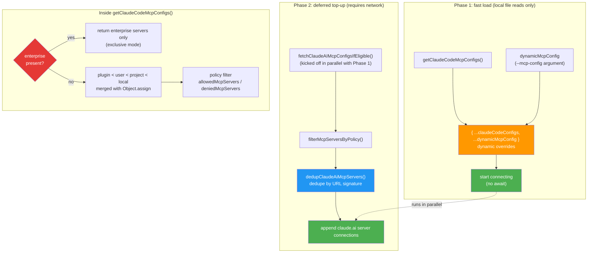
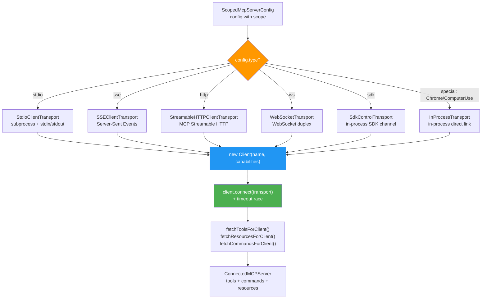

# Chapter 18: MCP Protocol Implementation — The Standardized Bridge to External Tools

> This is chapter 18 of *Deep Dive into Claude Code Source*. We will dissect how Claude Code implements the Model Context Protocol (MCP): type system design, multi-layer configuration merging, transport adaptation, connection lifecycle management, tool discovery and proxying, and the authentication stack.

## Why MCP?

Claude Code ships with 40+ built-in tools (`BashTool`, `FileEditTool`, `GlobTool`, …), enough to cover most programming scenarios. But real-world development goes far beyond that — you may need to query a Jira board, operate on Slack messages, call an internal API gateway, or hit GitHub Issues. None of these can be (or should be) baked into the core.

**Model Context Protocol (MCP)** is the answer. Proposed by Anthropic, it is an open standard that defines a communication protocol between AI applications (the Client) and external tools or data services (the Server). Think of MCP as the "USB port" of the AI world: as long as a service speaks MCP, Claude Code can discover and use the tools it exposes without changing a line of Claude Code itself.

Claude Code's MCP implementation is a complete client system that solves the following core problems:

1. **Type safety**: how do we precisely describe 8 server configuration shapes and 5 connection states with TypeScript + Zod?
2. **Multi-layer configuration**: how are configurations from many sources (local / user / project / plugin / dynamic / enterprise / claudeai) loaded, merged, and deduplicated in two phases?
3. **Transport adaptation**: how do six transports — stdio / SSE / HTTP / WebSocket / SDK / InProcess — share a single abstraction?
4. **Connection management**: how do we concurrently connect, recover from errors, and auto-reconnect across 30+ MCP servers?
5. **Tool proxying**: how do external MCP tools blend seamlessly into Claude Code's built-in tool system?
6. **Authentication**: how do OAuth and XAA (Cross-App Access) protect access to remote servers?

---

> **Chapter roadmap**: §1 type system → §2 two-phase configuration loading → §3 six transports → §4 concurrent connection scheduling → §5 tool discovery and proxying → §6 connection lifecycle and reconnection → §7 OAuth / XAA authentication → §8 the MCP extension for agents → §9 the React-layer `MCPConnectionManager` → §10 portable patterns. §1–§3 cover "protocol landing", §4–§6 cover "connection management", and §7–§9 cover "authentication and upper-layer integration".

## 1. Type System Design: Modeling Everything in MCP Precisely

The MCP type definitions live in `services/mcp/types.ts` (258 lines). This file is the **data contract layer** for the entire MCP subsystem.

### 1.1 Configuration scopes and transport types

We start with two core enums:

```typescript
// services/mcp/types.ts:10-26
export const ConfigScopeSchema = lazySchema(() =>
  z.enum([
    'local',      // .claude/settings.local.json
    'user',       // ~/.claude/settings.json
    'project',    // .mcp.json (walked upward from CWD)
    'dynamic',    // injected at runtime (--mcp-config)
    'enterprise', // managed-mcp.json (enterprise-managed)
    'claudeai',   // claude.ai connectors
    'managed',    // enterprise managed settings
  ]),
)

export const TransportSchema = lazySchema(() =>
  z.enum(['stdio', 'sse', 'sse-ide', 'http', 'ws', 'sdk']),
)
```

`ConfigScope` lists the 7 layers a configuration may come from. `TransportSchema` enumerates 6 publicly exposed transport literals (`stdio | sse | sse-ide | http | ws | sdk`), but the `McpServerConfigSchema` union actually supports 8 server-config shapes — it additionally covers the internal `ws-ide` (IDE WebSocket) and `claudeai-proxy` (claude.ai proxy) types. In other words, `Transport` and "connectable server-config types" are not one-to-one; the latter is a superset of the former. Notice the use of `lazySchema()` to wrap the Zod schemas — schema construction is deferred for startup performance.

### 1.2 A precise schema for each transport

Every transport has its own Zod schema that captures exactly the fields it needs:

```typescript
// services/mcp/types.ts:28-113 (abridged)
// stdio: local process
export const McpStdioServerConfigSchema = lazySchema(() =>
  z.object({
    type: z.literal('stdio').optional(), // optional for backward compatibility
    command: z.string().min(1, 'Command cannot be empty'),
    args: z.array(z.string()).default([]),
    env: z.record(z.string(), z.string()).optional(),
  }),
)

// SSE: Server-Sent Events (remote)
export const McpSSEServerConfigSchema = lazySchema(() =>
  z.object({
    type: z.literal('sse'),
    url: z.string(),
    headers: z.record(z.string(), z.string()).optional(),
    headersHelper: z.string().optional(),  // dynamic header script
    oauth: McpOAuthConfigSchema().optional(),
  }),
)

// HTTP: Streamable HTTP (recommended by MCP spec 2025-03-26)
export const McpHTTPServerConfigSchema = lazySchema(() =>
  z.object({
    type: z.literal('http'),
    url: z.string(),
    headers: z.record(z.string(), z.string()).optional(),
    headersHelper: z.string().optional(),
    oauth: McpOAuthConfigSchema().optional(),
  }),
)

// SDK: in-process SDK transport (used by Agent SDK)
export const McpSdkServerConfigSchema = lazySchema(() =>
  z.object({
    type: z.literal('sdk'),
    name: z.string(),
  }),
)
```

Finally, every configuration is unified through a union type:

```typescript
// services/mcp/types.ts:124-135
export const McpServerConfigSchema = lazySchema(() =>
  z.union([
    McpStdioServerConfigSchema(),
    McpSSEServerConfigSchema(),
    McpSSEIDEServerConfigSchema(),
    McpWebSocketIDEServerConfigSchema(),
    McpHTTPServerConfigSchema(),
    McpWebSocketServerConfigSchema(),
    McpSdkServerConfigSchema(),
    McpClaudeAIProxyServerConfigSchema(),
  ]),
)
```

### 1.3 Connection state: an algebraic data type

A server connection has 5 states, modeled precisely as a TypeScript discriminated union:

```typescript
// services/mcp/types.ts:180-227
export type ConnectedMCPServer = {
  client: Client           // MCP SDK client instance
  name: string
  type: 'connected'
  capabilities: ServerCapabilities
  serverInfo?: { name: string; version: string }
  instructions?: string    // usage guide provided by the server
  config: ScopedMcpServerConfig
  cleanup: () => Promise<void>  // cleanup function
}

export type FailedMCPServer = {
  name: string; type: 'failed'; config: ScopedMcpServerConfig; error?: string
}

export type NeedsAuthMCPServer = {
  name: string; type: 'needs-auth'; config: ScopedMcpServerConfig
}

export type PendingMCPServer = {
  name: string; type: 'pending'; config: ScopedMcpServerConfig
  reconnectAttempt?: number; maxReconnectAttempts?: number
}

export type DisabledMCPServer = {
  name: string; type: 'disabled'; config: ScopedMcpServerConfig
}

export type MCPServerConnection =
  | ConnectedMCPServer
  | FailedMCPServer
  | NeedsAuthMCPServer
  | PendingMCPServer
  | DisabledMCPServer
```

The benefit of a discriminated union is that anywhere `MCPServerConnection` is consumed, the TypeScript compiler forces you to discriminate on `type`, guaranteeing every state is handled.

---

## 2. Two-Phase Configuration Loading: Fast Startup + Deferred Top-Up

MCP's configuration sources are even more complex than Claude Code's settings system. `services/mcp/config.ts` (1578 lines) is responsible for collecting, validating, deduplicating, and merging MCP server configurations from many layers. But this merge is **not done by a single function in one shot** — it happens in two phases coordinated by multiple callers.

### 2.1 Two-phase architecture

The key to understanding MCP configuration is that **`getClaudeCodeMcpConfigs()` deliberately excludes claude.ai servers** (the comment reads: *"excludes claude.ai servers from the returned set — they're fetched separately and merged by callers"*). The claude.ai connectors require a network request, and putting them in the main function would drag down startup.

The actual loading flow happens inside the `useManageMCPConnections` hook in two phases:



```typescript
// services/mcp/useManageMCPConnections.ts:856-964 (abridged)
async function loadAndConnectMcpConfigs() {
  // Kick off the claude.ai fetch early so it runs in parallel with Phase 1
  const claudeaiPromise = fetchClaudeAIMcpConfigsIfEligible()

  // Phase 1: local file reads only — fast
  const { servers: claudeCodeConfigs } = isStrictMcpConfig
    ? { servers: {}, errors: [] }
    : await getClaudeCodeMcpConfigs(dynamicMcpConfig, claudeaiPromise)

  // dynamic overrides the Claude Code configs (highest priority)
  const configs = { ...claudeCodeConfigs, ...dynamicMcpConfig }

  // Start connecting; do not await (fire-and-forget)
  getMcpToolsCommandsAndResources(onConnectionAttempt, enabledConfigs)

  // Phase 2: wait for the claude.ai result
  const claudeaiConfigs = filterMcpServersByPolicy(await claudeaiPromise).allowed
  // Dedupe by URL signature; manual configs win over claude.ai connectors
  const { servers: dedupedClaudeAi } = dedupClaudeAiMcpServers(claudeaiConfigs, configs)
  // Append claude.ai server connections
  getMcpToolsCommandsAndResources(onConnectionAttempt, dedupedClaudeAi)
}
```

The core value of this two-phase design is **startup performance isolation**: Phase 1 only touches local files and usually finishes in a few milliseconds, while Phase 2's claude.ai fetch is a network request that may take hundreds of milliseconds or more — but it was already kicked off in parallel while Phase 1 ran.

Another important branch is the **`isStrictMcpConfig` mode**: when the caller (e.g. SDK print mode) sets the strict flag, all regular configuration loading is skipped and only the configs passed via `dynamicMcpConfig` remain. This is what the Agent SDK scenario needs — SDK consumers fully control which MCP servers are available.

### 2.2 Priority order inside `getClaudeCodeMcpConfigs()`

Inside `getClaudeCodeMcpConfigs()`, configurations are merged via `Object.assign` from lowest to highest priority:

```typescript
// services/mcp/config.ts:1231-1238
// plugin < user < project < local
const configs = Object.assign(
  {},
  dedupedPluginServers,    // lowest: plugin-provided servers
  userServers,             // ~/.claude/settings.json
  approvedProjectServers,  // .mcp.json (must pass approval)
  localServers,            // .claude/settings.local.json (highest)
)
```

The caller (`useManageMCPConnections`) then does `{ ...claudeCodeConfigs, ...dynamicMcpConfig }`, letting dynamic configs override all of the above. Finally, in Phase 2, the claude.ai connectors are merged as the **lowest priority** (`Object.assign({}, dedupedClaudeAi, claudeCodeServers)` — claude.ai goes in first and gets overridden).

The full priority order, lowest to highest, is:

| Priority | Source | Load phase |
|---|---|---|
| Lowest | claude.ai connectors | Phase 2 (network request) |
| ↓ | plugin servers | Phase 1 (cached read) |
| ↓ | user config | Phase 1 (local file) |
| ↓ | project config (requires approval) | Phase 1 (local file) |
| ↓ | local config | Phase 1 (local file) |
| Highest | dynamic (`--mcp-config`) | Phase 1 (caller override) |
| Exclusive | enterprise (`managed-mcp.json`) | exclusive mode, skips everything else |

### 2.3 Enterprise exclusive mode

When the enterprise configuration file (`managed-mcp.json`) is present, `getClaudeCodeMcpConfigs()` returns immediately and skips user/project/local/plugin loading. `getAllMcpConfigs()` also skips the claude.ai fetch:

```typescript
// services/mcp/config.ts:1082-1096
if (doesEnterpriseMcpConfigExist()) {
  const filtered: Record<string, ScopedMcpServerConfig> = {}
  for (const [name, serverConfig] of Object.entries(enterpriseServers)) {
    if (!isMcpServerAllowedByPolicy(name, serverConfig)) {
      continue
    }
    filtered[name] = serverConfig
  }
  return { servers: filtered, errors: [] }
}
```

Note that enterprise exclusive mode does not reject all external configs. SDK-typed servers (`type: 'sdk'`) are exempt from policy filtering — in `filterMcpServersByPolicy`, `c.type === 'sdk'` is let through directly — because SDK servers are placeholders for in-process transports. The CLI never spawns a process or opens a network connection for them, so a URL/command-based allowlist has no meaning.

### 2.4 Upward traversal for project configuration

Project-level `.mcp.json` has a special behavior: **starting from CWD, traverse upward to the filesystem root**, with configurations closer to CWD taking higher priority:

```typescript
// services/mcp/config.ts:913-955
case 'project': {
  const dirs: string[] = []
  let currentDir = getCwd()
  while (currentDir !== parse(currentDir).root) {
    dirs.push(currentDir)
    currentDir = dirname(currentDir)
  }
  // Process from the filesystem root down toward CWD so that
  // files closer to CWD override the more distant ones.
  for (const dir of dirs.reverse()) {
    const mcpJsonPath = join(dir, '.mcp.json')
    const { config, errors } = parseMcpConfigFromFilePath({
      filePath: mcpJsonPath, expandVars: true, scope: 'project',
    })
    if (config?.mcpServers) {
      Object.assign(allServers, addScopeToServers(config.mcpServers, scope))
    }
  }
}
```

This means a monorepo root can define shared MCP servers while subproject directories can override or extend them.

### 2.5 Plugin deduplication: signature-based content comparison

When multiple sources define MCP servers that point at the same underlying service (for example, the user manually configures a Slack MCP server while a plugin also provides one), smart deduplication is required.

The key is the **server signature** — not the name, but a unique identifier derived from the actual command or URL:

```typescript
// services/mcp/config.ts:202-212
export function getMcpServerSignature(config: McpServerConfig): string | null {
  const cmd = getServerCommandArray(config)
  if (cmd) {
    return `stdio:${jsonStringify(cmd)}`  // local process: signed by command + args
  }
  const url = getServerUrl(config)
  if (url) {
    return `url:${unwrapCcrProxyUrl(url)}`  // remote service: signed by URL
  }
  return null  // sdk type has no signature
}
```

Deduplication rules:
- **Manual config > plugin config**: a manually added server always wins.
- **First-come-first-served among plugins**: when multiple plugins provide the same server, the one loaded first wins.
- **Manual config > claude.ai connector**: a user's manual configuration expresses stronger intent.

### 2.6 Environment-variable expansion

MCP configuration supports `${VAR}` and `${VAR:-default}` syntax for environment-variable expansion:

```typescript
// services/mcp/envExpansion.ts:10-38
export function expandEnvVarsInString(value: string): {
  expanded: string; missingVars: string[]
} {
  const missingVars: string[] = []
  const expanded = value.replace(/\$\{([^}]+)\}/g, (match, varContent) => {
    const [varName, defaultValue] = varContent.split(':-', 2)
    const envValue = process.env[varName]
    if (envValue !== undefined) return envValue
    if (defaultValue !== undefined) return defaultValue
    missingVars.push(varName)
    return match  // keep the original text for easier debugging
  })
  return { expanded, missingVars }
}
```

This expansion is applied recursively to a stdio server's `command`, `args`, and `env`, and to a remote server's `url` and `headers`.

### 2.7 Enterprise policy filtering: allowlist and denylist

Enterprise administrators can control which MCP servers may be used via `allowedMcpServers` and `deniedMcpServers`. The policy supports three matching modes:

- **By name**: `{ serverName: "my-server" }`
- **By command**: `{ serverCommand: ["npx", "mcp-server-git"] }` (stdio only)
- **By URL glob**: `{ serverUrl: "https://*.example.com/*" }` (remote only)

```typescript
// services/mcp/config.ts:364-408
function isMcpServerDenied(serverName: string, config?: McpServerConfig): boolean {
  const settings = getMcpDenylistSettings()
  if (!settings.deniedMcpServers) return false

  // Match by name
  for (const entry of settings.deniedMcpServers) {
    if (isMcpServerNameEntry(entry) && entry.serverName === serverName) {
      return true
    }
  }
  // Match by command (stdio servers)
  // Match by URL glob (remote servers)
  // ...
}
```

**The denylist has absolute priority** — even if a server appears in the allowlist, a denylist match rejects it.

---

## 3. The Transport Layer: Six Ways to Connect, Unified

`services/mcp/client.ts` is the largest file in the MCP subsystem (3348 lines), and `connectToServer()` is at its core — it constructs the right transport for the given configuration type and then establishes the connection.

### 3.1 The full connection flow



### 3.2 stdio transport: the most common local MCP

stdio is the most-used transport — the MCP server runs as a subprocess and exchanges JSON-RPC messages through stdin/stdout:

```typescript
// services/mcp/client.ts:944-958
} else if (serverRef.type === 'stdio' || !serverRef.type) {
  const finalCommand =
    process.env.CLAUDE_CODE_SHELL_PREFIX || serverRef.command
  const finalArgs = process.env.CLAUDE_CODE_SHELL_PREFIX
    ? [[serverRef.command, ...serverRef.args].join(' ')]
    : serverRef.args
  transport = new StdioClientTransport({
    command: finalCommand,
    args: finalArgs,
    env: {
      ...subprocessEnv(),   // inherit environment variables
      ...serverRef.env,     // user-defined environment variables
    } as Record<string, string>,
    stderr: 'pipe',  // capture stderr so it does not pollute the terminal UI
  })
}
```

Notice the `stderr: 'pipe'` design — the MCP server's stderr output is captured and written to a debug log instead of being printed straight to the terminal, so it does not interfere with Claude Code's Ink UI.

### 3.3 HTTP transport: the recommendation in MCP spec 2025-03-26

HTTP transport (Streamable HTTP) is the remote transport recommended by the MCP specification. Claude Code's implementation has a clever `wrapFetchWithTimeout` wrapper that solves an AbortSignal memory leak:

```typescript
// services/mcp/client.ts:492-549
export function wrapFetchWithTimeout(baseFetch: FetchLike): FetchLike {
  return async (url: string | URL, init?: RequestInit) => {
    const method = (init?.method ?? 'GET').toUpperCase()
    // GET requests do not get a timeout — in MCP, GET is a long-lived SSE stream.
    if (method === 'GET') {
      return baseFetch(url, init)
    }
    // Use setTimeout rather than AbortSignal.timeout()
    // because on Bun the internal timer inside AbortSignal.timeout is not
    // released until GC, leaking ~2.4KB of native memory per request.
    const controller = new AbortController()
    const timer = setTimeout(
      c => c.abort(new DOMException('The operation timed out.', 'TimeoutError')),
      MCP_REQUEST_TIMEOUT_MS, // 60 seconds
      controller,
    )
    timer.unref?.()  // do not block Node.js from exiting
    // ... cleanup logic
  }
}
```

Two critical details here:
1. **GET requests are exempt from the timeout**: in MCP, GET requests are long-lived SSE streams and should not be cut off by the 60-second timeout.
2. **Manual `setTimeout` instead of `AbortSignal.timeout()`**: on the Bun runtime, `AbortSignal.timeout()` releases memory lazily, leaking roughly 2.4KB per request.

### 3.4 InProcess transport: avoiding a 325MB subprocess

For certain special built-in MCP servers (such as the Chrome MCP), Claude Code does not spawn a subprocess — it connects **inside the same process**:

```typescript
// services/mcp/InProcessTransport.ts:11-49
class InProcessTransport implements Transport {
  private peer: InProcessTransport | undefined
  private closed = false

  async send(message: JSONRPCMessage): Promise<void> {
    if (this.closed) throw new Error('Transport is closed')
    // Deliver to the peer asynchronously to avoid stack overflow
    // from synchronous request/response chains.
    queueMicrotask(() => {
      this.peer?.onmessage?.(message)
    })
  }

  async close(): Promise<void> {
    if (this.closed) return
    this.closed = true
    this.onclose?.()
    // Close the peer too
    if (this.peer && !this.peer.closed) {
      this.peer.closed = true
      this.peer.onclose?.()
    }
  }
}

// Create a paired pair of linked transport channels
export function createLinkedTransportPair(): [Transport, Transport] {
  const a = new InProcessTransport()
  const b = new InProcessTransport()
  a._setPeer(b)
  b._setPeer(a)
  return [a, b]
}
```

The usage is elegant — create a linked pair, hand one end to the client and the other to the server:

```typescript
// services/mcp/client.ts:910-924
const { createLinkedTransportPair } = await import('./InProcessTransport.js')
const context = createChromeContext(serverRef.env)
inProcessServer = createClaudeForChromeMcpServer(context)
const [clientTransport, serverTransport] = createLinkedTransportPair()
await inProcessServer.connect(serverTransport)
transport = clientTransport
```

A comment explains the reason: *"Run the Chrome MCP server in-process to avoid spawning a ~325 MB subprocess"*. This is a pragmatic optimization — launching a dedicated process for every MCP would be prohibitively expensive in memory.

### 3.5 `SdkControlTransport`: the cross-process SDK MCP bridge

The `sdk` server type does not use any of the transports above. Instead it uses the twin transports from `services/mcp/SdkControlTransport.ts` (136 lines): `SdkControlClientTransport` plays the MCP Client's peer inside the CLI process, while `SdkControlServerTransport` plays the MCP Server's peer inside the SDK process. The two ends exchange JSON-RPC frames through SDK control requests, and the control frame envelope carries `server_name` and `request_id` so that a single CLI can bridge multiple MCP servers embedded in the SDK without crosstalk.

It is more like InProcess transport's "distant cousin" — also avoiding a subprocess, but instead spanning the existing CLI ↔ SDK stdio control channel rather than the microtask queue inside a single process. When an Agent SDK user puts `{ type: 'sdk', name: 'foo' }` into `mcpServers`, the CLI does not spawn anything; it hooks the transport onto the SDK's `StructuredIO` so that the MCP server instance in the SDK process handles `tools/list`, `tools/call`, and the rest directly.

### 3.6 Connection timeout via a race

The connection uses `Promise.race` for timeout control (default 30 seconds):

```typescript
// services/mcp/client.ts:1048-1077
const connectPromise = client.connect(transport)
const timeoutPromise = new Promise<never>((_, reject) => {
  const timeoutId = setTimeout(() => {
    if (inProcessServer) inProcessServer.close().catch(() => {})
    transport.close().catch(() => {})
    reject(new TelemetrySafeError(
      `MCP server "${name}" connection timed out after ${getConnectionTimeoutMs()}ms`,
      'MCP connection timeout',
    ))
  }, getConnectionTimeoutMs())
  // Cancel the timeout if connect finishes first.
  connectPromise.then(() => clearTimeout(timeoutId), () => clearTimeout(timeoutId))
})

await Promise.race([connectPromise, timeoutPromise])
```

---

## 4. Concurrent Connection Scheduling: Divide-and-Conquer Between Local and Remote

When a user configures 30+ MCP servers, efficient concurrent connection becomes important.

### 4.1 Divide-and-conquer strategy

`getMcpToolsCommandsAndResources()` splits the servers into **local** and **remote** groups, each with its own concurrency budget:

```typescript
// services/mcp/client.ts:2264-2399
// Local servers (stdio/sdk): low concurrency (default 3) to avoid process-spawn contention
const localServers = configEntries.filter(([_, config]) => isLocalMcpServer(config))
// Remote servers: high concurrency (default 20) — just network connections
const remoteServers = configEntries.filter(([_, config]) => !isLocalMcpServer(config))

// Process the two groups in parallel, each with its own concurrency cap
await Promise.all([
  processBatched(localServers, getMcpServerConnectionBatchSize(), processServer),    // 3
  processBatched(remoteServers, getRemoteMcpServerConnectionBatchSize(), processServer), // 20
])
```

### 4.2 `pMap` replaces fixed batches

A source comment records an important optimization:

```typescript
// services/mcp/client.ts:2212-2224
// 2026-03 refactor: the previous implementation used fixed-size sequential
// batches (wait for batch 1 to complete, then start batch 2). That meant a
// single slow server in batch N could block all servers in batch N+1, even
// if the other 19 slots were idle. pMap releases a slot the instant a server
// finishes, so a slow server only holds one slot and never blocks the batch
// boundary.
async function processBatched<T>(
  items: T[], concurrency: number, processor: (item: T) => Promise<void>,
): Promise<void> {
  await pMap(items, processor, { concurrency })
}
```

This is a classic concurrency optimization: from "fixed batches" (batch 1 fully done → batch 2 fully done) to a "sliding window" (whenever one finishes, start the next). Same concurrency cap, better scheduling efficiency.

### 4.3 `needs-auth` cache: avoid repeated 401s

For remote servers that require authentication, Claude Code keeps a 15-minute TTL cache to avoid an HTTP 401 + OAuth discovery round-trip on every connection attempt:

```typescript
// services/mcp/client.ts:2300-2322
if (
  (config.type === 'claudeai-proxy' || config.type === 'http' || config.type === 'sse') &&
  ((await isMcpAuthCached(name)) ||
   ((config.type === 'http' || config.type === 'sse') &&
    hasMcpDiscoveryButNoToken(name, config)))
) {
  logMCPDebug(name, `Skipping connection (cached needs-auth)`)
  onConnectionAttempt({
    client: { name, type: 'needs-auth' as const, config },
    tools: [createMcpAuthTool(name, config)],  // expose an auth tool
    commands: [],
  })
  return
}
```

Servers marked `needs-auth` are not retried for connection; instead an `McpAuthTool` is injected, guiding the user to complete authentication via the `/mcp` command.

---

## 5. Tool Discovery and Proxying: Folding MCP Tools Into the Built-in System

Once a connection is established, Claude Code needs to **discover** the tools the remote server provides and **wrap** each one as a `Tool` the built-in tool system can understand.

### 5.1 `fetchToolsForClient`: discover and wrap

`fetchToolsForClient` fetches the tool list via the MCP `tools/list` method and wraps each tool as a Claude Code `Tool`:

```typescript
// services/mcp/client.ts:1743-1998 (abridged)
export const fetchToolsForClient = memoizeWithLRU(
  async (client: MCPServerConnection): Promise<Tool[]> => {
    if (client.type !== 'connected') return []
    if (!client.capabilities?.tools) return []

    const result = await client.client.request(
      { method: 'tools/list' }, ListToolsResultSchema,
    )

    return result.tools.map((tool): Tool => {
      const fullyQualifiedName = buildMcpToolName(client.name, tool.name)
      return {
        ...MCPTool,  // inherit MCPTool's base implementation
        name: fullyQualifiedName,  // mcp__serverName__toolName
        mcpInfo: { serverName: client.name, toolName: tool.name },
        isMcp: true,

        // Description truncation: prevents OpenAPI-derived MCP servers
        // from dumping 15-60KB of documentation.
        async prompt() {
          const desc = tool.description ?? ''
          return desc.length > MAX_MCP_DESCRIPTION_LENGTH  // 2048 chars
            ? desc.slice(0, MAX_MCP_DESCRIPTION_LENGTH) + '… [truncated]'
            : desc
        },

        // Leverage MCP annotations
        isConcurrencySafe() { return tool.annotations?.readOnlyHint ?? false },
        isReadOnly() { return tool.annotations?.readOnlyHint ?? false },
        isDestructive() { return tool.annotations?.destructiveHint ?? false },

        inputJSONSchema: tool.inputSchema as Tool['inputJSONSchema'],

        // Tool-call proxy
        async call(args, context, _canUseTool, parentMessage, onProgress) {
          const connectedClient = await ensureConnectedClient(client)
          const mcpResult = await callMCPToolWithUrlElicitationRetry({
            client: connectedClient,
            tool: tool.name,
            args,
            signal: context.abortController.signal,
            // ...
          })
          return { data: mcpResult.content }
        },
      }
    })
  },
  (client: MCPServerConnection) => client.name,  // cache key: server name
  MCP_FETCH_CACHE_SIZE,  // LRU cache cap: 20
)
```

### 5.2 Tool naming convention

MCP tools follow the `mcp__<serverName>__<toolName>` naming convention, managed by `mcpStringUtils.ts`:

```typescript
// services/mcp/mcpStringUtils.ts:50-52
export function buildMcpToolName(serverName: string, toolName: string): string {
  return `${getMcpPrefix(serverName)}${normalizeNameForMCP(toolName)}`
}
// Examples: mcp__slack__send_message, mcp__github__list_issues
```

Name normalization (`normalization.ts`) replaces any non-alphanumeric character with an underscore, ensuring conformance with the API's `^[a-zA-Z0-9_-]{1,64}$` constraint.

### 5.3 MCP Prompts → slash commands

MCP servers can provide more than tools — they can also expose **Prompts** (prompt templates), which Claude Code wraps as slash commands:

```typescript
// services/mcp/client.ts:2054-2096
return promptsToProcess.map(prompt => {
  return {
    type: 'prompt' as const,
    name: 'mcp__' + normalizeNameForMCP(client.name) + '__' + prompt.name,
    description: prompt.description ?? '',
    isMcp: true,
    source: 'mcp',
    async getPromptForCommand(args: string) {
      const connectedClient = await ensureConnectedClient(client)
      const result = await connectedClient.client.getPrompt({
        name: prompt.name,
        arguments: zipObject(argNames, argsArray),
      })
      return result.messages.map(message =>
        transformResultContent(message.content, connectedClient.name),
      ).flat()
    },
  }
})
```

So if an MCP server provides a prompt called `code_review`, the user can invoke it in Claude Code via `/mcp__github__code_review`.

---

## 6. Connection Lifecycle Management: Error Recovery and Auto-Reconnect

### 6.1 Error detection and grading

`connectToServer()` installs an enhanced `onerror` handler that classifies errors into several levels:

```typescript
// services/mcp/client.ts:1249-1365 (abridged)
const isTerminalConnectionError = (msg: string): boolean => {
  return (
    msg.includes('ECONNRESET') ||
    msg.includes('ETIMEDOUT') ||
    msg.includes('EPIPE') ||
    msg.includes('EHOSTUNREACH') ||
    msg.includes('ECONNREFUSED') ||
    msg.includes('Body Timeout Error') ||
    msg.includes('terminated') ||
    msg.includes('SSE stream disconnected') ||
    msg.includes('Failed to reconnect SSE stream')
  )
}

client.onerror = (error: Error) => {
  // 1. HTTP session expired (404 + JSON-RPC -32001) → reconnect immediately
  if (isMcpSessionExpiredError(error)) {
    closeTransportAndRejectPending('session expired')
    return
  }

  // 2. SDK SSE reconnection exhausted → trigger close
  if (error.message.includes('Maximum reconnection attempts')) {
    closeTransportAndRejectPending('SSE reconnection exhausted')
    return
  }

  // 3. Terminal connection error → count; after 3 consecutive, reconnect
  if (isTerminalConnectionError(error.message)) {
    consecutiveConnectionErrors++
    if (consecutiveConnectionErrors >= MAX_ERRORS_BEFORE_RECONNECT) {
      closeTransportAndRejectPending('max consecutive terminal errors')
    }
  } else {
    consecutiveConnectionErrors = 0  // non-terminal errors reset the counter
  }
}
```

### 6.2 `onclose` cache cleanup

When a connection closes, every memoize cache must be cleared so the next operation triggers a fresh reconnect:

```typescript
// services/mcp/client.ts:1374-1397
client.onclose = () => {
  // Clear the connection cache
  const key = getServerCacheKey(name, serverRef)
  connectToServer.cache.delete(key)

  // Also clear the fetch caches — otherwise a reconnect would
  // surface stale tools/resources.
  fetchToolsForClient.cache.delete(name)
  fetchResourcesForClient.cache.delete(name)
  fetchCommandsForClient.cache.delete(name)
}
```

### 6.3 Graceful exit for stdio processes

For stdio-type MCP servers, cleanup performs a three-stage signal escalation:

```
SIGINT → (wait 100ms) → SIGTERM → (wait 400ms) → SIGKILL
```

```typescript
// services/mcp/client.ts:1429-1562 (abridged)
// 1. Send SIGINT first (like Ctrl+C)
process.kill(childPid, 'SIGINT')
await sleep(100)
// 2. If still alive, send SIGTERM
process.kill(childPid, 'SIGTERM')
await sleep(400)
// 3. If still alive, force SIGKILL
process.kill(childPid, 'SIGKILL')
```

Total timeout 500ms — it keeps the CLI responsive while giving the MCP server enough time to clean up (Docker containers in particular need SIGTERM to trigger graceful shutdown).

### 6.4 Auto-reconnect: exponential backoff

The `useManageMCPConnections` hook implements auto-reconnect with exponential backoff:

```typescript
// services/mcp/useManageMCPConnections.ts:87-90
const MAX_RECONNECT_ATTEMPTS = 5
const INITIAL_BACKOFF_MS = 1000
const MAX_BACKOFF_MS = 30000
```

When a connection drops (`onclose` fires), the hook tries to reconnect, with backoff growing exponentially from 1 second to a 30-second cap, for at most 5 retries.

---

## 7. Authentication: OAuth and XAA

### 7.1 The OAuth flow

For remote MCP servers, Claude Code implements a full OAuth 2.0 client (`services/mcp/auth.ts`, 2465 lines), including:

- **`ClaudeAuthProvider`**: implements the MCP SDK's `OAuthClientProvider` interface.
- **PKCE**: uses an S256 code challenge to prevent authorization-code interception.
- **Token refresh**: automatically detects expiry and refreshes the access token.
- **Keychain storage**: securely stores tokens through macOS Keychain / Windows Credential Manager.
- **Dynamic client registration**: RFC 7591, automatically registers as an OAuth client with the MCP server.

### 7.2 XAA: browserless authentication for enterprises

XAA (Cross-App Access) is an authentication mode for enterprise scenarios that obtains an access token **without opening a browser**. It works via a two-step token exchange:

```typescript
// services/mcp/xaa.ts:1-17
// 1. RFC 8693 Token Exchange at the IdP: id_token → ID-JAG
// 2. RFC 7523 JWT Bearer Grant at the AS: ID-JAG → access_token
```

This is especially important for CI/CD and headless deployments — traditional OAuth requires a browser pop-up, while XAA performs token exchange entirely in the background through the IdP (Identity Provider).

### 7.3 `headersHelper`: dynamic auth headers

For non-OAuth authentication schemes, Claude Code supports the `headersHelper` configuration — a shell script that returns JSON headers:

```typescript
// services/mcp/headersHelper.ts:59-103
const execResult = await execFileNoThrowWithCwd(config.headersHelper, [], {
  shell: true,
  timeout: 10000,
  env: {
    ...process.env,
    CLAUDE_CODE_MCP_SERVER_NAME: serverName,
    CLAUDE_CODE_MCP_SERVER_URL: config.url,
  },
})
const headers = jsonParse(execResult.stdout.trim())
```

The `headersHelper` script receives `CLAUDE_CODE_MCP_SERVER_NAME` and `CLAUDE_CODE_MCP_SERVER_URL` as environment variables, so a single script can serve multiple MCP servers with different auth headers (mirroring the design of `git credential-helper`).

Security detail: if the configuration comes from project/local scope, `headersHelper` also checks the **workspace trust state** — the user must explicitly trust the current project before a project-scoped `headersHelper` script will execute.

---

## 8. The MCP Extension for Agents

Custom agents (`.claude/agents/*.md`) can declare the MCP servers they need in their frontmatter:

```typescript
// tools/AgentTool/runAgent.ts:95-150 (abridged)
async function initializeAgentMcpServers(
  agentDefinition: AgentDefinition,
  parentClients: MCPServerConnection[],
) {
  if (!agentDefinition.mcpServers?.length) {
    return { clients: parentClients, tools: [], cleanup: async () => {} }
  }

  for (const spec of agentDefinition.mcpServers) {
    if (typeof spec === 'string') {
      // Reference an existing configuration: name → getMcpConfigByName(spec)
      config = getMcpConfigByName(spec)
    } else {
      // Inline definition: full config provided directly in the frontmatter
      // ...
    }
  }
}
```

An agent can reference MCP servers in two ways:
1. **By name**: reference an already-configured MCP server and reuse the memoized shared connection.
2. **Inline definition**: provide a full MCP configuration inside the agent definition; it is cleaned up automatically when the agent finishes.

Enterprise policy still applies to an agent's MCP — when `strictPluginOnlyCustomization` is enabled, MCP declarations in user-defined agents are ignored, and only admin-trusted agents (plugin/built-in) may use MCP.

---

## 9. `MCPConnectionManager`: Connection Management at the React Layer

`MCPConnectionManager.tsx` bridges MCP and the React UI layer. It exposes two operations — `reconnectMcpServer` and `toggleMcpServer` — through a React Context:

```typescript
// services/mcp/MCPConnectionManager.tsx:38-72
export function MCPConnectionManager({ children, dynamicMcpConfig, isStrictMcpConfig }) {
  const { reconnectMcpServer, toggleMcpServer } = useManageMCPConnections(
    dynamicMcpConfig, isStrictMcpConfig,
  )
  return (
    <MCPConnectionContext.Provider value={{ reconnectMcpServer, toggleMcpServer }}>
      {children}
    </MCPConnectionContext.Provider>
  )
}
```

The `useManageMCPConnections` hook (1141 lines) is the core of MCP lifecycle management, with responsibilities well beyond "connection management":

1. **Two-phase config load and connect**: Phase 1 loads Claude Code configs and starts connecting; Phase 2 awaits the claude.ai configs and appends connections (see §2).
2. **AppState sync**: synchronizes connection state (clients, tools, commands, resources) into global state.
3. **`list_changed` notification handling**: reacts to the MCP server's `tools/list_changed`, `prompts/list_changed`, and `resources/list_changed` notifications, automatically refreshing the corresponding fetch caches and updating AppState.
4. **Auto-reconnect**: reconnects with exponential backoff after a connection drops.
5. **Register Elicitation handler**: handles the case where an MCP server requests user input (such as OAuth consent), registered via `registerElicitationHandler()`.
6. **Channel push / permission relay**: when the Kairos/Channels feature is enabled, `onConnectionAttempt` decides — based on `gateChannelServer()` — whether to register `notifications/claude/channel` and `notifications/claude/channel/permission` handlers, enabling MCP servers to push messages and permission requests to Claude Code.
7. **MCP Skill discovery**: when the `MCP_SKILLS` feature is enabled, in addition to `fetchToolsForClient` and `fetchCommandsForClient`, it calls `fetchMcpSkillsForClient` to discover `skill://` resources from servers that declare resource capability, and converts them into slash commands.

The channel-notification registration logic deserves special attention — it passes through multiple gates (`gateChannelServer`), checking server capability declarations, authentication state, enterprise policy, marketplace allowlist, and more before activating; if the conditions are not met it surfaces a hint toast (such as "Channels require claude.ai authentication · run /login").

---

## 10. Portable Design Patterns

### Pattern 1: discriminated union for connection state

Use a `type` discriminator to model 5 connection states (`connected` / `failed` / `needs-auth` / `pending` / `disabled`); the compiler forces complete handling of every state.

**Where it fits**: any connection/resource manager with multiple states — database connection pools, WebSocket managers.

### Pattern 2: signature dedup vs. name dedup

Use content signatures (command line or URL), not names, to decide whether two configurations point at the same service. This resolves conflicts among multi-source configs (manual vs. plugin vs. claude.ai connector).

**Where it fits**: any system that merges configurations from multiple sources — package-manager dependency resolution, CI/CD service-mesh configuration.

### Pattern 3: local/remote divide-and-conquer concurrency

Group connections by resource-consumption profile (local process spawn vs. remote network request), give each group its own concurrency cap, and use `pMap` for sliding-window scheduling.

**Where it fits**: any system that batch-connects heterogeneous resources — microservice orchestrators, distributed task schedulers.

---

## Coming Up

[Chapter 19: The Permission System and Remote Permission Back-Propagation — AI's Last Line of Defense](./19-permission-system-and-remote-permission-back-propagation.md)

We will dive into Claude Code's multi-layer permission system — from the `alwaysAllowRules` / `alwaysDenyRules` / `alwaysAskRules` rule chain to the three permission modes and the AI Classifier — and add a fresh look at how remote-session permission back-propagation is wired between `bridge/` and `remote/`.

---
*Full content lives at https://github.com/luyao618/Claude-Code-Source-Study (a free star is always welcome)*
