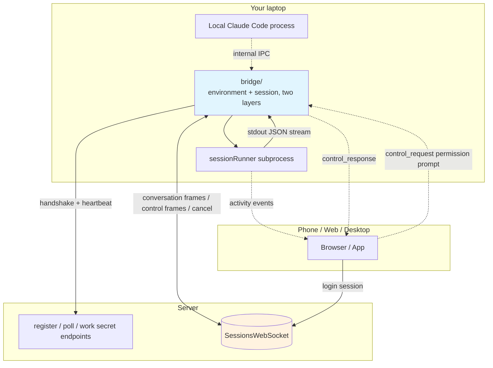

# Chapter 24: Bridge IPC and Remote Sessions — The Wire That Connects the Local CLI to Phones and Browsers

> This is chapter 24 of *Deep Dive into Claude Code Source*. The previous 23 chapters all treated Claude Code as a process running inside a terminal: you type `claude`, it opens a REPL, you press Enter, it answers, it exits. This chapter switches scenes: **you are on the subway, but the conversation has to keep running**.

The first time a reader sees the `bridge/` directory — alongside the equally unfamiliar `remote/`, `commands/bridge/`, `commands/remote-setup/`, `commands/remote-env/` — the gut reaction is usually "so they turned a CLI into a server." It is not that dramatic. This stack of code does exactly one thing: **it exposes the Claude Code process running on your laptop as a session that can be lit up from a phone, taken over from a browser, and continued with new instructions from a web UI**.

Why does this deserve its own chapter? Because it splits what looks like a single-process CLI into **two ends**: the end where you press Enter, and the end where the work actually happens, glued together by a pipeline of WebSocket, JWT, subprocess, control frames, and message transcoding. When any segment of that pipeline fails, the other end only sees "disconnected." The engineering thinking Claude Code applies on this wire is the same temperament as the conversation main loop (对话主循环), the tool system, and the agent orchestration we have already seen — push asynchrony, failure, and renewal into the open, and shrink the "happy path" down to a small slice.

> **Style note**: This chapter follows the same three-act shape as chapter 1 (*Project overview*) and chapter 2 (*Startup optimization*) — problem first → source-code evidence → design rationale — and closes with portable design patterns plus a worked example.
>
> Because this chapter touches server-side contracts that are not public, the wire-protocol frame layout, enterprise security policies, and upstream endpoint naming are described only at the interface level; binary layouts and signing algorithms are omitted. Treat the URL paths you see as "a class of endpoint," not as a public, stable contract.

This chapter answers four core questions:

1. **Why can't a single long HTTP connection do it all?** — three unavoidable protocol requirements push the architecture into two layers
2. **How does a server "dispatch work" to a local machine?** — the `register → poll → work secret` handshake
3. **How does the remote phone reattach to that session?** — `SessionsWebSocket`'s failure-classification table and `worker_epoch`'s preemption check
4. **What does each of the three command entrypoints open up?** — `/remote-control`, `/remote-setup`, `/remote-env` each own one segment

---

## Big picture: the two-layer architecture between the local CLI and the remote controller



---

## 1. Why do we need Bridge?

Before we crack the code, let's nail down the scenario. Tap the "Claude" icon on your phone and you see a conversation window — but the model is not running on the phone. The local `claude` process is the one that has to touch disk, read your project, and run tests. Between the two we need a pipe that translates the input from the other end into the local REPL's "next user message," and routes the local reply, tool calls, and permission requests all the way back out.

If you tried to do all this with HTTP short polling, the pipe is awkward in at least three places.

First, permission requests need to be **bidirectional**. Before the local BashTool runs `rm -rf`, it has to pop a `can_use_tool`, and the phone has to be able to ship "allow" or "deny" back within seconds — otherwise the tool just hangs. HTTP clients are not naturally bidirectional.

Second, the "owner" of the session may **change hands repeatedly** while you are on the move. One moment you are watching the REPL on your laptop, the next you switch to your phone, and then a colleague wants to peek too. Each handoff requires the newly-attached end to immediately see the conversation's *current* state, not replay it from scratch. That means the server has to remember the recent message stream of the session.

Third, the local CLI **cannot blindly accept external messages**. It must be able to verify "this message really came from the remote that was issued a token," or any public-internet request could make the local machine run commands.

`bridge/` and `remote/` together solve those three things in one shot. `bridge/` owns the **local side**: it registers itself as an environment that a remote can take over, polls for work, and spawns subprocesses to run the session. `remote/` owns the **remote side**: it subscribes to the session's WebSocket, pushes control frames back to the local side, and transcodes messages from the other end into the format the REPL can digest.

| Protocol requirement | How Bridge answers | Where it lives |
|---|---|---|
| Bidirectional control frames | `control_request` / `control_response` ride the same WS | `remote/RemoteSessionManager.ts:146-184` |
| Session state survives handoff | Server holds the message stream; clients subscribe and pull | `remote/SessionsWebSocket.ts:99-205` |
| Local rejects unauthorized inbound | `session_ingress_token` + `X-Trusted-Device-Token`, two tokens | `bridge/workSecret.ts` + `bridge/trustedDevice.ts` |

---

## 2. Two layers: environment and session

Open `bridge/types.ts` and the opening lines spell out the two-layer abstraction:

```typescript
// bridge/types.ts:2
export const DEFAULT_SESSION_TIMEOUT_MS = 24 * 60 * 60 * 1000

// bridge/types.ts:69
export type SpawnMode = 'single-session' | 'worktree' | 'same-dir'

// bridge/types.ts:79
export type BridgeWorkerType = 'claude_code' | 'claude_code_assistant'
```

`Environment` is the upper abstraction: one machine, one git repository, one dispatch mode — corresponding to one run of `claude /remote-control`. `Session` is the lower abstraction: one concrete conversation that runs inside an environment.

There is only one environment, but it **can host many sessions at once** — if you open three chat windows on your phone, they become three sessions hung under the same environment, all multiplexed by that one local `claude` process. This 1:N relationship is the most important shape of the Bridge pattern; every story below revolves around it.

The shape of the environment is described by `BridgeConfig` (`bridge/types.ts:81-115`). `spawnMode` decides whether each session attaches to the current process, opens a new git worktree, or takes over the current directory. `workerType` decides what role this environment advertises: a full-REPL `claude_code`, or a read-only `claude_code_assistant` with every write permission stripped. `maxSessions` defaults to 32 and, together with the GrowthBook gate `tengu_ccr_bridge_multi_session`, decides how many sessions can run concurrently on the local side.

To anchor this layer, compare it with the Agent system from earlier chapters: the "main conversation + spawned Worker" of the Coordinator chapter is a two-layer architecture at the **conversation** level; the "Environment + Sessions" here is a two-layer architecture at the **process** level. Both use the "the principal does not act directly, it dispatches" pattern internally, except Bridge dispatches a subprocess and crosses a physical boundary beyond the single machine.

---

## 3. Handshake: register → poll → work secret

The logic for an environment to check in with the server lives in `bridge/bridgeApi.ts`. This segment is the easiest part of the Bridge pipeline to overlook and the most important one, because every later story depends on the few things this handshake hands back.

### 3.1 Register the environment

The CLI POSTs its machine name, branch, and repo URL to an endpoint shaped like `/v1/environments/bridge`, with the beta header `anthropic-beta: environments-2025-11-01`. The server returns one `environment_id`, and from that moment the machine becomes "a dispatchable target" to the server.

The top of `bridge/bridgeApi.ts` defines `SAFE_ID_PATTERN = /^[a-zA-Z0-9_-]+$/`. The line is unremarkable but it is the security floor of the entire Bridge pipeline — every environment / session / bridge id flowing in or out must clear that regex first, to avoid any path injection or server-log pollution.

### 3.2 Long-poll for work

Once the environment is registered, the CLI enters the `runBridgeLoop` main loop and keeps asking the server "any new sessions for me?" Its backoff table splits into two groups:

```typescript
// bridge/bridgeMain.ts (DEFAULT_BACKOFF excerpt)
{
  connInitialMs: 2_000,
  connCapMs: 120_000,        // exponential backoff cap when unreachable: 2 minutes
  connGiveUpMs: 600_000,     // give up the bridge entirely after 10 minutes
  generalInitialMs: 500,
  generalCapMs: 30_000,      // backoff cap for business errors: 30 seconds
  generalGiveUpMs: 600_000,
}
```

Splitting the two means network flapping does not burn through the retry budget allocated to business errors, and business errors do not back off long enough to leave the user waiting forever.

There is also a `pollSleepDetectionThresholdMs = 2 × connCapMs` to handle a specific scenario — **laptop lid closed**. You wake up to find `setTimeout` actually slept for several hours; bridge proactively treats this as an environment anomaly and re-runs `register`, so it does not take a stale token to the server and get silently kicked. This kind of "time-aware" defense is rare in terminal tools.

### 3.3 Pick up the work secret

When the long-poll returns with a task, the response carries a base64url-encoded `work_secret`. It is decoded by `decodeWorkSecret()` at `bridge/workSecret.ts:6`, containing the fields `session_ingress_token`, `api_base_url`, `sources`, `auth`, `claude_code_args`, `mcp_config`, `use_code_sessions`.

This tiny JSON is the Bridge "dispatch slip": the server uses it to tell the local side "for this session, connect to that ingress, identify yourself with this short-lived token, take or skip the envless path." The boolean `use_code_sessions` will appear again in the next section — it decides whether the local side takes the legacy session-ingress HTTP protocol or the newer `code/sessions/{id}` path.

`session_ingress_token` is a JWT with a ~30-minute lifetime; the local side stores it and stamps it as the Authorization on every subsequent conversation packet to the server. Expiration handling for this token is owned by `createTokenRefreshScheduler` at `bridge/jwtUtils.ts:72` — see §9.

---

## 4. Subprocess orchestration: sessionRunner translates stdout into activity

Once `work_secret` is unpacked, bridge moves into "really open the conversation." `bridge/sessionRunner.ts` is the lead here. What it does is shockingly direct: **spawn a subprocess, parse its standard output line by line, translate each line into an `activity` the server understands**.

```typescript
// bridge/sessionRunner.ts:70-89
const TOOL_VERBS: Record<string, string> = {
  Read: 'Reading',
  Edit: 'Editing',
  Bash: 'Running',
  // ...
}
```

This little map is telling. It rewrites the tool name into the present participle — `Read` becomes `Reading`, `Bash` becomes `Running`. The "Reading `package.json`" / "Running `npm test`" you see on your phone is the direct product of this table. It is not on the server, not on the front end — it is right here in your local `sessionRunner`. "Put the source of the status copy as close to the truth as possible" is an engineering preference Claude Code shows again and again — we already saw the same pattern in the previous chapter on Cron scheduling.

The `extractActivities()` function scans the subprocess's stdout JSON stream and turns `tool_use` / `text` / `result` / `error` into reported activities. It shares ancestry with the SSE decoding from chapter 5 — same JSON chunks; rendered as a colorful terminal interface there, exposed here as a flat stream of events.

How does the subprocess actually start? `spawnScriptArgs()` (around `bridge/sessionRunner.ts:47-54`) decides whether the current `claude` is the bundled binary or an npm dev mode and emits the corresponding command line. The source comment points directly at upstream issue [anthropics/claude-code#28334](https://github.com/anthropics/claude-code/issues/28334), which documents "behavior differences between compiled and npm modes in subprocess argument parsing." Git log shows it has been rewritten several times — each one a "small price of compiling into a binary."

The subprocess's **lifetime** is capped by two things: `DEFAULT_SESSION_TIMEOUT_MS` (24 hours) and the `onSessionDone()` callback. The former ensures even a forgotten session does not hold a process slot forever; the latter is in charge of cleaning up the git worktree, calling `api.reconnectSession()` to mark the session archived, and — for `single-session` mode — invoking `controller.abort` to exit the entire bridge.

There is a subtle design choice: a session that fails with 401/403 is **not failed immediately**, but pushed back into the server's queue to be picked up next time a valid token is available (the source comment references design CC-1263). Short-lived auth flapping does not kill the whole job.

---

## 5. The env-less path: when /bridge replaces register

You might wonder: why does an envless session still need to register an environment first and then request a session, instead of doing it in one step? The answer is "the migration is underway but not finished."

`bridge/remoteBridgeCore.ts` is a product of that migration. It walks a different set of endpoints: POST `/v1/code/sessions` directly to get the session id, then POST `/v1/code/sessions/{id}/bridge` to receive a slimmer "dispatch slip" — only `worker_jwt`, `expires_in`, `api_base_url`, `worker_epoch`. The flow has no environment layer at all, which is why the code calls it the "env-less" core.

```typescript
// bridge/workSecret.ts:81
// buildCCRv2SdkUrl: combine worker_jwt + worker_epoch into the v2 ingress URL
```

A separate feature flag `tengu_bridge_repl_v2` gates it, and **only** REPL takes this path; daemon mode and print mode still live under the environment regime. This "old not retired, new running alongside" strategy comes from the same school as the gating discussion in chapter 22 on compile-time optimization — give a new path its own flag and let the old path carry the load during rollout.

`worker_epoch` is the small highlight of this path. Every call to `/bridge` bumps the session's epoch by one on the server and returns it to the client. The client stamps every subsequent WebSocket frame with that epoch; if the same session is **preempted** by another machine — you switched to the office laptop and resumed there — the old epoch immediately becomes invalid. What used to be a dedicated server-side worker registry under `register` collapses into a monotonically-increasing integer: cheaper and harder to get wrong.

---

## 6. SessionsWebSocket: how the browser side reattaches

Switch the camera to the remote side. The phone or browser has the conversation window open — how does **it** know what your local side is doing? The answer lives in `remote/SessionsWebSocket.ts`.

What it wraps is a `wss://…/v1/sessions/ws/{id}/subscribe`-shaped WebSocket. Once subscribed, every activity the local sessionRunner translates out is pushed from the server all the way down this connection.

```typescript
// remote/SessionsWebSocket.ts:17-36
const RECONNECT_DELAY_MS = 2000
const MAX_RECONNECT_ATTEMPTS = 5
const PING_INTERVAL_MS = 30_000
const MAX_SESSION_NOT_FOUND_RETRIES = 3
const PERMANENT_CLOSE_CODES = new Set([4003]) // unauthorized
```

You can read these five lines backward — they are a "failure-classification table":

- **4003 permanent close** — the server is explicitly saying "this session is gone; stop reconnecting." `handleClose` fires `onClose` directly (`remote/SessionsWebSocket.ts:247-253`); the client enters `disconnected` state and stops reconnecting.
- **4001 session temporarily not found** — usually a brief window during container drift, migration, or session-storage compaction. `sessionNotFoundRetries++`, up to 3 retries, with the interval scaling linearly with the count (`remote/SessionsWebSocket.ts:258-272`).
- **Other network errors** — reconnect with 5 backoffs (`remote/SessionsWebSocket.ts:275-287`), with a 30-second ping keepalive (`startPingInterval`, `remote/SessionsWebSocket.ts:301-313`).

Why does 4001 need a bounded retry specifically? Because it is visually indistinguishable from a session that has been **stuck in compaction for a long time**. Without the limit, the browser would keep reconnecting to a session that has already been GC'd on the server, producing a visible "infinite reconnect loop" disconnect banner.

Above this layer, `handleMessage` in `remote/RemoteSessionManager.ts:146-184` wraps another layer of "session lifecycle" that dispatches by message type:

```typescript
// remote/RemoteSessionManager.ts:154
if (message.type === 'control_request')       { /* permission request */ }
// remote/RemoteSessionManager.ts:160
if (message.type === 'control_cancel_request') { /* server-side withdraw */ }
// remote/RemoteSessionManager.ts:175
if (message.type === 'control_response')       { /* control-frame ack */ }
// remote/RemoteSessionManager.ts:181
if (isSDKMessage(message))                     { this.callbacks.onMessage(message) }
```

Regular conversation messages go straight to the upper UI for rendering; control requests take a separate `handleControlRequest` path (`remote/RemoteSessionManager.ts:189-214`); control cancels take a dedicated cleanup path. The "dispatch by message type" style is one you have seen in the chapter 5 query main loop — the same shape recurs in the network layer, the conversation layer, and the UI layer, which is the steady state of this codebase.

`RemoteSessionConfig` also has a small but noteworthy field, `viewerOnly` (comment at `remote/RemoteSessionManager.ts:56-61`): when the other end is a "just want to look" client like `claude assistant`, Ctrl+C / Escape will not actually send an interrupt to the remote, the 60-second disconnect timeout is disabled, and the session title is never updated. This separates "observer" and "driver" at the protocol level — without server-side help, the local wrapper knows which role it is playing.

---

## 7. Permission back-propagation (权限回灌): the full round trip of a control_request

Back to the local side. Before BashTool runs `rm`, it needs a `can_use_tool` confirmation. In a normal terminal session, the REPL renders a confirmation prompt and you press y/n. In Bridge mode, that prompt has no UI to render — you might be on the subway, and there is nobody at the local terminal.

`createSyntheticAssistantMessage` at `remote/remotePermissionBridge.ts:12` is what solves this. It takes the model-generated `can_use_tool` tool call and **dresses it up as an assistant message** to insert into the conversation stream — `id` becomes `` `remote-${requestId}` ``, `role` is set to `'assistant'`, and `content` is a `tool_use` block carrying the `tool_name` and `input` the model originally wanted to run. `createToolStub` at `remote/remotePermissionBridge.ts:53` then synthesizes a stub tool with `needsPermissions: true`, so the UI knows this is a confirmation-required shape when it renders.

Why the "dress-up" approach? Because the remote UI already knows how to render `tool_use` — it is exactly what the model looks like when it asks for a tool in an ordinary conversation. Reshaping a permission request into the same form means the remote does not need to write a second UI to handle the special case "this is a permission prompt, not a real tool call." Same rendering, same interaction, same mental model.

When the user taps "allow" on the phone, the response travels back through the WebSocket to the local `RemoteSessionManager.respondToPermissionRequest` (`remote/RemoteSessionManager.ts:247-282`). The payload looks like `{type:'control_response', response:{subtype:'success', request_id, response:{behavior, ...}}}`, where `behavior` is `allow` or `deny`:

- The `allow` branch carries `updatedInput` — the remote UI can **modify** the parameters the model originally wanted to run (for example, change `rm -rf /tmp/foo` to `rm -rf /tmp/foo/bar`). This is the entry point for "I approve, but let me tweak it slightly."
- The `deny` branch carries `message` — when denying, you have to give the model a reason so it can switch strategies, instead of mindlessly retrying.

The server may also **withdraw** an outstanding request — you already approved it on another device. The `control_cancel_request` branch in `handleMessage` (`remote/RemoteSessionManager.ts:160-172`) deletes the corresponding entry and calls `onPermissionCancelled`, shipping the `tool_use_id` so the UI can dismiss the right confirmation bubble. This is one of the few places in Bridge mode where "both ends have to know the other side may change its mind"; the cost of getting it right is the `pendingPermissionRequests` table at `remote/RemoteSessionManager.ts:97-98`.

---

## 8. Message transcoding: feeding SDK shapes back into the REPL

What Bridge spits out on this side are the Agent SDK's `SDKMessage` variants — `init` / `assistant` / `stream_event` / `result` / `status`, one of each. But the local REPL internally uses a different `Message` type with `type: 'user' | 'assistant' | 'system'` and REPL-specific fields like `isVirtual`. A translation layer is required in between.

`remote/sdkMessageAdapter.ts` is that translation table. It converts the five SDK message kinds via `convertAssistantMessage` / `convertStreamEvent` / `convertResultMessage` / `convertInitMessage` / `convertStatusMessage` depending on the target scenario. Two booleans in `ConvertOptions` toggle the detail-level differences:

- `convertToolResults`: whether to also translate `tool_result` into a REPL message — the CCR path needs it; DirectConnect does not, because local tool results never leave the box.
- `convertUserTextMessages`: whether to feed plain-text "user messages" from the other end back into the local REPL — needed for remote control, so the local REPL can show "incoming from the other end…".

The reason these two are two booleans instead of one enum is that the business actually has only two combinations — "CCR mode" and "DirectConnect mode" — and adding an enum layer would hide intent.

`bridge/bridgeMessaging.ts` also carries a reverse filter `isEligibleBridgeMessage`:

```typescript
// bridge/bridgeMessaging.ts
export function isEligibleBridgeMessage(m: Message): boolean {
  if ((m.type === 'user' || m.type === 'assistant') && m.isVirtual) return false
  return m.type === 'user'
      || m.type === 'assistant'
      || (m.type === 'system' && m.subtype === 'local_command')
}
```

Only real user / assistant messages, plus system feedback from local commands like `/clear` / `/compact`, are pushed to the bridge channel. `isVirtual` placeholder messages stay local. If this filter is wrong, the remote either sees a flood of intermediate states it does not understand, or — flipping it — drops a `/compact` completion notice the user must see. This boundary judgment about "what to ship and what to keep" is one of the easiest places to miscode in Bridge mode.

---

## 9. Tokens and failure recovery

By now the main Bridge line is wired up: local registration, polling, subprocess spawn, remote subscription, message transcoding, permission back-propagation. What remains is the engineering tissue that keeps this line **alive across hours, or even tens of hours**, without dropping.

### 9.1 Token renewal

`bridge/jwtUtils.ts` provides a single scheduler for every JWT-class token:

```typescript
// bridge/jwtUtils.ts:52-58
const TOKEN_REFRESH_BUFFER_MS = 5 * 60 * 1000        // refresh 5 minutes early
const FALLBACK_REFRESH_INTERVAL_MS = 30 * 60 * 1000  // if expiry cannot be parsed, refresh every 30 minutes
const MAX_REFRESH_FAILURES = 3
```

`decodeJwtPayload` (`bridge/jwtUtils.ts:21`) handles one special format: tokens issued by the server may be prefixed with `sk-ant-si-…`; the scheduler peels that shell off first and then base64url-decodes the payload to find `exp`. If it cannot be parsed — say, the token is an irregular opaque string — it falls back to "refresh every 30 minutes." Three consecutive refresh failures and it gives up, letting the upper layer trigger the matching recovery path: either re-run `register`, or mark the session dead.

### 9.2 The "quiet handling" of OAuth failure

`bridge/initReplBridge.ts` checks the OAuth state when the REPL starts. If it finds "not logged in on this machine" or "the last three starts were kicked because of OAuth failure," it **silently skips the entire bridge initialization**. That state is carried by a cross-process flag named `bridgeOauthDeadExpiresAt`: after three consecutive failures, it does not try again until the deadline passes.

Why so conservative? Because REPL startup is a hot path. Asking the server "can I join Bridge" on every cold start would add a second or two to every startup for users who are not logged in. The pattern "consecutive failures → enter a cool-down → silently skip during the cool-down" is one we already saw in the Cron scheduling chapter; it is Claude Code's standard posture for handling "optional-feature initialization failed."

### 9.3 Close-code-to-behavior mapping

The three-tier classification we saw in `SessionsWebSocket` earlier is one of the easiest places in this stack to write wrong and the hardest to debug — one tier missing and you treat a brief outage as a permanent death; one tier extra and you treat a permanent death as a brief outage. Table 9.3 lifts the three tiers out for direct comparison:

| Close code | Server-side meaning | Client reaction | Source location |
|---|---|---|---|
| 4003 | Auth failure; session permanently revoked | `onClose` says goodbye directly | `remote/SessionsWebSocket.ts:247-253` |
| 4001 | Session temporarily not found (compaction, etc.) | Bounded 3 retries + linear backoff | `remote/SessionsWebSocket.ts:258-272` |
| Others | Network flapping | 5 exponential backoffs | `remote/SessionsWebSocket.ts:275-287` |

### 9.4 Interrupt signals

`RemoteSessionManager.cancelSession()` translates a remote Ctrl+C into "stop the tool currently running locally" via a `{subtype: 'interrupt'}` control request:

```typescript
// remote/RemoteSessionManager.ts:294-297
cancelSession(): void {
  logForDebugging('[RemoteSessionManager] Sending interrupt signal')
  this.websocket?.sendControlRequest({ subtype: 'interrupt' })
}
```

`viewerOnly` mode disables this line — an observer should not be allowed to interrupt someone else's running session. The rule is written plainly in the `RemoteSessionConfig` comments; it is a hard binding between capability and role.

---

## 10. Trusted device and login

The last block is **device identity**. `bridge/trustedDevice.ts` maintains a 90-day trusted device token, stored in the macOS keychain — or the equivalent secure store on the platform:

```typescript
// bridge/trustedDevice.ts:33
const TRUSTED_DEVICE_GATE = 'tengu_sessions_elevated_auth_enforcement'
// bridge/trustedDevice.ts:45-52
// readStoredToken first reads CLAUDE_TRUSTED_DEVICE_TOKEN env var, then falls back to keychain
// bridge/trustedDevice.ts:98
// enrollTrustedDevice() calls /api/auth/trusted_devices; server gate = within 10 minutes of account session creation
```

The endpoint `enrollTrustedDevice()` calls is hard-gated on the server side: it only accepts the request when `account_session.created_at < 10min`. In other words, this machine can only register itself a trusted device token **within the ten-minute window after the OAuth login just completed**. Miss it, and re-enrollment requires running `/login` again.

The flavor of this design is "**trust is established inside a continuous human action**" — you just logged in, your fingers are still on the keyboard, your face is still in front of the screen; within those ten minutes the server is willing to add this machine to the allowlist. Any "please add me to trusted devices too" request that pops up at a later moment is stopped by another server-side gate. The `tengu_sessions_elevated_auth_enforcement` GrowthBook gate decides whether that gate is raised at all — it is the switch an admin can flip in enterprise deployments.

Once the token is in the keychain, every Bridge request carries an `X-Trusted-Device-Token` header. The server reconciles it against the issuance record: if the device fingerprint matches and the token has not expired, the request is allowed to perform high-sensitivity actions — like approving a remote permission request; if not, it is downgraded to the capabilities a normal token allows.

---

## 11. Three command entrypoints: where a user types to open this line

By now we have seen all the source-side gears. But to the end user, this whole Bridge stack only exposes three commands they can type: `/remote-control`, `/remote-setup`, `/remote-env`. The three commands carry the registration and UI for the three forms. They are small enough to be dismissed as pure boilerplate — `commands/bridge/index.ts` is 26 lines, `commands/remote-env/index.ts` is 15 — but each one embeds a switch that meshes with the engineering tissue we just walked through, worth a line-by-line look.

### 11.1 /remote-control: hand the current session over

`commands/bridge/index.ts:5-10` registers `/remote-control` — alias `rc` — as a `local-jsx` command, with `isEnabled` requiring both the compile-time `BRIDGE_MODE` feature in `bundledMode` and the runtime `isBridgeEnabled()` returning true. The "compile-time + runtime" double gate reads verbose, but it lets the enterprise build strip remote-control capability out of the same binary — in a `BRIDGE_MODE=false` artifact, this command does not even appear in `/help`.

`checkBridgePrerequisites()` at `commands/bridge/bridge.tsx:467` is one of the real bodies of work. The pre-check runs in this order:

1. `waitForPolicyLimitsToLoad()` waits for GrowthBook to fetch remote policy;
2. `isPolicyAllowed('allow_remote_control')` checks whether the organization has disabled it;
3. `getBridgeDisabledReason()` pulls the local gate;
4. `isEnvLessBridgeEnabled()` and `feature('KAIROS') && isAssistantMode()` decide between the envless path (§5) and the environment-registered legacy path (§3);
5. `checkEnvLessBridgeMinVersion()` or `checkBridgeMinVersion()` validates the CLI minimum version;
6. `getBridgeAccessToken()` checks whether the machine is logged in.

Any failure in the pre-check returns a human-readable error to the REPL; success writes `replBridgeEnabled` into AppState, the `useReplBridge` hook in `REPL.tsx` takes over, and the `runBridgeLoop` main line from §3 starts spinning from there.

`BridgeDisconnectDialog` at `bridge.tsx:155` takes the second-open path: when `replBridgeConnected || replBridgeEnabled` is already true and not in the "mirror-only, no interaction" CCR mode `replBridgeOutboundOnly`, it pops up with three choices — disconnect / show QR code / continue. "Show QR code" calls `toString` from the `qrcode` module (`bridge.tsx:3`) to encode the session URL as a UTF-8 text block printed straight into the terminal. This is the one place in the entire Bridge line where the UI downgrades the session URL into a carrier that can leave the screen — you scan it with your phone and you are on the same session — and the implementation is barely a dozen lines of React.

### 11.2 /remote-setup: send local credentials upward

`commands/remote-setup/` walks another path. It solves the scenario "I want to run Claude directly inside the claude.ai/code web page, not Bridge in a local terminal." The `Web` component at `commands/remote-setup/remote-setup.tsx:87` runs a state machine: `checking` → `confirm` → `uploading`:

1. `checkLoginState` at `commands/remote-setup/remote-setup.tsx:23-61` first uses `isSignedIn()` to see whether the machine has Claude OAuth credentials;
2. Then `getGhAuthStatus()` to see whether the local `gh` CLI is logged in to GitHub;
3. With both, `execa('gh', ['auth', 'token'])` extracts the GitHub token.

The moment the token is retrieved, it is wrapped in `RedactedGithubToken` (`commands/remote-setup/api.ts:16`). The wrapper rewrites `toString` / `toJSON` / Node's inspect protocol to all return `[REDACTED:gh-token]`, with only `.reveal()` returning the plaintext to slot into the HTTP body — every other path is unable to pull the raw token. This is one of the few places in the Bridge stack where a dedicated class was introduced "just to avoid logging it wrong," and the failure mode it assumes is direct: one accidental serialization of this token into Sentry is enough to leak a user's GitHub access to an attacker.

`importGithubToken` at `commands/remote-setup/api.ts:51` POSTs it to `/v1/code/github/import-token` with the beta header `anthropic-beta: ccr-byoc-2025-07-29` (`commands/remote-setup/api.ts:7`). The server stores it Fernet-encrypted in its own `sync_user_tokens` table, and subsequent sessions running inside claude.ai/code can use the token to clone or push your repo directly. Right after, `createDefaultEnvironment()` at `commands/remote-setup/api.ts:119` does a best-effort default-environment creation: first `fetchEnvironments()` to see if any exists, otherwise POST `/v1/environment_providers/cloud/create` to set up an `anthropic_cloud` environment with `python 3.11` + `node 20`. Failure is non-fatal — the front-end landing page auto-routes to env-setup so the user creates one manually, one extra click but not a dead end. There are four failure categories: `not_signed_in` / `invalid_token` / `server` / `network`, mapped one-to-one to `errorMessage` copy, in the same spirit as the failure table from §6.

### 11.3 /remote-env: let the remote environment stay editable locally

`commands/remote-env/` is the thinnest one — `remote-env.tsx` is six lines and just renders the `RemoteEnvironmentDialog` component. The `isEnabled` double gate in `index.ts` is also interesting: `isClaudeAISubscriber()` && `isPolicyAllowed('allow_remote_sessions')`, the first based on the subscription tier in the OAuth credentials, the second passing one more enterprise policy gate — two short-circuited gates together, so neither a free user without a subscription nor an enterprise user whose organization disabled remote sessions sees this command in the UI. The purpose is to let users edit "my default remote environment's scripts and env vars" directly inside the REPL, without jumping to the web page — but this UI layer actually delegates all heavy work to the shared `RemoteEnvironmentDialog` component, so the command file itself is a one-line forwarder.

Reading the three commands together, you can see the "three forms" Bridge mode exposes outward: `/remote-control` hands the current local session over to a remote controller; `/remote-setup` sends the local GitHub credentials of the current account upward so the web side can run commands on your behalf; `/remote-env` keeps the remote session's environment definition editable on the local side. The three forms share the same ingress-token + trusted-device-token credential layer but walk entirely different server endpoints. The restraint at the command layer — `/remote-env` is 6 lines, `/remote-control` spends most of its line count on a React state machine — also reinforces one thing: the Bridge stack's engineering bias is "keep the command layer thin to the point of having no business logic; push every failure classification down to a deeper layer."

---

## 12. Closing the loop: the full path from a phone tap to local execution

Stitching the previous eleven sections together, the moment you tap "have Claude run the tests" on your phone, this is what happens:

The server receives the prompt, sees that you have a registered Bridge environment on your local side, and pushes the task along with a `work_secret` back to the local side through long-poll. `runBridgeLoop` unpacks the ingress token, spawns a subprocess to run the REPL, and feeds your prompt to the subprocess as the initial message. The model starts working — reading source, running commands, editing files. Midway, `npm test` requires authorization; the local side pushes a message disguised as `assistant.tool_use` onto the WebSocket through `RemoteSessionManager`. The phone pops up "Allow Bash to run npm test?" You tap allow; the response travels back via the control frame to the local side, and the subprocess continues. `extractActivities` translates each line of stdout into "Running npm test" / "Reading package.json" and reports them; you watch a streamed update on your phone.

The session finishes, the subprocess exits, `onSessionDone` marks the session archived. In worktree mode, the local side cleans up the temporary worktree. If you get off the subway and want to continue, the new prompt rides the next long-poll on the same environment and a new session is spawned — `environment_id` is unchanged, but `session_id` is new; the 1:N relationship between "environment" and "session" closes the loop here.

If any segment along the way drops: the WebSocket's 5 backoffs, the token's 5-minute-early refresh, 4003 permanent close vs 4001 bounded retry, the cool-down after OAuth failure, the `worker_epoch` preemption check — each mechanism owns its own slice; together what you see is "when the network is bad, the conversation hiccups, but it rarely drops."

---

## 13. Portable design patterns

After reading the Bridge stack, several engineering trade-offs deserve to be lifted out and applied elsewhere.

### Pattern 1: dual-track parallel + feature-flag rollout

The environment regime (`bridge/bridgeApi.ts`) and env-less (`bridge/remoteBridgeCore.ts`) coexist; CCR and DirectConnect both share `sdkMessageAdapter.ts` for message transcoding; driver and viewer are forked client-side by the `viewerOnly` field — every new path keeps the old path intact and lets GrowthBook flags like `tengu_bridge_repl_v2` / `tengu_ccr_bridge_multi_session` decide which one runs.

This is not "backward compatibility because we are afraid to touch old code." It is because every failure on this line is not just a code failure: it can be a real laptop losing the network, an OAuth provider going down, a corporate proxy rotating its certificate at the wrong moment. These failures either cannot be reproduced in CI at all, or the reproduction cost is absurdly high.

**When to use**: any evolution where "a new path is replacing an old path, but the failure radius covers physical environments your CI cannot test" — network-protocol upgrades, third-party auth swaps, cross-region migrations. Running both for six months and watching the real failure rates under rollout is steadier than a one-shot cutover.

### Pattern 2: failure-tier table + hard mapping from close code to behavior

The five constants in `remote/SessionsWebSocket.ts:17-36` plus the three-branch dispatch in `handleClose` compress the entire disconnect strategy into a 3×3 table: when to give up permanently, when to retry a bounded number of times, when to back off exponentially. One tier missing and you treat a brief outage as a permanent death; one tier extra and you treat a permanent death as a brief outage.

Writing the failure-tier table as a readable set of constants — rather than scattering it across `if (err.code === ...)` — so a reviewer can tell at a glance "which tier this failure belongs to" is the most failure-tolerant shape this kind of code takes.

**When to use**: every client that needs long-lived connection keepalive — SSE, WebSocket, gRPC streaming, MQTT. Lifting the close-code-to-behavior mapping into top-of-module constants is safer than burying the policy inside a catch block.

### Pattern 3: dual-token credential layer + hard binding to device identity

`session_ingress_token` (short-lived JWT refreshed every 30 minutes) + `X-Trusted-Device-Token` (90-day long token in the keychain) + the server-side `account_session.created_at < 10min` hard gate form the Bridge "credential trio." The short token covers per-session auth, the long token carries device-identity continuity, and the hard gate fixes the legitimate window for a device's first enrollment.

The combination "short credential frequently refreshed, long credential slowly renewed, enrollment timing hard-gated" is common in mobile / IoT but rarely transplanted into a CLI tool. Bridge moves it in because the local CLI now bears the same responsibility as a phone app — "acting on the user's behalf on the public internet over long periods" — and a single OAuth bearer token is not enough.

**When to use**: every scenario where "the client is not a browser and has to make requests on the user's behalf on the public internet over long periods" — local proxies, desktop sync tools, device control endpoints. Short-refresh + long-renew + hard-gated enrollment window is the standard posture for sidestepping "the token leaks and runs naked forever."

---

## 14. Worked example: recovering a Bridge session from a network drop

Wire the pieces together and watch how Claude Code handles a real "subway through a tunnel" disconnection:

1. Your laptop is running `claude /remote-control`; the environment is registered on the server (§3). You have a chat window open on your phone, watching the sessionRunner stream up `Editing app.tsx`.
2. The train enters the tunnel; the phone's 4G drops for 30 seconds. The `on('close', ...)` at `remote/SessionsWebSocket.ts:194-204` fires; `handleClose` receives a network error code that is neither 4001 nor 4003 and enters the "other network errors" tier: `scheduleReconnect(2000, 'attempt 1/5')`.
3. Meanwhile, the local sessionRunner does not know the remote dropped and keeps translating subprocess stdout into activity, POSTing it to the server ingress. These activities pile up in the server cache, waiting for the subscriber to return.
4. Eight seconds after exiting the tunnel, the first reconnect succeeds — `handleClose` resets `reconnectAttempts` to zero. The phone's `RemoteSessionManager.handleMessage` receives the queued activities in one batch; what the UI shows is "a little hiccup, then it keeps scrolling."
5. At the same time, `createTokenRefreshScheduler` at `bridge/jwtUtils.ts:72` is running in the background — the 30-second tunnel may have straddled the `TOKEN_REFRESH_BUFFER_MS = 5min` boundary, and the refresh HTTP request will retry until it gets a result or hits 3 consecutive failures.
6. The next morning you open the laptop lid; `pollSleepDetectionThresholdMs` detects that `setTimeout` actually slept for 9 hours (well past `2 × connCapMs = 4 minutes`); bridge proactively considers the environment anomalous and re-runs `register`. A new `environment_id` is issued, and the old `worker_epoch` becomes invalid — if a colleague used the same account last night to open an environment on another machine, that one becomes "current" and yours goes stale.

Nowhere in this flow does the `claude` process need to be restarted — every disconnect classification, reconnect backoff, token renewal, and device identity check runs inside the same long-lived bridge main loop, glued together by the failure-tier table from §6, the token scheduler from §9, and the `worker_epoch` preemption check from §5.

---

---

## Next chapter

[Chapter 25: DirectConnect and upstream proxy — wiring the same CLI through two hidden lines, the remote server and the enterprise proxy](./25-directconnect-and-upstream-proxy.md)

We follow the same network line one step further out and watch how DirectConnect and the upstream proxy handle the even more awkward topology inside enterprise networks, one layer deeper than Bridge.

---
*Full content is at https://github.com/luyao618/Claude-Code-Source-Study (a free star would be appreciated)*
