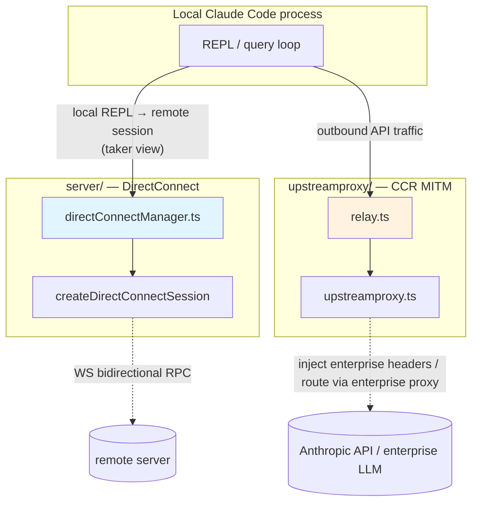

# Chapter 25: DirectConnect and Upstream Proxy — Wiring the Same CLI Onto Two Hidden Lines, the Remote Server and the Enterprise Proxy

> This is Chapter 25 of *Deep Dive into Claude Code Source*. The previous chapter looked at Bridge IPC: how the local CLI gets taken over by a phone or browser. This chapter shifts the camera again — this time the local CLI is not the one being taken over, it is the one doing the taking. We will look at two pieces of code that seem unrelated at first glance but turn out to be remarkably symmetric: `server/` and `upstreamproxy/`.
>
> **Style note**: this chapter follows the same three-beat shape as Chapter 1 (*Project Overview*) and Chapter 2 (*Startup Optimization*) — "problem first → source-code evidence → design reasoning" — and wraps up with "portable design patterns + practical examples".
>
> **Legal boundary**: this chapter touches enterprise intranet topology, an undocumented upstream server contract, CCR control-plane endpoints and auth protocol, and MITM injection strategy. Wire-frame layout, issuance flow, key derivation, and audit fields are described only at the interface level; concrete protocol-layer details and enterprise security configuration are omitted. Any URL paths that appear should be read as "a class of endpoint", not as a publicly stable contract.

This chapter answers four core questions:

1. **What is DirectConnect?** — a thin channel that turns the local REPL into a remote-session client
2. **What is Upstream Proxy?** — a hidden line that hijacks every outbound flow inside the container to an enterprise proxy
3. **Why are these two lines in one chapter?** — they mirror each other as engineering paradigms
4. **What reusable patterns can we take away?** — handshake-and-long-connection separation, bidirectional RPC over a single WebSocket, fail-open, and state injection that hugs the target surface

## Overview: `server/` and `upstreamproxy/`, two symmetric "direct" lines



---

## 1. Two "direct" lines, one CLI

Open the `claude-code-cli` directory and you will see two folders whose names both carry the scent of "direct", "connect", and "proxy":

```
server/
├── createDirectConnectSession.ts
├── directConnectManager.ts
└── types.ts

upstreamproxy/
├── upstreamproxy.ts
└── relay.ts
```

Add the React-side wiring in `hooks/useDirectConnect.ts` and the total code volume is modest: the three files in `server/` add up to 358 lines, the two files in `upstreamproxy/` add up to 740 lines, and `hooks/useDirectConnect.ts` is 229 lines — a little over a thousand lines of TypeScript in total. But the two pieces face in completely opposite directions.

The stack under `server/` solves this problem: **how does this local `claude` process connect to a remote `claude` server that is already running**. It is not a server itself; it is the client that talks to a server. In other words, it turns the local REPL into a WebSocket client, pushes the keys and Enter pressed on the screen up over WS to the remote process that is actually doing the work, and pulls the assistant replies, tool invocations, and permission requests back the other way to display in front of you.

The pair under `upstreamproxy/` solves this problem: **when this local `claude` process runs inside a CCR container, how does it get its own outbound traffic — and the outbound traffic of every bash / curl / gh / kubectl child process it will spawn — to flow through an enterprise-controlled MITM proxy**. It is not "connecting outward to a remote claude"; it is being hijacked to a proxy on its way to "connecting outward to anything else".

The two lines point in opposite directions, and the other ends they connect to are not even the same kind of party: one connects to a claude server, the other to an enterprise proxy server. But their engineering implementations are strongly symmetric, and that is the whole reason for grouping them into one chapter — you will see that whenever Claude Code faces the problem of "moving traffic from one process onto another machine", it reaches for the same small set of building blocks: **WebSocket as the transport, HTTP as the handshake, env var as the configuration switch, `graceful` as the fallback**. Looking at the two lines together is what brings the silhouette of this kit into focus.

The next five sections follow this thread: first walk the DirectConnect line from handshake through bidirectional control, then walk the Upstream Proxy line from switch through relay, and finally come back to see where the two lines are symmetric, where they are not, and why Claude Code wrote them as two systems rather than one.

---

## 2. DirectConnect: turning the local REPL into a remote-session client

The naming of the `server/` directory is actually a little misleading — it does not implement a server, it implements the client wrapper for "talking to a server". The real server is in another Anthropic-side process (it makes indirect appearances in the C24 Bridge series); this side just opens a WebSocket up to it and acts as a well-behaved bidirectional terminal.

Why does this thing exist? Simple: the person opening the REPL and the process actually doing the work are not necessarily on the same machine. The two most direct scenarios: one is Cloud Workspace — your local side is a lightweight CLI, while all source code and tool execution run in a workspace allocated to you in the cloud; the other is a headless remote session — you scriptedly `--connect` to a long-running sandbox from CI. Both scenarios share one mechanism: **the local CLI handles input, rendering, and permission approval; the remote server handles real LLM calls, tool execution, and filesystem operations**.

The glue in between has three layers: a one-shot HTTP handshake, a long-lived bidirectional WebSocket, and React-side state binding. These three layers live in `createDirectConnectSession.ts`, `directConnectManager.ts`, and `hooks/useDirectConnect.ts` respectively. We walk them in order.

### 2.1 The handshake: `createDirectConnectSession`

Open `server/createDirectConnectSession.ts`; the entire file is 88 lines and does one thing: POSTs to `/sessions` and validates the response into a `DirectConnectConfig`.

```typescript
// server/createDirectConnectSession.ts:49-58
resp = await fetch(`${serverUrl}/sessions`, {
  method: 'POST',
  headers,
  body: jsonStringify({
    cwd,
    ...(dangerouslySkipPermissions && {
      dangerously_skip_permissions: true,
    }),
  }),
})
```

The request body carries only two things: the caller telling the server "this is the working directory I want pointed at" (`cwd`), and an optional "I want to skip all permission confirmations" (`dangerouslySkipPermissions`). Both are fed to the server to initialize the claude sub-session it is about to spawn.

The response schema is equally plain, defined at `server/types.ts:5-11`:

```typescript
export const connectResponseSchema = lazySchema(() =>
  z.object({
    session_id: z.string(),
    ws_url: z.string(),
    work_dir: z.string().optional(),
  }),
)
```

The server returns only three things: a session ID, a WebSocket URL, and an optional actual working directory. The first two are the two keys for all subsequent communication — `session_id` is the logical handle, `ws_url` is the physical channel. `work_dir` is for the client UI, "telling the user which directory you have been dropped into".

The error handling in this function is worth noting. `createDirectConnectSession` collapses every failure into a dedicated error class `DirectConnectError` (defined at `server/createDirectConnectSession.ts:11-16`), in three tiers:

- **fetch threw** — the network layer broke;
- **`resp.ok` is false** — HTTP status is not OK;
- **Zod validation failed** — the response does not match the schema.

The three branches live in `server/createDirectConnectSession.ts:59-76`, all re-thrown as `throw new DirectConnectError(...)`. Unifying the error type has a plain benefit: the upper layer needs only one line `catch (e instanceof DirectConnectError)` to fold the three underlying errors into the same "cannot reach the server, check the URL / Token / network" message. The two call sites at `main.tsx:3160` and `main.tsx:4072` use it exactly this way.

That is the end of the synchronous HTTP handshake. The returned `DirectConnectConfig` looks like this (`server/directConnectManager.ts:13-18`):

```typescript
export type DirectConnectConfig = {
  serverUrl: string
  sessionId: string
  wsUrl: string
  authToken?: string
}
```

Four fields — the first two from the caller, the latter two from the server response. These four fields are the entire input to the `DirectConnectSessionManager` in the next subsection.

### 2.2 The long connection: message demultiplexing in `DirectConnectSessionManager`

Once the handshake is done, the long-running worker is the `DirectConnectSessionManager` class at `directConnectManager.ts:40-213`. It is a thin wrapper around a WebSocket client that exposes four event categories — `onMessage` / `onPermissionRequest` / `onConnected` / `onDisconnected` — via `DirectConnectCallbacks` to the upper layer.

```typescript
// server/directConnectManager.ts:20-29
export type DirectConnectCallbacks = {
  onMessage: (message: SDKMessage) => void
  onPermissionRequest: (
    request: SDKControlPermissionRequest,
    requestId: string,
  ) => void
  onConnected?: () => void
  onDisconnected?: () => void
  onError?: (error: Error) => void
}
```

Note that `onMessage` and `onPermissionRequest` are split into two separate callbacks. That split is deliberate: the server mixes two kinds of traffic on the same WebSocket — ordinary SDK messages (assistant replies, `tool_use`, `system` events) and bidirectional control requests carrying a `request_id` (canonically `can_use_tool`). The former just needs to be appended to the message stream; the latter must have a response sent back.

The `message` listener inside `connect()` (`directConnectManager.ts:64-114`) is exactly this demultiplexer:

```typescript
// server/directConnectManager.ts:80-100 (excerpt)
if (parsed.type === 'control_request') {
  if (parsed.request.subtype === 'can_use_tool') {
    this.callbacks.onPermissionRequest(
      parsed.request,
      parsed.request_id,
    )
  } else {
    logForDebugging(
      `[DirectConnect] Unsupported control request subtype: ${parsed.request.subtype}`,
    )
    this.sendErrorResponse(
      parsed.request_id,
      `Unsupported control request subtype: ${parsed.request.subtype}`,
    )
  }
  continue
}
```

`control_request` takes the permission branch; other types take the message branch. The message branch is fronted by a "don't propagate upward" allowlist (`directConnectManager.ts:102-112`) with six rules corresponding to: handshake response, heartbeat, cancellation, server-UI-only condensed text, server-UI-only tool-call summary, and post-turn auto summary. These six message classes are meaningless to upstream React components, so the demultiplexer swallows them internally, sparing every component from writing its own filter.

A more nuanced practical concern hides in that unsupported-subtype branch: if the server sends a `control_request` whose subtype is not `can_use_tool`, the local side does not pretend it never arrived — it **proactively replies with a `subtype: 'error'` `control_response`**. That logic lives in `sendErrorResponse` at `directConnectManager.ts:188-201`:

```typescript
// server/directConnectManager.ts:188-201 (excerpt)
private sendErrorResponse(requestId: string, error: string): void {
  const response = jsonStringify({
    type: 'control_response',
    response: {
      subtype: 'error',
      request_id: requestId,
      error,
    },
  })
  this.ws?.send(response)
}
```

Why is the proactive reply mandatory? Because the server is waiting — every `control_request` it emits carries a `request_id`; without a response it sits there forever, blocking the next round of the conversation. This "how does an old client avoid deadlocking the other side when future control types are added" handling is one of the easiest things to miss in wire-compatibility code, and here it sits in the most prominent spot.

`sendMessage` is the other direction — the local side pushing user input to the server. It wraps the content into the shape the SDK expects (`directConnectManager.ts:131-139`):

```typescript
const message = jsonStringify({
  type: 'user',
  message: {
    role: 'user',
    content: content,
  },
  parent_tool_use_id: null,
  session_id: '',
})
```

That `session_id: ''` is not a bug and not a placeholder — it has to be empty. The entire WebSocket is single-session; the session is a connection-level concept implicit in the URL returned by the handshake. Carrying another copy in the message body would actually get rejected by the server.

The permission response `respondToPermissionRequest` (`directConnectManager.ts:144-167`) and the interrupt `sendInterrupt` (`directConnectManager.ts:172-186`) ride the same WebSocket but use different envelopes: the response is `type: 'control_response'`, the interrupt is `type: 'control_request'` with `subtype: 'interrupt'`. The two share the concept of `request_id` but with reversed semantics — the response uses the ID the server gave you, the interrupt uses a fresh ID the client generates with `crypto.randomUUID()`. This is the standard pattern for bidirectional RPC over a single WS channel, and it is something you can lift into another project at a glance.

### 2.3 The React-side wiring: `useDirectConnect`

`hooks/useDirectConnect.ts` is the React-tree avatar of `DirectConnectSessionManager`. It wraps the otherwise-standalone manager into a React Hook so that the REPL screen (`screens/REPL.tsx`) only has to hand it a `DirectConnectConfig` to get four stable references back: `isRemoteMode` / `sendMessage` / `cancelRequest` / `disconnect`.

A few details in this layer are worth pausing on.

The first is the `toolsRef` ref (`hooks/useDirectConnect.ts:53-56`):

```typescript
const toolsRef = useRef(tools)
useEffect(() => {
  toolsRef.current = tools
}, [tools])
```

Why not read `tools` directly inside the `onPermissionRequest` closure? Because `onPermissionRequest` is bound permanently to the WebSocket, and the closure captures the `tools` reference at **the moment of initial binding**. If the user loads new tools mid-remote-session — for example an MCP server brings in a new tool — the permission dialog will not find metadata for that tool without an update, and can only fall back to `createToolStub`. The `toolsRef` move is a very stock React-toolbox trick for "letting long-lived callbacks read the latest value", but in the DirectConnect scenario, where "the connection lives for an entire round once established", it is especially load-bearing.

The second is the `hasReceivedInitRef` deduplication (`hooks/useDirectConnect.ts:73-78`):

```typescript
if (sdkMessage.type === 'system' && sdkMessage.subtype === 'init') {
  if (hasReceivedInitRef.current) {
    return
  }
  hasReceivedInitRef.current = true
}
```

The server re-emits a `system.init` at every turn — carrying the model name, the available tool list, and other session-level metadata. From the server's standpoint this is harmless redundancy; from the local REPL's standpoint every `init` would re-trigger a welcome-banner render. This move keeps only the first one and silently drops the rest. It looks like a UI detail, but it is actually a textbook split of "server-side wire compatibility + client-side UX consolidation" — the server emits in the way that is most robust for it, the client receives in the way that is most restrained for it.

The third is the semantic fork inside `onDisconnected` (`hooks/useDirectConnect.ts:165-179`):

```typescript
onDisconnected: () => {
  logForDebugging('[useDirectConnect] Disconnected')
  if (!isConnectedRef.current) {
    process.stderr.write(
      `\nFailed to connect to server at ${config.wsUrl}\n`,
    )
  } else {
    process.stderr.write('\nServer disconnected.\n')
  }
  isConnectedRef.current = false
  void gracefulShutdown(1)
  setIsLoading(false)
},
```

The WebSocket `close` event does not distinguish "never connected" from "disconnected after connecting", but the message shown to the user must — the former is a configuration error, the latter is a network blip. The `isConnectedRef` ref is flipped to true in `onConnected` and read in `onDisconnected`; a single boolean bit separates the two states.

Then regardless of which case it is, `gracefulShutdown(1)` fires — once disconnected, the entire CLI process exits without attempting to reconnect. This is by design: DirectConnect is the "I have surrendered my fate to the remote" mode; if the other side is gone, there is no point in continuing to limp along locally. The Bridge line is the opposite — it repeatedly register-polls until it gets the environment, because the local side is the principal there.

The fourth is the `toolUseContext: {} as ToolUseConfirm['toolUseContext']` inside `onPermissionRequest` (`hooks/useDirectConnect.ts:115`):

```typescript
const toolUseConfirm: ToolUseConfirm = {
  assistantMessage: syntheticMessage,
  tool,
  description:
    request.description ?? `${request.tool_name} requires permission`,
  input: request.input,
  toolUseContext: {} as ToolUseConfirm['toolUseContext'],
  toolUseID: request.tool_use_id,
  ...
}
```

Note the forced cast of that empty object. The local permission-dialog type signature requires a full `toolUseContext` containing reading lists, tracking pointers, and a pile of other fields that only local execution would use. But in the DirectConnect scenario the tools actually run remotely, and the local context is an empty concept. Manually constructing an empty object and casting it across is cheaper than splitting off another union-type branch — the local logic already reads `toolUseContext` in dozens of places, and refactoring it into a union would ripple through every one of them. This is a "perfect types vs. code volume" tradeoff, and the author picked the latter.

A `useMemo` at the end folds the four references into a stable result (`hooks/useDirectConnect.ts:225-228`):

```typescript
return useMemo(
  () => ({ isRemoteMode, sendMessage, cancelRequest, disconnect }),
  [isRemoteMode, sendMessage, cancelRequest, disconnect],
)
```

The comment here calls out by name "Same stability concern as useRemoteSession" — the `useRemoteSession` we met in Chapter 24 uses the same trick. The two hooks are sisters: one talks to the Bridge backend, the other to the DirectConnect backend, and the stability contract they expose outward is identical, so the lesson "remember to close out with `useMemo`" holds on both sides.

### 2.4 The overall shape of the DirectConnect line

Stack the three layers and DirectConnect gives the local REPL a **"shell on this side, soul on that side"** shape. The local `claude` process never calls the Anthropic API, never executes any tool, never reads any user file — it does only three things:

1. **Input intake**: package keyboard input into `SDKUserMessage` and push it across;
2. **Message rendering**: drop incoming SDK messages into the React state tree so Ink paints them in the terminal;
3. **Permission approval**: pop a remote-issued `can_use_tool` into a local permission dialog and push the user's allow/deny/feedback back as a `control_response`.

Model inference, Bash execution, file I/O — all of these happen in the process on the other end of `wsUrl`. This is the cleanest implementation of Claude Code's "shape the same CLI into both native and thin client" agenda: the thin-client code is an order of magnitude smaller than the native CLI, yet what shows up in the terminal for the user is visually indistinguishable from native mode.

---

## 3. Upstream Proxy: the MITM outbound for CCR containers

The pair of files under `upstreamproxy/` does something that is spiritually the opposite of what `server/` does. `server/` is "I go connect to a remote service"; `upstreamproxy/` is "I make every HTTPS request leaving this process and its children go through an enterprise proxy".

Why does this thing exist? Because Claude Code does not just run on your laptop. One important deployment form is CCR (a controlled remote containerized runtime, named `CLAUDE_CODE_REMOTE` in the source). CCR packages each session inside a disposable container whose outbound is controlled — it cannot reach the public internet at will; all outbound traffic must go through an enterprise-controlled proxy that injects credentials, runs compliance audits, and decides which upstreams are reachable.

The comment at the top of `upstreamproxy/upstreamproxy.ts` (`upstreamproxy/upstreamproxy.ts:1-20`) puts this plainly. Translated: when starting in a CCR container, this module:

1. reads a token from `/run/ccr/session_token`;
2. calls `prctl(PR_SET_DUMPABLE, 0)` to prevent same-UID processes from ptrace-ing into its heap;
3. downloads a CA certificate from upstream and concatenates it with the system certs so curl / gh / python trust that MITM proxy;
4. starts a local CONNECT→WebSocket relay;
5. unlinks the token file (the token stays in heap; the file disappears first, but only after the relay is up so a supervisor restart can retry);
6. injects the proxy address into every spawned agent child process via env var.

Every step is "fail open" — any failure logs a warning and gives up; a broken proxy is never allowed to drag the whole session down.

This is a very specific deployment line, and all its logic exists to **insert an invisible hijacking layer seamlessly into every outbound path of the container**. We walk the six steps next.

### 3.1 The double gate

The most prominent design is the double env-var gate at the entry (`upstreamproxy/upstreamproxy.ts:85-94`):

```typescript
if (!isEnvTruthy(process.env.CLAUDE_CODE_REMOTE)) {
  return state
}
if (!isEnvTruthy(process.env.CCR_UPSTREAM_PROXY_ENABLED)) {
  return state
}
```

The two env vars govern two different things. `CLAUDE_CODE_REMOTE` is the master switch "am I running inside a CCR container right now"; `CCR_UPSTREAM_PROXY_ENABLED` is the specific switch "should this session activate upstream proxy". Both must be true to proceed. This "environment gate + feature gate" separation has a counterintuitive but crucial benefit: upstream proxy is a feature gated by GrowthBook rollout, but the GrowthBook client SDK **can never get a value inside a CCR container** — every container is cold, the local cache is empty, and rollout evaluation can only happen on the control plane at container-issuance time and be passed through via env var. The source comment names this trap explicitly (`upstreamproxy/upstreamproxy.ts:88-92`): "Every CCR session is a fresh container with no GB cache, so a client-side GB check here always returned the default (false)" — so this code can only trust env, not call GrowthBook directly.

### 3.2 The "use first, destroy after" of the token

After reading the token, the token file is not immediately removed from disk. The deletion is deferred until after the relay is actually up (`upstreamproxy/upstreamproxy.ts:132-144`):

```typescript
try {
  const wsUrl = baseUrl.replace(/^http/, 'ws') + '/v1/code/upstreamproxy/ws'
  const relay = await startUpstreamProxyRelay({ wsUrl, sessionId, token })
  registerCleanup(async () => relay.stop())
  state = { enabled: true, port: relay.port, caBundlePath }
  logForDebugging(`[upstreamproxy] enabled on 127.0.0.1:${relay.port}`)
  await unlink(tokenPath).catch(() => {
    logForDebugging('[upstreamproxy] token file unlink failed', {
      level: 'warn',
    })
  })
}
```

The comment spells out the reasoning in place (`upstreamproxy/upstreamproxy.ts:138-139`): "Only unlink after the listener is up: if CA download or listen() fails, a supervisor restart can retry with the token still on disk." If the token were deleted before the listener came up, and CA download or `listen()` then failed, a supervisor-spawned new process would never be able to read the token — the session would be permanently dead. Preserve recoverability first, then erase the visible secret — that is the standard step order for code that initializes sensitive credentials.

The move that tightens the token in memory is `setNonDumpable` (`upstreamproxy/upstreamproxy.ts:225-252`). It calls libc's `prctl(PR_SET_DUMPABLE, 0)` directly through Bun FFI:

```typescript
// upstreamproxy/upstreamproxy.ts:225-252 (excerpt)
function setNonDumpable(): void {
  if (process.platform !== 'linux' || typeof Bun === 'undefined') return
  const lib = dlopen('libc.so.6', { prctl: { args: ['i32', 'u64', 'u64', 'u64', 'u64'], returns: 'i32' } })
  lib.symbols.prctl(PR_SET_DUMPABLE, 0n, 0n, 0n, 0n)
}
```

The intent is hardcore — it tells the kernel "this process is non-dumpable", so a same-UID process cannot `gdb -p $PPID` and scrape the token out of the heap. The comment states the threat model plainly: "a prompt-injected `gdb -p $PPID` can't scrape the token from the heap". In a CCR scenario where "user code and our own code run in the same container", having the LLM generate a `gdb` command is not science fiction, so this defense has a concrete target.

But note that its **effective scope is very narrow**. The guard at the top of the function, `if (process.platform !== 'linux' || typeof Bun === 'undefined') return`, constrains this FFI to only run when "Linux and Bun runtime" are both true. In CCR containers the CLI runs under Node (see the reference to `upstreamproxy/relay.ts:152-154` in §3.4), so on the CCR path this code in fact **does not execute**; on macOS / Windows in local development it does not fire either. In other words, it is more of a "written ahead of time, auto-activates when Bun can run CCR" placeholder defense than the line actually blocking `gdb` in current CCR deployments.

### 3.3 The NO_PROXY list

The `NO_PROXY_LIST` block (`upstreamproxy/upstreamproxy.ts:37-63`) looks like configuration, but it is actually a very interesting "I should bypass myself" inventory:

```typescript
const NO_PROXY_LIST = [
  'localhost',
  '127.0.0.1',
  '::1',
  '169.254.0.0/16',
  '10.0.0.0/8',
  '172.16.0.0/12',
  '192.168.0.0/16',
  'anthropic.com',
  '.anthropic.com',
  '*.anthropic.com',
  'github.com',
  'api.github.com',
  '*.github.com',
  '*.githubusercontent.com',
  'registry.npmjs.org',
  'pypi.org',
  'files.pythonhosted.org',
  'index.crates.io',
  'proxy.golang.org',
].join(',')
```

The list splits into three classes. The first is loopback and RFC1918 — intra-container network, private ranges, IMDS (cloud metadata endpoint); the proxy would only add detours, not value, by touching these. The second is `anthropic.com` — the proxy must not intercept Claude's own API calls, otherwise upstream would MITM its own service, and besides, non-Bun runtimes (e.g. Python httpx) handle self-signed CA trust chains in wildly different ways and would inevitably blow up. The comment calls out exactly this kind of detail (`upstreamproxy/upstreamproxy.ts:48-49`) "Python urllib/httpx (suffix match, strips leading dot)" — these are landmines someone stepped on. The third is GitHub / npm / pypi / crates / go proxy — these public package indexes are what Bash / curl / git tools touch most often in CI environments; the proxy has no compliance need for them, and direct connection is fastest.

Writing three different forms (`anthropic.com` / `.anthropic.com` / `*.anthropic.com`) is also a learned-the-hard-way move: different languages and different HTTP clients parse `NO_PROXY` with different semantics — Bun treats it as a glob, Python as a suffix, Go as a domain prefix — writing all three is the only way one config file works everywhere.

### 3.4 The relay: CONNECT-over-WebSocket

`upstreamproxy/relay.ts`, at 455 lines, is the heaviest implementation in this entire chapter. In one sentence: **start a local TCP listener, accept standard HTTP CONNECT requests, then ferry the bytes after CONNECT through a WebSocket tunnel to the enterprise proxy**.

Why go through WebSocket instead of direct TCP CONNECT? The comment at the top of the file states the reason head-on (`upstreamproxy/relay.ts:10-12`): "CCR ingress is GKE L7 with path-prefix routing; there's no connect_matcher in cdk-constructs." The enterprise ingress is a GKE layer-7 gateway with path-prefix routing and no TCP CONNECT matcher; the only way to get a full-duplex channel behind that gateway is WebSocket. The Session ingress channel (seen in Chapter 24) already uses this paradigm, and this code reuses the same one.

The bytes are not transferred raw on the WebSocket — they are wrapped in a protobuf message (`upstreamproxy/relay.ts:14-16`):

```
message UpstreamProxyChunk { bytes data = 1; }
```

The wrapping is hand-written — `encodeChunk` (`upstreamproxy/relay.ts:66-81`) is only 10 lines because there is only one field:

```typescript
export function encodeChunk(data: Uint8Array): Uint8Array {
  const len = data.length
  const varint: number[] = []
  let n = len
  while (n > 0x7f) {
    varint.push((n & 0x7f) | 0x80)
    n >>>= 7
  }
  varint.push(n)
  const out = new Uint8Array(1 + varint.length + len)
  out[0] = 0x0a
  out.set(varint, 1)
  out.set(data, 1 + varint.length)
  return out
}
```

One tag byte, a varint length, then the payload. This could of course have been delegated to protobufjs, but the author chose hand-rolled — the comment gives the reason: "avoids a runtime dep in the hot path". This is the hot path: every outbound request, every TCP segment, runs through encode/decode once, and a runtime parser's overhead is not worth ten saved lines. The yardstick here matters: **not everything needs a runtime lib; look at how hot the path is**.

The entire state machine of the relay is centralized in the `ConnState` type (`upstreamproxy/relay.ts:110-127`):

```typescript
type ConnState = {
  ws?: WebSocketLike
  connectBuf: Buffer
  pinger?: ReturnType<typeof setInterval>
  pending: Buffer[]
  wsOpen: boolean
  established: boolean
  closed: boolean
}
```

Seven fields covering three concerns: the WebSocket itself, the buffer accumulating CONNECT-phase bytes, the pending queue of TCP-uplink bytes for the WS phase, and three boolean state bits. The `pending` / `wsOpen` / `established` trio handles a very real timing problem — clients send subsequent bytes without waiting for a response to the CONNECT header; TCP often coalesces the CONNECT header and the TLS ClientHello into a single packet; meanwhile starting a local WebSocket is async. Without buffering those bytes until `wsOpen` flips, you get a silent byte-loss bug. The comment flags this corner case prominently (`upstreamproxy/relay.ts:113-117`): "TCP can coalesce CONNECT + ClientHello into one packet, and the socket's data callback can fire again while the WS handshake is still in flight. Both cases would silently drop bytes without this buffer."

The data inflow goes through `handleData` (`upstreamproxy/relay.ts:295-342`) as a unified entry, in two phases:

```typescript
if (!st.ws) {
  st.connectBuf = Buffer.concat([st.connectBuf, data])
  const headerEnd = st.connectBuf.indexOf('\r\n\r\n')
  if (headerEnd === -1) {
    if (st.connectBuf.length > 8192) {
      sock.write('HTTP/1.1 400 Bad Request\r\n\r\n')
      sock.end()
    }
    return
  }
  ...
}
if (!st.wsOpen) {
  st.pending.push(Buffer.from(data))
  return
}
forwardToWs(st.ws, data)
```

Phase one is "look for `CRLF CRLF` to assemble the CONNECT request"; phase two is "buffer if WS is not open, forward if it is". 8192 bytes is a safety threshold — no legitimate client writes a CONNECT header bigger than 8K; if one does, treat it as an attack or a bug, return 400, close the socket.

`openTunnel` (`upstreamproxy/relay.ts:344-428`) stuffs the CONNECT header and `Proxy-Authorization` together into the first WebSocket frame:

```typescript
ws.onopen = () => {
  const head =
    `${connectLine}\r\n` + `Proxy-Authorization: ${authHeader}\r\n` + `\r\n`
  ws.send(encodeChunk(Buffer.from(head, 'utf8')))
  st.wsOpen = true
  for (const buf of st.pending) {
    forwardToWs(ws, buf)
  }
  st.pending = []
  st.pinger = setInterval(sendKeepalive, PING_INTERVAL_MS, ws)
}
```

That `Proxy-Authorization: Basic <base64(sessionId:token)>` is the credential that actually lets the proxy identify "which session this tunnel belongs to". The WebSocket's own `Authorization: Bearer <token>` (in `headers`) is for upgrade authentication at the front-facing GKE gateway — each guards a different door.

The `ws.onerror` and `ws.onclose` pair (`upstreamproxy/relay.ts:410-427`) does one thing that is especially worth surfacing:

```typescript
ws.onerror = ev => {
  const msg = 'message' in ev ? String(ev.message) : 'websocket error'
  logForDebugging(`[upstreamproxy] ws error: ${msg}`)
  if (st.closed) return
  st.closed = true
  if (!st.established) {
    sock.write('HTTP/1.1 502 Bad Gateway\r\n\r\n')
  }
  sock.end()
  cleanupConn(st)
}
```

`established` is flipped to true when the first server-side chunk arrives (`upstreamproxy/relay.ts:404-407`). `established === true` means the client is already running TLS to the remote, and writing a plaintext `502 Bad Gateway` into the socket at that point corrupts the client's TLS stream — curl will report a baffling `OpenSSL SSL_read: error:0A000126`. So once established, only close, do not write — this is the hard rule of "don't say things inside a TLS tunnel".

The `closed` boolean handles the event pattern where `onerror` is necessarily followed by an `onclose` — without this guard, two cleanups against an already-`end`-ed socket call `end` again and trigger an unnecessary ECONNRESET noise.

Finally there is the dual Bun / Node implementation: `startBunRelay` (`upstreamproxy/relay.ts:176-241`) and `startNodeRelay` (`upstreamproxy/relay.ts:245-289`) are two co-existing implementations. The comment explains it bluntly (`upstreamproxy/relay.ts:152-154`): "the CCR container runs the CLI under Node, not Bun". The biggest difference is the semantics of `write`: Bun's TCP `sock.write` is synchronous and partial-write — it returns the actual bytes written, and the application layer must queue the unwritten part and flush via the `drain` event; Node's `net.Socket.write` is unconditionally buffered, and a false return only indicates "I am backpressured now", bytes are not lost. Bun's `BunState` has an extra `writeBuf: Uint8Array[]` to cover this difference. The two runtimes share the same `ConnState` and the same `handleData`, but each has its own write strategy — this "shared core + platform-adapter shell" split is the only paradigm that does not explode when you have to write cross-runtime code.

### 3.5 Injecting into every child process

Once the whole upstream proxy is up, how do the curl spawned by `BashTool`, the npx spawned by `MCPTool`, and the typescript-language-server spawned by `LSPTool` all use this proxy? The answer is `getUpstreamProxyEnv` (`upstreamproxy/upstreamproxy.ts:160-199`):

```typescript
const proxyUrl = `http://127.0.0.1:${state.port}`
return {
  HTTPS_PROXY: proxyUrl,
  https_proxy: proxyUrl,
  NO_PROXY: NO_PROXY_LIST,
  no_proxy: NO_PROXY_LIST,
  SSL_CERT_FILE: state.caBundlePath,
  NODE_EXTRA_CA_CERTS: state.caBundlePath,
  REQUESTS_CA_BUNDLE: state.caBundlePath,
  CURL_CA_BUNDLE: state.caBundlePath,
}
```

Eight env vars stuffed in at once. `HTTPS_PROXY` / `https_proxy` are for Node / curl / Go; `SSL_CERT_FILE` is for OpenSSL; `NODE_EXTRA_CA_CERTS` is for Node.js; `REQUESTS_CA_BUNDLE` is for Python `requests`; `CURL_CA_BUNDLE` is for curl. Writing both cases is for the same reason as the `NO_PROXY` list above — different ecosystems read different cases.

This env bundle is merged into the environment of every spawned child process at `utils/subprocessEnv.ts:67-84`. There is one detail here that looks odd: `subprocessEnv.ts` does not directly import `upstreamproxy`; it picks up the function through a `_getUpstreamProxyEnv` registration point:

```typescript
// utils/subprocessEnv.ts:67-84 (excerpt)
let _getUpstreamProxyEnv: (() => Record<string, string>) | undefined
...
_getUpstreamProxyEnv = fn
...
const proxyEnv = _getUpstreamProxyEnv?.() ?? {}
```

Why the detour? Because `subprocessEnv` is a utility every command on the cold-start path touches, while `upstreamproxy` is a module only used in CCR mode. A direct import would force every non-CCR startup to pay the upstreamproxy module's load cost as well. The `entrypoints/init.ts:164-176` snippet (lazy import + register-fn) is the other end of this detour:

```typescript
const { initUpstreamProxy, getUpstreamProxyEnv } = await import(
  '../upstreamproxy/upstreamproxy.js'
)
registerUpstreamProxyEnvFn(getUpstreamProxyEnv)
await initUpstreamProxy()
```

Calibrate the gate width on this lazy import precisely. `entrypoints/init.ts:167-176` checks only the single env var `CLAUDE_CODE_REMOTE`: as long as the process believes it is running inside a CCR container, it will dynamic-import this module and call `registerUpstreamProxyEnvFn`, and **will not** read `CCR_UPSTREAM_PROXY_ENABLED` while doing so. The second feature gate `CCR_UPSTREAM_PROXY_ENABLED` returns early only inside `initUpstreamProxy()` at `upstreamproxy/upstreamproxy.ts:85-94` — in CCR mode the module is always loaded / registered, but the init may immediately no-op out.

So this "dependency inversion + lazy load" combo saves the load cost for the "non-CCR startup" class of processes; it does not let sessions inside CCR with upstream proxy disabled skip module loading. Even so, the second benefit still holds: it keeps `utils/subprocessEnv.ts`, a low-level utility imported in dozens of places, from depending on `upstreamproxy/`, an upper-layer feature module — preventing the dependency cycle in reverse.

`getUpstreamProxyEnv` also has an inheritance branch (`upstreamproxy/upstreamproxy.ts:160-183`): when the current process has not enabled the proxy but the environment already has `HTTPS_PROXY` and `SSL_CERT_FILE`, pass the parent process's proxy settings down as-is. The intent is clear: the first-layer `claude` process inside the CCR container unlinked the token file, and a second-layer `claude` child process cannot init again, but the parent process's relay is still running and the port is still alive — the child only needs to inherit the same env to use the parent's proxy.

---

## 4. Where the two lines are symmetric, where they are not

By this point you may already have noticed: DirectConnect and Upstream Proxy seem to do completely different things, but as engineering paradigms they mirror each other. Lay out the mirrored faces:

| Dimension | DirectConnect | Upstream Proxy |
|---|---|---|
| Entry role | Local CLI is the client, remote is the claude server | Local CLI is the one being hijacked, remote is the enterprise proxy |
| Init protocol | HTTP POST to obtain `wsUrl` + `sessionId` | Read token file + HTTP GET to fetch CA cert |
| Long-connection carrier | One WebSocket | One WebSocket per CONNECT |
| Frame format | JSON Lines (SDK message) | Hand-written protobuf (UpstreamProxyChunk) |
| Auth layer | `Authorization: Bearer authToken` | `Authorization: Bearer wsAuth` + `Proxy-Authorization: Basic sessionId:token` |
| Message demultiplexing | Split by `type` into `control_request` / SDK msg | Split by phase into CONNECT header / tunnel bytes |
| Failure semantics | On close → `gracefulShutdown(1)` | On failure → fail open, disable proxy without dropping the session |
| State injection | React Hook (`useDirectConnect`) | env var (`HTTPS_PROXY` and seven others) |
| Platform adaptation | Single WebSocket implementation | Bun / Node dual relay implementations |

Four points in common. First, **WebSocket is the default carrier** — both sides are constrained by a GKE layer-7 gateway or ingress to the HTTP family, neither can open a native TCP channel, so WebSocket naturally becomes "the most bidirectional HTTP-shaped channel you can get". Second, **handshake / long-connection separation** — one-shot meta (session id, ca cert) over HTTP, long-lived business over WS; neither side tries to cram both onto one. Third, **collapse failure at the entry with a single boolean bit** — `DirectConnectError` on one side, `fail open + state.enabled` on the other; neither leaks underlying errors outward, and external code sees only the binary "works / doesn't work". Fourth, **explicit forking for multiple platforms / runtimes** — React vs. command-line invocation, Bun vs. Node, Linux vs. other platforms; forks live at the closest possible boundary and never bubble up into core logic.

The two places where they are not symmetric are more interesting. One is the failure mode: DirectConnect failure necessarily kills the process, because "the soul is on the other side" and the local has no way to continue; Upstream Proxy failure necessarily does not kill the process, because "the proxy is only a nice-to-have, a failed hijack still allows the session to continue without a proxy". This reversed pair of strategies is dictated exactly by "where the session's subject lives". The other is the injection point: DirectConnect injects via React Context into the UI tree; Upstream Proxy injects via env var into the subprocess tree. The former needs React components to be aware "I am in remote mode"; the latter needs forked bash processes to be aware "this is the proxy I should use" — each injection path hugs the target surface it has to influence, and neither is forced to reuse the other's carrier.

The biggest takeaway from putting these two lines in one chapter is this: **at the cross-process, cross-machine, cross-trust-domain boundaries, Claude Code uses not "one big framework" but "a set of small contracts"**. Each piece is small (DirectConnect is 358 lines across three files, Upstream Proxy is 740 lines across two files), but each piece independently explains its own "who am I waiting for, who do I trust, who do I deliver to, what do I do on failure". A network layer assembled from such small contracts stays stable across many years of iteration better than one large all-encompassing RPC framework would.

---

## 5. Portable design patterns

Finally, condense the recurring moves on the two lines into patterns you can take away.

**Pattern 1: handshake-and-long-connection separation**. One-shot meta over HTTP, long-running communication over WS. Do not mix the two on one endpoint — the former wants to be easy to debug and wants the server to validate/reject statelessly; the latter wants bidirectionality and a lifecycle not bound by the request/response model. Claude Code's `createDirectConnectSession` + `DirectConnectSessionManager` is one clean sample; CCR's `downloadCaBundle` + `startUpstreamProxyRelay` is another.

**Pattern 2: bidirectional RPC over a single WS**. When you can only get one WS and must support both "server pushes messages" and "server sends requests and awaits responses" semantics, use the `type` field for first-level demultiplexing, `request_id` for second-level pairing, and `subtype` as an extension point. When you see an unrecognized subtype, **proactively reply with an error rather than playing dead** — this is the key to avoiding the remote hanging on you, and the unsupported-subtype handling at `directConnectManager.ts:88-97` is the minimal demonstration of this rule.

**Pattern 3: fail open + explicit state bit**. Any subsystem that is "nice-to-have, but whose failure must not drag down the main flow" should wrap its entry as "return early on any failure" and shape its public query function (`getUpstreamProxyEnv`) as "branch on `state.enabled`". This pair runs through the entire upstreamproxy module. Conversely, a subsystem of the form "soul on the remote, local is just a shell" should fail loud + `gracefulShutdown` and not pretend it can still work — DirectConnect's `onDisconnected` is the foil for this.

**Pattern 4: state injection hugs the surface**. To influence the React tree, use Hook/Context; to influence the subprocess tree, use env var. Do not force env vars into React for the sake of "consistency", and do not force React state into a subprocess-visible global for the sake of "elegance" — the propagation rules of the two surfaces are just different, and only by hugging each respective propagation rule do things stay stable.

**Pattern 5: hand-written wire beats runtime lib on the hot path**. If you only have a one-field protobuf message to encode/decode on every TCP segment, 10 hand-written lines are worth more than a 50KB runtime parser. The yardstick is "how hot is this path" — for a handshake packet sent once per session, use a lib; for a tunnel frame riding every TLS byte, hand-write it.

**Pattern 6: cross-runtime code = shared core + platform-adapter shell**. In `relay.ts`, Bun and Node share one `ConnState` and one `handleData`, but `startBunRelay` and `startNodeRelay` each handle the write-semantic difference on their own. The biggest trap when running the same code on multiple runtimes is always "same-name API, different semantics"; collapse those differences into the two functions closest to the boundary and the core logic does not have to repeatedly branch on `typeof Bun`.

---

## 6. Practical examples: applying these patterns to your own project

Listing patterns alone is not useful. Here are two small scenarios you can pattern off directly. They are not Claude Code's code; they are minimal skeletons to compare against the day you have to do something similar.

### 6.1 Scenario one: add a "remote session" mode to your own CLI

Suppose you also have a local CLI and want to let it `--connect ws://server/sessions/xxx`, attaching the session to the cloud. The minimum viable implementation is the combination of Pattern 1 + Pattern 2: first, a single HTTP POST to get `ws_url`, `session_id`, and an optional `auth_token`; then upgrade a WebSocket on the returned `ws_url`. The HTTP segment must be wrapped in a dedicated `SessionError`: fold "network broken", "HTTP not OK", and "Zod validation failed" — three underlying error classes — into one error type, so the upper layer needs only one line of `catch` to deliver a unified "cannot reach the server" message.

Once the WebSocket is up, demultiplex on the `type` field: `control_request` messages carry a `request_id` and must have a response sent back; other SDK messages get forwarded to the business layer for handling. There is one thing here that is easiest to miss: when you see a `control_request` with an unrecognized subtype, **do not play deaf**. The server is waiting for a response; if you do not reply, it sits there and blocks the next round. The correct move is to proactively reply with a `subtype: 'error'` `control_response`, so the other side knows "I received it, but I cannot handle it".

Following this skeleton lets you immediately dodge the two most common pitfalls Claude Code walked into: one is the upper layer having to write five `catch`es when handshake errors come in five varieties; the other is the server adding a new control type and the old client hanging the session. The skeleton itself is under 40 lines of TypeScript (a condensed version of Claude Code's `createDirectConnectSession.ts` 88 lines + `directConnectManager.ts` 213 lines), but it can sustain the full essential semantics of a remote session.

### 6.2 Scenario two: add a "hijack outbound" switch to your own container process

Suppose you also run inside a controlled container and want every HTTP / HTTPS request leaving it to go through a local relay. The minimum skeleton is the combination of Pattern 3 + Pattern 4.

Step one is the **double gate** at the entry. The first env var decides "am I truly running inside that controlled container" (say `MY_CONTAINER_RUNTIME`); the second env var decides "should this session enable the proxy" (say `MY_PROXY_ENABLED`). Both must be true to proceed. This split looks verbose, but it explains why Claude Code cannot call GrowthBook live inside the container: cold containers have no GB cache, rollout can only be evaluated at container-issuance time and passed through via env var. If you write your own rollout and run into the same "cold-start SDK cannot get a value" situation, you will also have only this env-var passthrough route.

Step two is **fail open** inside the init function body. Every possibly failing operation — downloading the CA, starting the relay, listening on the port — goes inside one try/catch; the catch only warns and does not rethrow, leaving `state` at `{ enabled: false }`. This `state` is the single source of truth for all subsequent query functions: export a `getProxyEnv()` that branches on `state.enabled`, returning eight env vars when enabled (`HTTPS_PROXY` / `https_proxy` for Node and curl; `SSL_CERT_FILE` / `NODE_EXTRA_CA_CERTS` / `REQUESTS_CA_BUNDLE` / `CURL_CA_BUNDLE` for various TLS implementations), returning an empty object when disabled.

Step three is **state injection**. The utility that spawns subprocesses pulls those eight env vars from `getProxyEnv()` and merges them into the child's environment. Every Bash / curl / npm / pip command forked from this process will automatically use the proxy, and the business layer does not change a single line. This is the core of Pattern 4: env var is the natural propagation mechanism for the subprocess tree; do not bypass it for the sake of "elegance".

The two skeletons together are under 60 lines of code, yet they cover the core conclusions argued for in the three-thousand-plus words of this chapter: **handshake-and-long-connection separation, bidirectional RPC over a single WS, fail-open state bit, state injection hugs the surface**. The rest of the advanced problems — hot-path hand-rolled protobuf, Bun/Node dual relay, the hardcore defense of `setNonDumpable` — only need to be worried about once this skeleton grows to a certain scale.

---

DirectConnect and Upstream Proxy are not the largest subsystems in Claude Code — they are each small in volume, totaling only a little over a thousand lines combined. But they sit on two of the most easily overlooked hidden lines: one lets the CLI hook up to a remote server as a thin client; the other lets the CLI hand over all its outbound traffic to a controlled proxy in an enterprise environment. The "one HTTP handshake + one WebSocket + a bundle of env vars + one fail-open state bit" that recurs through these two lines' code is Claude Code's dialect for doing engineering at the network layer. Once you understand this dialect, when you go look at the upper-layer stories of Bridge IPC, Coordinator remote dispatch, and the Remote Permission Bridge, you will find that the same small building blocks lie beneath them.

---

## Next chapter

[Chapter 26: Ink Framework Deep Customization — Running React in the Terminal](./26-ink-framework-deep-customization.md)

We enter Part 7, "Terminal UI and Multimodal Input", starting from ink/'s 96 files and native-ts/, looking at how the team builds a complete React rendering engine inside the terminal.
