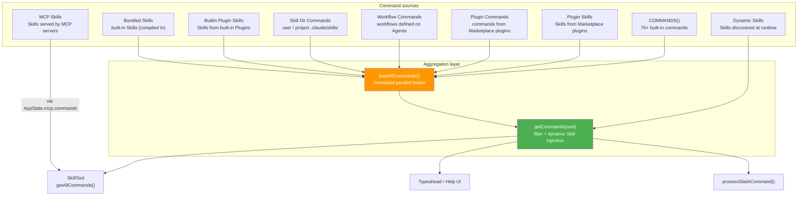

# Chapter 32: Command System Overview (全景) — How Slash Commands Are Aggregated and Extended

> This is Chapter 32 of *Deep Dive into Claude Code Source* — a source-code study (源码学习) of Claude Code. We dig into `commands.ts` and its surrounding modules to show how Claude Code unifies built-in commands, user-defined Skills, Plugin commands, Bundled Skills, MCP Skills, and Workflow commands under a single type system — with lazy loading, conditional registration (注册), and dynamic discovery.

## Why does Claude Code need a command system?

When you type `/commit`, `/compact`, or `/review` in the Claude Code REPL, you are using a **slash command**. They look like simple shortcuts, but inside Claude Code each one carries a surprising amount of weight:

1. **Some commands run locally** (for example `/clear`, which wipes the conversation history).
2. **Some commands generate a Prompt and send it to the model** (for example `/commit`, which produces a code-review prompt).
3. **Some commands need to render an interactive UI** (for example `/config`, which opens a configuration panel).
4. **Some commands come from user-defined Skills** (the Markdown files under `.claude/skills/`).
5. **Some commands come from third-party Plugins** (extensions installed from the Marketplace).
6. **Some commands come from MCP servers** (skills exposed by remote AI tools).
7. **Some commands are only visible to internal users** (Anthropic employee-only commands).

The core questions are: how do you aggregate these wildly different sources under **one** type system? How do you keep 70+ built-in commands from slowing down startup? How do you let a new source — Workflow, Dynamic Skill — plug in without friction?

This chapter answers all three.

---

> **Chapter roadmap**: §1 the Command type system (three execution models) → §2 command aggregation (unifying six sources) → §3 Skill loading (from Markdown to Command) → §4 the remaining command sources → §5 the SkillTool bridge (how the model invokes commands) → §6 caching and invalidation → §7 special command patterns → §8 portable patterns. §1–§3 answer "what does a command look like, where does it come from, how does a Skill become a command"; §4–§5 fill in the remaining sources and the bridge; §6–§7 are the supporting infrastructure.

## 1. The Command type system: three execution models, one shape

### 1.1 The Command union type

The type foundation lives in `types/command.ts`. A `Command` is the intersection of `CommandBase` (the shared fields) and one of three execution models:

```typescript
// types/command.ts:205-206
export type Command = CommandBase &
  (PromptCommand | LocalCommand | LocalJSXCommand)
```

The three execution models differ in how they run:

| Model | `type` value | How it runs | Typical commands |
|------|-----------|---------|---------|
| **Prompt command** | `'prompt'` | Generates prompt content and sends it to the model | `/commit`, `/review`, custom Skills |
| **Local command** | `'local'` | Runs locally and returns text | `/clear`, `/compact`, `/cost` |
| **Local-JSX command** | `'local-jsx'` | Runs locally and renders a React (Ink) UI | `/config`, `/model`, `/mcp` |

### 1.2 CommandBase: the shared metadata protocol

`CommandBase` declares the 18 fields every command shares (`types/command.ts:175-203`). Together they form the command system's **discovery protocol** — no matter where a command comes from, implementing this interface is enough to make it work with typeahead search, permission checks, availability filtering, and the rest of the infrastructure:

```typescript
// types/command.ts:175-203
export type CommandBase = {
  availability?: CommandAvailability[]  // 'claude-ai' | 'console'
  description: string
  hasUserSpecifiedDescription?: boolean
  isEnabled?: () => boolean            // runtime conditional enable
  isHidden?: boolean                   // hide from typeahead
  name: string
  aliases?: string[]                   // aliases (e.g. /clear's /reset, /new)
  whenToUse?: string                   // detailed usage context (shown to the model)
  disableModelInvocation?: boolean     // whether the model may invoke via SkillTool
  userInvocable?: boolean              // whether the user may trigger with /xxx
  loadedFrom?: 'commands_DEPRECATED' | 'skills' | 'plugin' | 'managed' | 'bundled' | 'mcp'
  kind?: 'workflow'                    // distinguishes workflow commands
  immediate?: boolean                  // bypass the queue and run immediately
  userFacingName?: () => string        // display name (may differ from internal name)
  // ...
}
```

The design highlight is that `isEnabled` and `availability` are deliberately split:

- **`availability`**: static identity gating (who are you? a claude.ai subscriber or a Console API user?).
- **`isEnabled()`**: dynamic capability gating (is the feature flag on? does the platform support this?).

Splitting them lets `meetsAvailabilityRequirement()` and `isCommandEnabled()` each do one job without stepping on the other.

### 1.3 PromptCommand: the substrate for Skills

The prompt command is the richest of the three because it has to support both built-in prompt commands and the external Skill extension point:

```typescript
// types/command.ts:25-57
export type PromptCommand = {
  type: 'prompt'
  progressMessage: string
  contentLength: number
  argNames?: string[]
  allowedTools?: string[]          // extra tools this Skill is allowed to use
  model?: string                   // specify a model (overrides the default)
  source: SettingSource | 'builtin' | 'mcp' | 'plugin' | 'bundled'
  hooks?: HooksSettings            // hooks bundled with the Skill
  skillRoot?: string               // root directory of the Skill
  context?: 'inline' | 'fork'     // execution context
  agent?: string                   // agent type to use in fork mode
  effort?: EffortValue             // reasoning effort level
  paths?: string[]                 // file path globs for conditional activation
  getPromptForCommand(             // core method: produce the prompt
    args: string,
    context: ToolUseContext,
  ): Promise<ContentBlockParam[]>
}
```

`getPromptForCommand()` is the heart of a prompt command. When the user types `/commit`, the system calls this method, takes the returned prompt content, and sends it to the model as a user message. In other words, **a custom Skill is fundamentally a prompt generator**.

### 1.4 Lazy loading for local commands

Both local and local-JSX commands use a `load()` method to defer their implementation:

```typescript
// types/command.ts:74-78
type LocalCommand = {
  type: 'local'
  supportsNonInteractive: boolean
  load: () => Promise<LocalCommandModule>   // load the implementation lazily
}

// types/command.ts:144-152
type LocalJSXCommand = {
  type: 'local-jsx'
  load: () => Promise<LocalJSXCommandModule>
}
```

A typical `local` command definition:

```typescript
// commands/clear/index.ts
const clear = {
  type: 'local',
  name: 'clear',
  description: 'Clear conversation history and free up context',
  aliases: ['reset', 'new'],
  supportsNonInteractive: false,
  load: () => import('./clear.js'),  // only loaded when actually invoked
} satisfies Command
```

**The key design point**: `index.ts` only holds metadata (name, description, and other static information). The real implementation lives in `clear.ts` and is loaded lazily via the dynamic `import()` inside `load()`. The result is that loading the `index.ts` of all 70+ commands at CLI startup costs almost nothing — no heavyweight dependency is pulled in.

### 1.5 Command dispatch: a three-way switch

When the user types text starting with `/`, the dispatch logic in `processSlashCommand.tsx` branches on `command.type`:

```typescript
// utils/processUserInput/processSlashCommand.tsx:550-723
switch (command.type) {
  case 'local-jsx':
    // call load(), get the JSX render function
    // collect the result via the onDone callback
    return new Promise<SlashCommandResult>(resolve => { ... });

  case 'local':
    // call load(), get the call() function
    // run it directly and return a text/compact/skip result
    const mod = await command.load();
    const result = await mod.call(args, context);
    // ...

  case 'prompt':
    // call getPromptForCommand(), get the prompt content
    // inject it as a user message to trigger the model's response
    const promptContent = await command.getPromptForCommand(args, context);
    // ...
}
```

---

## 2. Command aggregation: unifying six sources

`commands.ts` is the **aggregation hub** for the entire command system. It merges commands from six different sources into one unified list.

How big is the hub itself? `commands.ts` currently runs 754 lines (`commands.ts:1-754`), and it sits on top of the `commands/` directory — which in the current snapshot has 86 top-level subdirectories + 15 top-level `.ts/.tsx` files = 101 top-level entries, 207 source files in total. Those 101 top-level entries are mostly one-to-one with a single built-in command (a few files are just helper modules, such as `createMovedToPluginCommand.ts`). In other words, the `loadAllCommands()` machinery below has to pull all 207 files — together with the commands that come from on-disk Skills, Plugins, Bundled Skills, and Workflows — into a single `Command[]` list. (MCP Skills do not go through `loadAllCommands()`; the SkillTool merges them in at execution time via `AppState.mcp.commands`. See §4.3 and §6.1.)

### 2.1 Built-in commands: static imports + feature gates

The top of the file is the import area for the 70+ built-in commands. There are two import styles, each serving a different purpose:

**Style one: static `import` (most commands)**

```typescript
// commands.ts:2-58
import clear from './commands/clear/index.js'
import compact from './commands/compact/index.js'
import config from './commands/config/index.js'
// ...about 60 similar imports
```

Note that the cost of these static imports is **not uniform**. `local` and `local-jsx` commands usually achieve genuinely lightweight registration via the `index.ts` + `load()` pattern — `index.ts` only contains metadata, and the implementation is loaded later. But **built-in `prompt` commands often lack this shim**: `commit.ts`, `security-review.ts`, `advisor.ts`, and others are imported directly as full implementations, which means dependencies such as `executeShellCommandsInPrompt` and `parseFrontmatter` come along for the ride.

The project is explicitly aware of this — the `/insights` command (113KB / 3200 lines) has a dedicated lazy shim (`commands.ts:190-202`) that dynamically `import`s the real implementation from inside `getPromptForCommand()` so it is not loaded at startup. The fact that this special case exists is itself proof that not all static imports are free.

**Style two: conditional `require` + `feature()` DCE**

```typescript
// commands.ts:62-122
const proactive =
  feature('PROACTIVE') || feature('KAIROS')
    ? require('./commands/proactive.js').default
    : null

const voiceCommand = feature('VOICE_MODE')
  ? require('./commands/voice/index.js').default
  : null

const workflowsCmd = feature('WORKFLOW_SCRIPTS')
  ? (require('./commands/workflows/index.js') as typeof import('./commands/workflows/index.js')).default
  : null
```

These commands are gated by the compile-time `feature()` helper. In external builds, `feature('VOICE_MODE')` is replaced with `false`, the whole `require()` branch is removed by Dead Code Elimination (`DCE`), and the underlying module file never even ships in the final artifact.

There is also a special runtime-looking condition:

```typescript
// commands.ts:48-52
const agentsPlatform =
  process.env.USER_TYPE === 'ant'
    ? require('./commands/agents-platform/index.js').default
    : null
```

`USER_TYPE === 'ant'` is written as `process.env.USER_TYPE === 'ant'` in the source (`commands.ts:216`, `commands.ts:237`), which looks like a runtime env read. In practice it follows the same playbook described in Chapter 22 and Chapter 34 as `--define` compile-time replacement: Bun's bundler step rewrites `process.env.USER_TYPE` to the build-time literal (`''` for external builds, `'ant'` for internal builds), the equality folds to `false` or `true` at compile time, and the bundler then DCE's away the unreachable branch. So every `USER_TYPE === 'ant'` in this section is a compile-time gate, not a runtime env read — consistent with Chapter 22 §2 pattern 1 and Chapter 34 pattern 1.

### 2.2 The COMMANDS() registry

Every built-in command flows into one `memoize`-wrapped function:

```typescript
// commands.ts:258-346
const COMMANDS = memoize((): Command[] => [
  addDir,
  advisor,
  agents,
  branch,
  // ...about 70 commands
  ...(proactive ? [proactive] : []),
  ...(voiceCommand ? [voiceCommand] : []),
  ...(process.env.USER_TYPE === 'ant' && !process.env.IS_DEMO
    ? INTERNAL_ONLY_COMMANDS
    : []),
])
```

**Why `memoize(() => [...])` instead of just declaring `const COMMANDS = [...]`?** The comment spells it out:

> Declared as a function so that we don't run this until getCommands is called, since underlying functions read from config, which can't be read at module initialization time.

A few commands (such as `login()`) need to read config to decide their state, and config is not yet ready at module initialization. Wrapping the array in a function defers it until first access and sidesteps the ordering problem.

`INTERNAL_ONLY_COMMANDS` collects every command that should only be visible to internal users:

```typescript
// commands.ts:225-254
export const INTERNAL_ONLY_COMMANDS = [
  backfillSessions,
  breakCache,
  bughunter,
  commit,
  commitPushPr,
  // ...about 25 internal commands
].filter(Boolean)
```

### 2.3 Six-source aggregation: loadAllCommands

The real magic lives in `loadAllCommands()` — it loads the six command sources **in parallel** and merges them:

```typescript
// commands.ts:449-469
const loadAllCommands = memoize(async (cwd: string): Promise<Command[]> => {
  const [
    { skillDirCommands, pluginSkills, bundledSkills, builtinPluginSkills },
    pluginCommands,
    workflowCommands,
  ] = await Promise.all([
    getSkills(cwd),                   // ① Skill directories + Plugin Skills + Bundled Skills
    getPluginCommands(),              // ② Plugin commands
    getWorkflowCommands              // ③ Workflow commands
      ? getWorkflowCommands(cwd)
      : Promise.resolve([]),
  ])

  return [
    ...bundledSkills,                 // highest priority: bundled Skills
    ...builtinPluginSkills,           // Skills from built-in Plugins
    ...skillDirCommands,              // user / project custom Skills
    ...workflowCommands,              // Workflow commands
    ...pluginCommands,                // Plugin commands
    ...pluginSkills,                  // Skills shipped by Plugins
    ...COMMANDS(),                    // ④ built-in commands (lowest priority)
  ]
})
```

Note the merge order: **extension commands take precedence over built-in commands.** If a user defines a Skill with the same name as a built-in command, the user's version wins.



### 2.4 getCommands(): availability filtering + dynamic injection

The result of `loadAllCommands()` is memoized (the load involves disk I/O), but the `getCommands()` consumers actually use re-runs its filter on every call — the user's identity state can change mid-session (after running `/login`, for example):

```typescript
// commands.ts:476-517
export async function getCommands(cwd: string): Promise<Command[]> {
  const allCommands = await loadAllCommands(cwd)

  // Skills discovered at runtime (dynamic directory discovery + path-conditioned activation)
  const dynamicSkills = getDynamicSkills()

  const baseCommands = allCommands.filter(
    _ => meetsAvailabilityRequirement(_) && isCommandEnabled(_),
  )

  // Dedupe and inject dynamic Skills
  const baseCommandNames = new Set(baseCommands.map(c => c.name))
  const uniqueDynamicSkills = dynamicSkills.filter(
    s => !baseCommandNames.has(s.name) &&
         meetsAvailabilityRequirement(s) &&
         isCommandEnabled(s),
  )

  // Insertion point: just before the first built-in command.
  // Given the merge order in loadAllCommands, this places dynamic Skills after the
  // bundledSkills → builtinPluginSkills → skillDirCommands → workflowCommands
  // → pluginCommands → pluginSkills block and before COMMANDS().
  const builtInNames = new Set(COMMANDS().map(c => c.name))
  const insertIndex = baseCommands.findIndex(c => builtInNames.has(c.name))
  return [
    ...baseCommands.slice(0, insertIndex),
    ...uniqueDynamicSkills,
    ...baseCommands.slice(insertIndex),
  ]
}
```

The **availability filter** itself is worth a look (`commands.ts:417-443`):

```typescript
export function meetsAvailabilityRequirement(cmd: Command): boolean {
  if (!cmd.availability) return true       // not declared = available to everyone
  for (const a of cmd.availability) {
    switch (a) {
      case 'claude-ai':
        if (isClaudeAISubscriber()) return true
        break
      case 'console':
        if (!isClaudeAISubscriber() && !isUsing3PServices() &&
            isFirstPartyAnthropicBaseUrl())
          return true
        break
    }
  }
  return false
}
```

---

## 3. Skill loading: from Markdown to Command

Skills are Claude Code's extension mechanism — write a Markdown file and you have a new command. `skills/loadSkillsDir.ts` implements the pipeline (链路) that converts a file on disk into a `Command` object.

### 3.1 Skill directory layout and loading layers

Skills are loaded from five directory layers, in descending priority:

| Layer | Path | Source identifier |
|------|------|---------|
| Managed (enterprise policy) | `<managed-path>/.claude/skills/` | `policySettings` |
| User-level | `~/.claude/skills/` | `userSettings` |
| Project-level | `<cwd>/.claude/skills/` | `projectSettings` |
| Additional (extra dirs) | `<--add-dir>/.claude/skills/` | `projectSettings` |
| Legacy (old format) | `<cwd>/.claude/commands/` | `commands_DEPRECATED` |

The new Skill format strictly requires the **directory layout**:

```
.claude/skills/
├── my-skill/
│   └── SKILL.md       # must be named SKILL.md
├── another-skill/
│   ├── SKILL.md
│   └── helper.py      # other files may live alongside
```

The legacy `/commands/` directory accepts both directory and single-file (`some-command.md`) formats, but everything loaded from it is tagged `commands_DEPRECATED`.

### 3.2 Frontmatter parsing

Each Skill's `SKILL.md` declares metadata via YAML frontmatter:

```markdown
---
description: Generate a git commit message
allowed-tools: Bash(git add:*), Bash(git status:*), Bash(git commit:*)
model: sonnet
context: fork
agent: Bash
effort: high
when_to_use: When user wants to commit changes
argument-hint: <message>
user-invocable: true
paths: src/**/*.ts, lib/**/*.js
hooks:
  PreToolCall:
    - matcher: Bash
      hooks:
        - type: command
          command: echo "pre-hook"
---

You are a Git commit assistant...
```

Frontmatter parsing happens in two steps. First, `parseSkillFrontmatterFields()` (`loadSkillsDir.ts:185-265`) parses most fields — description, allowed-tools, model, hooks, context, agent, effort, shell, and so on. The `paths` field (the file-path glob for conditional activation) is **not** handled here — it is parsed separately by `parseSkillPaths()` (`loadSkillsDir.ts:159-178`). The loader merges both results before handing them to `createSkillCommand()`:

```typescript
// loadSkillsDir.ts:453-469
const parsed = parseSkillFrontmatterFields(frontmatter, markdownContent, skillName)
const paths = parseSkillPaths(frontmatter)  // parsed independently

return {
  skill: createSkillCommand({
    ...parsed,       // spread the parseSkillFrontmatterFields result
    skillName,
    markdownContent,
    source,
    baseDir: skillDirPath,
    loadedFrom: 'skills',
    paths,            // passed through separately
  }),
  filePath: skillFilePath,
}
```

### 3.3 createSkillCommand(): Markdown becomes Command

```typescript
// loadSkillsDir.ts:270-401
export function createSkillCommand({ skillName, markdownContent, ... }): Command {
  return {
    type: 'prompt',
    name: skillName,
    description,
    source,
    loadedFrom,
    progressMessage: 'running',
    async getPromptForCommand(args, toolUseContext) {
      let finalContent = baseDir
        ? `Base directory for this skill: ${baseDir}\n\n${markdownContent}`
        : markdownContent

      // 1. Argument substitution: ${ARG1} → the argument the user passed
      finalContent = substituteArguments(finalContent, args, true, argumentNames)

      // 2. Directory variable: ${CLAUDE_SKILL_DIR} → the skill's directory
      if (baseDir) {
        finalContent = finalContent.replace(/\$\{CLAUDE_SKILL_DIR\}/g, skillDir)
      }

      // 3. Session variable: ${CLAUDE_SESSION_ID} → the current session id
      finalContent = finalContent.replace(/\$\{CLAUDE_SESSION_ID\}/g, getSessionId())

      // 4. Inline shell execution: !`git status` → the actual command output.
      //    MCP Skills skip this step (security).
      if (loadedFrom !== 'mcp') {
        finalContent = await executeShellCommandsInPrompt(finalContent, ...)
      }

      return [{ type: 'text', text: finalContent }]
    },
  }
}
```

There is an important security decision here: **MCP Skills do not execute inline shell commands.** MCP Skills come from remote, untrusted sources; executing the `` !`...` `` syntax inside their Markdown would be equivalent to remote code execution.

### 3.4 Deduplication

Because Skills load from several directory layers, the same file can be referenced more than once through symlinks or overlapping parent directories. `getSkillDirCommands()` resolves symlinks with `realpath()` and dedupes based on the **canonical path**:

```typescript
// loadSkillsDir.ts:728-763
const fileIds = await Promise.all(
  allSkillsWithPaths.map(({ filePath }) => getFileIdentity(filePath))
)

const seenFileIds = new Map<string, SettingSource | ...>()
for (let i = 0; i < allSkillsWithPaths.length; i++) {
  const fileId = fileIds[i]
  if (fileId && seenFileIds.has(fileId)) {
    logForDebugging(`Skipping duplicate skill '${skill.name}' ...`)
    continue
  }
  seenFileIds.set(fileId, skill.source)
  deduplicatedSkills.push(skill)
}
```

### 3.5 Conditional Skills: activated by file path

A Skill can declare `paths` in its frontmatter to indicate it should only activate when the model is touching matching files:

```typescript
// loadSkillsDir.ts:997-1058
export function activateConditionalSkillsForPaths(
  filePaths: string[], cwd: string
): string[] {
  for (const [name, skill] of conditionalSkills) {
    const skillIgnore = ignore().add(skill.paths)
    for (const filePath of filePaths) {
      const relativePath = relative(cwd, filePath)
      if (skillIgnore.ignores(relativePath)) {
        // move from "pending" to "active"
        dynamicSkills.set(name, skill)
        conditionalSkills.delete(name)
        activatedConditionalSkillNames.add(name)
        break
      }
    }
  }
  skillsLoaded.emit()  // signal that caches should be cleared
}
```

The `ignore` library (same glob semantics as `.gitignore`) makes patterns like `paths: src/**/*.ts` match file paths exactly the way the user expects.

---

## 4. The remaining command sources

### 4.1 Bundled Skills: Skills compiled into the binary

Bundled Skills are built-in Skills registered through code (`skills/bundledSkills.ts`). Unlike file-system Skills, they are registered synchronously at module initialization:

```typescript
// skills/bundledSkills.ts:53-100
export function registerBundledSkill(definition: BundledSkillDefinition): void {
  const command: Command = {
    type: 'prompt',
    name: definition.name,
    source: 'bundled',
    loadedFrom: 'bundled',
    // ...
  }
  bundledSkills.push(command)
}
```

Bundled Skills also support a `files` field — companion reference files that are written lazily to disk (in a temp directory) on first invocation, so the model can read them with Read/Grep. The write uses the `O_NOFOLLOW | O_EXCL` flags to defend against symlink attacks (`bundledSkills.ts:176-193`).

### 4.2 Plugin commands: third-party extensions

Plugins are installed through the Marketplace, and the command-loading logic lives in `utils/plugins/loadPluginCommands.ts`. Plugin commands share the same frontmatter protocol as Skills, but they get extra variable substitutions:

```typescript
// utils/plugins/loadPluginCommands.ts:340-341
// ${CLAUDE_PLUGIN_ROOT} → plugin root directory
// ${CLAUDE_PLUGIN_DATA} → plugin data directory
finalContent = substitutePluginVariables(finalContent, { path: pluginPath, source: sourceName })
```

Plugin command names follow the rule `pluginName + path namespace + base name`, computed by `getCommandNameFromFile()` (`loadPluginCommands.ts:60-97`). For a plain Markdown file, the base name is the filename (minus `.md`); for the `SKILL.md` format, the base name is the parent directory's name. If the command lives in a nested subdirectory rather than the root, the directory hierarchy is preserved as a `:`-separated namespace:

```
plugin/commands/foo.md           → pluginName:foo
plugin/commands/sub/bar.md       → pluginName:sub:bar
plugin/commands/my-skill/SKILL.md → pluginName:my-skill
plugin/commands/ns/sk/SKILL.md   → pluginName:ns:sk
```

### 4.3 MCP Skills: skills from remote servers

MCP Skills plug in through a clever mechanism that breaks a circular dependency. Because `loadSkillsDir.ts` has a long dependency chain, importing it directly from the MCP module would create a cycle. The fix is a **write-once registry**:

```typescript
// skills/mcpSkillBuilders.ts
let builders: MCPSkillBuilders | null = null

export function registerMCPSkillBuilders(b: MCPSkillBuilders): void {
  builders = b
}

export function getMCPSkillBuilders(): MCPSkillBuilders {
  if (!builders) throw new Error('MCP skill builders not registered ...')
  return builders
}
```

`loadSkillsDir.ts` registers its own `createSkillCommand` and `parseSkillFrontmatterFields` at module initialization, and the MCP module fetches them via `getMCPSkillBuilders()` — no direct import required.

### 4.4 Workflow commands

Workflow commands are gated by `feature('WORKFLOW_SCRIPTS')` and produced by the `WorkflowTool/createWorkflowCommand.js` module. Inside `loadAllCommands()` the source function itself is loaded through a conditional `require`:

```typescript
// commands.ts:401-406
const getWorkflowCommands = feature('WORKFLOW_SCRIPTS')
  ? (require('./tools/WorkflowTool/createWorkflowCommand.js') as typeof import(...))
      .getWorkflowCommands
  : null
```

Workflow commands carry `kind: 'workflow'` in `CommandBase`, and the UI layer uses it to show a `(workflow)` badge in the typeahead (see the `cmd.kind === 'workflow'` branch in `formatDescriptionWithSource()`, `commands.ts:733-735`).

### 4.5 Dynamic Skill discovery

This is one of the more interesting sources. Whenever the model reads or edits a file mid-conversation, the system walks up from the file's directory looking for a `.claude/skills/` directory along the way:

```typescript
// loadSkillsDir.ts:861-915
export async function discoverSkillDirsForPaths(
  filePaths: string[], cwd: string
): Promise<string[]> {
  for (const filePath of filePaths) {
    let currentDir = dirname(filePath)
    // walk from the file's directory up to (but not including) cwd
    while (currentDir.startsWith(resolvedCwd + pathSep)) {
      const skillDir = join(currentDir, '.claude', 'skills')
      if (!dynamicSkillDirs.has(skillDir)) {
        dynamicSkillDirs.add(skillDir)
        // check that the directory exists and is not gitignored
        if (await isPathGitignored(currentDir, resolvedCwd)) continue
        newDirs.push(skillDir)
      }
      currentDir = dirname(currentDir)
    }
  }
}
```

This delivers a **progressive discovery** model: Skills at the project root load at startup, while Skills nested in subdirectories are only discovered once the model actually touches that area.

---

## 5. How the model invokes commands: the SkillTool bridge

The user can trigger a command manually with `/xxx`, but the model can also invoke commands on its own — through `SkillTool` (`tools/SkillTool/SkillTool.ts`).

It is important to distinguish **two different command sets**:

1. **Display list** (`getSkillToolCommands()`) — which skills the model "sees" in the System Prompt.
2. **Execution set** (`SkillTool.getAllCommands()`) — which skills the model can actually invoke.

### Display list: getSkillToolCommands()

SkillTool injects a list of available Skills into the System Prompt so the model knows what it can call. Building the list has to respect a token budget:

```typescript
// tools/SkillTool/prompt.ts:70-171
export function formatCommandsWithinBudget(
  commands: Command[], contextWindowTokens?: number
): string {
  const budget = getCharBudget(contextWindowTokens)  // default: 1% of the context
  // First try the full description.
  // If it overflows, truncate the descriptions of non-bundled commands proportionally.
  // In the extreme case, non-bundled commands show only their name.
}
```

Which commands make it into the display list? The filter:

```typescript
// commands.ts:563-581
export const getSkillToolCommands = memoize(async (cwd: string): Promise<Command[]> => {
  const allCommands = await getCommands(cwd)
  return allCommands.filter(cmd =>
    cmd.type === 'prompt' &&          // prompt commands only
    !cmd.disableModelInvocation &&    // model invocation must not be disabled
    cmd.source !== 'builtin' &&       // not built-in (/review etc. don't need SkillTool)
    (cmd.loadedFrom === 'bundled' ||  // must come from one of these sources
     cmd.loadedFrom === 'skills' ||
     cmd.loadedFrom === 'commands_DEPRECATED' ||
     cmd.hasUserSpecifiedDescription ||
     cmd.whenToUse)
  )
})
```

### Execution set: SkillTool.getAllCommands()

When the model actually calls SkillTool, the executable command set is **larger** than the display list. `getAllCommands()` additionally folds in MCP Skills — commands in `AppState.mcp.commands` with `loadedFrom === 'mcp'`:

```typescript
// tools/SkillTool/SkillTool.ts:81-94
async function getAllCommands(context: ToolUseContext): Promise<Command[]> {
  const mcpSkills = context.getAppState().mcp.commands.filter(
    cmd => cmd.type === 'prompt' && cmd.loadedFrom === 'mcp',
  )
  if (mcpSkills.length === 0) return getCommands(getProjectRoot())
  const localCommands = await getCommands(getProjectRoot())
  return uniqBy([...localCommands, ...mcpSkills], 'name')
}
```

The split has a security motivation: MCP Skills travel through `AppState`, not through `getCommands()`, which keeps `getCommands()` to local / trusted sources only. MCP Skills remain reachable from the execution set, but before this design (per the code comment) the model could call any MCP prompt by guessing an `mcp__server__prompt` name — now only commands tagged `loadedFrom === 'mcp'` are admitted.

---

## 6. Cache management and invalidation

The command system leans heavily on `memoize` to cache load results, but those caches have to invalidate correctly in several scenarios:

```typescript
// commands.ts:523-539
export function clearCommandMemoizationCaches(): void {
  loadAllCommands.cache?.clear?.()
  getSkillToolCommands.cache?.clear?.()
  getSlashCommandToolSkills.cache?.clear?.()
  clearSkillIndexCache?.()  // also clear the outer search index
}

export function clearCommandsCache(): void {
  clearCommandMemoizationCaches()
  clearPluginCommandCache()     // Plugin cache
  clearPluginSkillsCache()      // Plugin Skill cache
  clearSkillCaches()            // Skill directory cache
}
```

After dynamic Skill discovery, a signal mechanism notifies subscribers to clear their caches, avoiding circular dependencies:

```typescript
// loadSkillsDir.ts:832-851
const skillsLoaded = createSignal()

export function onDynamicSkillsLoaded(callback: () => void): () => void {
  return skillsLoaded.subscribe(() => {
    try { callback() } catch (error) { logError(error) }
  })
}
```

---

## 7. Special command patterns

### 7.1 The `/insights` lazy-loading shim

The implementation file for `/insights` is 113KB / 3200 lines. To avoid pulling that into `commands.ts` at module init, it uses a shim:

```typescript
// commands.ts:190-202
const usageReport: Command = {
  type: 'prompt',
  name: 'insights',
  description: 'Generate a report analyzing your Claude Code sessions',
  contentLength: 0,
  progressMessage: 'analyzing your sessions',
  source: 'builtin',
  async getPromptForCommand(args, context) {
    // The real implementation is only imported when invoked
    const real = (await import('./commands/insights.js')).default
    if (real.type !== 'prompt') throw new Error('unreachable')
    return real.getPromptForCommand(args, context)
  },
}
```

### 7.2 "Moved-to-plugin" transition commands

When a built-in command is migrated to a Plugin, `createMovedToPluginCommand()` produces a transitional stand-in:

```typescript
// commands/createMovedToPluginCommand.ts:29-65
export function createMovedToPluginCommand({ name, pluginName, ... }): Command {
  return {
    type: 'prompt',
    name,
    async getPromptForCommand(args, context) {
      if (process.env.USER_TYPE === 'ant') {
        // Internal users: nudge them to install the plugin
        return [{ type: 'text', text: `This command has been moved to a plugin...` }]
      }
      // External users (while the Marketplace listing is still private): use the fallback prompt
      return getPromptWhileMarketplaceIsPrivate(args, context)
    },
  }
}
```

### 7.3 Safe-command sets: Remote and Bridge

Two `Set`s declare which commands remain safe under specific modes:

```typescript
// commands.ts:619-676
export const REMOTE_SAFE_COMMANDS: Set<Command> = new Set([
  session, exit, clear, help, theme, ...  // commands that only touch local TUI state
])

export const BRIDGE_SAFE_COMMANDS: Set<Command> = new Set([
  compact, clear, cost, summary, ...      // commands safe when driven remotely from mobile
])
```

---

## 8. Portable design patterns

### Pattern 1: union types + lazy command registration

Use a TypeScript union type to model multiple execution shapes (`PromptCommand | LocalCommand | LocalJSXCommand`), and give commands with heavyweight dependencies a `load()` method for lazy loading. The `index.ts` of `local` / `local-jsx` commands only contains lightweight metadata; specially heavy `prompt` commands (such as `/insights` and its 113KB implementation) use a lazy shim of their own.

**Where this applies**: any system with a large number of commands, plugins, or extensions. Evaluate each command's import cost and apply a lazy-load shim to the heavy ones.

### Pattern 2: multi-source aggregation + priority ordering

Merge isomorphic objects from different sources (all implementing the `Command` interface) into one list, and let the merge order encode priority. `memoize` caches the load result, but filter checks re-run on every call so they respond to state changes.

**Where this applies**: multi-layer configuration merges, multi-plugin systems, any architecture that collects objects of the same kind from several sources and needs override semantics.

### Pattern 3: conditional activation + progressive discovery

Instead of loading every possible extension at startup, discover them gradually as the user interacts (for example through file operations). Use a signal / event mechanism to notify dependents to clear their caches.

**Where this applies**: submodule (子模块) configuration discovery in large monorepos, on-demand activation of IDE plugins, and any system where the catalog of extensions could be enormous but each session uses only a small slice.

---

---

## Next chapter

[Chapter 33: State management and the cross-process bridge (跨进程桥) — bridging state between the React world and beyond](./33-state-management-and-cross-process-bridge.md)

We dig into the six files under `state/` and `bridge/bridgePointer.ts`, and see how a minimal 35-line Store implementation serves both React components and the non-React tool system — with a side note on how cross-process state crosses the bridge to remote endpoints.

---
*The full series is at https://github.com/luyao618/Claude-Code-Source-Study (a free star is appreciated).*
