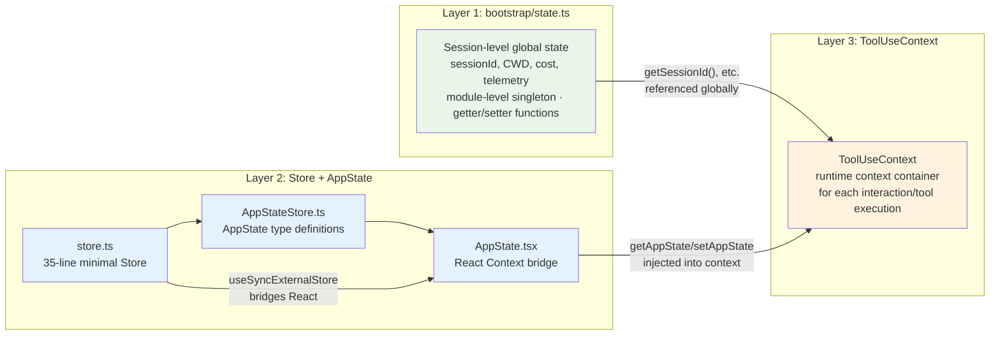
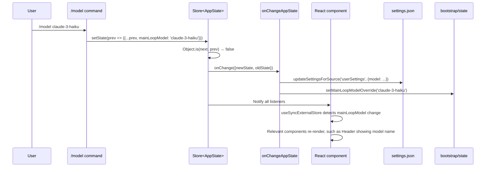

# Chapter 33: State Management and the Cross-Process Bridge (跨进程桥) — Bridging State Between React and the Non-React World

> This chapter is chapter 33 of *Deep Dive into Claude Code Source*, a source-code study (源码学习). We will analyze how Claude Code uses a minimal 35-line Store implementation to bridge state management between the React UI and non-React business logic, and understand the design philosophy behind its three-layer state architecture.

## Why does state management deserve its own chapter?

Claude Code faces a unique state management problem: it is **both a React application and not entirely one**.

The terminal UI is rendered with Ink (React for CLI), so components need reactive state updates. But the core business logic — API calls, tool execution, and Agent orchestration (编排) — runs outside the React tree. The result of a single tool call must simultaneously:
1. Update React components so it appears in the terminal UI
2. Be read by the non-React `query.ts` conversation main loop (对话主循环)
3. Be used by the Agent subsystem, which may run in an isolated context

Use a library like Redux or Zustand? Too heavy. React's built-in `useState` / `useReducer`? Not accessible from outside the React tree. Module-level globals? They cannot trigger React re-renders.

Claude Code's answer is: **a three-layer state architecture plus a 35-line in-house Store**.

---

> **Chapter guide**: §1 Three-layer state architecture overview → §2 Layer 1: `bootstrap/state.ts` (session globals) → §3 Layer 2: Store + AppState (the bridge between React and non-React) → §4 Layer 3: `ToolUseContext` (tool execution runtime) → §5 The full journey of one state change → §6 Transferable patterns → §7 Layer 4: `bridge/bridgePointer.ts` (cross-process). The first four sections describe state layering inside a single process; §7 extends the mechanism to the cross-process scenario where "another machine takes over the same session."

## 1. Three-Layer State Architecture Overview

Before diving into the code, build the global mental model. Claude Code's state is distributed across three layers, each with a clear responsibility boundary:



| Layer | File | Lifecycle | Core purpose | Stored in Store? |
|------|------|---------|---------|---------------|
| Session globals | `bootstrap/state.ts` | Process-level, lives for the entire session | `sessionId`, CWD, cost accounting, telemetry | Module-scoped variables; does not go through Store |
| AppState Store | `state/store.ts` + `AppStateStore.ts` + `AppState.tsx` | REPL-level, follows the React tree | UI state, permissions, tools, plugins, MCP | Yes, through `createStore` |
| ToolUseContext | `Tool.ts:158-254` | Per interaction/tool execution | All runtime context needed for tool execution | No; it is a parameter container, not a Store |

The first two layers are "state": data that **can be read, can be changed, and must broadcast changes**. The third layer, `ToolUseContext`, is not a Store. It is a **parameter container packaged for a single tool execution**: callers construct it in the query loop or REPL path, pass it by value (including getters) to tools, and discard it after the tool finishes. React does not subscribe to it, and it does not trigger re-renders. It is listed alongside the first two layers because anyone tracing "where did this field come from?" will inevitably run into it, so §4 gives it a dedicated explanation.

The design principle across these three layers is **downward dependency, upward isolation**: `ToolUseContext` references AppState getters/setters; AppState can read values from `bootstrap/state`; but the reverse is not allowed.

---

## 2. Layer 1: bootstrap/state.ts — Session-Level Global State

**File**: `bootstrap/state.ts` (1,758 lines)

This is the lowest-level state module in the entire project. Near the top of the file there is a conspicuous comment:

```typescript
// DO NOT ADD MORE STATE HERE - BE JUDICIOUS WITH GLOBAL STATE
```

And another one before the initialization function:

```typescript
// ALSO HERE - THINK THRICE BEFORE MODIFYING
```

These two comments reveal an important design decision: **strictly control the size of global state**.

### 2.1 Why is bootstrap/state needed?

Some state is naturally process-level. It belongs neither to any React component nor to any single query loop:

- **sessionId**: identifies the current session and remains unchanged from startup to exit, unless another session is resumed
- **CWD / projectRoot**: the working directory, globally unique in the process
- **Cost accounting**: accumulators such as `totalCostUSD` and `totalAPIDuration`
- **Telemetry counters**: OpenTelemetry `Meter` and `Counter` instances
- **Model usage statistics**: `modelUsage` accumulates token usage by model name

### 2.2 Implementation: module-level singleton + getter/setter

```typescript
// bootstrap/state.ts:429
const STATE: State = getInitialState()

export function getSessionId(): SessionId {
  return STATE.sessionId
}

export function getCwdState(): string {
  return STATE.cwd
}

export function setCwdState(cwd: string): void {
  STATE.cwd = cwd.normalize('NFC')
}

export function addToTotalCostState(
  cost: number,
  modelUsage: ModelUsage,
  model: string,
): void {
  STATE.modelUsage[model] = modelUsage
  STATE.totalCostUSD += cost
}
```

This is the plainest possible state management pattern: a **module-level closure singleton**. `STATE` is a module-private object, accessed through exported getter/setter functions. There is no publish-subscribe mechanism, no reactivity, just direct imperative reads and writes.

### 2.3 Why not use Store?

You might ask: why not put this state into the AppState Store too?

The answer lies in the constraint imposed by the **import DAG (directed acyclic graph)**. `bootstrap/state.ts` sits at the bottom of the import tree, effectively a leaf node, and imports almost no business modules. `state/store.ts` (35 lines, no imports) and `state/AppStateStore.ts` do not depend on React; the file that actually imports React is `state/AppState.tsx`. So "bootstrap state cannot be moved into Store" is unrelated to whether React is the boundary. The real constraint is **layering**: bootstrap must be referenced by all higher-level modules, and therefore cannot import anything higher-level in return, or the DAG would acquire a cycle. A source comment states this explicitly:

```typescript
// bootstrap can't import listeners directly (DAG leaf), so
// callers register themselves.
```

This is a valuable engineering decision: **place the most foundational state at the leaf of the dependency tree so everyone can safely reference it, while it references nobody else.**

### 2.4 The scale of the State type

The `State` type defines roughly 80+ fields, covering:

| Category | Representative fields | Purpose |
|------|---------|------|
| Identity | `sessionId`, `parentSessionId` | Session tracking |
| Path information | `originalCwd`, `projectRoot`, `cwd` | Directory management |
| Cost and performance | `totalCostUSD`, `totalAPIDuration`, `turnToolCount` | Statistics and billing |
| Model configuration | `mainLoopModelOverride`, `initialMainLoopModel` | Model selection |
| Telemetry infrastructure | `meter`, `sessionCounter`, `loggerProvider` | OpenTelemetry |
| Session markers | `isInteractive`, `kairosActive`, `isRemoteMode` | Runtime mode |
| Cache state | `promptCache1hEligible`, `afkModeHeaderLatched` | API optimization |

---

## 3. Layer 2: Store + AppState — The Bridge Between React and Non-React

This is the most elegant part of the entire state management system. It consists of three files, each with a distinct role.

### 3.1 store.ts — A 35-Line Minimal Store

**File**: `state/store.ts` (35 lines)

First, look at the complete code. It really is only 35 lines:

```typescript
// state/store.ts - complete source
type Listener = () => void
type OnChange<T> = (args: { newState: T; oldState: T }) => void

export type Store<T> = {
  getState: () => T
  setState: (updater: (prev: T) => T) => void
  subscribe: (listener: Listener) => () => void
}

export function createStore<T>(
  initialState: T,
  onChange?: OnChange<T>,
): Store<T> {
  let state = initialState
  const listeners = new Set<Listener>()

  return {
    getState: () => state,

    setState: (updater: (prev: T) => T) => {
      const prev = state
      const next = updater(prev)
      if (Object.is(next, prev)) return
      state = next
      onChange?.({ newState: next, oldState: prev })
      for (const listener of listeners) listener()
    },

    subscribe: (listener: Listener) => {
      listeners.add(listener)
      return () => listeners.delete(listener)
    },
  }
}
```

This Store exposes only three methods:

| Method | Signature | Purpose |
|------|------|------|
| `getState` | `() => T` | Synchronously read the current state |
| `setState` | `(updater: (prev: T) => T) => void` | Functional update, avoiding stale closures |
| `subscribe` | `(listener: () => void) => () => void` | Subscribe to changes and return an unsubscribe function |

Several design details are worth noting:

1. **`Object.is` equality check**: if the updater returns the same reference, notifications are skipped. This avoids unnecessary re-renders.

2. **`onChange` callback**: when creating the Store, callers may pass an `onChange` callback. It is invoked on every state change with both the new and old state. This callback is used for **global side effects**, such as synchronizing permission mode to external systems.

3. **Functional `updater`**: direct assignment (`setState(newValue)`) is not accepted; only a function (`setState(prev => newValue)`) is. This is intentional. Functional updates ensure every call is based on the latest state snapshot, avoid stale snapshot problems, and allow multiple asynchronous updates to compose correctly. The later updater receives the `prev` produced by the earlier update.

4. **`Set<Listener>` instead of an array**: listeners are stored in a Set. `add` and `delete` are O(1), and duplicates are naturally removed.

### 3.2 Why build this instead of using Zustand?

Zustand's core API is also `getState/setState/subscribe`, so it looks very similar. But Claude Code chooses an in-house implementation for several reasons:

- **Zero dependencies**: 35 lines of code, no library needed
- **Full control**: the `onChange` callback is not a feature Zustand directly supports
- **TypeScript-first**: the type definitions match the project's needs exactly
- **No middleware needed**: there is no need for devtools, persist, immer, or similar features

This Store API happens to match React 18's `useSyncExternalStore` requirements. That is not a coincidence; the interface is **precisely designed for bridging**.

### 3.3 AppStateStore.ts — AppState Type Definitions

**File**: `state/AppStateStore.ts` (about 570 lines)

This file defines the `AppState` type and the `getDefaultAppState()` factory function. `AppState` is the **single state tree** for the application's UI layer.

```typescript
// state/AppStateStore.ts:89 (simplified to core fields)
export type AppState = DeepImmutable<{
  // User configuration
  settings: SettingsJson
  verbose: boolean
  mainLoopModel: ModelSetting

  // Permission system
  toolPermissionContext: ToolPermissionContext

  // MCP protocol
  mcp: {
    clients: MCPServerConnection[]
    tools: Tool[]
    commands: Command[]
    resources: Record<string, ServerResource[]>
  }

  // Plugin system
  plugins: {
    enabled: LoadedPlugin[]
    disabled: LoadedPlugin[]
    commands: Command[]
    errors: PluginError[]
  }

  // UI state
  thinkingEnabled: boolean | undefined
  expandedView: 'none' | 'tasks' | 'teammates'
  footerSelection: FooterItem | null

  // ... about 60+ more fields
}> & {
  // These fields are excluded from DeepImmutable
  tasks: { [taskId: string]: TaskState }
  agentNameRegistry: Map<string, AgentId>
}
```

Several key design points:

**1. `DeepImmutable<T>` wrapper**

The entire AppState is wrapped in `DeepImmutable<T>`, which recursively makes every property `readonly`. This forces all state changes to go through the `setState` function and prevents any code from directly mutating the state object.

Note, however, that `& { tasks, agentNameRegistry }` is excluded from `DeepImmutable`. The source gives an explicit comment for why `tasks` is excluded (`AppStateStore.ts:159`):

```typescript
// Unified task state - excluded from DeepImmutable because TaskState contains function types
tasks: { [taskId: string]: TaskState }
```

`TaskState` contains function types, such as `abortController`, and `DeepImmutable` cannot correctly handle function types. `agentNameRegistry` (`Map<string, AgentId>`) is also placed outside `DeepImmutable`, but the source does not give the same explicit causal explanation. It may be because `Map` is incompatible with `DeepImmutable`'s recursive readonly conversion, but that is a structural inference and should be distinguished from source-backed fact.

**2. Organization of nested structures**

The state is not flat. It is grouped by domain: `mcp.*` manages MCP connections, `plugins.*` manages plugins, and `inbox.*` manages the inbox. This structure lets selectors subscribe precisely to one subtree and trigger re-renders only when relevant state changes.

**3. Initialization in `getDefaultAppState()`**

```typescript
// state/AppStateStore.ts:456-569
export function getDefaultAppState(): AppState {
  return {
    settings: getInitialSettings(),
    tasks: {},
    agentNameRegistry: new Map(),
    verbose: false,
    mainLoopModel: null,
    toolPermissionContext: {
      ...getEmptyToolPermissionContext(),
      mode: initialMode,
    },
    thinkingEnabled: shouldEnableThinkingByDefault(),
    promptSuggestionEnabled: shouldEnablePromptSuggestion(),
    // ... default values for 70+ fields
  }
}
```

Some default values are computed dynamically. For example, `shouldEnableThinkingByDefault()` decides whether thinking should be enabled by default based on the current model's capabilities.

### 3.4 AppState.tsx — React Context Bridge

**File**: `state/AppState.tsx`

This is the core of the bridge. It connects the non-React `Store<AppState>` into the React component tree.

**Provider component**:

```typescript
// state/AppState.tsx (original TypeScript source, not the compiled version)
export const AppStoreContext = React.createContext<AppStateStore | null>(null)

export function AppStateProvider({
  children,
  initialState,
  onChangeAppState,
}: Props): React.ReactNode {
  // Forbid nesting
  const hasAppStateContext = useContext(HasAppStateContext)
  if (hasAppStateContext) {
    throw new Error(
      'AppStateProvider can not be nested within another AppStateProvider',
    )
  }

  // The Store is created once and never changes. A stable context value means
  // the Provider never triggers re-renders.
  const [store] = useState(() =>
    createStore<AppState>(
      initialState ?? getDefaultAppState(),
      onChangeAppState,
    ),
  )

  // Listen for external settings changes and sync them into AppState.
  const onSettingsChange = useEffectEvent((source: SettingSource) =>
    applySettingsChange(source, store.setState),
  )
  useSettingsChange(onSettingsChange)

  return (
    <HasAppStateContext.Provider value={true}>
      <AppStoreContext.Provider value={store}>
        <MailboxProvider>
          <VoiceProvider>{children}</VoiceProvider>
        </MailboxProvider>
      </AppStoreContext.Provider>
    </HasAppStateContext.Provider>
  )
}
```

The key trick is this line: `const [store] = useState(() => createStore(...))`.

The Provider's context value is `store` (the Store instance itself), not `store.getState()`. Once created, the Store instance never changes. Therefore, **the stability of the context value avoids full consumer subtree re-renders caused by context value changes**. Of course, the Provider component itself can still re-execute when its parent re-renders, which is normal React behavior, but that does not propagate downward because of a changed context value. The mechanism that actually drives consumer updates is `useSyncExternalStore`'s subscription mechanism, not context changes. This is a key performance design.

**Consumer hook: the `useSyncExternalStore` bridge**:

```typescript
// state/AppState.tsx:142-163
export function useAppState<T>(selector: (state: AppState) => T): T {
  const store = useAppStore()

  const get = () => {
    const state = store.getState()
    const selected = selector(state)
    return selected
  }

  return useSyncExternalStore(store.subscribe, get, get)
}
```

`useSyncExternalStore` is the official React 18 API for subscribing to external data sources. It takes three parameters:
- `subscribe`: registers a listener
- `getSnapshot`: reads the current value
- `getServerSnapshot`: used for SSR; here it uses the same function

When `store.setState` is called, all listeners are triggered. Internally, `useSyncExternalStore` calls `get()` again, and if the selector's returned value differs from the previous one by `Object.is`, the component re-renders.

**Usage**:

```typescript
// Used this way inside components; re-renders only when verbose changes.
const verbose = useAppState(s => s.verbose)
const model = useAppState(s => s.mainLoopModel)

// Get the setter; this never triggers a re-render.
const setAppState = useSetAppState()

// Get the whole Store instance and pass it to non-React code.
const store = useAppStateStore()
```

There is also a fault-tolerant version, `useAppStateMaybeOutsideOfProvider`, which returns `undefined` instead of throwing when no Provider exists in the context:

```typescript
// state/AppState.tsx:186-199
export function useAppStateMaybeOutsideOfProvider<T>(
  selector: (state: AppState) => T,
): T | undefined {
  const store = useContext(AppStoreContext)
  return useSyncExternalStore(
    store ? store.subscribe : NOOP_SUBSCRIBE,
    () => store ? selector(store.getState()) : undefined,
  )
}
```

### 3.5 onChangeAppState — Centralized Global Side Effects

**File**: `state/onChangeAppState.ts` (172 lines)

Remember the second argument to `createStore`, `onChange`? `onChangeAppState` is that callback. It is invoked **after every state change** and is responsible for synchronizing AppState changes to external systems:

```typescript
// state/onChangeAppState.ts:43-92 (core excerpt)
export function onChangeAppState({
  newState,
  oldState,
}: {
  newState: AppState
  oldState: AppState
}) {
  // Permission mode changed -> notify CCR and SDK.
  const prevMode = oldState.toolPermissionContext.mode
  const newMode = newState.toolPermissionContext.mode
  if (prevMode !== newMode) {
    const prevExternal = toExternalPermissionMode(prevMode)
    const newExternal = toExternalPermissionMode(newMode)
    if (prevExternal !== newExternal) {
      notifySessionMetadataChanged({
        permission_mode: newExternal,
      })
    }
    notifyPermissionModeChanged(newMode)
  }

  // Model changed -> persist to settings.
  if (newState.mainLoopModel !== oldState.mainLoopModel) {
    if (newState.mainLoopModel === null) {
      updateSettingsForSource('userSettings', { model: undefined })
    } else {
      updateSettingsForSource('userSettings', { model: newState.mainLoopModel })
    }
  }

  // Settings changed -> clear authentication caches.
  if (newState.settings !== oldState.settings) {
    clearApiKeyHelperCache()
    clearAwsCredentialsCache()
    clearGcpCredentialsCache()
  }
}
```

This design is clever. A comment explains the historical context:

> Prior to this block, mode changes were relayed to CCR by only 2 of 8+ mutation paths... Every other path mutated AppState without telling CCR, leaving external_metadata stale.

In the past, permission mode changes had to manually notify external systems at every mutation site. As a result, only 2 of 8+ mutation paths synchronized correctly. Now, through the `onChange` callback, **any** change caused by a `setState` call is handled centrally, with no missed paths.

---

## 4. Layer 3: ToolUseContext — The Runtime Context for Tool Execution

**File**: `Tool.ts:158-254`

`ToolUseContext` is not stored in Store and is not subscribed to by React. It is **a parameter container for a single tool execution**. The caller, most commonly the query loop, but also REPL command execution in `screens/REPL.tsx`, permission modal flows, and the side question fallback in `utils/queryContext.ts:142-170`, packages all external dependencies needed to run a tool into it at once: `abortController`, `messageId`, `agentId`, `readFileState`, several AppState getters/setters, and snapshots of session-level configuration such as `options.tools` / `options.commands`. A tool receives it, uses it, and then it is discarded; it does not trigger re-renders. The three-layer table in §1 lists it outside Store as a separate row for exactly this reason: it helps connect the layers above and below, but is not itself state. It is the messenger that serves state.

```typescript
// Tool.ts:158-254 (core fields)
export type ToolUseContext = {
  options: {
    commands: Command[]
    tools: Tools
    mainLoopModel: string
    thinkingConfig: ThinkingConfig
    mcpClients: MCPServerConnection[]
    isNonInteractiveSession: boolean
    agentDefinitions: AgentDefinitionsResult
    // ...
  }
  abortController: AbortController
  readFileState: FileStateCache

  // AppState getters/setters — connects Layer 2.
  getAppState(): AppState
  setAppState(f: (prev: AppState) => AppState): void

  // Task-level setter; even when setAppState is no-op, this can reach the root Store.
  setAppStateForTasks?: (f: (prev: AppState) => AppState) => void

  // Callbacks for tool execution progress.
  setInProgressToolUseIDs: (f: (prev: Set<string>) => Set<string>) => void
  setResponseLength: (f: (prev: number) => number) => void

  // File history and attribution tracking.
  updateFileHistoryState: (updater: (prev: FileHistoryState) => FileHistoryState) => void
  updateAttributionState: (updater: (prev: AttributionState) => AttributionState) => void

  // Agent-related.
  agentId?: AgentId
  agentType?: string
  messages: Message[]
  // ...
}
```

### 4.1 Why not pass the Store directly?

`ToolUseContext` explicitly contains `getAppState()` and `setAppState()` instead of directly passing the Store instance. This is intentional, because **different callers need different versions of `getAppState` / `setAppState`**:

- **Main conversation loop**: directly connects to the real Store
- **Synchronous Agent**, such as the Explore Agent: shares the parent Store
- **Asynchronous Agent**, such as a background Agent: replaces `setAppState` with a no-op to avoid interfering with the UI

### 4.2 createSubagentContext — The Key to Agent Isolation

**File**: `utils/forkedAgent.ts:345-435`

When an Agent tool creates a child Agent, it cannot directly reuse the parent's `ToolUseContext`, because that would allow state contamination between the two. `createSubagentContext` creates an isolated context:

```typescript
// utils/forkedAgent.ts:345-435 (simplified)
export function createSubagentContext(
  parentContext: ToolUseContext,
  overrides?: SubagentContextOverrides,
): ToolUseContext {
  // 1. AbortController: create a child controller linked to the parent;
  // parent abort propagates.
  const abortController = overrides?.shareAbortController
    ? parentContext.abortController
    : createChildAbortController(parentContext.abortController)

  // 2. getAppState: wrap it to set shouldAvoidPermissionPrompts.
  const getAppState = overrides?.shareAbortController
    ? parentContext.getAppState
    : () => ({
        ...parentContext.getAppState(),
        toolPermissionContext: {
          ...parentContext.getAppState().toolPermissionContext,
          shouldAvoidPermissionPrompts: true,
        },
      })

  return {
    // 3. FileStateCache: clone it to avoid mutual interference.
    readFileState: cloneFileStateCache(
      overrides?.readFileState ?? parentContext.readFileState,
    ),

    // 4. New collection instances to prevent cross-Agent contamination.
    nestedMemoryAttachmentTriggers: new Set<string>(),
    loadedNestedMemoryPaths: new Set<string>(),

    // 5. setAppState: no-op by default unless sharing is explicitly opted into.
    getAppState,
    setAppState: overrides?.shareSetAppState
      ? parentContext.setAppState
      : () => {},

    // 6. setAppStateForTasks: always connects to the root Store!
    setAppStateForTasks:
      parentContext.setAppStateForTasks ?? parentContext.setAppState,

    // ... other fields
  }
}
```

The most elegant design here is the **"always pierce through" behavior of `setAppStateForTasks`**.

Even if `setAppState` is set to no-op, because asynchronous Agents should not modify UI state, `setAppStateForTasks` still connects to the root Store. Why? Because bash tasks started by background Agents must be registered in the global task list; otherwise, they cannot be cleaned up correctly when the process exits. A source comment records the painful lesson:

> Task registration/kill must always reach the root store, even when setAppState is a no-op — otherwise async agents' background bash tasks are never registered and never killed (PPID=1 zombie).

### 4.3 Selectors — Derived State

**File**: `state/selectors.ts` (77 lines)

Claude Code also has the concept of selectors, but it is very lightweight. They are only used to derive view state that requires more complex computation from AppState:

```typescript
// state/selectors.ts:59-76
export function getActiveAgentForInput(
  appState: AppState,
): ActiveAgentForInput {
  const viewedTask = getViewedTeammateTask(appState)
  if (viewedTask) {
    return { type: 'viewed', task: viewedTask }
  }

  const { viewingAgentTaskId, tasks } = appState
  if (viewingAgentTaskId) {
    const task = tasks[viewingAgentTaskId]
    if (task?.type === 'local_agent') {
      return { type: 'named_agent', task }
    }
  }

  return { type: 'leader' }
}
```

This selector returns a **discriminated union**, so callers can use `switch(result.type)` for type-safe branching.

---

## 5. Data Flow Overview: The Full Journey of One State Change

Let's trace a concrete scenario: **the user switches models through the `/model` command**.



1. The user enters `/model claude-3-haiku`
2. The command handler calls `store.setState(prev => ({...prev, mainLoopModel: 'claude-3-haiku'}))`
3. The Store performs its internal `Object.is` check; old and new differ, so the update is accepted
4. `onChangeAppState` is triggered:
   - It writes the model to `settings.json` for persistence
   - It updates the process-level `mainLoopModelOverride` in `bootstrap/state`
5. All React listeners are notified
6. Components using `useAppState(s => s.mainLoopModel)` re-render

Notice that in this flow, **one `setState` call completes three tasks at once**: update in-memory state, persist to disk, and notify the UI. That is the power of centralized `onChange`.

---

## 6. Transferable Design Patterns

### Pattern 1: Minimal Store + useSyncExternalStore

Implement a Store in 35 lines and bridge it into React components through React 18's `useSyncExternalStore`. This pattern fits any scenario that needs shared state between React and non-React code.

**Key points**:
- Put the Store instance, a stable reference, in the context value; do not put the state value there, or context value changes will cause the full consumer subtree to re-render
- Subscribe to slices with selectors to avoid full re-renders
- Make `setState` accept an updater function to avoid stale snapshots and let multiple asynchronous updates compose correctly

**Suitable scenarios**: small to medium applications that do not want external dependencies such as Zustand or Redux, but do need shared state across the React/non-React boundary.

### Pattern 2: Centralized onChange Side Effects

Pass an `onChange` callback when creating the Store, and use it to centrally handle side effects for all state changes: persistence, external notifications, cache clearing. This is much more reliable than manually triggering side effects at every `setState` call site.

**Suitable scenarios**: state changes must synchronize to multiple external systems, such as databases, APIs, or other processes, and there are many mutation entrypoints, such as CLI commands, UI interactions, and configuration file changes.

### Pattern 3: Context Isolation + Selective Sharing

Create isolated context copies for subsystems such as child Agents. By default, all mutable state is isolated: no-op setters and cloned caches. Only explicitly opted-in channels, such as `setAppStateForTasks`, are allowed to pierce through to shared state.

**Key points**:
- Isolate by default, share explicitly. This is much safer than sharing by default and isolating explicitly
- Certain critical operations, such as task registration and cleanup, must pierce through isolation; otherwise they cause resource leaks

**Suitable scenarios**: multi-Agent or multi-tenant systems, plugin systems, and any system that needs to run untrusted code in an isolated environment.

---

## 7. The Cross-Process Fourth Layer: bridge/bridgePointer.ts

The first three layers all live **inside the same process**: `bootstrap/state` is a module singleton, `AppState` is context in the React tree, and `ToolUseContext` is a container on the function call stack. They solve the question of how React and non-React code share state inside one Claude Code process.

But Claude Code also has a class of state that must survive **across processes**. When a bridge session, the kind where a phone or Web client remotely controls the local CLI, is running, and the process is killed with `kill -9`, the terminal window is closed, or the process truly crashes, the next `claude remote-control` startup should be able to ask the reader, "the previous session crashed; do you want to recover it?" instead of treating it as a clean startup.

This is not the responsibility of any of the first three layers. It must write a small set of IDs to disk, and it must have written them **before the crash**. `bridge/bridgePointer.ts` (210 lines) is the entire implementation of this layer.

### 7.1 What it writes and why that is enough

The comment at the top of the file clearly defines the boundary of the whole mechanism:

```typescript
// bridge/bridgePointer.ts:42-50
const BridgePointerSchema = lazySchema(() =>
  z.object({
    sessionId: z.string(),
    environmentId: z.string(),
    source: z.enum(['standalone', 'repl']),
  }),
)

export type BridgePointer = z.infer<ReturnType<typeof BridgePointerSchema>>
```

The entire "crash recovery pointer" has only three fields: `sessionId`, `environmentId`, and `source`, which indicates whether this bridge was started standalone or suspended from the REPL. On the next startup, those three fields are enough to reuse the existing `--session-id` flow and resume the session. There is no need to serialize the entire AppState tree. This is a **minimal recoverable set** design: the less it writes, the more likely the write will complete before a crash, and the lower the risk of half-written dirty data on disk.

The file location is also deliberate:

```typescript
// bridge/bridgePointer.ts:52-54
export function getBridgePointerPath(dir: string): string {
  return join(getProjectsDir(), sanitizePath(dir), 'bridge-pointer.json')
}
```

The pointer is written under the sanitized working directory. Each repository gets its own `bridge-pointer.json`, colocated with that project's transcript JSONL files. This means **two concurrent bridge sessions in different repositories will not overwrite each other**, and no global lock is needed.

### 7.2 mtime as freshness: a rolling 4-hour TTL

`bridgePointer` does not put a timestamp inside the file content. Instead, it directly uses the file system's `mtime` as the freshness criterion:

```typescript
// bridge/bridgePointer.ts:40
export const BRIDGE_POINTER_TTL_MS = 4 * 60 * 60 * 1000

// bridge/bridgePointer.ts:88-110
mtimeMs = (await stat(path)).mtimeMs
raw = await readFile(path, 'utf8')
// ...
const ageMs = Math.max(0, Date.now() - mtimeMs)
if (ageMs > BRIDGE_POINTER_TTL_MS) {
  logForDebugging(`[bridge:pointer] stale (>4h mtime), clearing: ${path}`)
  await clearBridgePointer(dir)
  return null
}
```

The 4-hour window aligns with the backend `BRIDGE_LAST_POLL_TTL`. A comment captures the benefit of this design in one sentence:

> Staleness is checked against the file's mtime (not an embedded timestamp) so that a periodic re-write with the same content serves as a refresh.

In other words, a long-running session does not need to change the pointer content every time it refreshes. Rewriting the same three fields updates `mtime`, automatically resetting the freshness clock. Even if a bridge has been polling for 5 hours and crashes right now, as long as the latest same-content rewrite landed within the 4-hour window, the pointer is still fresh. This merges "write once to record the session" and "periodic heartbeat" into the same API, `writeBridgePointer`, so callers do not need to distinguish the two.

What if the pointer becomes invalid? The read path **clears it as a side effect**:

```typescript
// bridge/bridgePointer.ts:98-103
const parsed = BridgePointerSchema().safeParse(safeJsonParse(raw))
if (!parsed.success) {
  logForDebugging(`[bridge:pointer] invalid schema, clearing: ${path}`)
  await clearBridgePointer(dir)
  return null
}
```

Missing file, broken JSON, schema mismatch, or older than 4 hours: any "untrusted" condition returns `null` and cleans up the dirty file on disk. `clearBridgePointer` itself is idempotent and swallows `ENOENT`, so repeated cleanup does not error. The read side does not need to call `exists()` before `read()`, avoiding the TOCTOU anti-pattern; it uses the "read directly and handle errors" style.

### 7.3 Worktree fan-out: connecting "where it started" to "where it recovers"

The hard part of the bridge pointer is this: in REPL mode, the bridge is written under `getOriginalCwd()`, while `EnterWorktreeTool` may switch the current working directory into a worktree subdirectory. When the user later runs `claude remote-control --continue`, the command starts from the shell's current CWD. These two directories may not be the same.

`readBridgePointerAcrossWorktrees` handles exactly this fan-out problem of "where should recovery look for the pointer?":

```typescript
// bridge/bridgePointer.ts:129-184 (excerpt)
export async function readBridgePointerAcrossWorktrees(
  dir: string,
): Promise<{ pointer: BridgePointer & { ageMs: number }; dir: string } | null> {
  // Fast path: current dir.
  const here = await readBridgePointer(dir)
  if (here) {
    return { pointer: here, dir }
  }

  const worktrees = await getWorktreePathsPortable(dir)
  if (worktrees.length <= 1) return null
  if (worktrees.length > MAX_WORKTREE_FANOUT) {
    logForDebugging(
      `[bridge:pointer] ${worktrees.length} worktrees exceeds fanout cap ${MAX_WORKTREE_FANOUT}, skipping`,
    )
    return null
  }
  // ...parallel stat+read, pick freshest by ageMs
}
```

Several design details are worth noting:

1. **Fast path first**: check the current directory first and return immediately on hit. Standalone bridge sessions, where the pointer is always in the startup directory, and REPL sessions that never switched worktrees both resolve with one `stat` and zero `exec`.
2. **Fan-out cap**: `MAX_WORKTREE_FANOUT = 50` adds another defensive bound on top of the naturally bounded `git worktree list`, preventing pathological configurations from spawning too many parallel `stat` calls.
3. **Pick the freshest one**: read all sibling worktrees in parallel, then choose the lowest `ageMs` and return the directory it came from. That way, if recovery fails, the caller knows which pointer to clear.

### 7.4 How this layer relates to the first three

Returning to the three-layer architecture diagram at the beginning: `bridgePointer` is **not part of AppState and does not go into `bootstrap/state`**. It is an independent, **single-responsibility** cross-process module. Bridge entrypoints such as `bridge/replBridge.ts` and `bridge/bridgeMain.ts` call it at three points:

- When a bridge session is established → `writeBridgePointer`, immediately, as early as possible
- While the session is alive → periodic `writeBridgePointer`, refreshing `mtime` with the same content
- When the session exits cleanly → `clearBridgePointer`, telling the next startup that there is nothing to recover

Only when any of those steps **does not run**, because of a crash, `SIGKILL`, or terminal disconnect, does the pointer get "left behind" on disk. That is exactly why it exists. In other words, this is a design that detects crashes by treating "cleanup did not happen" as abnormal exit, much lighter than a heartbeat process or external watchdog.

If you draw Claude Code's state management as a tree, the first three layers, bootstrap / Store / `ToolUseContext`, form the in-process **vertical** handoff path. `bridgePointer` is a small needle extending **horizontally** from that tree into the file system, waiting for the next process to pull it out.

---

## Next Chapter Preview

[Chapter 34: Architecture Patterns Summary — Design Patterns You Can Transfer to Your Own Projects](./34-architecture-patterns-summary.md)

From the source-code analysis in the first 33 chapters, we distill 11 reusable architecture patterns, including Bridge IPC, Coordinator-Agent, Migration-as-Code, and Output-Style-as-Plugin, into a design map that you can transfer to your own projects.

---
*For the full content, follow https://github.com/luyao618/Claude-Code-Source-Study (a free star would be appreciated).*
